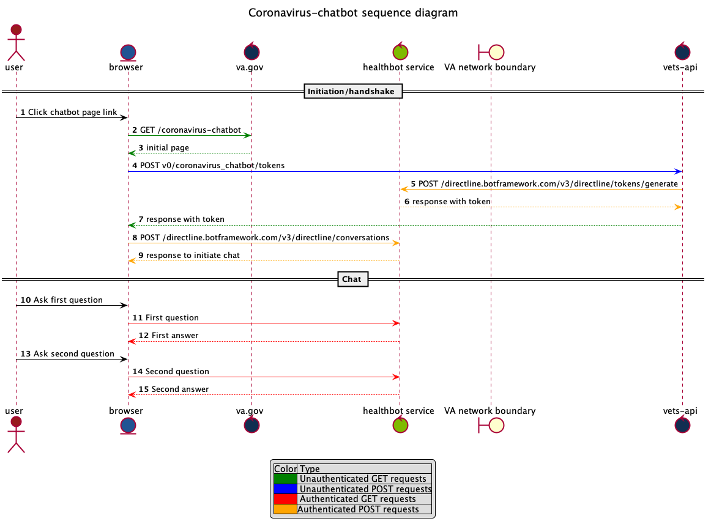

# Architecture Overview

[Reference](https://docs.microsoft.com/en-us/healthbot/#architecture)

Microsoft Healthbot is a SaaS application that offers configurable chat and NLP functionality.
It leverages Microsoft's Bot framework, and offers the ability to build custom scenarios with an authoring tool.

VA's Coronavirus-chatbot is built on top of the healthbot, and is also integrated into the VA.gov website.

## Backend API

There is an endpoint in the `vets-api` Rails application that is used to get a token, which is needed to start a chat.

The front-end will call this endpoint, which then connects to the Healthbot to get the token. 
More details are [here](https://docs.microsoft.com/en-us/healthbot/embed).
During this call to the vets-api, traffic passes through the TIC. For more information see [endpoints](./endpoints).
 
## Web Chat

Once it has a token, the front-end communicates directly with the Healthbot.
The front end container is currently in [vagov-content](https://github.com/department-of-veterans-affairs/vagov-content/blob/master/pages/coronavirus-chatbot.md), and
 invokes a react widget that is maintained in the 
 [`vets-website` frontend codebase](https://github.com/department-of-veterans-affairs/vets-website/tree/master/src/applications/covid19-chatbot).

This widget handles making the call to the back-end to get the token, and then starting the chat conversation using
the [WebChat BotFramework](https://github.com/microsoft/BotFramework-WebChat).

## Sequence
The sequence of calls is described by [this plantuml](chatbot-sequence.puml). Diagram is below:

