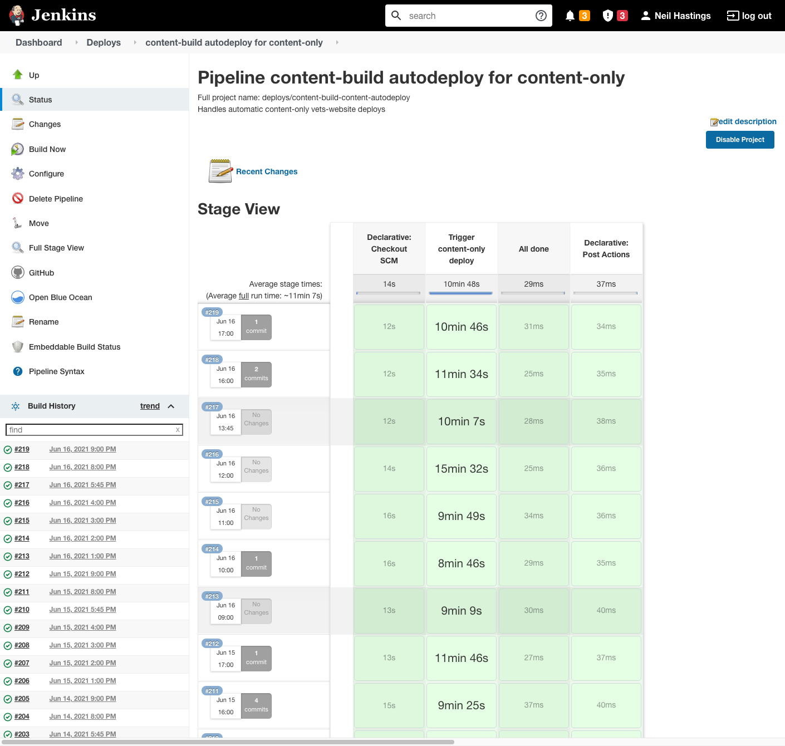
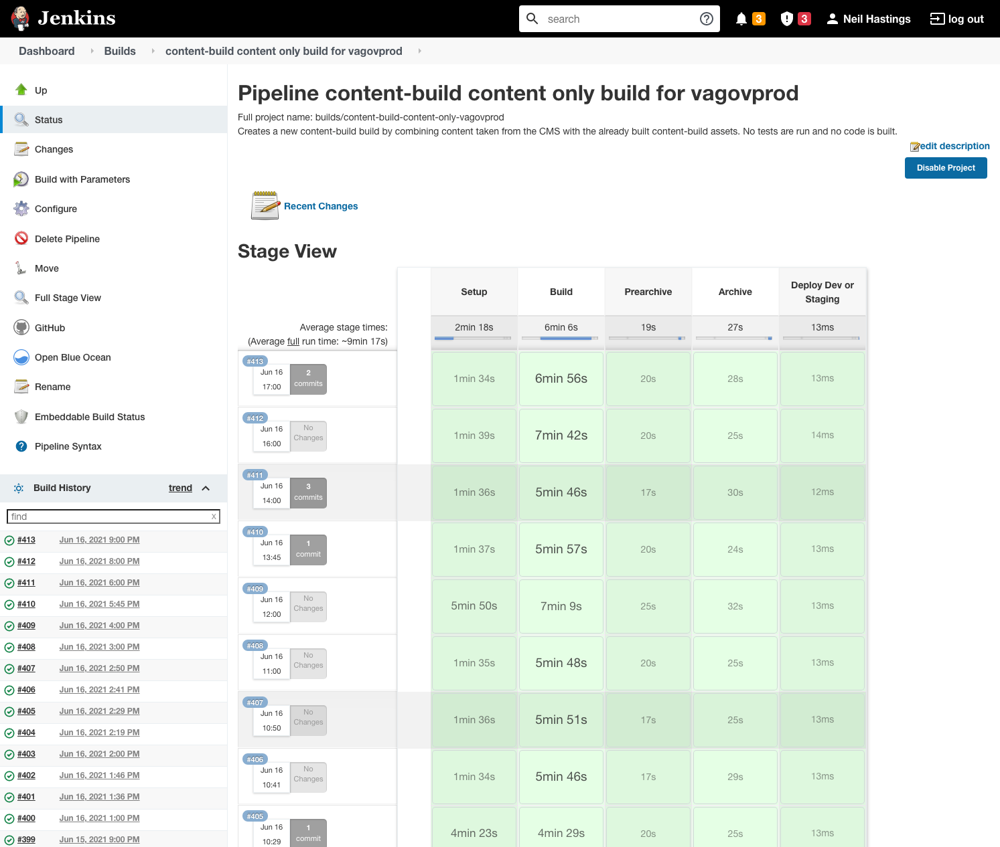
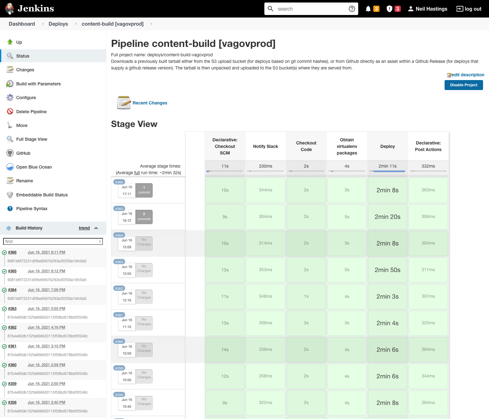
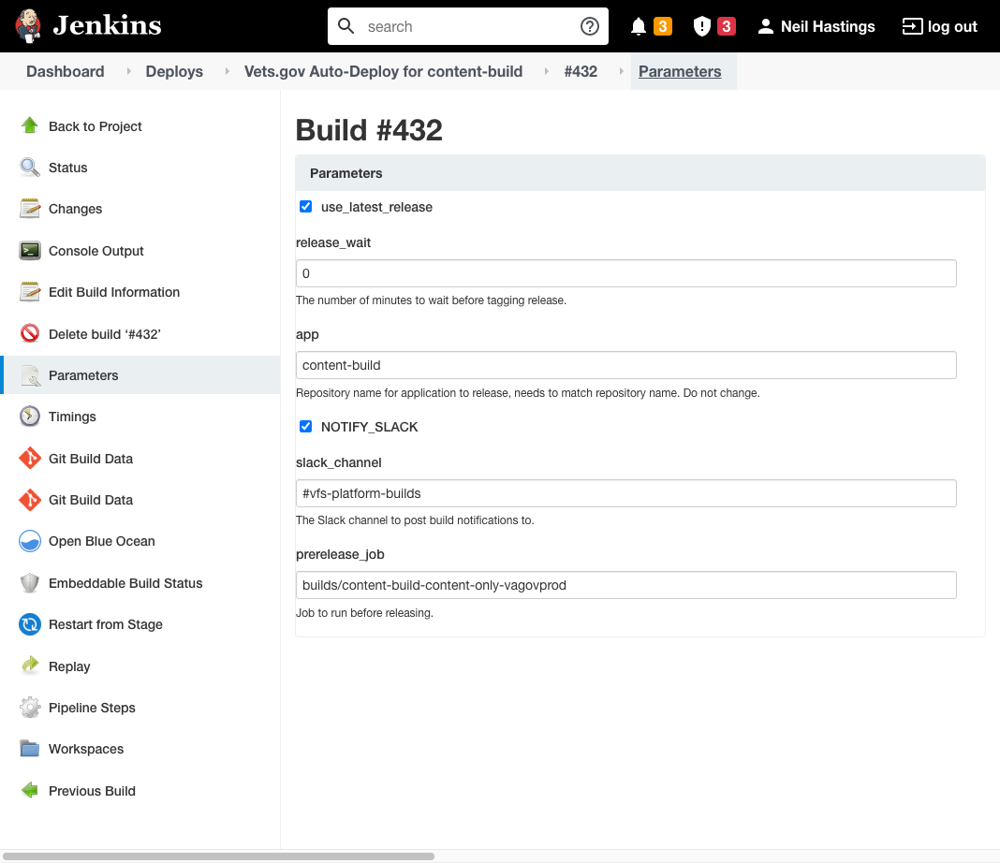

**_This page documented the content releaes process for Jenkins and is deprecated as the build as moved to GitHubActions._**
**_See https://vfs.atlassian.net/wiki/spaces/FTT/pages/1844641889/Deployments for the updated documentation_**

# Content Release
A _Content Release_ describes the entire process behind refreshing content on the website to reflect the content as stored in the CMS. The process begins after a CMS editor manually initiates it through a control in the CMS, when an engineer initiates it through a specific Jenkins job, or after being initiated automatically by a scheduled job. The process is complete once content on the website is visibly up-to-date with that in the CMS.

The Jenkins job behind a Content Release run hourly and only updates the content.  Changes to tempaltes in `content-build` and appliation code in `vets-webstie` are not updated. This Jenkins job is the [`content-build autodeploy for content-only`](http://jenkins.vfs.va.gov/job/deploys/job/content-build-content-autodeploy/), or just the _Hourly-Deploy_.  

The Hourly-Deploy dashboard in Jenkins

The Jenknis job that triggers the Hourly-Deploy triggers another Jenknens job called [`Vets.gov Auto-Deploy for content-build`](http://jenkins.vfs.va.gov/job/deploys/job/vets-gov-autodeploy-content-build/).  The `Vets.gov Auto-Deploy for content-build` Jenkens job is triggered from the `Trigger content-only deploy`.  The triggered Jenkins job is the same job that is executed during the `content-build` Full-Code Release, widely referred to as the "daily deployment." 

A step inside of the Auto-Deploy, its column labeled in the Auto-Deploy dashboard as `Prerelease Job`, issues a separate job and waits for that job to complete. This separate job is the [`content-build content only build`](http://jenkins.vfs.va.gov/job/builds/job/content-build-content-only-vagovprod/). This is commonly referred to as the _Content Build_, which is an execution of the vets-website static site generator. The result of this process is an updated version of the website uploaded to the cloud (Amazon S3 bucket) as a compressed directory of static HTML, CSS, JavaScript, and other static files - this compressed file is referred to as an "archive."

The content-build Content Only Build dashboard in Jenkins

This job is executed synchronously during the `Prerelease Job` in the Auto-Deploy.

Towards the end of the pipeline, the Auto-Deploy issues another separate job under the column labeled `Release then trigger deploy`. This separate job is the [`vagovprod`](http://jenkins.vfs.va.gov/job/deploys/job/content-build-vagovprod/), which actually populates the VA.gov cloud [(S3 bucket)](https://s3-us-gov-west-1.amazonaws.com/content.www.va.gov) with the contents of the archive. This job is executed asynchronously, which means it isn't well-reflected in the Auto-Deploy dashboard because the Auto-Deploy will complete before Vagovprod is finished. However, as a Content Release is finished only after content is visibly refreshed on VA.gov, it is part of the Content Release as a whole. The `vagovprod` job takes roughly three minutes.

The Vagovprod dashboard in Jenkins

This job is executed asynchronously during the `Release then trigger deploy` job in the Auto-Deploy.

## Content Release vs. Full-code Release (daily deployment)
As said previously, a Content Release uses the same Jenkins build job as the Full-Code Release. However, there is a key difference between the two, in form of a build parameter - the Content Release has the property `use_latest_release` set to true. The screenshot below shows what a Content Release initiated through manual execution of the Jenkins Auto-Deploy job may look like -

Content Release manually executed through Jenkins

The `use_latest_release` parameter being set to `true` is what defines this Auto-Deploy job as a Content Release.

This `use_latest_release` parameter indicates that rather than checking out the latest code in content-build (main branch), the build job should check out the code behind the [latest content-build release on GitHub](https://github.com/department-of-veterans-affairs/content-build/releases).

Also observe that the `prerelease_job` parameter is set (by default, and probably shouldn't ever be changed) to `builds/content-build-content-only-vagovprod`, which refers to the Content Only Build.

These parameters are passed to and processed throughout the [Auto-Deploy script](https://github.com/department-of-veterans-affairs/devops/blob/master/ansible/Jenkinsfiles/deploys/warn-release-deploy#L11). Together, the `use_latest_release` and `prerelease_job` parameters direct the Auto-Deploy to grab the commit SHA of the  latest _release_ (not the latest commit) in content-build, then pass that commit SHA to the job for executing a Content Only Build.

Tracing further, the [Content Only Build](https://github.com/department-of-veterans-affairs/devops/blob/master/ansible/deployment/config/jenkins-vetsgov/seed_job.groovy#L1368) will execute the [`Jenkinsfile` in content-build](https://github.com/department-of-veterans-affairs/content-build/blob/main/Jenkinsfile), which contains the logic for executing the content-build static website generator. This will result in a new archive of the latest content-build release rebuilt to contain the latest content from the CMS.

## The Content Build

[Content Build Diagram](https://raw.githubusercontent.com/department-of-veterans-affairs/va.gov-team/master/platform/cms/accelerated_publishing/content-build/content-build.svg) ([edit diagram](https://app.diagrams.net/?src=https://raw.githubusercontent.com/department-of-veterans-affairs/va.gov-team/master/platform/cms/accelerated_publishing/content-build/content-build.svg))

The _Content Build_ refers to a specific process in the front-end repo that executes the content-build static site generator. The _Content Build_ is usually summarized as a task to generate everything on the website that isn't a standalone React app.

The tool behind the static website generator is [Metalsmith](https://metalsmith.io/). In general, Metalsmith is a simple library that accepts a local directory of content as an input (in the case of content-build, the original input is a sibling GitHub repository named vagov-content, which contains Markdown file), processes that original input throughout some steps known as "plugins", and then outputs the resultant directory of static HTML and other assets to the file system.

The Metalsmith API for creating plugins is very simple and flexible - content-build has _many_. In the entry point for executing Metalsmith in content-build (usually referred to as the [build script](https://github.com/department-of-veterans-affairs/content-build/blob/main/src/site/stages/build/index.js)), observe that each plugin is registered using the `metalsmith.use` function.
