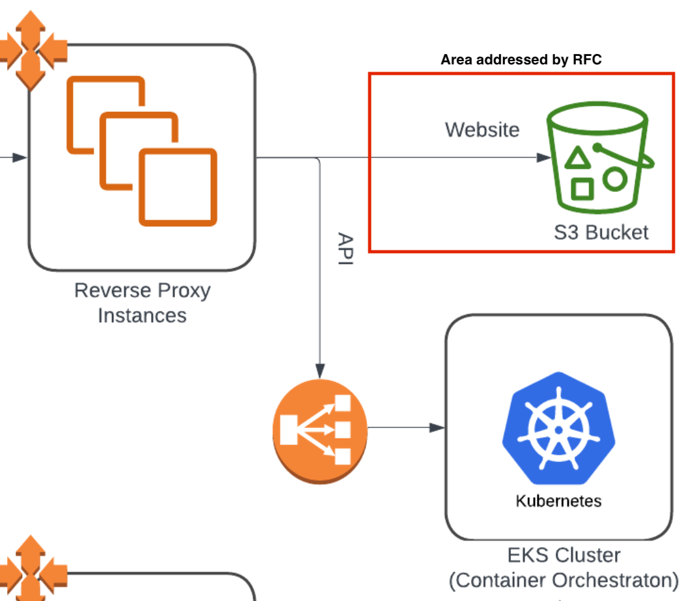
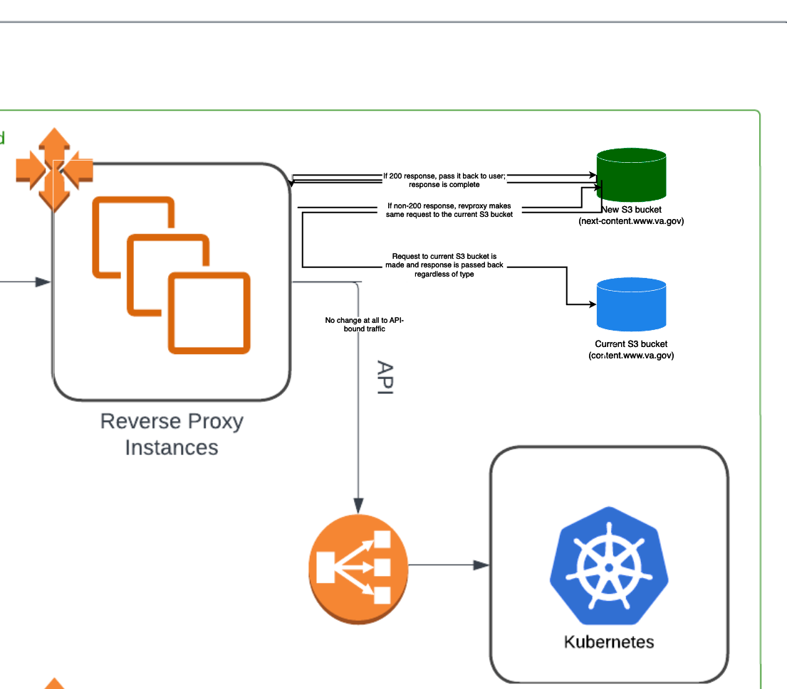

# RFC: Content Proxy Location Fallback

- Date: 2024-01-04
- Related Issue: [va.gov-cms #14469](https://github.com/department-of-veterans-affairs/va.gov-cms/issues/14469) (Content Build / Next Build traffic routing)
- Status: open for review and comment

## Background
The changes proposed in this RFC are designed to address bringing [Next Build / Accelerated Publishing](https://github.com/department-of-veterans-affairs/va.gov-cms/issues/6577) to production. Next Build is a new front-end build system intended to replace [Content Build](https://github.com/department-of-veterans-affairs/content-build) as the mechanism by which CMS content is built and delivered to the Veteran.

Currently VA.gov uses a single S3 bucket as storage for the output of Content Build and the source for content files that are served to web requests. [Traffic is relayed by the reverse proxy to this S3 bucket](https://github.com/department-of-veterans-affairs/vsp-platform-revproxy/blob/main/template-rendering/revproxy-vagov/templates/nginx_website_server.conf.j2#L393).

This [VA EKS architecture document](https://vfs.atlassian.net/wiki/spaces/OT/pages/2231304195/Platform+Infrastructure+Diagrams#EKS-Architecture) is a good high-level overview of how traffic flow works. We are specifically addressing traffic to 'Website' in this proposal:

We are not proposing any changes to API traffic handling. Only web content requests would be affected.

## Motivation
Content publishing will migrate from Content Build to Next Build gradually, as products are implemented in Next Build and able to be published there. It is unlikely that we could migrate every type of content currently built by Content Build prior to taking Next Build to production. Coexistance of the two systems will be necessary during the migration and rollout.

This rollout will be greatly simplified if each system publishes to its own S3 bucket, rather than to the same bucket (reasons for this are given in the Alternatives section below). However, web requests will need to be routed to the appropriate S3 bucket.

We propose an addition to the reverse proxy which would direct web traffic to the new Next Build bucket first. If content is available at that bucket, it is served. If a 4xx/5xx response is returned, the reverse proxy would then direct traffic to the Content Build bucket.

## Design
This diagram shows roughly what we propose: 

At an nginx level, this is accomplished by taking advantage of `proxy_intercept_errors on;` in the primary location configuration for web content and changing the handler for errors to a named fallback which targets the secondary location. The primary `proxy_pass` location would point to the Next Build S3 bucket, and the fallback location `proxy_pass` would point to the Content Build S3 bucket.

The Veteran should see no difference; to them, all content will be served from 'www.va.gov'. Also, any files that are currently managed via direct S3 URI would continue to function without alteration (i.e. https://prod-va-gov-assets.s3-us-gov-west-1.amazonaws.com/img/plus-white.svg and the like).

## Proof of concept
We went through two POC cycles to establish that the proposal was viable and (in our estimation) low-impact to the Veteran.

### POC setup
Our first step was to create a setup that replicates the proposal (details: [va.gov-cms #16089](https://github.com/department-of-veterans-affairs/va.gov-cms/issues/16089#issuecomment-1817239688)).

The POC setup was simple:
* two S3 buckets, set up to function as S3 web servers
* an EC2 instance running nginx to act as a proxy/traffic router

One S3 bucket was designated as the "new" bucket, or primary location, and the other "old" or fallback location. Our tests were very simple:
1. If a file exists in the new bucket, requests for that file are returned from the new bucket, even if a file also exists at an equivalent location in the old bucket.
2. If a file does not exist in the new bucket but does exist in the old bucket, requests will return the file from the old bucket correctly.
3. If a file does not exist in either bucket, a 404 is returned (effectively, whatever response the old bucket gives is returned).

These tests were all successful.

### Response time testing
Our second step was to run tests on the latency introduced by this configuration (details:  [va.gov-cms #16090](https://github.com/department-of-veterans-affairs/va.gov-cms/issues/16090#issuecomment-1852606718)).

For this test we populated the "old" bucket with a number of files, and began making requests against those files. This can be viewed as a 100% miss rate with respect to the new bucket, and therefore we anticipated the slowest average response times. The average response time for 100% miss rate was 0.39 seconds.

We then added files to the "new" bucket, such that we would expect increasing amounts of hits with respect to the new bucket, and therefore anticipated faster response times. Our testing confirmed that eliminating the cycle of 404 response and request to the fallback location did improve response times. The average difference between a 100% miss rate (slower) and a 100% hit rate (faster) was **0.07 seconds** total.

## Risks
1. **Latency.** As discussed in the Proof of concept section, our primary concern was that this design obviously introduces latency to any request that we expect to be filled by the Content Build S3 bucket, since a 404 request/response cycle from the Next Build S3 bucket is required in order for traffic to subsequently reach the Content Build bucket.

    As described above, we ran tests on an equivalent configuration using two S3 buckets, and found that the average latency introduced to the Content Build (i.e. fallback) requests was **0.07 seconds**. This amount of latency is non-zero but does not represent a significant change in Veteran experience.

    We'd also note that this latency is only introduced for Content Build content. As content is moved to Next Build, it will effectively be delivered faster by no longer being subject to the fallback case.

2. **Stability** Obviously, any change to a critical system infrastructure like the reverse proxy comes with risks and the potential for unforeseen consequence. It is our hope that this can be mitigated and addressed by evaluation by Platform Devops COP members who are most familiar with the reverse proxy and larger traffic flow concerns. Any recommendations would then fall to the Accelerated Publish team to implement.

## Alternatives
**1. Load balancing with rules**. Prior to coming to the nginx fallback solution, we explored the idea of using a load balancer to direct traffic to one S3 bucket or another. In theory, load balancer rules could be used to send traffic to one place or another.

There were two primary issues with this approach:

1.  The number of load balancer rules required would be beyond what AWS ALB's handle. There is not a clean correspondance between the URLs/routes of VA.gov content and the type of content it is. It is not possible to clearly state 'I want all content of type X to go to one place' based on URL.

    Given that, there would need to be an individual rule for each URL to determine which bucket that request would go to. Next Build is already building over 10,000 pages of Content Build content. This would require a number of ALB rules that AWS does not support. [AWS ALB's support 100 rules by default](https://docs.aws.amazon.com/elasticloadbalancing/latest/application/load-balancer-limits.html). This is adjustable, but in our case it would need to be adjusted multiple times to accommodate content growth.

2.  Content can be added at will by VA editors without engineering involvement. If a piece of content that is published by Next Build were added, a new ALB rule would be required, and this would need to be handled by CMS -> ALB communication. This could potentially be possible if the number of rules were sufficiently small, but we decided that, number of rules aside, this would be a brittle setup prone to failure, and moreover that even if possible it would be engineering work that would be discarded.

**2. Shared S3 destination**. We also looked at the possibility of publishing Next Build content to the same location as Content Build does, i.e. simply using the existing S3 bucket for both systems. This presents a few problems:

1. Content Build uses a delete-on-sync mechanism to remove content that is no longer present in its build. If a page exists on the S3 bucket, and that page is removed from a new build (because it was archived, say), upon the sync of the new build to S3, everything that is not in the new build is removed from the S3 remote.

    This complicates a shared S3 bucket scenario. If content is no longer published by Content Build and is instead published by Next Build, Content Build's delete-on-sync would remove any content that Next Build created. We would need to remove delete-on-sync from Content Build and replace it with a different mechanism for content removal.

    Content Build is a complex and fragile application and process, and our bias has been towards changing it as little as possible while developing Next Build. We think that bias is relevant here.

2. Content Build and Next Build will run on independent cycles. While we will make every effort to ensure that content is not being built redundantly - that is, content moved to Next Build should not also continue to be built by Content Build - there is no guarantee that every case will be caught. This could result in the two systems overwriting each other's content output, which would be a confusing situation to diagnose and rectify. It also could cause strange variations in the content presented to the Veteran.

3. Next Build will not serve from an S3 bucket forever. Our initial launch of Next Build is similar to Content Build in that it generates static HTML and pushes it to an S3 bucket. However, the desired end state for Next Build is to be a persistently running application that receives incoming requests and builds & caches responses on demand. This is a fundamentally different situation to an S3-provided web server.

    We expect that Next Build and Content Build will coexist for at least several months from initial launch, as it will take teams time to migrate their products out of Content Build and into Next Build. We ideally would like to launch Next Build-as-application-server before that migration is complete. For that reason, we need to be able to direct traffic to two destinations that are dissimilar, and the shared S3 bucket approach is not viable.

**3. Sub-proxy.** Another possibility would be leaving the reverse proxy almost entirely as is, and setting up a small EC2/nginx instance that performs the role of traffic router. In the reverse proxy, `web_server.content_proxy_url` would then point to this new EC2/nginx instance and delegate any routing work to that second nginx instance.

The proposed changes seem simple enough that making them in the reverse proxy directly would be preferable to the sub-proxy approach's additional web server. However, we are very open to feedback that the sub-proxy approach is preferable to embedding the fallback logic directly in the reverse proxy configuration.

## Conclusion
The Accelerated Publishing team feels this approach provides the greatest stability for Content Build with the least friction for the teams migrating content into Next Build while supporting va.gov web server infrastructure.  When Content Build is ready to be archived, the traffic router fallback can be removed, and `web_server.content_proxy_url` can simply point at the Next Build S3 bucket or application server.
