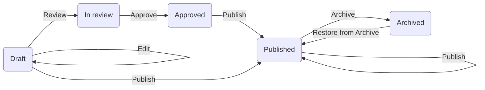
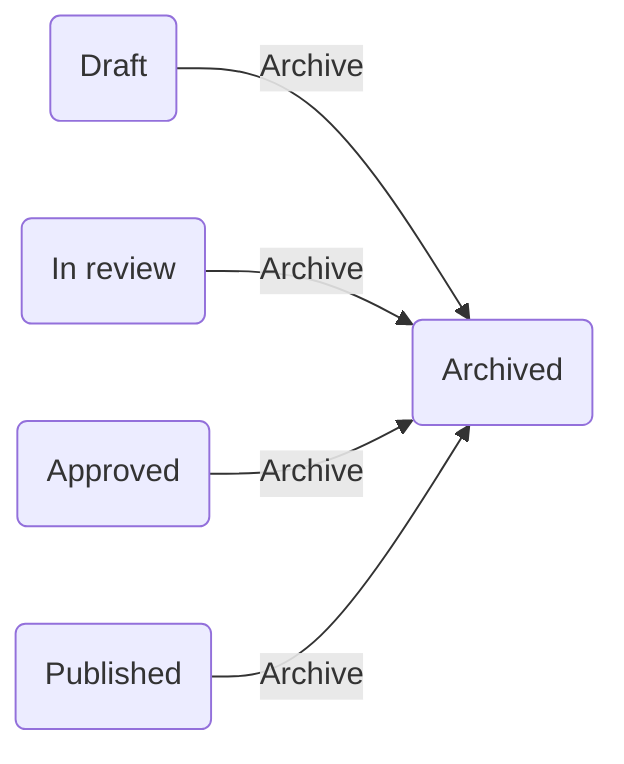
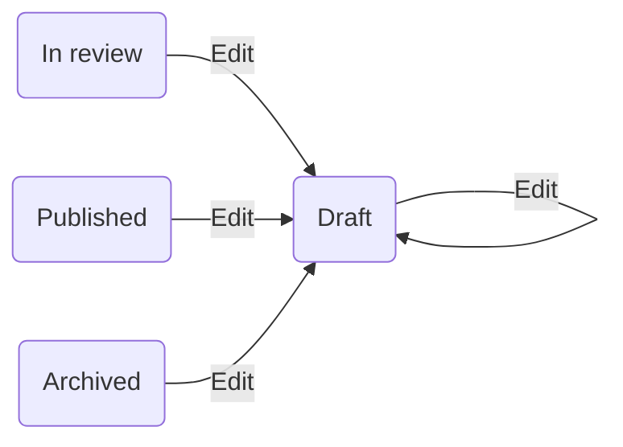
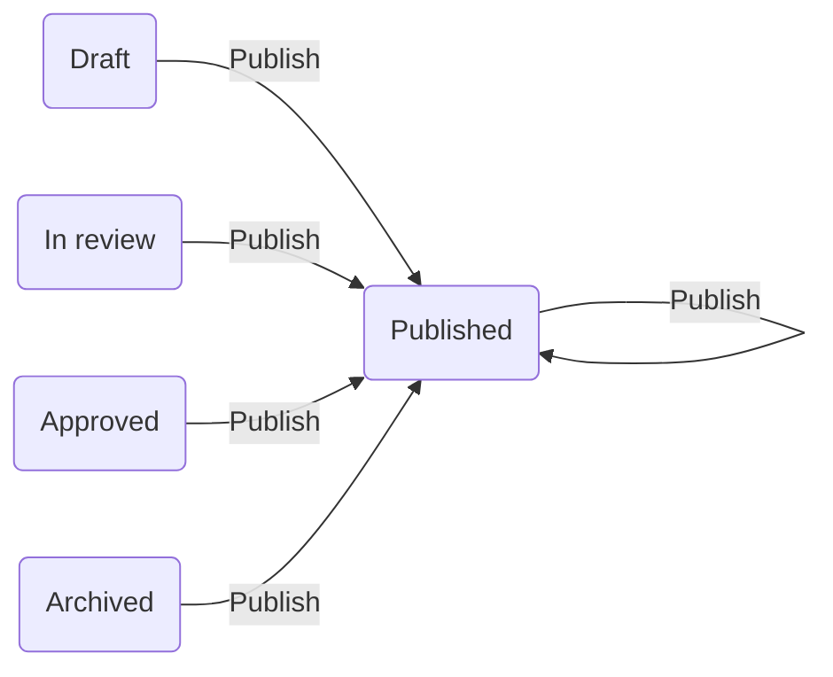
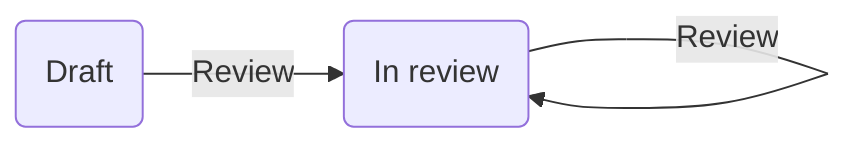
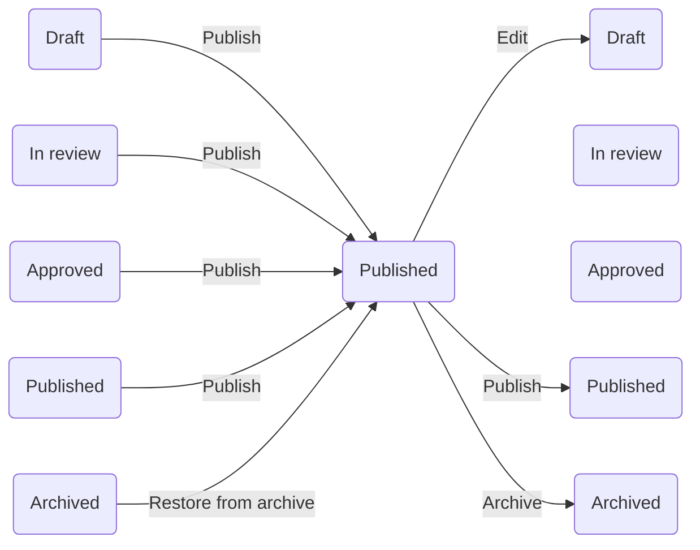
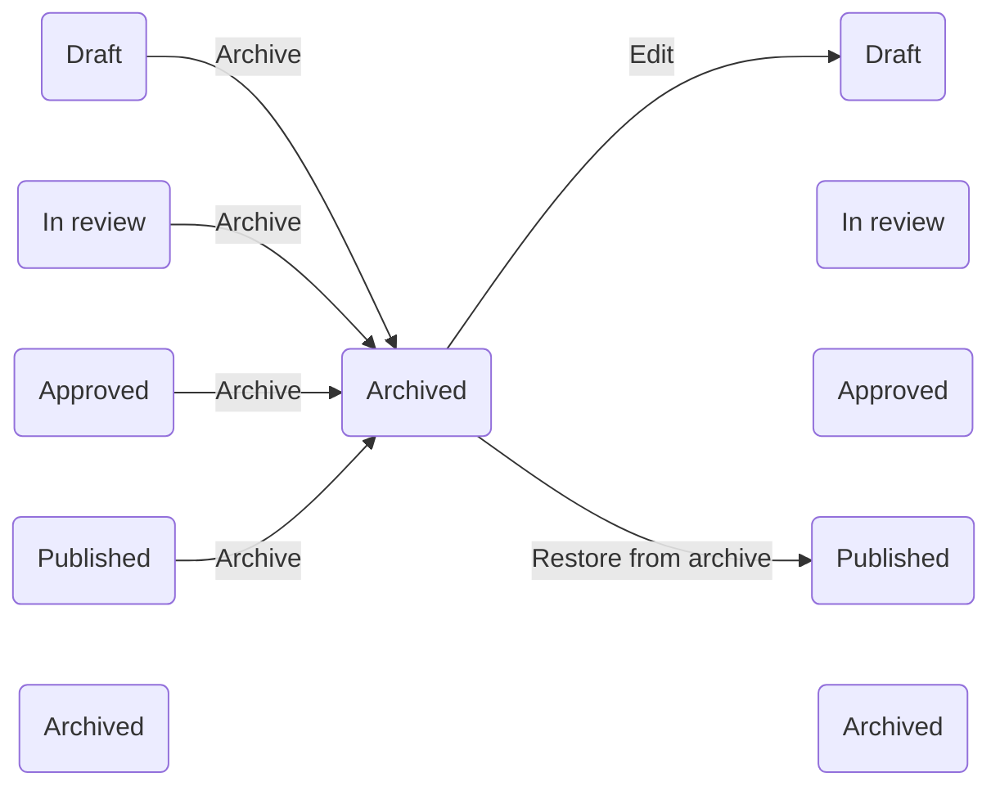

Content Moderation Roles determine how a Drupal CMS user can move content into various different states in the editorial workflow.
## Content Moderation Roles

Listed in order from lowest permissions to highest:
* Content Editor
* Content Reviewer
* Content Publisher 
* Content Admin

## Diagram of Editorial Workflow States & Transitions (simple)

## Editorial Workflow States & Transitions (full)
 ```mermaid
flowchart LR
    A(Draft) 
    B(In review)
    C(Approved)
    D(Published)
    E(Archived)
    A -->|Edit| A
    A -->|Review| B
    B -->|Review|B
    B -->|Approve| C
    C -->|Publish| D
    D -->|Archive| E
    E -->|Restore from Archive|D
    B -->|Edit| A
    D -->|Edit| A
    E -->|Edit| A
    A -->|Publish| D
    B -->|Publish| D
    D -->|Publish| D
    E -->|Publish| D
    A -->|Archive| E
    B -->|Archive| E
    C -->|Archive| E
 ```

## Workflow Transitions

**Approve**
* From: In review
* To: Approved
* Permissions: Content Reviewer, Content Publisher 


**Archive**
* From: Draft, In review, Approved, Published 
* To: Archived
* Permissions: Content Publisher 



**Edit**
* From: Draft, In review, Published, Archived 
* To: Draft
* Permissions: Content Editor, Content Reviewer, Content Publisher


**Publish**
* From: Draft, In review, Approved, Published
* To: Published 
* Permissions: Content Publisher



**Restore**
* From: Archived 
* To: Published 
* Permissions: Content Publisher


**Review**
* From: Draft, In review 
* To: In review 
* Permissions: Content Editor, Content Reviewer, Content Publisher



**All Transitions**
```mermaid
flowchart LR

    subgraph Edit
    direction LR
    A(Draft) 
    B(In review)
    D(Published)
    E(Archived)
    A -->|Edit| A
    B -->|Edit| A
    D -->|Edit| A
    E -->|Edit| A
    end
    
    subgraph Review
    direction LR
    A2(Draft) 
    B2(In review)
    A2 -->|Review| B2
    B2 -->|Review| B2
    end
    
    subgraph Approve
    direction LR
    B3(In review)
    C3(Approved)
    B3 -->|Approve| C3
    end
    
    subgraph Publish
    direction LR
    A4(Draft) 
    B4(In review)
    C4(Approved)
    D4(Published)
    E4(Archived)
    A4 -->|Publish| D4
    B4 -->|Publish| D4
    C4 -->|Publish| D4
    D4 -->|Publish| D4
    E4 -->|Publish| D4
    end
    
    subgraph Archive
    direction LR
    A5(Draft) 
    B5(In review)
    C5(Approved)
    D5(Published)
    E5(Archived)
    A5 -->|Archive| E5
    B5 -->|Archive| E5
    C5 -->|Archive| E5
    D5 -->|Archive| E5
    end
    
    subgraph Restore
    direction LR
    D6(Published)
    E6(Archived)
    E6 -->|Restore from Archive| D6
    end
    
    Edit ~~~ Review ~~~ Approve
    Publish ~~~ Archive ~~~ Restore
    
 ```
 
## Content Moderation Roles - Workflow Transition Permissions 
 
* Content Editor
  * Edit
  * Review
* Content Reviewer
  * Edit
  * Review
  * Approve
* Content Publisher 
  * Edit
  * Review
  * Approve
  * Publish
  * Archive
  * Restore from Archive

## Workflow State Centric Diagrams

**Draft**
```mermaid
flowchart LR
    A1(Draft)
    A2(Draft)
    A3(Draft)
    B1(In review)
    B2(In review)
    C1(Approved)
    C2(Approved)
    D1(Published)
    D2(Published)
    E1(Archived)
    E2(Archived)
    A1 -->|Edit| A2
    A2 -->|Edit| A3
    A2 -->|Review| B2
    B1 -->|Edit| A2
    C1 ~~~ A2
    A2 ~~~ C2
    D1 -->|Edit| A2
    E1 -->|Edit| A2
    A2 -->|Publish| D2
    A2 -->|Archive| E2
```
**In review**
```mermaid
flowchart LR
    A1B(Draft)
    A2B(Draft)
    B1B(In review)
    B2B(In review)
    B3B(In review)
    C1B(Approved)
    C2B(Approved)
    D1B(Published)
    D2B(Published)
    E1B(Archived)
    E2B(Archived)
    A1B -->|Review| B2B
    B2B -->|Edit| A2B
    B1B -->|Review|B2B
    B2B -->|Review|B3B
    C1B ~~~ B2B
    B2B -->|Approve| C2B
    D1B ~~~ B2B
    B2B -->|Publish| D2B
    E1B ~~~ B2B
    B2B -->|Archive| E2B
 ```
**Approved**
 ```mermaid
flowchart LR
    A1(Draft)
    A2(Draft)
    B1(In review)
    B2(In review)
    C1(Approved)
    C2(Approved)
    C3(Approved)
    D1(Published)
    D2(Published)
    E1(Archived)
    E2(Archived)

    A1 ~~~ C2 ~~~ A2
    B1 -->|Approve| C2 ~~~ B2
    C1 ~~~ C2 ~~~ C3
    D1 ~~~ C2 -->|Publish| D2
    E1 ~~~ C2 -->|Archive| E2
```
**Published**

**Archived**

