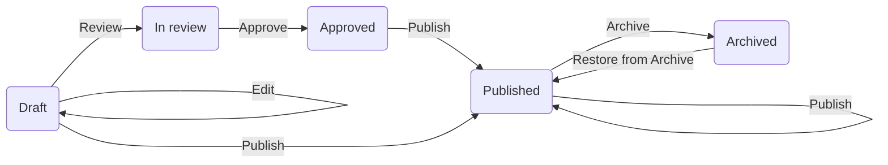

Content Moderation Roles determine how a Drupal CMS user can move content into various different states in the editorial workflow.
## Content Moderation Roles

Listed in order from lowest permissions to highest:
* Content Editor
* Content Reviewer
* Content Publisher 
* Content Admin

## Diagram of Editorial Workflow States & Transitions (simple)


## Workflow Transitions
* Approve 
  * Move content from In review state 
  * to Approved state
* Archive
  * Move content from Draft, In review, Approved, Published states 
  * to Archived state
* Edit
  * Move content from Draft, In review, Published, Archived states 
  * to Draft state
* Publish
  * Move content from Draft, In review, Approved, Published states 
  * to Published state
* Restore
  * Move content from Archived state 
  * to Published state. 
* Review
  * Move content from Draft, In review states 
  * to In review state


## Editorial Workflow States & Transitions (full)
```mermaid
flowchart LR
    A -->|Edit| A
    A(Draft) -->|Review| B(In review)
    B -->|Review|B
    B -->|Approve| C(Approved)
    C -->|Publish| D(Published)
    D -->|Archive| E(Archived)
    E -->|Restore from Archive|D
    B -->|Edit| A
    D -->|Edit| A
    E -->|Edit| A
    A -->|Publish| D
    B -->|Publish| D
    D -->|Publish| D
    E -->|Publish| D
    A -->|Archive| E
    B -->|Archive| E
    C -->|Archive| E
 ```
 
## Content Moderation Roles - Workflow Transition Permissions 
 
* Content Editor
  * Edit
  * Review
* Content Reviewer
  * Edit
  * Review
  * Approve
* Content Publisher & Content Admin
  * Edit
  * Review
  * Approve
  * Publish
  * Archive
  * Restore from Archive

## Individual Workflow State Diagrams

### Draft
```mermaid
flowchart LR
    A1(Draft)
    A2(Draft)
    A3(Draft)
    B1(In review)
    B2(In review)
    C1(Approved)
    C2(Approved)
    D1(Published)
    D2(Published)
    E1(Archived)
    E2(Archived)
    A1 -->|Edit| A2
    A2 -->|Edit| A3
    A2 -->|Review| B2
    B1 -->|Edit| A2
    C1 ~~~ A2
    A2 ~~~ C2
    D1 -->|Edit| A2
    E1 -->|Edit| A2
    A2 -->|Publish| D2
    A2 -->|Archive| E2
    

 ```
