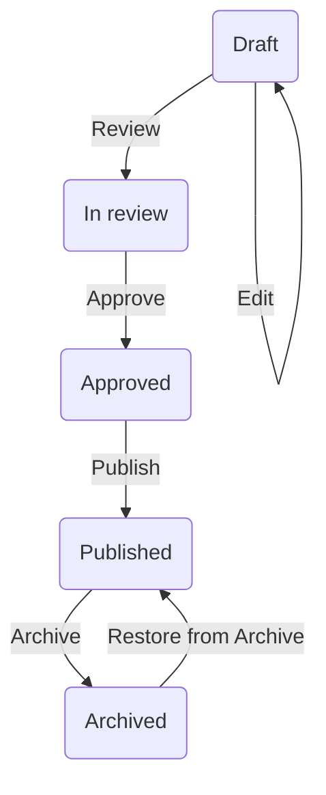

Content Moderation Roles determine how a Drupal CMS user can move content into various different states in the editorial workflow. The transitions between states are the important things to understand.

* Approve 
  * Move content from In review state 
  * to Approved state
* Archive
  * Move content from Draft, In review, Approved, Published states 
  * to Archived state
* Edit
  * Move content from Draft, In review, Published, Archived states 
  * to Draft state
* Publish
  * Move content from Draft, In review, Approved, Published states 
  * to Published state
* Restore
  * Move content from Archived state 
  * to Published state. 
* Review
  * Move content from Draft, In review states 
  * to In review state


Editorial Workflow States & Transitions (simple)


Editorial Workflow States & Transitions (full)
```mermaid
flowchart TD
    A -->|Edit| A
    A(Draft) -->|Review| B(In review)
    B -->|Review|B
    B -->|Approve| C(Approved)
    C -->|Publish| D(Published)
    D -->|Archive| E(Archived)
    E -->|Restore from Archive|D
    B -->|Edit| A
    D -->|Edit| A
    E -->|Edit| A
    A -->|Publish| D
    B -->|Publish| D
    D -->|Publish| D
    E -->|Publish| D
    A -->|Archive| E
    B -->|Archive| E
    C -->|Archive| E
 ```
 
* Content Editor
  * Edit
  * Review
* Content Reviewer
  * Edit
  * Review
  * Approve
* Content Publisher & Content Admin
  * Edit
  * Review
  * Approve
  * Publish
  * Archive
  * Restore from Archive
