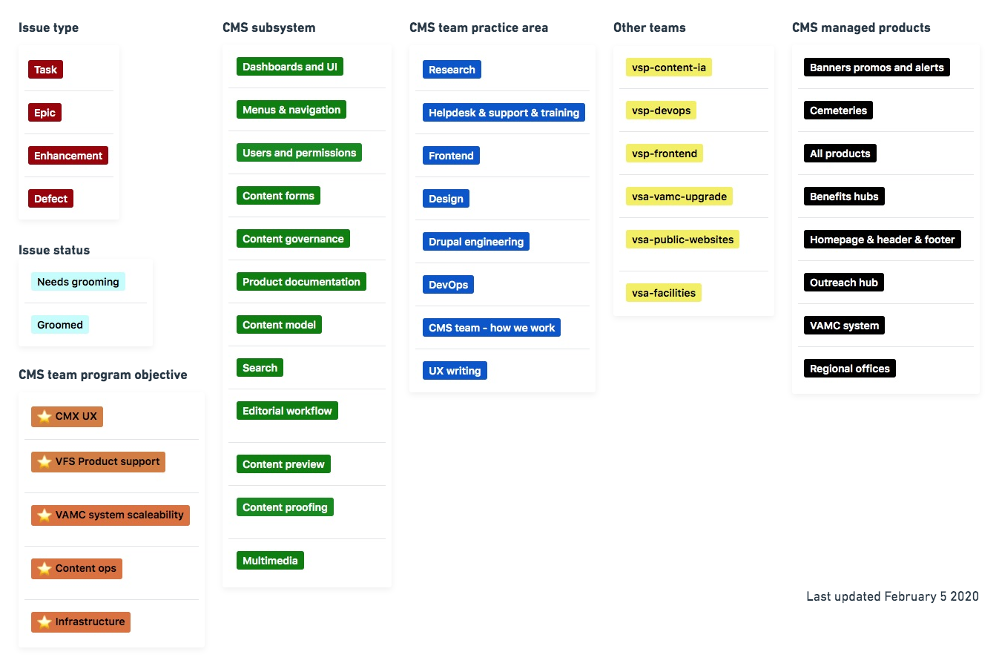

# How we use Github and Zenhub

## Table of contents 

 1. [Github Issue labels](#labels)
 1. [Github Milestones](#milestones)  
 1. [Zenhub practice](#zenhub)
 1. [Backlog grooming](#grooming)
 1. [Defect triage](#defect-triage)

<a name="labels">

## Issue labels 

We have about [50 pre-defined labels](https://github.com/department-of-veterans-affairs/va.gov-cms/labels) in the va.gov-cms repo, which should help us to:

* Groom backlog, prioritize epics and stories, and triage bugs by theme.
* Track progress towards objectives (eg how many enhancements delivered). 
* Develop and leadership and ownership over our various workstreams products, subsystems, and practice areas. 
* Encourage cross-disciplinary epics
* Help users of CMS managed products, and product design teams, collaborate on our backlog. 
* Align with certain practices already in use on VSP and VFS teams. 
* Discern bot-driven issues (dependabot, primarily) from human issues.

**Issue type (red):** Issue type is the first label that's added, and typically it's added automatically by which [issue template you choose](https://github.com/department-of-veterans-affairs/va.gov-cms/issues/new/choose). (Each of these issues types have an [associated issue template](https://github.com/department-of-veterans-affairs/va.gov-cms/tree/master/.github/ISSUE_TEMPLATE)). 

* Epics contain enhancements or tasks. 
* Enhancements issues may "contain" tasks.
* Defects issues stand alone.
* "CMS discovery request" and "Support or training request" will typically be created by members other product teams. 

**Issue status (light blue):** These labels (groomed or not groomed) will help us prepare for grooming. 

**CMS program objectives (orange):** These labels will help us track progress towards our [program objectives](#) (link forthcoming!). 

**CMS team practice area (green):** This should help us to encourage cross-disciplinary planning and ownership.

**CMS subsystem (blue):** This helps us to find related work and dependencies.

**CMS managed products (black)** These help us prioritize and plan support for product teams, and find related work and dependencies.

**Teams we work with (yellow):** These labels help other teams find CMS-related specific to their team. 

<a name="milestones">

 ## Github Milestones

Each issue can be tagged with a milestone.  It is the responsibility of the delivery manager will ensure to ensure completed work has associated milestones. 

We may also use milestones for specific product milestones, such as an MVP or release. 

<a name="milestones">

---- Everything below this is still in draft ----

## Zenhub

## Backlog management

### Grooming sessions

- Every other Monday at 3:30pm: Helpdesk and support backlog grooming 
- Every other Tuesday at 1:30pm ET: Devops Grooming 
- Every other Wednesday at 2pm ET: Design pod grooming 
- Every other Friday at 12:30pm: Cross-disciplinary grooming. The agenda will usually be a few epics, and participation may depend on what epics we’re grooming. 

It is the responsibility of the product manager to facilitate these 

### Defect triage

Critical bugs will often be triaged immediately, but non-critical bugs will be triaged 

On a weekly basis 

