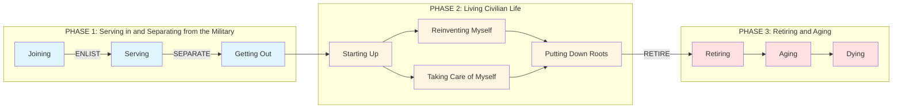

# Journeys of Veterans Map

This map covers ten life stages any Veteran may encounter, from pre-service to end of life. These life stages are organized in three phases in which Veterans' goals and aspirations are distinctly different.

This page contains an image of the map; the next page is an alternate text version of the map's content for screen readers.

## Journey Map Visualization

### Interactive Journey Map Details

<strong>PHASE 1: Joining (Pre-Service)</strong>

**Moments:**
- Leaving home
- Embracing military culture
- Being motivated by the mission
- Understanding future prospects
- Preparing for military service

**🔴 MOMENT THAT MATTERS:** The promise of VA benefits and services during recruitment is often the first time servicemembers are "introduced" to VA and factors into decision making around their future.

<strong>PHASE 1: Serving</strong>

**Moments:**
- Adapting to military culture
- Managing military and family obligations
- Doing well by my unit
- Fulfilling my military obligation

**Associated VA Services:**
- GI Bill
- VA Home Loan
- Life insurance

**🔴 MOMENT THAT MATTERS:** Purchasing a home, enrolling in part-time education, and/or maintaining their personal and familial health are often top-of-mind concerns for servicemembers balancing life inside and outside of the military.

<strong>PHASE 1: Getting Out (Separation)</strong>

**Moments:**
- Understanding the process of separating
- Transition Assistance Program (TAP)
- Completing my paperwork
- Engaging VA to access benefits and services

**Associated VA Services:**
- GI Bill
- Home Loan
- Pre-discharge Program (Disability Compensation)
- Healthcare

**🔴 MOMENT THAT MATTERS:** Separation programs pack in a lot of good information but are delivered at a moment when Veterans are not ready or able to absorb the information.

<strong>PHASE 2: Starting Up</strong>

**Moments:**
- Finding something to do
- Re-establishing and creating relationships
- Balancing finances
- Attending to health needs
- Finding a place to live

**Associated VA Services:**
- GI Bill
- Career Center
- Vocational Rehab & Employment
- Vet Center
- VA Health Care
- MyHealtheVet
- Pharmacy
- Disability Health Condition
- Compensation & Pension Exam
- Post-Deployment Clinic
- Welcome Home Events
- VA Home Loan

**🔴 MOMENT THAT MATTERS #1:** Finding something to do like returning to school, going to work, or connecting with the community decreases the risk of harmful behaviors like substance abuse.

**🔴 MOMENT THAT MATTERS #2:** Veterans select health care coverage according to their individual set of needs and preferences, often choosing private healthcare over VA unless they seek care and compensation for service-related conditions.

<strong>PHASE 2: Reinventing Myself</strong>

**Moments:**
- Building my network
- Translating my military skills
- Acquiring the appropriate education, new skills, and credentials
- Finding the right job
- Building my professional reputation

**Associated VA Services:**
- Skills Translator
- Career Center
- Resume Builder
- GI Bill
- Vocational Rehab & Employment
- Educational & Vocational Counseling
- Veterans Job Bank
- VA Employment

**🔴 MOMENT THAT MATTERS:** Veterans expect to be able to translate their skills and leadership abilities easily from the military to a civilian career and rely on resources to identify and fill gaps in their education and credentials.

<strong>PHASE 2: Taking Care of Myself</strong>

**Moments:**
- Recognizing and addressing mental health needs
- Managing primary care and chronic health issues
- Seeking support for an acute health event
- Maintaining my health

**Associated VA Services:**
- Mental Health Care
- PTS Services
- Psychosocial Rehabilitation & Recovery Services
- Veteran Crisis Line
- MST Counseling
- Social work
- VA Health Care
- Disability Compensation
- Prescription Services
- Inpatient Care
- Choice Act
- Emergency Care
- Specialized Care
- MyHealtheVet
- Preventative Care
- Pharmacy

**🔴 MOMENT THAT MATTERS #1:** Veterans with mental health needs often have a difficult time accessing providers and feeling safe once in care — not just at VA, but in the entire mental healthcare industry.

**🔴 MOMENT THAT MATTERS #2:** A lack of formal or informal knowledge transfer between providers leads to Veterans experiencing discontinuity within VA and between VA and external sources of healthcare.

<strong>PHASE 2: Putting Down Roots</strong>

**Moments:**
- Starting, growing, or maintaining my family
- Revisiting housing
- Maintaining my financial, social, and emotional health
- Connecting with and serving my community
- Taking care of my family
- Saving for my retirement
- Engaging VA to access benefits and services

**Associated VA Services:**
- VA Home Loan
- VA Refinancing
- Vet Center
- VA Mental Health Center
- Social work
- myVA Communities
- VSOs
- GI Bill
- Life Insurance
- Veteran's Pension
- Disability Compensation
- Home Loan
- Pre-discharge Program (Disability Compensation)
- Healthcare

**🔴 MOMENT THAT MATTERS:** Through bonding over shared experiences on social media, at in-person events, and via support networks, Veterans create a sense of community.

<strong>PHASE 3: Retiring</strong>

**Moments:**
- Finding additional sources of income
- Taking care of my health
- Participating in meaningful activities

**Associated VA Services:**
- VA Veteran's Pension
- Disability Compensation
- VA Health Care
- Audiology
- Blind & Vision Rehab
- Specialized Care
- Vet Center

**🔴 MOMENT THAT MATTERS:** Veterans seek supplemental coverage to fill healthcare coverage gaps caused by insurance changes during retirement. Some Veterans reengage or engage with VA for the first time at this stage.

<strong>PHASE 3: Aging</strong>

**Moments:**
- Managing my declining health
- Planning for longer term care
- Adapting my support network to my new needs
- Maintaining social and community connections

**Associated VA Services:**
- VA Health Care
- Geriatric & Extended Care
- Home Health Care
- Caregiver Services
- PACT teams
- Holistic end of life planning
- Geriatric & Extended Health

**🔴 MOMENT THAT MATTERS #1:** Veterans increasingly seek alternatives to institutional based care and instead wish to stay independent for longer, remaining in their homes and communities.

**🔴 MOMENT THAT MATTERS #2:** Sustaining a sense of community and social connection is critical to Veterans' well-being as they age.

<strong>PHASE 3: Dying</strong>

**Moments:**
- Deciding how and where to be memorialized
- Scheduling and planning a funeral service

**Associated VA Services:**
- Burial Benefits
- Burial Allowance
- Survivor's Benefits
- Grief Counseling

**🔴 MOMENT THAT MATTERS:** Often the first time a Veteran's family interacts directly with VA is during the highly-emotional time of a Veteran's death.

## Visual Journey Map Overview

### Pre-Service Life
- Leaving home
- Embracing military culture
- Being motivated by the mission
- Understanding future prospects
- Preparing for military service

**MOMENT THAT MATTERS:** The promise of VA benefits and services during recruitment is often the first time servicemembers are "introduced" to VA and factors into decision making around their future.

### Joining → Serving → Getting Out → Starting Up
**[ENLIST → SEPARATE]**

### Key Moments and Services

#### Serving
- Adapting to military culture
- Managing military and family obligations
- Doing well by my unit
- Fulfilling my military obligation

**Associated VA Services:**
- GI Bill
- VA Home Loan
- Life insurance

**MOMENT THAT MATTERS:** Purchasing a home, enrolling in part-time education, and/or maintaining their personal and familial health are often top-of-mind concerns for servicemembers balancing life inside and outside of the military.

#### Getting Out
- Understanding the process of separating
- Transition Assistance Program (TAP)
- Completing my paperwork
- Engaging VA to access benefits and services

**Associated VA Services:**
- GI Bill
- Home Loan
- Pre-discharge Program (Disability Compensation)
- Healthcare

**MOMENT THAT MATTERS:** Separation programs pack in a lot of good information but are delivered at a moment when Veterans are not ready or able to absorb the information.

#### Starting Up
- Finding something to do
- Re-establishing and creating relationships
- Balancing finances
- Attending to health needs
- Finding a place to live

**Associated VA Services:**
- GI Bill
- Career Center
- Vocational Rehab & Employment
- Vet Center
- VA Health Care
- MyHealtheVet
- Pharmacy
- Disability Health Condition
- Compensation & Pension Exam
- Post-Deployment Clinic
- Welcome Home Events
- VA Home Loan

**MOMENT THAT MATTERS:** Finding something to do like returning to school, going to work, or connecting with the community decreases the risk of harmful behaviors like substance abuse.

**MOMENT THAT MATTERS:** Veterans select health care coverage according to their individual set of needs and preferences, often choosing private healthcare over VA unless they seek care and compensation for service-related conditions.

---

## Legend
- **🔴 Moment that matters** - Significant impact on Veterans' experiences
- **Moment** - Typical experience Veterans encounter
- **Life Stage** - Broader phase of the Veteran journey

---

## Important Notes

**Not all Veterans are the same** and there is no "one" veteran. There are, however, a broad set of shared moments many Veterans will encounter and live through. Different Veteran personas will experience these moments differently.

**Life events impact individual goals and change priorities.** Events like marriage, divorce, widowhood, birth of a child, obtaining a new degree, loss of housing, empty nesting, major illness and so forth impact individual Veteran journeys.

---

## Continuing Journey Phases

### Reinventing Myself
- Building my network
- Translating my military skills
- Acquiring the appropriate education, new skills, and credentials
- Finding the right job
- Building my professional reputation

**Associated VA Services:**
- Skills Translator
- Career Center
- Resume Builder
- GI Bill
- Vocational Rehab & Employment
- Educational & Vocational Counseling
- Veterans Job Bank
- VA Employment

**MOMENT THAT MATTERS:** Veterans expect to be able to translate their skills and leadership abilities easily from the military to a civilian career and rely on resources to identify and fill gaps in their education and credentials.

### Taking Care of Myself
- Recognizing and addressing mental health needs
- Managing primary care and chronic health issues
- Seeking support for an acute health event
- Maintaining my health

**Associated VA Services:**
- Mental Health Care
- PTS Services
- Psychosocial Rehabilitation & Recovery Services
- Veteran Crisis Line
- MST Counseling
- Social work
- VA Health Care
- Disability Compensation
- Prescription Services
- Inpatient Care
- Choice Act
- Emergency Care
- Specialized Care
- MyHealtheVet
- Preventative Care
- Pharmacy

**MOMENT THAT MATTERS:** Veterans with mental health needs often have a difficult time accessing providers and feeling safe once in care — not just at VA, but in the entire mental healthcare industry.

**MOMENT THAT MATTERS:** A lack of formal or informal knowledge transfer between providers leads to Veterans experiencing discontinuity within VA and between VA and external sources of healthcare.

### Putting Down Roots
- Starting, growing, or maintaining my family
- Revisiting housing
- Maintaining my financial, social, and emotional health
- Connecting with and serving my community
- Taking care of my family
- Saving for my retirement
- Engaging VA to access benefits and services

**Associated VA Services:**
- VA Home Loan
- VA Refinancing
- Vet Center
- VA Mental Health Center
- Social work
- myVA Communities
- VSOs
- GI Bill
- Life Insurance
- Veteran's Pension
- Disability Compensation
- Home Loan
- Pre-discharge Program (Disability Compensation)
- Healthcare

**MOMENT THAT MATTERS:** Through bonding over shared experiences on social media, at in-person events, and via support networks, Veterans create a sense of community.

---

## Phase 3: Retiring and Aging

### Retiring **[RETIRE]**
- Finding additional sources of income
- Taking care of my health
- Participating in meaningful activities

**Associated VA Services:**
- VA Veteran's Pension
- Disability Compensation
- VA Health Care
- Audiology
- Blind & Vision Rehab
- Specialized Care
- Vet Center

**MOMENT THAT MATTERS:** Veterans seek supplemental coverage to fill healthcare coverage gaps caused by insurance changes during retirement. Some Veterans reengage or engage with VA for the first time at this stage.

### Aging
- Managing my declining health
- Planning for longer term care
- Adapting my support network to my new needs
- Maintaining social and community connections

**Associated VA Services:**
- VA Health Care
- Geriatric & Extended Care
- Home Health Care
- Caregiver Services
- PACT teams
- Holistic end of life planning
- Geriatric & Extended Health

**MOMENT THAT MATTERS:** Veterans increasingly seek alternatives to institutional based care and instead wish to stay independent for longer, remaining in their homes and communities.

**MOMENT THAT MATTERS:** Sustaining a sense of community and social connection is critical to Veterans' well-being as they age.

### Dying
- Deciding how and where to be memorialized
- Scheduling and planning a funeral service

**Associated VA Services:**
- Burial Benefits
- Burial Allowance
- Survivor's Benefits
- Grief Counseling

**MOMENT THAT MATTERS:** Often the first time a Veteran's family interacts directly with VA is during the highly-emotional time of a Veteran's death.

---

# Accessible Text Version

## Journeys of Veterans Map

This map covers ten life stages any Veteran may encounter, from pre-service to end of life. These life stages are organized in three phases in which Veterans' goals and aspirations are distinctly different.

Each life stage lists out moments Veterans typically experience and associated VA services, and calls out key "moments that matter" which may have significant impact on Veterans' experiences.

**This page is an alternate text version of the map's content, to make the content accessible to screen readers.**

### Context and Usage Notes

**Not all Veterans are the same** and there is no "one" veteran. There are, however, a broad set of shared moments many Veterans will encounter and live through. Different Veteran personas will experience these moments differently.

**Life events impact individual goals and change priorities.** Events like marriage, divorce, widowhood, birth of a child, obtaining a new degree, loss of housing, empty nesting, major illness and so forth impact individual Veteran journeys.

---

## Phase 1: Serving in and Separating from the Military

### Life Stage: Joining

#### Moments:
- Leaving home
- Embracing military culture
- Being motivated by the mission

#### Moment that Matters: Understanding future prospects

**Why it matters:** The promise of VA benefits and services during recruitment is often the first time Servicemembers are "introduced" to VA and factors into decision making around their future.

- Preparing for military service

**[Enlist]**

---

### Life Stage: Serving

#### Moment: Adapting to military culture

#### Moment that Matters: Managing military and family obligations

**Associated VA services:**
- GI Bill
- VA Home Loan
- Life insurance

**Why it matters:** Purchasing a home, enrolling in part-time education, and/or maintaining their personal and familial health are often top-of-mind concerns for Servicemembers balancing life inside and outside of the military.

#### Moments:
- Doing well by my unit
- Fulfilling my military obligation

---

### Life Stage: Getting Out

#### Moment that Matters: Understanding the process of separating

**Associated VA services:**
- Transition Assistance Program (TAP)

**Why it matters:** Separation programs pack in a lot of good information but are delivered at a moment when Veterans are not ready or able to absorb the information.

#### Moments:
- Completing my paperwork
- Engaging VA to access benefits and services

**Associated VA services:**
- GI Bill
- Home Loan
- Pre-discharge Program (Disability Compensation)
- Healthcare

**[Separate]**

---

## Phase 2: Living Civilian Life

### Life Stage: Starting Up

#### Moment that Matters: Finding something to do

**Associated VA services:**
- GI Bill
- Vocational Rehab & Employment
- Career Center

**Why it matters:** Finding something to do like returning to school, going to work, or connecting with the community decreases the risk of harmful behaviors like substance abuse.

#### Moment: Re-establishing and creating relationships

**Associated VA services:**
- Vet Center

#### Moment: Balancing finances

#### Moment that Matters: Attending to health needs

**Associated VA services:**
- VA Health Care
- MyHealtheVet
- Pharmacy
- Disability Health Condition
- Compensation & Pension Exam
- Post-Deployment Clinic
- Welcome Home Events
- Vet Center

**Why it matters:** Veterans select health care coverage according to their individual set of needs and preferences, often choosing private healthcare over VA unless they seek care and compensation for service-related conditions.

#### Moment: Finding a place to live

**Associated VA services:**
- VA Home Loan

---

### Life Stage: Taking Care of Myself

#### Moment that Matters: Recognizing and addressing mental health needs

**Associated VA services:**
- Mental Health Care
- PTS Services
- Psychosocial Rehabilitation & Recovery Services
- Veteran Crisis Line
- MST Counseling
- Social work

**Why it matters:** Veterans with mental health needs often have a difficult time accessing providers and feeling safe once in care — not just at VA, but in the entire mental healthcare industry.

#### Moment that Matters: Managing primary care and chronic health issues

**Associated VA services:**
- VA Health Care
- Disability Compensation
- Prescription Services
- Inpatient Care
- Choice Act

**Why it matters:** A lack of formal or informal knowledge transfer between providers leads to Veterans experiencing discontinuity within VA and between VA and external sources of healthcare.

#### Moment: Seeking support for an acute health event

**Associated VA services:**
- VA Health Care
- Prescription Services
- Emergency Care
- Specialized Care

#### Moment: Maintaining my health

**Associated VA services:**
- VA Health Care
- MyHealtheVet
- Preventative Care
- Pharmacy

---

### Life Stage: Reinventing Myself

#### Moment: Building my network

#### Moment: Translating my military skills

**Associated VA services:**
- Skills Translator
- Career Center
- Resume Builder

#### Moment that Matters: Acquiring the appropriate education, new skills, and credentials

**Associated VA services:**
- GI Bill
- Vocational Rehab & Employment
- Educational & Vocational Counseling

**Why it matters:** Veterans expect to be able to translate their skills and leadership abilities easily from the military to a civilian career and rely on resources to identify and fill gaps in their education and credentials.

#### Moment: Finding the right job

**Associated VA services:**
- Career Center
- Veterans Job Bank
- Resume Builder
- VA Employment

#### Moment: Building my professional reputation

---

### Life Stage: Putting Down Roots

#### Moment: Starting, growing, or maintaining my family

#### Moment: Revisiting housing

**Associated VA services:**
- VA Home Loan
- VA Refinancing

#### Moment: Maintaining my financial, social, and emotional health

**Associated VA services:**
- Vet Center
- VA Mental Health Center
- Social work

#### Moment that Matters: Connecting with and serving my community

**Associated VA services:**
- myVA Communities
- VSOs

**Why it matters:** Through bonding over shared experiences on social media, at in-person events, and via support networks, Veterans create a sense of community.

#### Moment: Taking care of my family

**Associated VA services:**
- GI Bill
- Life Insurance

#### Moment: Saving for my retirement

**Associated VA services:**
- Veteran's Pension
- Disability Compensation

#### Moment: Engaging VA to access benefits and services

**Associated VA services:**
- GI Bill
- Home Loan
- Pre-discharge Program (Disability Compensation)
- Healthcare

---

## Phase 3: Retiring and Aging

### Life Stage: Retiring

#### Moment: Finding additional sources of income

**Associated VA services:**
- VA Veteran's Pension
- Disability Compensation

#### Moment that Matters: Taking care of my health

**Associated VA services:**
- VA Health Care
- Blind & Vision Rehab
- Audiology
- Specialized Care

**Why it matters:** Veterans seek supplemental coverage to fill healthcare coverage gaps caused by insurance changes during retirement. Some Veterans reengage or engage with VA for the first time at this stage.

#### Moment: Participating in meaningful activities

**Associated VA services:**
- Vet Center

**[Retire]**

---

### Life Stage: Aging

#### Moment that Matters: Managing my declining health

**Associated VA services:**
- VA Health Care
- Geriatric & Extended Care
- Home Health Care
- Caregiver Services

**Why it matters:** Veterans increasingly seek alternatives to institutional based care and instead wish to stay independent for longer, remaining in their homes and communities.

#### Moment: Planning for longer term care

**Associated VA services:**
- PACT teams
- Holistic end of life planning

#### Moment: Adapting my support network to my new needs

**Associated VA services:**
- Caregiver Services
- Home Health Care
- Geriatric & Extended Health

#### Moment: Maintaining social and community connections

**Why it matters:** Sustaining a sense of community and social connection is critical to Veterans' well-being as they age.

---

### Life Stage: Dying

#### Moment: Deciding how and where to be memorialized

**Associated VA services:**
- Burial Benefits
- Burial Allowance
- Survivor's Benefits

#### Moment that Matters: Scheduling and planning a funeral service

**Associated VA services:**
- Burial Benefits
- Burial Allowance
- Survivor's Benefits
- Grief Counseling

**Why it matters:** Often the first time a Veteran's family interacts directly with VA is during the highly-emotional time of a Veteran's death.

---

## About This Project

The Journey of Veterans map is a project by the Veterans Experience Office.

The Veterans Experience team traveled across the country to meet and learn more about Veterans from all eras and branches of service. We listened to stories about their diverse military experiences and their evolving civilian lives.

**The purpose of this effort** is to catalyze action through analysis of customer insights, so we can align what we do with the needs and expectations of who we serve.

---

## Contact Information

**For more information, email:** Vets-Experience@VA.gov

---

**Developed by the VA Veterans Experience Office**
