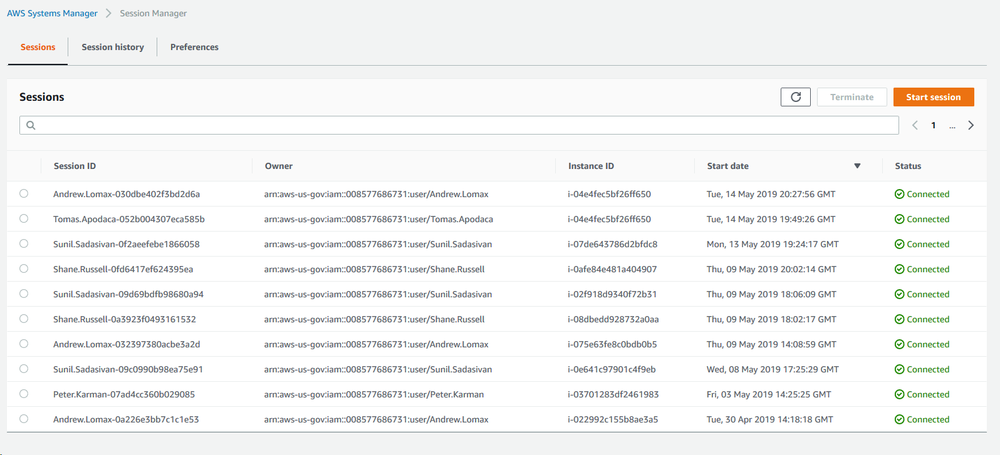
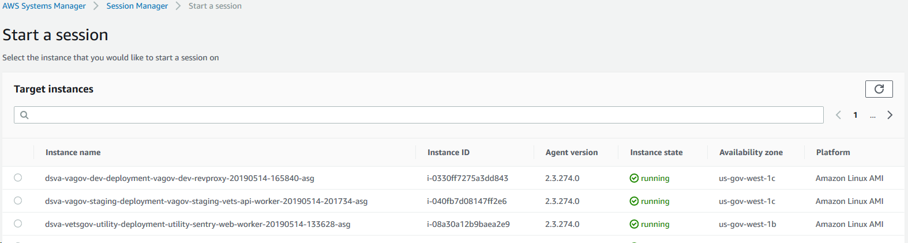
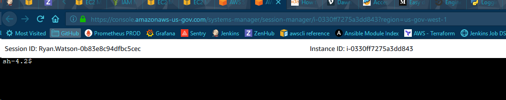
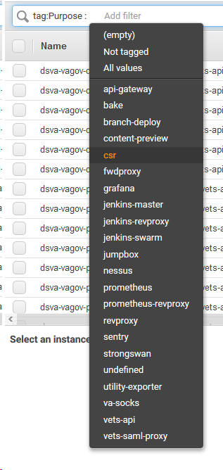
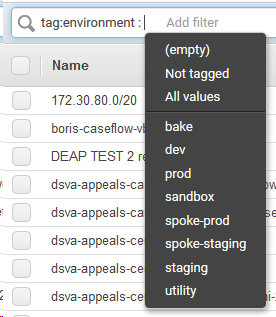

# Table of Conents

1. [Introduction](#introduction)
2. [Web Console Usage](#web-console-usage)
3. [CLI Usage](#CLI-usage)
4. [CLI Requirements and Environment Setup](#CLI-Requirements)
5. [SSM Helper Script](#SSM-helper-script)
6. [End-to-End Demo with the CLI](#Demo)
7. [Troubleshooting](#troubleshooting) - Some common errors and how to fix them

## Introduction

Previously gaining shell access to instances meant setting your `ssh` options and tunnelling through a jumpbox. We have began to implment `ssh`-like functionality via a relatively new offering from AWS Systems Manager. This service, Session Manager, allows authorized IAM users to create local 'sessions' which connect via the AWS API to EC2 instances running the ssm-agent software using secure websockets.

A session can be started via the AWS web console or on the CLI.

The CLI tool offers the look and feel of a typical SSH experience, but does require some [setup locally](#cli-requirements).

## Web Console Usage

The web console experience begins here https://console.amazonaws-us-gov.com/systems-manager/session-manager/sessions?region=us-gov-west-1.

Along the top there are two tabs; 'Sessions' and 'Session history'. 

You can start a web only session without having to use the CLI tool. Click the yellow button in the right corner labelled 'Start session'.


Filtering here is a little strange and does not accept wild cards. You can page through all instances which are currently reporting to the service and select one to begin a session:


This acts like a typical terminal and can be exited when complete.

## CLI Usage

The script is run thusly:
```bash
./ssm.sh [APP_NAME] [APP_ENV] [auto]
# APP_NAME corresponds to the EC2 tag 'Purpose'
# APP_ENV corresponds to the EC2 tag 'environment'
# auto immediately login to the first instance returned
```

```bash
./ssm.sh revproxy dev
# Returns a list of current revproxy instances in DEV
```

`APP_NAME` or 'Purpose' does correspond to what we think of as apps:



and likewise for `APP_ENV` environment:



### CLI Requirements

Use the following sections to setup each of the SSM connection requirements.

- `ssm.sh` helper script
- AWS IAM permissions for your user account
- Docker

### SSM helper script

The SSM script helps translate a need to connect to the shell of a specific instance type into SSM commands to automatically connect you located in the devops repo at `utilities/ssm.sh`. Copy it into your local path or symlink. It has been forked from the original implementation by the folks over on the Appeals team to work with our instance naming scheme.

### Demo

Installing and verifying:
```bash
➜  tmp curl "https://s3.amazonaws.com/session-manager-downloads/plugin/latest/ubuntu_64bit/session-manager-plugin.deb" -o "session-manager-plugin.deb"
  % Total    % Received % Xferd  Average Speed   Time    Time     Time  Current
                                 Dload  Upload   Total   Spent    Left  Speed
100 2918k  100 2918k    0     0  1047k      0  0:00:02  0:00:02 --:--:-- 1047k
➜  tmp sudo dpkg -i session-manager-plugin.deb
[sudo] password for user:
(Reading database ... 47548 files and directories currently installed.)
Preparing to unpack session-manager-plugin.deb ...
Stopping session-manager-plugin
/var/lib/dpkg/info/session-manager-plugin.prerm: 4: /var/lib/dpkg/info/session-manager-plugin.prerm: stop: not found
Preparing for install
/var/lib/dpkg/tmp.ci/preinst: 4: /var/lib/dpkg/tmp.ci/preinst: stop: not found
Unpacking session-manager-plugin (1.1.17.0-1) over (1.1.17.0-1) ...
Setting up session-manager-plugin (1.1.17.0-1) ...
Starting session-manager-plugin
/var/lib/dpkg/info/session-manager-plugin.postinst: 4: /var/lib/dpkg/info/session-manager-plugin.postinst: start: not found
rm: cannot remove '/usr/local/bin/session-manager-plugin': No such file or directory
Processing triggers for ureadahead (0.100.0-20) ...
➜  tmp session-manager-plugin

The Session Manager plugin was installed successfully. Use the AWS CLI to start a session.
```

Using the bash helper script:
```bash
(venv27) ➜  tmp ssm.sh vets-api dev
Finding apps for vets-api dev
Found the following instances:
Instance ID             Launch Date                     Private Ip
i-09b8ee2482e58e8bb     2019-05-13T21:25:17.000Z        10.247.97.77
i-079f70186ea66f64c     2019-05-13T21:25:16.000Z        10.247.96.165
i-060426244e95fb4e1     2019-05-13T21:25:19.000Z        10.247.96.56
i-0be31c06d4c75e9d8     2019-05-13T21:25:21.000Z        10.247.97.78
i-000cf15c71a16dca9     2019-05-13T21:25:19.000Z        10.247.96.160
i-0717216985d3bf7bf     2019-05-13T21:25:17.000Z        10.247.96.16

What instance do you want to connect to? (input only the number eg: 1, 2, 4)
<CTRL+C> to exit
1) i-09b8ee2482e58e8bb  3) i-060426244e95fb4e1  5) i-000cf15c71a16dca9
2) i-079f70186ea66f64c  4) i-0be31c06d4c75e9d8  6) i-0717216985d3bf7bf
#? ^C
(venv27) ➜  tmp ssm.sh revproxy dev
Finding apps for revproxy dev
Found the following instances:
Instance ID             Launch Date                     Private Ip
i-03373dabe1063ade6     2019-05-13T21:12:39.000Z        10.247.96.110
i-030ad58cd01370cd6     2019-05-13T21:12:39.000Z        10.247.97.111
i-027ead3226f038d70     2019-05-13T21:12:38.000Z        10.247.96.168

What instance do you want to connect to? (input only the number eg: 1, 2, 4)
<CTRL+C> to exit
1) i-03373dabe1063ade6
2) i-030ad58cd01370cd6
3) i-027ead3226f038d70
#? 1
Starting session to:  i-03373dabe1063ade6

Starting session with SessionId: Ryan.Watson-0b9a893d88b3b8f6d
sh-4.2$ ls
bin  boot  cgroup  configuration  dev  etc  home  lib  lib64  local  lost+found  media  mnt  opt  proc  root  run  sbin  selinux  srv  sys  tmp  usr  var
sh-4.2$ pwd
/
sh-4.2$ echo $SHELL
/bin/bash
sh-4.2$ sudo -s
[root@ip-10-247-96-110 /]# exit
exit
sh-4.2$ exit
exit


Exiting session with sessionId: Ryan.Watson-0b9a893d88b3b8f6d.
```
_Note_

The ability to query and list available servers does not imply you can start a session on a server.

### Troubleshooting

#### Request has expired

`An error occurred (RequestExpired) when calling the DescribeInstances operation: Request has expired.`

This is due to the `aws ssm` command not having a valid token. Refresh your MFA tokens using the [`issue_mfa.sh` script](https://github.com/department-of-veterans-affairs/devops#credentials).

#### AWS CLI Usage printed

```bash
usage: aws [options] <command> <subcommand> [<subcommand> ...] [parameters]
To see help text, you can run:

  aws help
  aws <command> help
  aws <command> <subcommand> help
aws: error: argument operation: Invalid choice, valid choices are:
...
```

This means that the newish `aws ssm start-session` subcommand wasn't found. Upgrade the version of `aws-cli` so the new subcommand is available.
