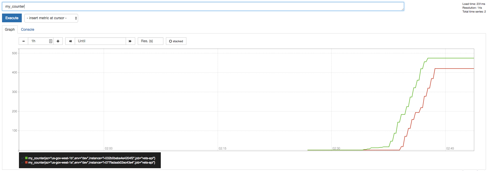
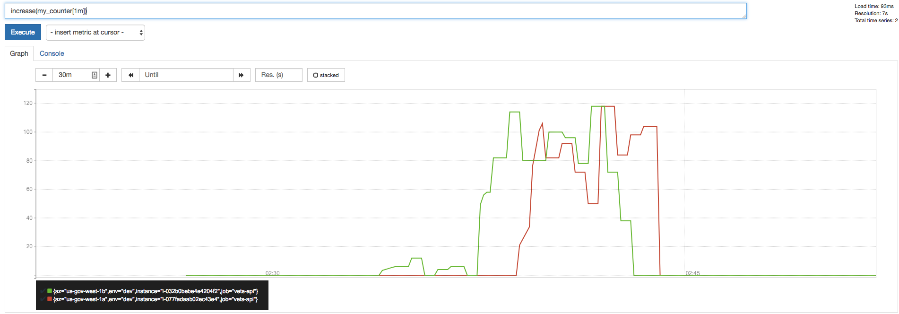
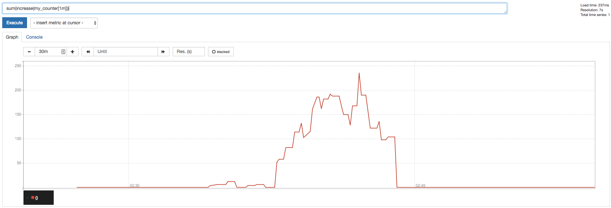

----
# We're moving our docs! 
### Find [the latest version of this page](https://depo-platform-documentation.scrollhelp.site/developer-docs/StatsD-Metrics.1886847017.html) on the Platform website.

### Still can't find what you're looking for? Reach out to [#vfs-platform-support](https://dsva.slack.com/archives/CBU0KDSB1) on Slack.

----

# StatsD Metrics

This document is meant to provide an introduction to how StatsD metrics are sent, how they interact with Prometheus, and how a developer can use them on vets-api.

## Sending Metrics

The Prometheus instance in each environment (dev, staging, prod) automatically collects data sent to StatsD.

Metrics are sent out from the application via an API call to the [statsd-instrument gem](https://github.com/Shopify/statsd-instrument). There's a process called the StatsD Exporter which runs on each EC2 node that listens for events sent to it by the this library. That process is then queried by Prometheus to gather metrics. There is generally no need for extra plumbing outside of simply starting to send metrics from within the application, with few exceptions.

An important thing to note while implementing metrics with this tool is that it is best-effort and should not be considered the source of truth for anything that must be 100% accurate (think billing report). It is extremely useful in measuring and detecting trends, but not a transactional database (or a database at all).

Metrics are stored for 15 days by default. We have the ability to store them longer-term, but that needs to be configured ahead of time. Metrics not configured for longer retention are deleted at the end of 15 days without a way to restore them. Ask for help from the DevOps team if you are in need of extending the expiration time.

### Naming

Metrics can be named arbitrarily, but should not conflict with one another. Traditionally, they use dots to build out a tree as the original implementation was for Graphite, but dots in our metric names get translated to underscores for storage in Prometheus.

Example: a metric created with the name `mhv.account.existed` gets renamed to `mhv_account_existed` in Prometheus.

There's some transformation of names to other names plus tags in the [StatsD exporter configuration for vets-api](https://github.com/department-of-veterans-affairs/devops/blob/master/ansible/deployment/config/vets-api/statsd-exporter-mapping.conf), but an understanding of this is not entirely necessary (nor is it necessary to do these translations to use StatsD to store metrics). This file also contains an alternative way to apply tags to metrics.

### Tagging

Tags can be passed along with metrics as well, but a metric must consistently have the same set of tag names each time it is sent. If there is a mismatch, StatsD will start ignoring metrics sent that differ from the first style sent.

As an example of this, if we send a metric `api.foo` with tags value of `{my_tag: bar}`, a tag of name "my_tag" will be expected for any future metrics sent called `api.foo`. If we were to then send a metric named `api.foo` with tags value of `{other_tag: baz}`, StatsD will refuse the metric.

Care should also be made to not allow user input to enter tag values. Each combination of metric name + tag name/value pairs becomes a unique metric in Prometheus. An excessive and constantly growing number of metrics can have dramatic effects on Prometheus' performance. We have an [alert](https://github.com/department-of-veterans-affairs/va.gov-team-sensitive/blob/master/OnCall/alerts.md#applicationmetricswarning) which attempts to catch this situation, but can be triggered after it has hit production.

### Metric Types

There's documentation in statsd-instrument's page (linked above) so please review there for specific documentation for how to use them, but there are some special considerations when using these types with Prometheus the way that we do that we'll review here.

#### measure

`StatsD.measure('my.measurement', 0.1234, tags: {'my_tag': 'value'})`

Use this data type when measuring an amount of something. Examples would be the time something took or the size of a file being processed.

When using measure, Prometheus will automatically translate the data into a few metric names and individual measurements will not be stored. First, it will store quantiles in a metric using the original name and a tag per quantile. By default it will give you 50%, 90%, and 99%. This metric is essentially "x% of things measured were under this value". Ask for help if you need different buckets. Secondly, it stores two additional metrics which are essentially like increments (below) suffixed with `_sum` and `_count`. These can be used for combining and averaging (see below for how to query this).

#### increment

`StatsD.increment('my.counter', tags: {'my_tag': 'value'})`

Use increment when you want to count occurrences of some event.

When using an increment, the metric needs to be initialized to 0 in the [statsd initializers file](https://github.com/department-of-veterans-affairs/vets-api/blob/master/config/initializers/statsd.rb). This counter will be set to 0 on every node on new deployments, but this is entirely normal and ok.

##### Bonus material on increment:

To add a bit of context for why the above is necessary: Prometheus will not see data if the counter has not been initialized and it uses the `increment()` function to calculate changes over time. When the first value shows up at 1, Prometheus will not see this as an "increase", simply a new metric that started at 1. Incrementing metrics that are really low traffic are especially affected by this as the first time the event occurs on a given server (the lifespan of a server is usually about a day and there are 4 of them in production as of this writing) is simply thrown away, and only the occurrences after that will be counted. We overcome this by initializing the counter.

The current counter value is preserved in the StatsD Exporter process, not in the Rails application. A restart of StatsD Exporter process (which may happen occasionally) will result in the counters being reset, but Prometheus handles this correctly in the `increase()` function.

#### gauge

`StatsD.gauge('my.gauge', 5, tags: {'my_tag': 'value'})`

A gauge is used to record a value of something at a specific time (think speedometer in a car). Typically we'll want to use gauges only in a worker process as they are not likely to be event-based like the other types.

## Querying in Prometheus

Each node running the vets-api application runs its own instance of the StatsD exporter, which Prometheus queries. This means that there will be several "metrics" in Prometheus which map to a single metric that was sent by the StatsD API in the application. Understanding this and how to combine them is important to being able to query them and build a dashboard.

### Example 1: Graphing an increment value

Let's put this together and walk through an example. The examples are built directly in the [Prometheus console for dev](http://prometheus-dev.vetsgov-internal:9090/prometheus/graph), but the same exact queries can be used in Grafana.

We can generate some sample metrics to work with by doing the following on the two dev nodes in the Rails console:

```ruby
r = Random.new
100.times do |n|
 StatsD.increment('my.counter', r.rand(10))
 sleep(3)
end
```

We can query the `my.counter` metric by referencing it by name in Prometheus. Remember that in metric names, dots get swapped out for underscores, so we can display the values for this metric by simply querying `my_counter`. That query gives us back results like:

```
my_counter{az="us-gov-west-1b",env="dev",instance="i-032b0bebe4e4204f2",job="vets-api"}	475
my_counter{az="us-gov-west-1a",env="dev",instance="i-077fadaab02ec43e4",job="vets-api"}	421
```

This tells us that the StatsD Exporter process on EC2 instance "i-032b0bebe4e4204f2" has seen 475 increments of `my_counter` and instance "i-077fadaab02ec43e4" has seen 421.

If you click on the Graph tab, you can see it in graph form:



From here we can calculate a couple of values. We can determine the number of increments in a given time period and the rate in increments per second.

We can use the `increase()` function to show how much this metric has increased over a given period of time. For this example, we'll use 1 minute. Our query would be: `increase(my_counter[1m])`:



As you can see, we still have two separate metrics, one for each of the EC2 instances. That's not great since we don't care so much about this metric on a per-server basis, we care about it site-wide. Let's combine them by `sum`ing the two values: `sum(increase(my_counter[1m]))`:



Similarly, we can use the `rate()` function to determine the per-second value of increments to this metric with `rate(my_counter[1m])`. This has same split on EC2 instance, so we can combine them the same with with `sum(increase(my_counter[1m]))`.

### Example 2: Graphing a measure value

Building off this first example and using the example metric from the `measure` section, let's calculate the average of `my.measurement` over time.

As described in the measure section, Prometheus will end up with a set of metrics from the original you sent. If you want to aggregate metrics together across all nodes (you probably do), the `_count` and `_sum` metrics must be used. It's statistically insignificant and meaningless to aggregate the quantile values together.

The data will be spread across two named metrics called `my_measurement_sum` and `my_measurement_count`. The first is the sum of all values sent, the second is the number of measurements. We can use the `increase()` function in Prometheus to calculate how much the value changed in a given period to graph them over time. The data are further split into yet more metrics by Prometheus using a tag called `instance` (EC2 instance which runs vets-api) and we'll want to combine all the values to be meaningful. We can combine that by using the `sum()` function. Putting it together, we can use the following to calculate an average over time and display it on a graph:

`sum(increase(my_measurement_sum)) / sum(increase(my_measurement_count))`

Always be sure to do functions like `increase()` or `rate()` before using `sum()` as that will result in incorrect values and graphs.

Querying a metric created using `increment` is similar to above, except there's not additional special names.

An example to use while building a new dashboard would be the [Breakers](http://grafana.vetsgov-internal/dashboard/db/breakers) dashboard. "Service Up" uses a gauge type, "Request Rate by Status" uses an increment type, and "Response Times.. by Endpoint" graph uses a measurement type.

### Why do I get a fractional number from the increase function?

This can be a bit surprising when you first encounter it in Prometheus. The function sounds like it should just return the number of times the increment was called and sum up the values passed, but it's not quite that simple.

The data in Prometheus is not stored in clean per-minute buckets. It is gathered by default at 15s intervals, and the data points are not combined so we do not lose granularity. [The `rate()` function](https://prometheus.io/docs/prometheus/latest/querying/functions/#rate()) will extrapolate to the end of a time bucket in order to compensate for imperfect buckets of time and times when a data point wasn't gathered. For this reason, you may see fractional values for the number of increments in a time period. [The `increase()` function](https://prometheus.io/docs/prometheus/latest/querying/functions/#increase()) is simply a syntax wrapper around `rate()` which multiplies the resulting value by the correct number of seconds to get back to an estimated number of times the counter was incremented.

### Why do we increment a bunch of metrics by 0 in our initializers?

Some values for metrics are initialized on every deploy because we run a process for statsd exporter (the thing that bridges between the statsd library to Prometheus) on every EC2 instance. This is not so much “zeroing” anything, but more so initializing that counter on that particular EC2 instance. For slow-running counters (think less than 50 occurrences of an event per day) this initialization is hugely important to remain even close to an accurate number (though do keep in mind the warning towards the top about these metrics being considered a source of truth). For faster moving metrics, this isn’t necessarily important as you can just start incrementing metrics however you want.

The primary reason that this matters on slower-moving metrics is that Prometheus uses a rate of change over a time period to do `increase()` or `rate()` calculations. It treats missing data (this counter hasn’t been initialized on a given EC2 instance) as truly missing. When the first value shows up at 1, that’s not an increase to Prometheus, but rather just the starting place for a metric. There’s 8 EC2 instances in our deploy of vets-api right now, and that “missing” count results in confusing numbers when you’re trying to determine how often something happens. If we “initialize” it (by incrementing by 0) that causes the metric to exist.

The above scenario also makes a difference when counters come in bursts as Prometheus only polls every 15 seconds. If we saw a number of the same events in a burst (the counter went from uninitialized to 10 really quickly), but then that scenario passed and we didn’t see it again that event would be missing from any `increase()` or `rate()` queries. Prometheus would see that as an initialization of a metric at value 10 and not call it an “increase”.
