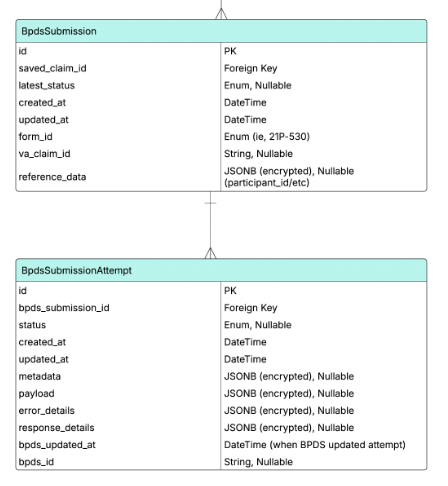

# 2025-06 - Architecture Intent - BPDS

**Product description:** The [Benefits Processing Data Service (BPDS)](https://department.va.gov/privacy/wp-content/uploads/sites/5/2024/09/FY24BenefitsProcessingDataServiceBPDSPIA_508.pdf) is a backend service developed to extract, transform, and store structured data from benefits-related form submissions. It acts as a normalized data layer that supports downstream automation and rules engines used in claims adjudication workflows. By centralizing access to preprocessed form data, BPDS reduces the complexity of parsing PDF form content at the point of use and enables faster, rules-driven decision-making.

BPDS typically operates as part of a broader service ecosystem that includes Pension Automation (POI) and other adjudication services. It is deployed within the VA Enterprise Cloud (VAEC) and adheres to VA security and compliance standards. Engineers interact with BPDS primarily through internal APIs or batch processes that query and retrieve structured form data for use in backend processing pipelines, reducing reliance on manual review and improving the scalability of claims systems.

**UX design description:** No end-user UX

**Frontend changes:** No frontend impact

**Internal API changes:** No changes

**External API changes:** No changes, but we are using the BPDS API, which is new:

​	https://bpds-uat.stage.bip.va.gov/api/v1/bpd

**Background jobs:** The job is kicked off via a [sidekiq job](https://github.com/department-of-veterans-affairs/vets-api/blob/master/lib/bpds/sidekiq/submit_to_bpds_job.rb)

**Data storage:** Two tables were created to track submissions

- [bpds_submission_attempts](https://github.com/department-of-veterans-affairs/vets-api/blob/master/db/schema.rb#L456)

- [bpds_submissions](https://github.com/department-of-veterans-affairs/vets-api/blob/master/db/schema.rb#L472)

    

**Libraries and dependencies:** No new packages or gems

**Metrics, logging, observability, alerting:**  https://vagov.ddog-gov.com/dashboard/2k5-e24-m9y?fromUser=false&refresh_mode=sliding&from_ts=1749211138965&to_ts=1749214738965&live=true

**Infrastructure and network changes:** None

**Test strategy:**  

* Unit testing for any Ruby utility libraries provided
* Integration testing is planned with the MAS and POI teams.

**Rollout plan:** This is still to be determined and is contingent upon testing and readiness from downstream partners.

**Internal administration tasks:** 
* No future planned maintenance
* Teams wishing to use BPDS will need to kick-off an exploratory conversation with stakeholders. 
  * Additional documentation for engineers and interested groups can be found here:
    * https://github.com/department-of-veterans-affairs/vets-api/tree/master/lib/bpds

## Security Checklist Commentary

**PII and PHI handling**
* To connect submissions with a unique identifier for a veteran, our team is looking up participant ID's for veterans

**Data retention**

* As detailed above, there are two tables used to track submissions.    We are not currently following the 60 day business rule.
* The only data that is PII would be what the user submits on the website.  That data is stored in an encrypted field called `reference_data_ciphertext`

**Data encryption**

* The payload that a user fills out on the site is encrypted.

**Authentication and authorization**
* Authentication to the BPDS endpoint is done via JWT.  The JWT secrets are stored in AWS Parameter Store.

Additional Links

| Description           | URL                                                          |
| --------------------- | ------------------------------------------------------------ |
| Engineering ADR's     | https://github.com/department-of-veterans-affairs/vets-api/tree/master/lib/bpds/documentation |
| BPDS Engineering Docs | https://github.com/department-of-veterans-affairs/vets-api/tree/master/lib/bpds |
| Swagger Doc for BPDS  | https://bpds-dev.dev.bip.va.gov/swagger-ui.html              |
