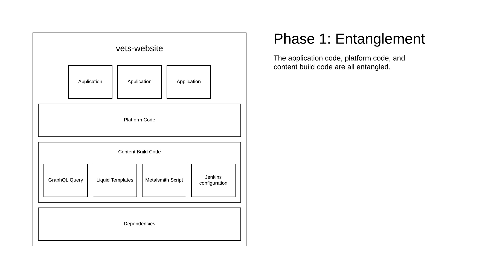
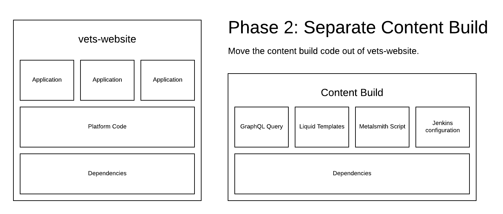
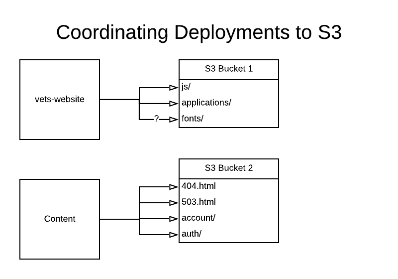

# Separate Content Build

**Author(s):** Christopher Valarida  
**Last Updated:** April 9 2020  
**Status:** Draft | In Review | **Approved**  
**Approvers:** Dror Matalon [x], Andrew Gunsch [x], Rian Fowler [x]

## Table of Contents

- [Separate Content Build](#separate-content-build)
  - [Table of Contents](#table-of-contents)
  - [Overview](#overview)
    - [Objective](#objective)
    - [Background](#background)
      - [Build script](#build-script)
      - [CI pipeline](#ci-pipeline)
      - [Deployment](#deployment)
      - [Pain points](#pain-points)
    - [High Level Design](#high-level-design)
  - [Specifics](#specifics)
    - [Detailed Design](#detailed-design)
      - [Content build in a separate repository](#content-build-in-a-separate-repository)
      - [Triggering builds](#triggering-builds)
      - [Coordinating deployments to S3](#coordinating-deployments-to-s3)
      - [Nginx Reverse Proxy](#nginx-reverse-proxy)
      - [Creating temporary static pages for application testing](#creating-temporary-static-pages-for-application-testing)
      - [Miscellaneous](#miscellaneous)
      - [React application landing pages](#react-application-landing-pages)
      - [Cache busting application code](#cache-busting-application-code)
    - [Code Location](#code-location)
    - [Testing Plan](#testing-plan)
      - [Consolidated build script](#consolidated-build-script)
    - [Logging](#logging)
    - [Debugging](#debugging)
      - [Content](#content)
        - [Build](#build)
        - [Deploy](#deploy)
      - [Application](#application)
        - [Build](#build-1)
        - [Deploy](#deploy-1)
    - [Caveats](#caveats)
    - [Security Concerns](#security-concerns)
    - [Privacy Concerns](#privacy-concerns)
    - [Open Questions and Risks](#open-questions-and-risks)
      - [Risk: Deployment drift](#risk-deployment-drift)
        - [Reasons](#reasons)
        - [Types of drift](#types-of-drift)
          - [Missing application pages](#missing-application-pages)
          - [Contents of an application landing page change](#contents-of-an-application-landing-page-change)
          - [Rolling back a newly-released application's code, but not landing page](#rolling-back-a-newly-released-applications-code-but-not-landing-page)
          - [Landing page deployed before code](#landing-page-deployed-before-code)
    - [Work Estimates](#work-estimates)
    - [Alternatives](#alternatives)
      - [Mono-repo](#mono-repo)
    - [Future Work](#future-work)
    - [Revision History](#revision-history)

## Overview

### Objective
The objective here is to define an approach to isolate the concerns of the
content build from the front end application build and vice versa.

This design document is intended for front end and DevOps engineers on the
Veteran-facing Services Platform (VSP) and Veteran-Facing Services (VFS) teams.

### Background
VA.gov is composed of static content (`.html`), applications (`.js`), and
styling (`.css`).

Static content files are created from the **[Metalsmith build
script](#build-script)**. Application bundles are created with Webpack.

These two distinct tasks are currently **entangled in a single build script.**

The **[CI pipeline](#ci-pipeline)** runs this build script (among other things)
whenever a commit is pushed to a branch in GitHub. This build must succeed
**before the branch can be merged** from a pull request.

The outputs of this build are frontend applications that are
**[deployed](#deployment) to and hosted from an AWS S3 bucket**. These
applications are deployed on a weekdaily schedule. Content in the CMS is
deployed by a manual trigger from the CMS and by the weekdaily application
deployment. This trigger runs a Jenkins job which, in turn, runs the [Metalsmith
build script](#build-script).

The entangling of the content and application builds have [led to
frustrations](#pain-points) for engineers, slower iteration cycles due to failed
builds, and failed production deployments.

#### Build script
[Metalsmith](https://github.com/segmentio/metalsmith) is a static content build
pipeline orchestrator. `vets-website` uses it to manage the steps in the content
build. The highlights of what this script does include:
- Fetching static content from Drupal
- Building static HTML pages from the content
- Triggering Webpack to build JS and CSS bundles
- Creating the HTML pages for the React Single-Page Applications (SPAs)
- Checking all HTML pages for broken links

See [the build script](https://github.com/department-of-veterans-affairs/vets-website/blob/006185b7c40fe85a8b219ae99f3aefb3d8bf0e09/src/site/stages/build/index.js) for more details

#### CI pipeline
The CI pipeline for `vets-website` triggers the above build and runs a number of
tests. Pertinent to this document are:
- Accessibility tests on static content pages
  - Using the [`npm run nightwatch:docker --
    --env=accessibility`](https://github.com/department-of-veterans-affairs/vets-website/blob/006185b7c40fe85a8b219ae99f3aefb3d8bf0e09/Jenkinsfile#L82) command
  - This iterates through all the pages on the sitemap, which is created by the
    content build script
- Broken link checks on static content pages
  - The actual link checking happens during the build script, but it isn't
    reported anywhere until [after the build script has been run](https://github.com/department-of-veterans-affairs/vets-website/blob/006185b7c40fe85a8b219ae99f3aefb3d8bf0e09/jenkins/common.groovy#L200)
    
#### Deployment
There are currently two kinds of deployments:
1. [Partial deploy](https://department-of-veterans-affairs.github.io/veteran-facing-services-tools/getting-started/workflow/deploy/#partial-deploy--static-page-changes-only)
    - Outputs static pages (.html) only
    - Uses the latest `vets-website` release and static assets
      - Does not trigger Webpack to build the JS and CSS bundles
      - Instead,
        [fetches](https://github.com/department-of-veterans-affairs/vets-website/blob/006185b7c40fe85a8b219ae99f3aefb3d8bf0e09/src/site/stages/build/plugins/configure-assets.js#L22-L23)
        the assets [from S3](https://github.com/department-of-veterans-affairs/vets-website/blob/006185b7c40fe85a8b219ae99f3aefb3d8bf0e09/src/site/stages/build/plugins/download-assets.js#L111)
        - Process is triggered [from this Jenkins config](https://github.com/department-of-veterans-affairs/vets-website/blob/006185b7c40fe85a8b219ae99f3aefb3d8bf0e09/Jenkinsfile.content#L32)
    - Does **NOT** run any accessibility tests
2. [Full deploy](https://department-of-veterans-affairs.github.io/veteran-facing-services-tools/getting-started/workflow/deploy/#full-deploy-of-vagov-client-app)
    - Outputs frontend applications (.js, .css) and static pages (.html)
    - Creates a new release and deploys it
    - Fetches the latest Drupal content
      - Falls back to the cached content in S3 from the last successful deploy
        (full or partial)
        - Explained further in [pain points](#pain-points)
    - Runs the accessibility tests and link checker

See [the deployment documentation](https://department-of-veterans-affairs.github.io/veteran-facing-services-tools/getting-started/workflow/deploy/)
for more details.

#### Pain points
- Engineers encounter **confusing build errors** that are due to the mismatch in
  outdated locally cached content and updated Liquid templates
- Fetching content from the CMS and building HTML files when developing
  applications **slows down the local builds** for engineers unnecessarily
  - It **requires either SOCKS proxy access** or the `npm run
  fetch-drupal-cache` command, which isn't obvious
- **Application deployments and PR builds fail** when content in the CMS is
  invalid
  - This includes broken links and accessibility violations
  - We have a safeguard that mostly works; if we run into a failure using the
    latest CMS content, we try again with the cached content in S3 from the last
    successful build
    - This doesn't work when the GraphQL query has been updated; that
      invalidates the cache
    - Errors in liquid templates would potentially break the build and falling
      back to the cache won't help

### High Level Design
The current front end build will be split up into two distinct builds:
1. Content build
    - Input: CMS content
    - Output: HTML files, assets from the CMS (PDFs, images and the like)
    - This maps pretty cleanly to the current partial deploy
1. Application build
    - Input: `vets-website` code
    - Output: JavaScript and CSS bundles
    - This essentially maps to the current full deploy minus the content

There will be two _new_ S3 buckets. One will hold the output of the application build (including .js and .css), and the other will hold the output of the content build (including .html and .pdf).
The original bucket will still exist to hold the teamsite assets.

Previously there would just be one bucket to hold the output of both builds.

**Another important note:** The deploy process will not automatically coordinate these two deploys to
make an application live for the first time. The process will be to manually:
1. Verify the application assets (js and css) are live in production
1. Make the landing page live in production in the content build
    - Depending on the answer to [this
      question](#react-application-landing-pages), this may mean publishing the
      page in Drupal or switching the flag in the JSON file
1. Deploy a new content build

## Specifics

### Detailed Design

#### Content build in a separate repository
The content build will live in a separate repository called `content-build`.
This repository will contain only code pertaining to the content build.

#### Triggering builds
**Applications**  
The `vets-website` build is triggered in CircleCI when:
1. Code is pushed to a feature branch on GitHub
1. A feature branch is merged into `main`
1. A weekdaily deploy is triggered
    - This build results in a versioned release artifact

**Content**  
The content build is triggered in Jenkins when an editor with the required
permissions initiates a content deploy.

#### Coordinating deployments to S3
We use S3 to serve a static site. To do this, the bucket consists of a file tree
which corresponds to the URLs on VA.gov. For example, `/education/index.html` is
the file that's served at www.va.gov/education/.

The output of the application build **currently** live in the `/generated/`
directory. To support the transition, the **new** application build will put its
assets in the `/applications/` directory.

#### Nginx Reverse Proxy

Our reverse proxy currently routes all va.gov requests to the same S3 bucket.
When we split things up to have the application build in one bucket and the content in another we will need to update the routing.

All static content (html, pdf files) will be proxied to the bucket containing the content build,
and requests for everything else (js, css files) will be proxied to the bucket containing the application build.

#### Creating temporary static pages for application testing
- The Webpack configuration will use
  [`html-webpack-plugin`](https://github.com/jantimon/html-webpack-plugin) to
  generate temporary landing pages for React applications
  - This will happen for all build types
    - Engineers will be able to access the site on a `localhost` build
    - CI can run E2E tests against production code without the output of the
      content build
- The E2E test script in CI will start a process to serve these pages so the
  tests can run a browser and access the applications
- **Important note:** These HTML files will not be served in production; the
  landing pages for the applications come from the content build
  - To ensure these pages aren't made in production, the deploy script will copy
    only the files in `/applications/`

#### Miscellaneous
- Separating the content and application builds will require a standalone content validation job that runs outside of the CI pipeline- probably once a day on a schedule
  - **Question:** How will we validate links to `vets-website` assets?
  - **Question:** Where will this job be run? Jenkins? Nomad? Circle?
- The application build will be responsible for creating the `settings.js`
  - It's currently a step in the Metalsmith script
- The landing pages to the applications will be created in the CMS build
- The CMS repo will no longer import `vets-website`, but rather the new content
  build repo
  
#### React application landing pages
JavaScript application landing pages will be created during the content build.

**Phase 1: Stopgap solution**  
To mirror the current process for creating application landing pages, we will
modify the `createReactPages` Metalsmith plugin to use a JSON file with the
parameters instead of pulling the properties from the various `manifest.json`
files. This JSON file will include:
- URL of the page
- Application name
- Whether the file should be made available in production

When we do this, we will update the `manifest.json` documentation and remove
unused properties from all the files.

**Phase 2: Long-term solution**  
All application landing pages will be created in the CMS. The page's published
state will determine whether the application should be made available in
production.

Once this is complete, we will remove the Phase 1 stopgap solution.

#### Cache busting application code
To ensure the latest code is downloaded by the browser, we have to bust the
browser's cache. **Currently**, we're adding hashes to the asset file names and
changing the `<script>` tag's `src` property to point to the file name with
hash.

Once we split out the content build, however, it's infeasible to continue this
approach. Instead, we'll rely on the (`Cache-Control`
header)[https://developer.mozilla.org/en-US/docs/Web/HTTP/Headers/Cache-Control].
Setting it to `no-cache` will require browsers to check with the server for
every request before using the cached assets.

**Note:** This will cause higher traffic for S3 and may result in a lower
performance for users, as the browser will have to make a request to the server
before the cache can be used.

### Code Location
To start, the **content build** will live at
`vets-website/src/stages/build-content/`. (This should be mostly just a rename
of `build/` to `build-content/` for clarity.) Once the implementation is
complete, this code will **move to a new repository.**

The **application build** will consist of **Webpack configuration files** found
in the **root of the project.** If we need any script files to aid in the build
process, they will be located in `vets-website/scripts/build/`.

### Testing Plan

#### Consolidated build script
After the content and application builds have their own build scripts within
`vets-website`, we'll write a script to run both builds together to reproduce
the current build script's output. To test that this is working properly we can:

1. Run the script pre-separation (checkout `main` for this)
1. Rename the `vets-website/build/localhost/` directory
1. Run the post-separation build script
1. Check that the all same files are there
    - We can use `find` and `cmp` for this as needed
    
### Logging
**Question:** What _should_ it log? Anything? Is this a Jenkins / Nomad /
CircleCI thing?

### Debugging

#### Content

##### Build
When the [`process-cms-exports`](https://github.com/department-of-veterans-affairs/vets-website/blob/006185b7c40fe85a8b219ae99f3aefb3d8bf0e09/src/site/stages/build/process-cms-exports/index.js)
system is live, there will be automated tests to validate input from the CMS and
output from the content transformers.

##### Deploy
To determine whether a page exists in the drupal content, we can go to
`staging.va.gov/drupal/debug/`. This page is not available in production,
however.

#### Application

##### Build
We have automated unit and end-to-end tests that are run on every CI build.

##### Deploy
**Question:** How can we tell whether the application assets are live in
production?  
**Answer:** Look at www.va.gov/applications/BUILD.txt and compare the `ref` to
the commit hash you expect to be in production.

### Caveats
- The content validation doesn't happen in the build job
  - The application CI runs tests, but the content CI does not
  - This is because it takes a long time and content editors are used to seeing
    their changes in production quickly
  - Validation instead happens in a separate job

### Security Concerns
There are no new security concerns with a separated build process.

### Privacy Concerns
There are no new privacy concerns with a separated build process.

### Open Questions and Risks
All questions have been in-lined to preserve context.

#### Risk: Deployment drift
Given the relationship between the applications and content, there's necessarily
some codependency. The primary relationship between the two builds is that **the
content build is responsible for the application landing pages**.

##### Reasons
If the application build was responsible for creating the HTML landing pages for
each application, it would need to write to directories outside of
`applications/`. These could be **overwritten by the content deploy**.
Additionally, if a file was written to an arbitrary location in S3
(corresponding to the URL), when a future deploy **removed** that file, we have
**no simple way to sync** that change.

In order for the application build to create a landing page consistent with the
rest of VA.gov, it would need access to the templates. This is the kind of
dependency entanglement this document aims to resolve.

##### Types of drift

###### Missing application pages
If we had to revert a content release for whatever reason, we may lose an
application page.

**Mitigation:** With hundreds of content editors, it's not feasible to revert a
content release. Our current solution is to deploy a new release with the fix.
This approach minimizes the risk of this type of drift.

###### Contents of an application landing page change
If the contents of a landing page change to, for example, point to a different
bundle name before that bundle was made available, the request for it would 404
in production.

**Mitigation:** That said, the contents of the pages shouldn't change between
releases unless we did it deliberately. In that case, it's the responsibility of
the author of the change to ensure the change is valid before deploying it.

###### Rolling back a newly-released application's code, but not landing page
If we release a new application and had to roll the application deployment back,
we could end up with a landing page that points to a JS bundle that doesn't
exist.

**Mitigation:** Similar to [missing application
pages](#missing-application-pages), our approach has historically been to
release a fix instead of reverting a release.

###### Landing page deployed before code
The content release which includes a newly prod-facing application landing page
is deployed before the code is deployed to production.

**Mitigation:** It's up to the team releasing a new application to ensure the
code is in production before deploying the landing page for it.

### Work Estimates
The following estimates vary greatly depending on who's doing the work.

1. Remove Webpack from the Metalsmith build script `vets-website`
    - Use
      [`html-webpack-plugin`](https://github.com/jantimon/html-webpack-plugin)
      to generate temporary application landing pages
      - Create a template which we can use with the above plugin
      - This should only be used in `localhost` builds until `vets-website` is
        no longer responsible for deploying the content
    - Write a script to run content and application builds while they're both in
      `vets-website`
    - **Estimate:** 3 - 5 days
1. Create an `application-registry.json` to hold information about all
   applications in `vets-website` neede during the content build process
    - This includes `rootUrl`, `appName`, `inProduction`
    - **Estimate:** 1 hour - 1 day
1. Modify the `createReactPages` step to use [the new JSON
   file](#react-application-landing-pages)
    - Remove the unused pieces of the `manifest.json` files
    - Update the documentation for the `manifest.json` files
    - Update the app generator to not add the unused properties in the
      `manifest.json`, but log to the console with instructions on what to do to
      make the application landing page in the content build
    - **Estimate:** 2 - 4 days
1. Copy the content build script to another repo
    - The hard part here is figuring out what all the content build touches
      - [Madge](https://github.com/pahen/madge) might be helpful for this
    - **Estimate:** 5 - 8 days
1. Set up the CI for the content build repo
    - **Estimate:** ??
    - I'm not sure what all goes into this
        - What does it take to wire this into Jenkins / Nomad?
1. Set up the deploy job for the content build repo
    - **Estimate:** ??
    - **Question:** Is this where we write a new script to copy the files from
      the build over to S3?
1. Once we're confident the deploys are working properly, switch the
   `vets-website` build to build only Webpack assets
    - Modify the deploy script to copy over only the files in `applications/`
      - The deployment of this to Jenkins (or wherever) must be done in concert
        with the switch to building only Webpack assets
    - **Estimate:** 1 hour - 1 day
1. Create the content model for application landing pages in Drupal
    - **Estimate:** ??
1. Create all the application landing pages in Drupal
    - Test in staging
    - **Estimate:** 2 hours?
1. Create a buildtype branch in the Metalsmith script to build application
   landing pages only in prodction
    - So we can test the landing pages from Drupal
    - **Estimate:** 1 hour
1. Publish all the application landing pages and remove the `createReactPages`
   Metalsmith step
    - **Question:** How do we coordinate this so the cut over is clean?
    - **Estimate:** 1 hour

### Alternatives

#### Mono-repo
The alternative to splitting out the content build into its own separate repo is
to keep it in `vets-website`. The reasons we're not doing this are:
- To reduce what `vets-website` is "in charge" of
  - Building static content from the CMS and compiling application code are two
    completely separate functions
- To keep one CI pipeline per repository
  - And they'll be more narrowly focused
- To manage dependencies independently
  - All dependencies in the content build repo are not client-facing
    - There _may_ be exceptions later
  - It will be harder for an application to use be able to use a dependency that
    wasn't intended to be client-facing

### Future Work
1. Splitting out the platform code from the application code
1. Splitting up the applications into separate repositories

### Revision History
Date | Revisions Made | Author
-----|----------------|--------
Apr 9, 2020 | Initial draft | Christopher Valarida
Jun 11, 2020 | Change the plan to use multiple S3 buckets | Brooks Johnson
