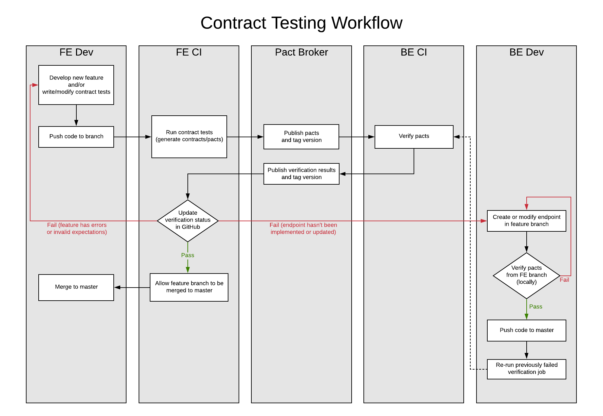

# Integration Testing with Consumer-Driven Contract Tests

**Author:** Eugene Doan  
**Last Updated:** May 6, 2020  
**Status:** Draft | **In Review** | Approved  
**Approvers:** Dror Matalon [], Andrew Gunsch [], Rian Fowler [], John Paul Ashenfelter []


## Overview

### Objective

- To identify the need for integration testing as part of VA.gov's automated testing processes.
- To propose consumer-driven contract testing as a solution that meets that need as well as the following metric from the Quality Assurance Surveillance Plan (QASP).

  > Number of top ten VA.gov user experiences, based on unique transactions per month, that have a corresponding **automated end-to-end browser test that exercises multiple pieces of functionality including both FE and BE**.
  > Target: 1.

  *The QASP is a report that measures the performance of the Veteran-Facing Services Platform (VSP) in fulfilling contractual obligations.*
- Goals of this proposal do not include defining or replacing any documentation tools or schema specifications.
- The intended audience are front-end, back-end, and DevOps engineers of the Veteran-Facing Services Platform (VSP) and Veteran-Facing Services (VFS) teams

### Background

For the purposes of this document, integration testing will be defined as **the validation of interactions between front-end (FE) applications and the back-end (BE) API**.

Applications currently lack true integration test coverage.
- The closest we get to integrated testing is with our **existing end-to-end (E2E) tests**. The E2E tests run in [Nightwatch](https://nightwatchjs.org), a Node.js E2E testing framework. They are browser-based tests that simulate user flows in the application being tested.
- **No BE developers or systems have any role in these tests.** Any API responses expected in the course of a test are stubbed in the tests themselves by the FE developer writing the test. Response stubs are managed with a simple stub server that was developed in-house.

There are some problems with relying only on the current set of E2E tests as integration tests.
- **The E2E tests don't actually incorporate the API.** The stubbed responses are not validated and don't necessarily reflect reality, so the tests don't give us confidence that we're testing the right thing.
- FE developers are entirely responsible for coming up with stubbed API responses, but aren't accountable for *validating those responses*.
- Without involving the BE developers maintaining the endpoints, FE developers are **prone to making invalid assumptions** about systems that they don't work on themselves.

There has been at least one incident that revealed the ineffectiveness of the current test strategy in detecting breaking changes from the API. In this case, an API endpoint was modified independently of the form that invoked it, causing the form to break. Tests did not catch this as they were assuming an outdated expected response.

To address the gap in integration testing, the VSP FE Tools team has done some discovery on **consumer-driven contract testing (CDCT)** as a method of integration testing and [evaluated Pact as a CDCT solution](https://github.com/department-of-veterans-affairs/va.gov-team/blob/3a8f4953b5e77edcbd39fd3db073232cdaca0ea0/teams/vsp/teams/tools/frontend/2019-11-13-consumer-driven-contract-testing-with-pact.md).

We also conducted a [testing tools audit](https://github.com/department-of-veterans-affairs/va.gov-team/blob/fa7b02be2d7a71821a893a55e61a26ba53f0b770/teams/vsp/teams/tools/frontend/2020-03-31-testing-tools-audit.md#integration-testing) that reiterated the lack of integration testing in our current processes. As part of that audit, Pact is still under consideration as our preferred CDCT solution.

### High Level Design

The design of the integration testing solution will be described in terms of using [Pact, a consumer-driven contract testing framework](https://docs.pact.io/).

This [animated diagram from Pactflow (starting at slide 3)](https://pactflow.io/how-pact-works/#slide-3) illustrates how Pact works.

#### [What Is Contract Testing?](https://docs.pact.io/#what-is-contract-testing)

> **Contract testing is a technique for testing an integration point by checking each application in isolation to ensure the messages it sends or receives conform to a shared understanding that is documented in a "contract".**

> For applications that communicate via HTTP, these "messages" would be the HTTP request and response, and for an application that used queues, this would be the message that goes on the queue.

The contract involves two parties, the **consumer** and **provider**. For our purposes, the FE application is the consumer consuming an endpoint from the provider, which is the API.

In a consumer-driven context, the consumer (FE app) generates the contract and the provider (API) verifies it.

The process of using Pact can be broken into multiple steps:
1. A consumer (FE app) runs unit tests to validate its request and response interactions with the provider's (API's) endpoints.
2. Contracts, also referred to as **pacts** in the Pact framework, are generated from the the consumer's (FE app's) tests.
3. The pacts are published to a central location or a broker to be versioned and shared with the provider (API).
4. The provider (API) runs a task to verify the pacts. This verification task replays the requests defined in the pacts against the provider (API) and validates that the actual response matches the expected response.
5. Results of the verification can be published back to the broker if there is a broker involved.
6. Builds will depend on successful verification results to deploy.

## Specifics

### Detailed Design

Pact is language agnostic and has packages for both Node.js and Ruby, so both `vets-website` and `vets-api` both have access to their language-specific implementations of the Pact spec.
- `vets-website` will install the `@pact-foundation/pact` package.
- `vets-api` will install the `pact` gem.

In the context of VA.gov, the contract testing process looks like this:



1. **Contract tests are written for a FE application.** They are written like unit tests with `describe` and `it` blocks and will follow these steps:
   - Start up the mock server from the Pact library. This requires naming the consumer and provider and assigning a port for the server to run.
     ```
     const mockApi = new Pact({
       port: 3000,
       consumer,
       provider,
       spec: 2,
     });

     ```
   - Test each request in its own `describe` block. Purely for better readability and organization, tests can be wrapped one level further in `context` blocks corresponding to different BE states when the same request expects different results for each of those states.
   - In each `it` block, define the request and response interaction being tested and add them to the mock server (`mockApi.addInteraction({ ... })`).
     This sets up the mock server to accept the specified requests and return the specified expected responses.
     Interactions are defined in objects formatted like so:

     ```
     const interaction = {
       state: 'a single matching result exists',
       uponReceiving: 'a search query',
       withRequest: {
         method: 'GET',
         path: '/v0/search',
         query: { query: 'testing' },
         headers: {
           'X-Key-Inflection': 'camel',
         },
       },
       willRespondWith: {
         status: 200,
         headers: {
           'Content-Type': 'application/json; charset=utf-8',
         },
         body: {
           // The minimum expected response body.
           data: { ... },
           meta: { ... },
         },
       },
     };
     ```
     - **The `state` attribute will be used as a key for the API to set up the corresponding "provider state" (handled in a `provider_states.rb` module) when verifying the contract.** For example, this might entail spinning up a mock third-party service, seeding the database, or simulating a logged in session.
     - **The body does not need to be comprehensive.** At a minimum, the expected response only needs to define the attributes that are relevant to the test. This means that any extra, unused, or unexpected properties of the response will not break the verification later.
   - Invoke the relevant methods that make the request being tested.
   - Make assertions on the expected response.

   **To reiterate, the tests should focus on the components or functions that make requests to the API.** It's not meaningful to simply test a fetch call to an endpoint.

   There is some boilerplate in declaring the mock server and some `before`/`after`/`afterEach` hooks that perform some Pact-specific ceremony. We could simplify all of that boilerplate by writing a reusable helper function (`contractTest()`) that can be invoked like this:
   ```
   contractTest('VA.gov Search', 'VA.gov API', mockApi => {
     describe('GET /search', () => {
       context('with no results', () => {
         it('responds with success', async () => {
           await mockApi.addInteraction(INTERACTIONS.searchWithNoResults);
           ...
         })
       })
     })
   });
   ```
2. The contract tests will run in continuous integration (CI) when FE changes are pushed.
   - **If they pass, they generate pacts in the form of JSON files in the `pacts` directory.** JSON files are generated for each pairing of consumer (the FE application) and provider (`vets-api`).
   - If they fail, it's possible the request wasn't picked up by the mock server because request defined in the interaction didn't match the request that was actually made. It's also possible the component or function that made the request failed an assertion.

   The assumption henceforth is that the CI workflow is done in Circle.
3. **The CI job invokes a script to publish the pacts to a broker.** The command to publish requires a version to label the consumer and optionally accept tags. The published pacts should be versioned to the current commit hash of `vets-website`. For builds to be deployed, the pacts should also be tagged with the appropriate environment. *Tagging is important to ensure that we verify only the pact associated with the build that is getting deployed and not pacts generated from other branches.*

   Note that publishing pacts under the same version, as in the case of publishing during local development, should overwrite the existing pact and previous verification results under that version.

   Ideally, we would stand up a [Docker instance of the broker](https://github.com/pact-foundation/pact-broker-docker). Since Circle CI is unable to access our internal systems, it would not be possible to host the broker at a `*.vfs.va.gov` subdomain. We will explore hosting the broker on Heroku or other platform. It should be noted that the broker needs to be able to connect to a PostgresSQL database.

   Alternatively, there is a [paid service (Pactflow)](https://pactflow.io/) that provides the base broker functionality with improved UI, support, and other features.
4. Publishing the pacts should trigger a webhook in the broker that invokes a Rake task in `vets-api`:
   ```
   bundle exec rake pact:verify
   ```
   This task pulls all relevant pacts from the broker, replays the requests defined in the pacts against the API, and verifies that the expected responses match the actual responses. For any states specified in the pacts, the API will set up any matching states already defined in `provider_states.rb`. If there are no matching states, the verification will fail.
   
   [Pact Broker webhooks can be created using the CLI](https://github.com/pact-foundation/pact_broker-client/#create-webhook), whether it's from the Ruby gem or NPM package. **The webhook should just check for `contract_content_changed` because the broker will automatically pass any unmodified contracts that previously passed verification."**
   
   While the pacts are being verified, the `vets-website` build can proceed to E2E tests.

   **If the pacts are coming from a feature branch and the API has not been updated to match the new expectations, verification should be expected to fail.** In that case, once the pacts have been published, the BE developers working on updating the API can run the following task during development to verify their changes:
   ```
   bundle exec rake pact:verify:at[http://your-pact-broker/pacts/provider/PROVIDER/consumer/CONSUMER/version/CONSUMER_VERSION]
   ```

   The actual URL should [point to the pact that was published](https://github.com/pact-foundation/pact_broker/wiki/Publishing-and-retrieving-pacts#retrieving) from the `vets-website` feature branch. A specific URL might look something like this, where the version is the commit hash on the feature branch that created the new pact:
   ```
   https://localhost:9292/pacts/provider/VA.gov%20API/consumer/HCA/version/d553c678bbdf1963fe3e27250eebc7c17b26fd55
   ```

   After the `vets-api` feature branch is merged to master, that pact should be able to pass verification. 
5. **The verification results are published back to the broker** with the version of the API that verified the pacts. Again, we can use the commit hash to version, but this time it's from `vets-api`.
   The broker maintains a matrix matching the consumer version and provider version.
6. **The `vets-website` build runs a check to see if it can be deployed.**
   ```
   pact-broker can-i-deploy --broker-base-url=BROKER_BASE_URL
   ```
   This check is dependent on the published verification results.

   **For deploy jobs, if verification was successful, the CI pipeline will proceed to deploy. If it failed, the pipeline will stop the deploy.**
   
   **For a feature branch, a successful verification allows a PR to be merged while a failed verification blocks a PR from merging.**

   If the CI job responsible for the verification task fails to publish the verification results, the `can-i-deploy` check would also fail, since it's looking for a passing verification. It would be possible to re-run the verification task job in Circle CI in the event that it fails.

   [Circle CI has an API for triggering specific jobs](https://circleci.com/docs/2.0/api-job-trigger/), and the [broker should be able to trigger that check](https://github.com/pact-foundation/pact_broker/wiki/Webhook-template-library#circleci---trigger-workflow-build) if it has a [webhook configured](https://github.com/pact-foundation/pact_broker-client/#create-webhook) to run after a `provider_verification_succeeded` event.

**The above steps apply to changes made from the FE.** Assuming the pacts are already in place, the only relevant step for the BE CI pipeline is running the verification Rake task to ensure that any API changes don't break existing contracts in the appropriate environments.


### Deploy Strategy and Tagging

Every build of `vets-website` publishes pacts, tags the version with the _name of the branch_, and triggers the verification task from a `master` build of `vets-api`.
- We could also verify the pacts against `prod` `vets-api` (in addition to `master`) for more stability. This ensures that `vets-website` deploy won't be blocked by `vets-api` deploy failures and that PR's won't be able to merge with a stale verification status and break other builds. The downside is that `vets-website` PRs may have to sit an extra day to wait for any corresponding `vets-api` changes to go out to prod first.

Every build of `vets-api` verifies pacts from versions that have been tagged as `master` and `prod` and tags the results with the _name of the branch_.
- Verifying `master` pacts would be ideal, since it would stay up to date on verifying the `vets-website` master branch, and it would ensure that `vets-website` and `vets-api` work together in staging.
- But that introduces the possibility of breaking `vets-api` builds when the `vets-website` stale verification merge issue arises, since the `vets-website` master branch will have breaking changes in that scenario, although fairly unlikely to occur.
- On the other hand, not verifying `master` means that changes in the `vets-api` master branch can cause the `vets-website` master builds to fail even if not actually breaking contracts for `prod` `vets-website`.

At daily deploy, if the `vets-api` verification passes and the build gets deployed, the verification results for this version gets tagged as `prod`.

After deploying `vets-api` to production, tag this version as `prod`.

At daily deploy, the `vets-website` pipeline checks `can-i-deploy`. The deploy can't proceed if this check fails. This would have to occur after the result of the `vets-api` deploy.
- If the `vets-api` build would have accommodated production-breaking changes from this `vets-website` build but couldn't get deployed, then the `vets-website` deploy can't proceed either.
- If this `vets-website` build wouldn't break with the `vets-api` currently in production, the deploy will go out as usual.

```
pact-broker can-i-deploy -a 'App Name' --version $COMMIT_HASH -a 'VA.gov API' --latest prod
```

After deploying `vets-website` to production, tag this version as `prod`.


### Code Location
In `vets-website`:
- Contract tests will be specific to each application and located within that application's `tests` directory: `src/applications/**/tests/contract/*.contract.spec.js`.
- Interactions can exist in a sibling file to be imported into the tests: `src/applications/**/tests/contract/interactions.js`
- Helper functions for writing contract tests will be at `src/platform/testing/contract`.
- Pacts will be generated in the `pacts` directory, but this is not intended to be committed to version control.

In `vets-api`:
- Configuration for the provider verification will be at `spec/service_consumers/pact_helper.rb`.
- Provider states will be at `spec/service_consumers/provider_states.rb`.


### Testing Plan
We can start with a trial run of using Pact to contract teste a VA.gov application. This will demonstrate the viability of incorporating contract testing into our process and reveal any unforeseen work that needs to be done.

Currently, we have a local setup of the Pact flow. There is a FE app (HCA) running through the pact generation, publishing, and verification loop with the API and a Docker instance of the Pact broker, all set up locally. It hasn't been tested in CI yet, so there is more discovery to be done with configuring the webhooks and async jobs.


### Logging
The continuous integration job that runs the contract tests will contain the output of running the tests and store the generated pacts as build artifacts. The mechanism for passing pacts from consumer to provider will also need to store the pacts, whether it's a central repository or a Pact broker.


### Debugging
The output from the tests that create the pacts and from the provider verification of the pacts should be sufficient to figure out where issues occurred. If the failure is due to a breakdown in the expected request and response interaction, FE and BE developers involved should discuss to clear up assumptions and misunderstandings.


### Caveats
To be determined.


### Security Concerns
There are no security concerns with contract testing.


### Privacy Concerns
There are no privacy concerns with contract testing.


### Open Questions and Risks

#### [Question] What should we recommend testing within the contract tests? What layer of abstraction should we focus on?

For demo purposes, I have been testing action creators that make API requests. The assertions made by that test might be redundant if there are already tests for the action creators. But I'm more so concerned whether this good level test at to call it a valid integration test. The Pact documentation seems to suggest testing calls made from a client class, as in something that has methods that invoke specific endpoints, but we don't follow such a pattern in `vets-website`.

The forms system makes submissions using common functions, so we can cover most of the contract tests for form applications. It might be a good idea to create a helper function that can perform contract tests for any form. The question is what function we should test the submission from. In particular, should we be including the form data transformation in the test?

#### [Question] How should `vets-api` set up the provider states?

We ultimately depend on external services for any endpoint, so we would need to stub out those services to keep the contract tests focused on the `vets-website` and `vets-api` integration. `vets-api` uses VCR to record the expected behaviors of those external services for its own tests. Can we leverage the cassettes from VCR to set up the provider states, or is there a better approach?

#### [Question] In using a broker, how will the asynchronicity of the publishing and verification steps be handled when it comes to reporting build status (GitHub PRs, CI jobs)?

When `vets-api` pushes changes, it should be able to just grab the latest contract generated by a master build of the website and verify it. If we version by commit hash, we can tag contracts as `master` when they get published.

When `vets-website` pushes changes, it runs the tests to generate the pacts and then publishes them to the broker. And then it waits for the pacts to be verified. The question is how the verification results will report back and appropriately update the build status.

The Pact Broker has some webhooks we might be able to use in conjunction with GitHub checks.

#### [Question] Should we host Pact broker internally? What work would be involved?

There is a [Docker image available](https://github.com/pact-foundation/pact-broker-docker) of the official open-source Pact Broker.

If we don't want to self-host, there is also a [commercial solution](https://pactflow.io/?utm_source=github&utm_campaign=pact_broker_intro) that's a fork of that broker with improved UI and federated login. 

#### [Question] How will provider states be set up for authenticated requests?

What will it take to simulate a logged in session? Can we simply stub out SAML responses? If that's not possible, there may be a way to [modify the request with live data](https://github.com/pact-foundation/pact-ruby/wiki/Verifying-pacts#modifying-the-request-with-live-data).

#### [Risk] Contract testing could introduce a non-trivial increase to build times for `vets-website`

There will be additional tests to run, but they run similarly to unit tests, so the performance cost of running the tests themselves is likely to be low.

However, the provider verification step requires running a Rake task with a build of the API. There is also a question of where we can point to that build in order to run that task. If we have to build it when the verification is triggered, it will add to the total build time. If the build occurs in Circle, we could probably leverage some caching mechanisms from Circle orbs to improve the build time. If BE Tools team has configured their own `vets-api` build job and optimized for performance, we might be able to reference that. There might also be an option where we could just pull an pre-built master image of the API and run the verification task in that.

#### [Risk] The verification status check for `vets-website` PRs might not report the most up-to-date status and could lead to breaking master builds.

Sometimes `vets-api` has to implement or update the endpoint in master to accommodate the changes from a `vets-website` feature branch before that feature branch can merge. When the API changes are pushed to master, the verification job can be re-run, and the `vets-website` PR can get a passing status.

The concern is the possibility of leaving the feature branch un-merged for a long enough time that another `vets-api` change gets introduced that would break the contract again. The status wouldn't update without manually re-running the job, and developers are unlikely to double check a passing status.

`vets-website` Version | `vets-api` Version | Verification Results
-----------------------|--------------------|---------------------
1                      | 1                  | Success
1                      | 2                  | Failure

- The status on the PR for `vets-website` v1 would display success and can merge.
- `vets-api` v2 has breaking changes for `vets-website` v1 and gets merged to master
- `vets-website` v1 PR still shows the old success and can still merge.

Ultimately, verification during the `vets-website` master build should catch any issues, since it will validate all of its contracts against the `vets-api` master. The problem is that an app's broken contract will fail any `vets-website` builds for branches based off of the master that had that contract test checked in, and those branches will need to pull in the fixes when master gets patched.

This could only occur if there is a lot of overlapping development on one endpoint and developers leave a PR sitting for a long enough time with the passing verification status. Furthermore, it would involve BE developers not communicating with FE developers at all when making changes, which would be bad practice. Overall, it's an unlikely situation. Even when it comes to resolving the issue, it should be clear which contract is affecting the build, and it should be fairly quick to revert a change or make the necessary patches.

One way this can be avoided entirely is by running the verification task with the `prod` version of `vets-api`, but having PRs wait for `vets-api` changes to deploy to production could be detrimental to a team's velocity. That tradeoff might not be worthwhile for an issue that might be uncommon and can be quickly patched.


### Work Estimates
*Rough estimates relative to a sprint (2 weeks) with expected outcomes listed after.*

1. Define the Pact workflow in `vets-website` and `vets-api` separately (0.25 - 0.5 sprint)
   - Set up Pact in `vets-website`  
     Scripts and helpers related to writing Pact tests and generating and publishing pacts
   - Set up Pact in `vets-api`  
     Tasks and spec helpers to facilitate Pact verification, including approach for stubbing external services to set up provider states

2. Explore integrating Pact with E2E tests (0.25 - 1 sprint)
   - Scripts and helpers for setting up E2E tests to use Pact, with assumption that the pacts will pass verification
   - Test the integration with a specific application

3. Coordinate between FE and BE to define the full Pact workflow (0.5 - 1 sprint)
   - Using Pact to test a specific application as a demo (not necessarily fully implemented in CI)

4. Discovery on brokers (0.5 - 1 sprint)
   - Agreement on what tool to use (Pactflow, Pact Broker, etc.)
   - Agreement on how we want to version and tag pacts
   - Defined approach for handling the publishing and verification loop in CI

5. Configure the broker (0.5 - 1 sprint)
   - If we're internally hosting the Docker instance of Pact Broker, we will need to coordinate with DevOps to set that up
   - If we're going with a commercial solution, we'll have to figure out how it integrates with our CI.

6. Roll out Pact workflow with CI integration (1-2 sprints)
   - Previous demo'd application with full Pact test flow running in CI


### Alternatives

#### Running `vets-website` and `vets-api` simultaneously in E2E tests

Our current testing strategy comprises of unit tests and E2E tests. Each method has its benefits and shortcomings that can be summarized like so:

|                                    | Unit | E2E |
|------------------------------------|------|-----|
| Fast                               | Yes  | No  |
| Reliable                           | Yes  | No  |
| Isolates Failures                  | Yes  | No  |
| Trustworthy (Simulates Real Users) | No   | Yes |

* [Source: Just Say No to More End-to-End Tests](https://testing.googleblog.com/2015/04/just-say-no-to-more-end-to-end-tests.html)

The disadvantages are certainly true of our E2E tests even before including a running instance of the API. Running the website and API at the same time would most closely replicate the full experience of using an application, so theoretically, the results should be trustworthy and instill confidence. However, in doing so, the disadvantages become much more pronounced in every category.
- The total run time of the CI pipeline increases since there is another dependency to build, so the tests will be even slower.
- Setting up the API creates another potential point of failure that isn't relevant to the tests being run. Failures related to environment or configuration while building `vets-api` doesn't add value to the actual tests but does add time invested in maintenance.
- Introducing `vets-api` to the pipeline adds a dependency that is unfamiliar to the developers writing the tests. FE developers are responsible for maintaining these tests since they are UI-based, and having to manage building and running `vets-api` adds to the maintenance burden.
- We also need to consider the dependency on Betamocks, since we would want to stub out external services to keep the scope of the tests focused on VA.gov. Modifying the `vets-api-mockdata` repo is unintuitive to most FE engineers because it requires understanding what responses the API should expect from external services. That knowledge is out of scope for FE engineers who will inevitably have to tweak the mocks to accommodate their tests. Alternatively, BE developers could be requested to make the necessary changes to the mocks, but they are not the maintainers of the tests, so they would need to take the time to understand the needs of the FE tests instead of focusing on their own work. In either case, developers are forced to overextend beyond their domain.

With Pact, we get the benefits of both types of testing.
- The contract tests that generate the pacts are unit-like, so they run quickly and reliably, and failures are easy to isolate because the tests are written against specific endpoints.
- The pact publishing and verification loop does still require building `vets-api`. However, the same problems with building the API from the full E2E approach are mitigated with the contract testing approach. The workflow cleanly isolates and delineates the responsibilities of FE and BE engineers, so any issues within either FE or BE pipeline can be handled by the respective party. Furthermore, there is no reliance on Betamocks, and the needs of the tests are formalized in the Pact DSL.
- When run alone, contract tests don't simulate real users. However, we can use the generated pacts to create stubbed responses in the E2E tests. This would also address the existing issue of unvalidated and untrustworthy stubbed responses in those tests. There is already an official stub server that Pact has documented. Alternatively, in the spirit of consolidating dependencies, it might be simpler to leverage the stubbing capabilities of the E2E testing framework. Either way, using the the pacts grants the advantage of having stubbed responses that have gone through validation with the actual running API. The validation may occur in separate steps, but those steps come together to make the contract-supplemented E2E tests as trustworthy as full E2E tests.

#### Supplementing the E2E tests with existing JSON schemas

The JSON schemas we currently have are only applicable to forms. While a majority of our applications are forms, they don't account for all VA.gov apps.

Furthermore, this implies using specifications like JSON schemas to generate values, since tests will inevitably have to send requests with an actual payload. This means the tests will usually generate data that is not very helpful or does not provide meaningful or readable documentation.

[Why doesn't Pact use JSON Schema?](https://github.com/pact-foundation/pact-ruby/wiki/FAQ#why-doesnt-pact-use-json-schema)

### Future Work
Enforcing integration test coverage would be difficult since there's no real way to measure coverage in that context. Still, we could consider what we can enforce and how we can encourage the practice by improving the workflow or creating guidelines for using the tools.

### Revision History

Date | Revisions Made | Author
-----|----------------|--------
May 6, 2020 | Added workflow diagram, deploy strategy, and a question and risk. | Eugene Doan
Apr 30, 2020 | Updated with clarifications from review | Eugene Doan
Apr 21, 2020 | <ul><li>Added questions.</li><li>Revisions to clarify CI workflow.</li><li>Revisions to clarify questions from comments.</li></ul> | Eugene Doan
Apr 16, 2020 | Initial draft | Eugene Doan
