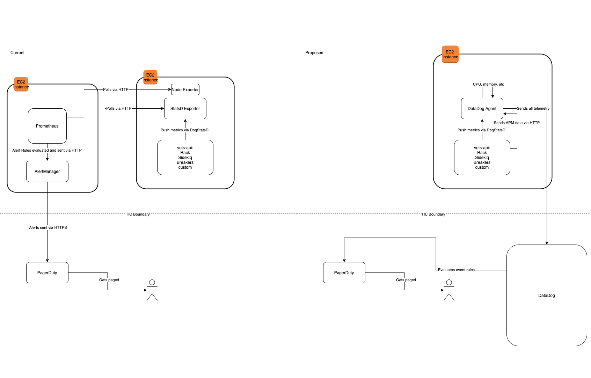

# DataDog Design Doc

**Author(s):** Wyatt Walter
**Last Updated:** May 15, 2020
**Status:** Draft | **In Review** | Approved  
**Approvers:** JP Ashenfelter \[ \], Joanne Esteban \[ \], Andrew Gunsch \[ \]

## Overview

### Objective

This doc is meant to provide a place to collaborate around a proposal to replace the current Prometheus + Grafana monitoring stack on VSP with DataDog and make a decision with buy-in across the VSP program. This design doc covers DataDog in a Hashicorp stack world. The transition can be laid out separately, but not in-scope here.

We are writing this assuming that some other technical components around the Prometheus system do not change immediately. What's not on the table here are:

- AWS (GovCloud) as a hosting environment
- PagerDuty
- Nomad/Consul/Vault stack
- Slack
- vets-api does not get split into many services, but we should consider a future where that could be a reality

### Background

The program is at a crossroad with respect to monitoring. We are in the process of overhauling the way that we manage infrastructure and deployments, so the current monitoring solution needs to be adapted. The current installation of Prometheus is also very out-of-date and likely needs to be rebuilt from scratch in order to move forward. Some members of the team have knowledge of Prometheus, but it's currently a small number. So, we are at a place where we need to choose whether we have a lot of new team members on ramping into Prometheus knowledge for a new implementation or decide to pursue another option.

There are a lot of options on the market today. A key decision included here is SaaS vs self-hosted. Both have advantages and disadvantages. The solution being proposed here is using DataDog which is SaaS with an agent installed on each node within the infrastructure. DataDog also has a mixed push and poll method, whereas Prometheus is strictly poll.

### High Level Design

The proposal here is to utilize DataDog to replace the current Prometheus and Grafana implementations. DataDog would be the place that we would collect and store metrics, build dashboards for presenting that information, and send alerts out to on-call engineers through PagerDuty and Slack.

To do this, there's some features we'd like to have access to:

- Infrastructure
- APM
- Synthetic monitors
- AWS integration

Features that we like to utilize but believe are not sure will be feasible compliance-wise:

- Logging
- Real User Monitoring

The infrastructure feature replaces the majority of the exporters we use for Prometheus. It will gather things like CPU/memory/disk statistics, information about containers (and their CPU/memory/disk statistics), and enable us to gather metrics from other things like HAProxy or custom scripts. The agent also listens locally for StatsD metrics which we can use for everything that's currently sending to StatsD (vets-api, Sentry).

APM is also available once the agent is installed. Additional tracing code has to be added to vets-api to get the full APM experience. This would be a much-needed feature that is currently not available in our monitoring stack.

Synthetic monitors replace the Prometheus Blackbox Exporters and Route53 Health Checks in place today, and are the way that we would monitor endpoints from across the public internet.

Enabling AWS integrations gets events about changes from AWS to be integrated alongside metrics from the systems. It enables new alerting and contextualization in dashboards that is not available today.

## Specifics

### Detailed Design

DataDog is an agent-based monitoring system. An agent would be installed onto each node in the infrastructure and the agent has the capability to poll for data via "integrations" or receive data via DogStatsD. The agent then sends that data to the DataDog service where it can be queried via API and visualized in various ways.

#### Sending metrics to DataDog

DogStatsD is an extension of the StatsD protocol with added tagging capabilities which is the way DataDog encourages developers to send custom metrics into the system. Poll integrations would be avoided where possible and done only for the lower level infrastructure components like Nomad, Consul, Vault, Docker, etc.

Today, vets-api already sends most metrics with tags via the DogStatsD protocol to a local StatsD listener which is polled by Prometheus. Luckily, we should be able to just change the destination for these metrics and the change for metrics that aren't using tags yet would be minimal. The [Prometheus StatsD exporter has mapping](https://github.com/department-of-veterans-affairs/devops/blob/master/ansible/deployment/config/vets-api/statsd-exporter-mapping.conf) for all of the metrics it receives which would need to be adjusted. We can expose this as a service for VFS products to send metrics in and have them stored without any additional configuration by the VSP team.

The agent also provides a listener for APM data, it's a local HTTP server. Tracing code has to be added for most APM information. Ruby is supported with a full guide in the [documentation](https://docs.datadoghq.com/tracing/setup/ruby/). The product uses [OpenTracing](https://docs.datadoghq.com/tracing/opentracing/), so we can swap providers in the future should we need to for whatever reason.

AWS data is retreived by DataDog itself using the public AWS API and has a service account with permissions to see resource information and gather CloudWatch data.

#### Using metrics

The biggest area that we've invested in Prometheus + Grafana to date has been around alerting and dashboards. All of the basic constructs within DataDog will be managed by Terraform to manage changes.

TODO Open question: Would we want to have multiple accounts? Could we segregate by environment (i.e. production account, staging account, etc) or team (i.e. GIDS account, CMS account, etc)? Would we want to? It's hugely beneficial in Grafana to flip from staging to prod in the same app, but if things are consistent between environments and enforced by Terraform maybe that feature becomes less appealing. We also don't know what user management looks like.

Similar to Grafana, we can build dashboards with varying visualization types built in, and we can use tags for template variables to create generalized dashboards for VFS teams to filter down to only apps or services they care about.

This flow is described in the DataDog documentation [here](https://docs.datadoghq.com/developers/dogstatsd/?tab=hostagent).

Alerts are called "monitors" in DataDog. The VSP team would setup some default monitors for an application (% of 500 errors for a given app) similar to the way that Prometheus is setup today, and allow VFS teams to define their own rules for custom metrics that are sent via DogStatsD.

### Code Location

The DataDog agent would be installed in the base image which is managed in the [vsp-infra-ami](https://github.com/department-of-veterans-affairs/vsp-infra-ami) repository.

The DataDog agent key is stored in Vault and retrieved by cloud-init. This is managed by Terraform in the environment and specific cluster config (vault.tf, consult.tf, nomad.tf) like [this](https://github.com/department-of-veterans-affairs/vsp-infra-playground).

The rest of the code depends upon the application that is sending metrics. Most, if not all, would use one of the DataDog libraries to send metrics to DogStatsD and the tracing API.

Where dashboards and monitors are managed should be left up to a future design document or decision. There are Terraform providers for everything we would need. The tradeoff with managing dashboards in this way is that you end up with a less flexible system because it's hard to develop the visualization in a text editor only to see it after an apply.

### Testing Plan

Not applicable at this stage.

### Logging

This isn't very relevant at this stage, but the DataDog agent would log just like any other application on the platform.

### Debugging

DataDog provides a number of ways to inspect the work it's doing. Most of the tools on this page are limited to administrative users, but they have a dedicated [troubleshooting](https://docs.datadoghq.com/agent/troubleshooting/) page on their site for the agent itself.

On the alerting side, the rule editor has built-in functionality to provide assistance in querying and seeing when thresholds would be crossed and guideance for writing alert text and other details.

### Caveats

_To be determined._

### Security Concerns

The agent is calling out to a SaaS service, which does carry some classes of risks. DataDog does have [information](https://www.datadoghq.com/security/?tab=security) on security precautions about both the data stored and security of the agent itself.

The service is also a bit more likely to see things like DDoS attacks than something self-hosted.

### Privacy Concerns

Metrics should be about the applications and systems running those applications. The only known privacy concern would be if a developer put PII into the tags for a metric and sent that along. It is unknown if DataDog has filtering on tag data to account for that unlikely scenario.

### Open Questions and Risks

How does user management work?

Do we have a single account or several?

How do we route alerts to a specific VFS team? This is also unanswered by the current solution as well so not unique to this decision.

When or will DataDog receive an ATO at VA? If not, can we get an excemption to use it?

Will we manage dashboards via Terraform or some other tool to keep them in git?

### Work Estimates

There's a number of large projects involved here, without a great way to estimating work this early. We anticipate major milestones to look something like:

- Configure agents in the new infrastructure. agents are already being installed in the playground environment.
- Possibly in parallel with the above, install and configure agents on vets-api and GIDS instances in current infrastructure.
- Configure PagerDuty integration, figure out authentication/authorization, train folks who are going to be on-call for services on how to use the new system.
- Migrate over the Prometheus BlackBox checks into DataDog Synthetic checks, mirror alarms there. Tear down Route53 Health Checks in AWS Commercial as well.
- Migrate metrics collection, dashboards, and monitors (alerts) over to DataDog as the service moves into the new infrastructure

### Alternatives

There's a few alternatives to this. We have a doc describing decision points for the Ops team in the [infrastructure recommit project folder](https://github.com/department-of-veterans-affairs/va.gov-team/blob/master/products/platform/infrastructure_recommit/monitoring/solution_evaluation.md). Some brief details on decision points below.

#### Re-implement using Prometheus

We could re-implement monitoring using Prometheus. We have some in-house knowledge already, but it's a limited set of individuals. In general, the biggest issues with Prometheus have been that its query language has been hard for a lot of engineers and we have to be very careful about the performance with cardinality. The current implementation has been allowed to fall way out-of-date, which we could address with some re-commitment on that front, but it's also a burden for us to keep it updated.

#### Explore other solutions

Most other open source / self-hosted solutions need a large number of components put together. While they are technically capable, our time could be better spent in other areas of the platform outside of re-learning and building a new solution.

There are other SaaS providers as well, but only NewRelic and Dynatrace are known to have hope of becoming approved for use anytime soon. NewRelic has fantastic APM functionality, but is weak on the infrastructure side. Dynatrace doesn't have Ruby support which is a non-starter given that the two main APIs we operate are Ruby on Rails applications.

### Future Work
_Features you'd like to (or will need to) add but aren't required for the current release. This is a great place to speculate on potential features and performance improvements._

### Revision History
_The table below should record the major changes to this document. You don't need to add an entry for typo fixes, other small changes or changes before finishing the initial draft._

Date | Revisions Made | Author
-----|----------------|--------
May 15, 2020 | updates to move it out of draft status | Wyatt Walter
April 30, 2020 | Initial draft | Wyatt Walter
