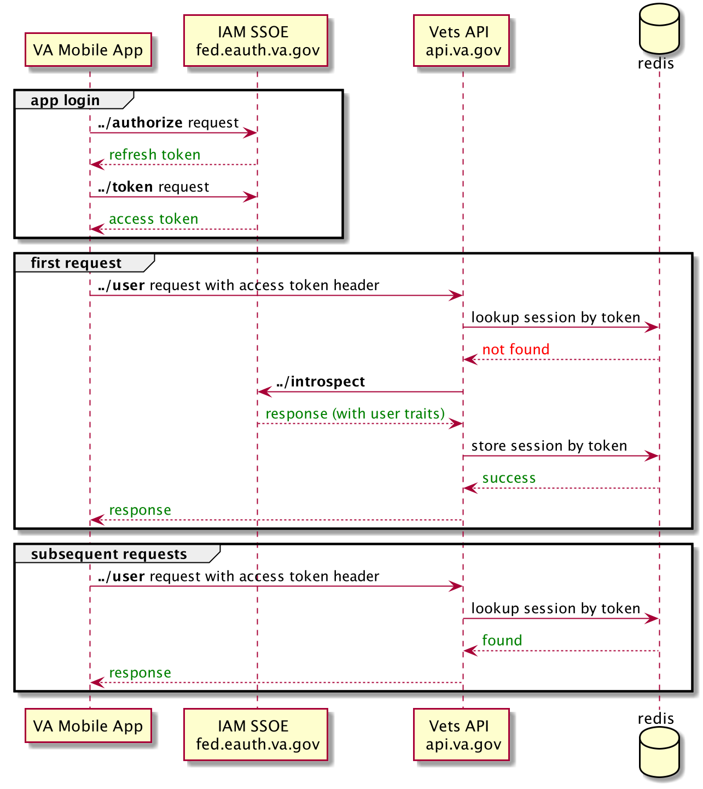
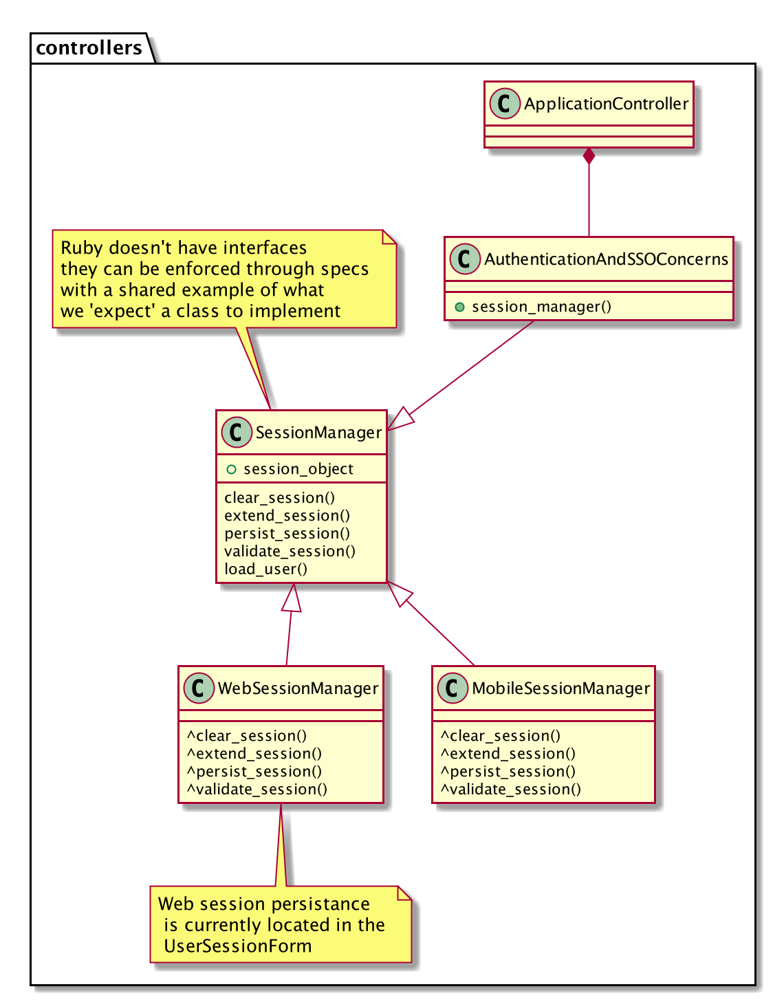

# Mobile SSOe Auth Design Doc

_Replace the previous line with the the title of your project or component and replace the following lines with your name(s), email and the date._  
**Author(s):** Alastair Dawson, Jonathan Julian  
**Last Updated:** August 12th, 2020  
**Status:** **Draft** | In Review | Approved  
**Approvers:** Andrew Gunsch, John Paul Ashenfelter, Michael Fleet 

## Overview

### Objective
Allow VA Mobile App users, authenticated via the IAM SSOe identity provider, to consume endpoints in api.va.gov

### Background
A flagship mobile app for the VA is being developed to augment services available on va.gov with unique mobile features 
such as notifications and biometric sign-in. The VA’s Identity and Access Management System (IAM) maintains a Single Sign On 
identity provider/service for external apps (SSOe). Web clients can currently establish VA.gov sessions from SAML, Okta, 
and across vites via SSO. To enable the mobile app to consume api.va.gov endpoints we’ll allow mobile SSOe signed requests 
to also create and use VA.gov sessions.

Currently in vets-api all web client session (from va.gov) logic is managed in the `AuthenticationAndSSOConcerns` concern 
that is mixed in to the main `ApplicationController`.  API sessions (from lighthouse) are managed in the `OpenidApplicationController`.

The main difference between the two are that session extension/expiration for web requests are handled in the app while API 
session TTL is part of the token payload.

### High Level Design
When launching the mobile app for the first time a call is made to IAM OAuth service's `../authorise` endpoint. 
This returns a long-term auth token that lasts for 30 days. Then, and after all logins during that window, the app makes
a call to IAM's `../token` endpoint to retrieve an access token which signifies that a IAM session has been created.
The mobile app will include that access token in a Bearer authorization header for all requests to vets-api.
When vets-api receives a request with that mobile auth header it will first lookup a session in redis by the access token.
If a session is not found vets-api will use a `IamSsoeService` (draft PR [here](https://github.com/department-of-veterans-affairs/vets-api/pull/4665)) to call IAM's `../introspect` endpoint which both
validates and returns traits for a user.



The user traits returned by the instrospect endpoint are similar to those returned by ID.me and MVI and can be used to
instantiate a user profile. We will create an adapter class or method to map the fields to a user profile.

```json
{
  "fediamtransaction_id": "5eWibth5T4By92LinZBrcRi+dMHCkde5bhzwwVeOmPI=",
  "fediam_is_delegate": "false",
  "fediam_birls_number": "796121200",
  "birthdate": "1970-08-12",
  "fediamss_issue_instant": "2020-08-05T21:48:38Z",
  "fediam_mviicn": "1008596379V859838",
  "fediam_street": "1700 University Boulevard",
  "fediamsecid": "0000028114",
  "client_id": "VAMobile",
  "fediam_country": "NOT_FOUND",
  "fediam_gender": "MALE",
  "exp": 1596667726,
  "code_challenge": "tDKCgVeM7b8X2Mw7ahEeSPPFxr7TGPc25IV5ex0PvHI",
  "fediam_street1": "1700 University Boulevard",
  "fediam_do_dedipn_id": "1005079124",
  "fediam_gc_id": "1008596379V859838^NI^200M^USVHA^P|796121200^PI^200BRLS^USVBA^A|0000028114^PN^200PROV^USDVA^A|1005079124^NI^200DOD^USDOD^A|32331150^PI^200CORP^USVBA^A|85c50aa76934460c8736f687a6a30546^PN^200VIDM^USDVA^A|2810777^PI^200CORP^USVBA^A|32324397^PI^200CORP^USVBA^A|19798466a4b143748e664482c6b6b81b^PN^200VIDM^USDVA^A|796121200^AN^200CORP^USVBA^",
  "active": true,
  "fediamauth_n_type": "IDME",
  "fediam_not_on_or_after": "2020-08-05T21:53:42Z",
  "aud": "VAMobile",
  "fediam_mcid": "WSSOE2008051748411450069042554",
  "fediamidsource": "ssoe",
  "fediam_vaafi_proof_authority": "FICAM",
  "phone_number": "(858)335-0190",
  "tokens_generated_by": "OAuth AZN Code Flow",
  "fediamissuer": "https://int.eauth.va.gov/isam/sps/saml20idp/saml20",
  "fediamproofing_auth": "FICAM",
  "fediam_authentication_method": "http://idmanagement.gov/ns/assurance/loa/3",
  "fediamam_eai_xattr_session_lifetime": "1596667722",
  "fediam_suffix": "NOT_FOUND",
  "sub": "0000028114",
  "fediam_mhvien": "NOT_FOUND",
  "fediam_authentication_instant": "2020-08-05T21:48:42Z",
  "token_type": "bearer",
  "fediam_common_name": "va.api.user+idme.008@gmail.com",
  "scope": "openid",
  "fediam_postal_code": "78665",
  "fediam_vaafi_csp_id": "200VIDM_19798466a4b143748e664482c6b6b81b",
  "fediam_pn_id": "796121200",
  "fediam_pn_id_type": "SSN",
  "iat": 1596664126,
  "email": "va.api.user+idme.008@gmail.com",
  "code_challenge_method": "S256",
  "given_name": "GREG",
  "middle_name": "A",
  "fediamassur_level": "3",
  "fediam_not_before": "2020-08-05T21:43:42Z",
  "fediam_prefix": "NOT_FOUND",
  "fediam_state": "TX",
  "fediam_city": "Round Rock",
  "fediam_pid": "32331150,2810777,32324397",
  "family_name": "ANDERSON",
  "username": "0000028114"
}
```

Mobile sessions are a hybrid of web sessions and api sessions. Like web sessions they are first class citizens. 
i.e. they do not have restrictions on which endpoints they can call. However they will have their TTL managed 
externally by the IAM auth service. With

Because of this hybrid nature mobile session management needs to live in the main application controller. To not 
require conditional logic everywhere web and mobile sessions are differentiated they should share the same interface 
and apply the correct logic where applicable (strategy pattern).

The proposed solution is to move the current session logic dealing with sessions in `AuthenticationAndSSOConcerns` 
to a `WebSessionMananger` class. Then create a sibling `MobileSessionManager` class that implements the same interface 
with mobile specific logic.

## Specifics

### Detailed Design
A base `SessionManager` will be created for the shared logic that both the `WebSessionMananger` and `MobileSessionMananger` to use.
It will also declare an interface by defining a set of methods that must be overrriden by its child classes.

The `AuthenticationAndSSOConcerns` module is mixed in to the `ApplicationController` and has information about the 
incoming request. When a request originates from a web client the concern can instantiate a `WebSessionManager`. 
Likewise when it originates from a mobile client it can instantiate a `MobileSessionMananger`. As both managers implement 
the same interface we won’t need to sprinkle web or mobile conditional logic throughout the concern. The request determines 
which state it’s in and chooses the appropriate manager:



Should another form of session manager be needed in the future it can implement the same interface. The design also makes testing easier as the logic to determine if each type of session manager is correct can be tested in isolation.

#### Example Code Changes

A new base `SessionManager` class is created for the shared logic and to mark methods that should be implemented.
The one major change is that as the logic is now in a class rather than a concern current_user must be returned 
from methods when its state needs updating in the controller:

```ruby 
class SessionManager
  def load_user
    session_object = Session.find(session[:token])
    return nil unless session_object
    
    # return 'current_user'
    User.find(session_object.uuid)
  end
  
  def validate_session
    raise NotImplementedError, 'SessionManager subclasses must implement the validate_session method'
  end
end
```

The authenticate callback with the session_mananger instance based on request origin:

```ruby
module AuthenticationAndSSOConcerns

MOBILE_TOKEN_REGEX = /Bearer /.freeze

# ...

protected

def authenticate
  session_mananger.validate_session || render_unauthorized
end

def session_mananger
   web_request? ? WebSessionMananger.new : MobileSessionManager.new(request.authorization)
end

def web_request?
  request.authorization.to_s[MOBILE_TOKEN_REGEX].nil?
end

```

The current `validate_session` logic moves to the `WebSessionManager`:

```ruby
class WebSessionMananger < SessionManager
  def validate_session
    @current_user = load_user

    if @session_object.nil?
      Rails.logger.debug('SSO: INVALID SESSION', sso_logging_info)
      clear_session
      return false
    end

    if should_signout_sso?
      Rails.logger.info('SSO: MHV INITIATED SIGNOUT', sso_logging_info)
      reset_session
    else
      extend_session!
    end

    @current_user.present?
  end
end
```

The new `MobileSessionManager` has it's own version of `validate_session`:

```ruby
class MobileSessionMananger < SessionManager
  def initialize(authorization)
    @token = token_from_authorization(authorization)
  end
  
  def validate_session
    load_user
    return true if @session_object.present? && @current_user.present?
    
    introspect_response = IamSsoeAuth::Service.new.post_introspect(@token)
    @current_user = build_user(introspect_response)
    @current_user.present?
  end
  
  def build_user(introspect_response)
    # build session, user, and profile objects...
    user = User.save
    user
  end
end
```


### Code Location
Code will live in th vets-api repo. IAM auth code will be located in lib/iam_ssoe_auth as in the [draft PR](https://github.com/department-of-veterans-affairs/vets-api/pull/4665).

### Testing Plan
- Like MVI IAM's OAuth team requires a live demo to move up environments
- Updated and new specs for session creation
- Integration tests first on a review instance then staging (may require the rollback dance if staging testing requires more than a day)

### Logging
- New log lines and metrics around the type of session created.
- Log errors when session creation fails or are unexpectedly not found.

### Debugging
_How users can debug interactions with your system. When designing a system it's important to think about what tools you can provide to make debugging problems easier. Sometimes it's unclear whether the problem is in your system at all, so a mechanism for isolating a particular interaction and examining it to see if your system behaved as expected is very valuable. Once a system is in use, this is a great place to put tips and recipes for debugging. If this section grows too large, the mechanisms can be summarized here and individual tips can be moved to another document._

- Rails console debugging
- Link to mobile build instructions, logging details
- TODO: check on access to IAM logs, point of contact

### Caveats
_Gotchas, differences between the design and implementation, other potential stumbling blocks for users or maintainers, and their implications and workarounds. Unless something is known to be tricky ahead of time, this section will probably start out empty._

_Rather than deleting it, it's recommended that you keep this section with a simple place holder, since caveats will almost certainly appear down the road._

_To be determined._

### Security Concerns
_This section should describe possible threats (denial of service, malicious requests, etc) and what, if anything, is being done to protect against them. Be sure to list concerns for which you don't have a solution or you believe don't need a solution. Security concerns that we don't need to worry about also belong here (e.g. we don't need to worry about denial of service attacks for this system because it only receives requests from the api server which already has DOS attack protections)._

TODO

### Privacy Concerns
_This section should describe any risks related to user data, PII that are added by this new application. Think about flows of user data through systems, places data is stored and logged, places data is displayed to users. Where is user data stored or logged? How long is it stored?_

TODO

### Open Questions and Risks
_This section should describe design questions that have not been decided yet, research that needs to be done and potential risks that could make make this system less effective or more difficult to implement._

_Some examples are: Should we communicate using TCP or UDP? How often do we expect our users to interrupt running jobs? This relies on an undocumented third-party API which may be turned off at any point._

_For each question you should include any relevant information you know. For risks you should include estimates of likelihood, cost if they occur and ideas for possible workarounds._

TODO

### Work Estimates
- IAM SSOe Service (in [draft PR](https://github.com/department-of-veterans-affairs/vets-api/pull/4665))
- Create base `SessionManager` and `WebSessionMananger` (1 week)
- Create `MobileSessionMananger` (1 week)
- IAM Dev test (1 day)
- IAM Staging test (1 day)
- IAM Prod test (1 day)

### Alternatives
_This section contains alternative solutions to the stated objective, as well as explanations for why they weren't used. In the planning stage, this section is useful for understanding the value added by the proposed solution and why particular solutions were discarded. Once the system has been implemented, this section will inform readers of alternative solutions so they can find the best system to address their needs._

TODO

### Future Work
_Features you'd like to (or will need to) add but aren't required for the current release. This is a great place to speculate on potential features and performance improvements._

TODO

### Revision History

Date | Revisions Made | Author
-----|----------------|--------
Aug 14, 2020 | Initial Draft | Alastair Dawson

