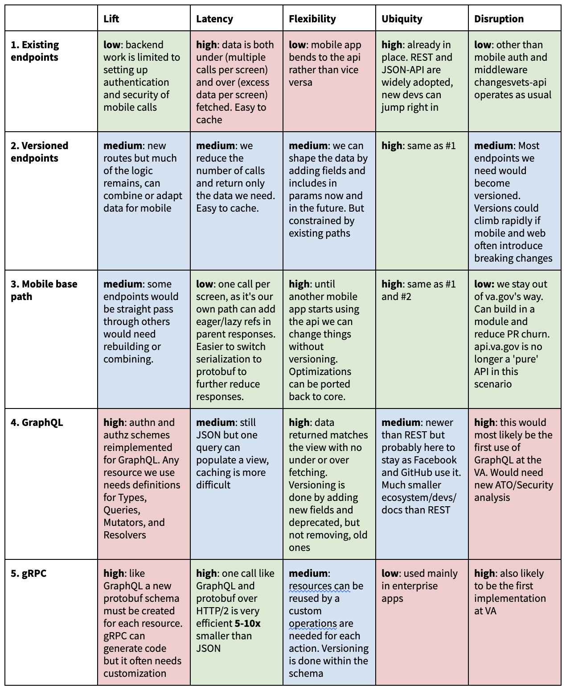

# Mobile API Design Doc

**Author(s):** Jonathan Julian (CTO Support, Engineering), Alastair Dawson (CTO Support, Engineering)  
**Last Updated:** August 17, 2020  
**Status:** **Draft** | In Review | Approved  
**Approvers:** Andrew Gunsch, John Paul Ashenfelter, Michael Fleet, Johnny Holton  

## Overview

### Objective
The new flagship VA Mobile app contains functionality that is available on VA.gov, as well as some novel features. 
The app needs to be powered by an API providing authenticated Veteran data. This API should:

- Reuse backend integrations wherever possible
- Not add complexity to an already complex system
- Be able to be built and maintained without undue overhead
- Complement and even bolster adjacent projects such as VA.gov web and Lighthouse

This document is intended for engineers and engineering leadership alike.

### Background
In the winter/spring of 2020, a “VA Mobile App Discovery Sprint” was held to determine the feasibility of a flagship 
mobile app for the VA. It was immediately apparent that the authenticated Veteran experience would provide the most value, 
similar to the VA.gov experience. The goal of the mobile app is not to replicate every bit of VA.gov, but to provide a 
new mode of communication to allow Veterans to interact more easily with the department. Since VA.gov is powered by 
vets-api and VSP, it seemed like a natural fit for the mobile app to be powered by APIs in the same space.

### High Level Design
Since vets-api already contains integrations to backend services that the mobile app will need 
(MVI, Claims, <list more here>), the mobile API will be built inside of the vets-api codebase, and exposed in the same 
 way that VA.gov API endpoints are exposed.

The mobile API will provide functionality that is currently exclusive to VA.gov as well as some already-public functionality 
from Lighthouse, so existing integrations will be reused. A Rails engine will house the mobile API surface area, with necessary 
functionality connected as closely as possible to the backend integrations. In some cases, this may be a simple passthrough 
(/mobile/abc just invokes /abc), while in other cases the mobile API will provide its own presentation layer on top of the 
integrations. This will allow the mobile API to grow independently of the rest of vets-api, while providing a consistent API 
that will be useful for future mobile applications to consume.

All endpoints will be versioned, so that long-lasting mobile releases will continue to function into the future. When 
modifications are required, changes will be made in a way to not break existing clients (versioning). The team is considering 
building a machine-readable discovery API endpoint to decouple the mobile app from hard-coded urls.

All mobile authorization will be confined to this Rails engine. The mobile app will require some new endpoints as well, and 
these will be built in the Rails engine for isolation.

## Specifics

### Detailed Design
The mobile endpoints need custom authentication, merged responses, and reduced payloads. With versioning this is possible 
in the core api albeit with a fractured experience. Mobile endpoints could be on v0, v1, or even v2. MVP mobile endpoints 
will be in flux, and parallel va.gov changes could cause versions to climb.

To limit the disruption to the API it's best to perform the optimizations in a module with a `/mobile` base path. 
This allows us to:

- Add mobile authentication without changes to the core API codebase.
- Stay out of the way as we tweak endpoints in a mobile sandbox.
- Test out optimizations that can be later ported back to the core API.

#### Application Controller

Authentication for the mobile app is via IAM's SSOe OAuth service. It is 100% API based and does not use callbacks or cookies. 
The mobile `ApplicationController` would extend the core `ApplicationController` and override its authentication methods.

There's some tech debt in the `ApplicationController` that is not required to fix to enable the mobile API but would clean it up for all its sub-classes
The logic in the core `ApplicationController` does not apply globally could move to concerns be and 
included as needed. e.g. `render_job_id` only applies to the `DocumentsController` and the `EVSSClaimsController`. 

#### Routing

The mobile engine's endpoints mount at `/mobile`:

```ruby
mount Mobile::Engine, at: '/mobile'
```

Some endpoints such as facilities don't need optimization. They will pass-through via routes:

```ruby
# modules/mobile/config/routes.rb (redirect starts at the app root so this is /v0/mobile/.. pointing to )
get '/v0/facilities/va/:id' => redirect('/v1/facilities/va/%{id}')
```

#### Request/response differences

How requests and responses function within the mobile module will be isolated from the core API. However, there are improvements that could
be ported back and it would be good to get consensus on an approach. The plan is for views, such as user profile, that currently over-fetch 
or over-deliver to implement fieldsets and includes in REST url params so not extra data is returned. JSON-API defines
sparse [fieldsets](https://jsonapi.org/format/#fetching-sparse-fieldsets) and [includes](https://jsonapi.org/format/#fetching-includes) which
can be implemented with custom code or through gems such as [JSON-API Resources](https://jsonapi-resources.com/) or [Graphiti](https://www.graphiti.dev/guides/).


### Code Location
The code will live in a 'mobile' directory within the [modules](https://github.com/department-of-veterans-affairs/vets-api/tree/master/modules) directory within vets-api.

### Testing Plan
To ensure changes to shared backend services will not break code, tests will be written to demonstrate the mobile API requirements. Any breaking changes to upstream services will fail our tests.

### Logging
We plan to adhere to VSP standards for logging.

### Debugging
TBD

### Caveats
TBD

### Security Concerns
#### Potential threats
- SSOe introspect DoS

Adding more surface area to the API does enable new possibilities for denial-of-service attacks. We plan on making a call to SSOe (introspect) with every vets-api session cache miss, to validate the access token and establish a session.

Remediation could include caching each “miss” for a period of time, protecting the introspect endpoint on SSOe from DOS.
- CSRF for API POST requests

TBD - research best practices that do not include turning off the CSRF checking


### Privacy Concerns
TBD

### Open Questions and Risks
TBD

### Work Estimates
N/A

### Alternatives
#### Alternative to building in vets-api
##### Build Mobile API entirely outside of vets-api
Benefits to our team include autonomy and speed of development, but have some major drawbacks:
- Lack of reuse - back-end integrations will need to be re-established
- High LOE when it comes to deployment
- No value for our work to be reused by VA.gov

##### Build Mobile API as a proxy in front of vets-api
Benefits to our team include a degree of autonomy, improved speed of development, but have some definite drawbacks:
- High LOE when it comes to deployment, although the future VSP container-managed deployment could mitigate this
- No value for our work to be reused by VA.gov

##### Build Mobile API as a presentation layer within vets-api
Benefits include keeping a distinct separation between this mobile api and VA.gov api. Allows the mobile api team to work 
independently on the shape of API responses.
- No reuse by VA.gov by design
- Duplication of code within vets-api

#### Path and Protocol Alternatives
Once we decided on building within vets-api we analyzed our options for how to do so. The short term solutions were to use 
existing endpoints, version endpoints and make changes there, or create a mobile base path (module) so the mobile routes and 
auth are isolated. Below is a table listing the sizes for; Lift, or the estimated effort to implement a solution. Latency, 
the number of calls and size of the payload per mobile screen. Flexibility, how easy it is to make near and long term changes. 
Ubiquity, the penetration/adoption rate of a technology. And Disruption, how new a technology is to VA and likelihood of 
requiring a new ATO.



Notes: REST can do a lot of what GraphQL does. Passing in url params of fields and includes can reduce and combine data. 
A rails plugin called Graphiti which enables GraphQL like features (over REST). Also there’s no rule that REST has to use JSON, 
responses can be serialized as a Protobufs. The same endpoint could return JSON or a Protobuf with a url param flag or by 
appending a file extension (.json, .proto) to the path. GraphQL and gRPC have a lot of red boxes above, however; GraphQL is 
by far the most flexible; and gRPC delivers much smaller payloads, can keep connections open, and enables real-time data push/pull.


### Future Work
TBD

### Revision History

Date | Revisions Made | Author
-----|----------------|--------
Aug 10, 2020 | Initial draft | Jonathan Julian
Aug 17th, 2020 | Add detailed design section | Alastair Dawson
