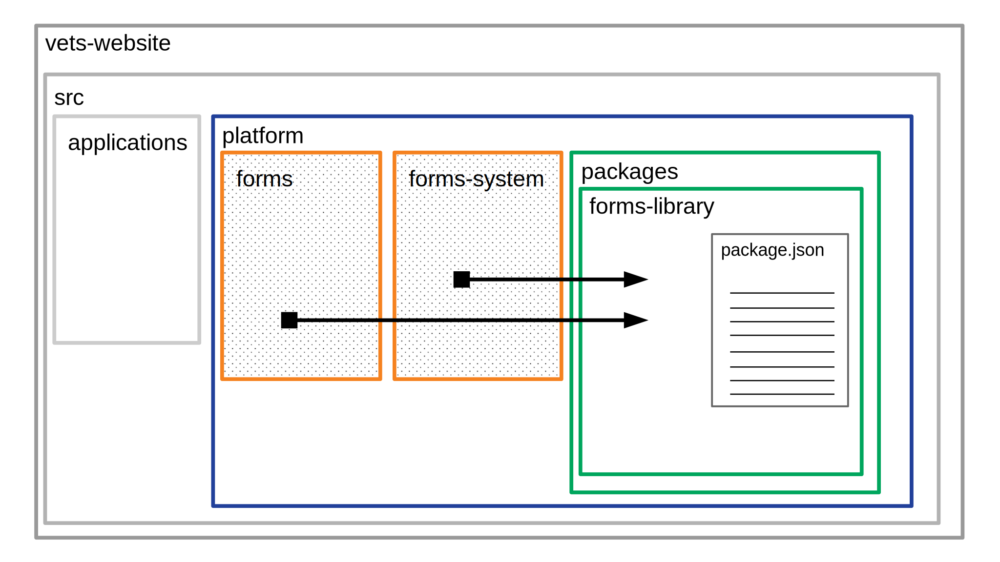

# Bundling the forms library as a Node package

**Author(s):** Brooks Johnson 
**Last Updated:** September 24, 2020  
**Status:** **Draft** | In Review | Approved  
**Approvers:** _Chris Valarida_ \[ \], _Michael Fleet_ \[ \], ...  

## Overview

### Objective

The goal of this project is to define clear boundaries around the collection of code, markup, and styling that is referred to as "the forms library."

Some non-goals are:

- Bug fixes to the forms library
- Adding new features to the forms library
- Refactoring the forms library beyond what is required to group the existing code together in the same package
- Establishing a separate build & publish pipeline for the forms library (yet)

The intended audience for this document is VSP and VFS frontend engineers.

### Background

The forms library is a collection of React components, CSS, and JS that allows an app team to build a form application for `vets-website` using a form configuration.

Right now in `vets-website` we have the following folders containing code for the forms library:

- `src/platform/forms`
- `src/platform/forms-system`

We also have forms-adjacent code in the form of other dependencies

- `@department-of-veterans-affairs/react-jsonschema-form` (See [Tighter dependencies](#tighter-dependencies))
- `vets-json-schema`

Additionally, the forms library code is entangled with other platform code as well as some app code.

#### Application entanglement

We have several examples of the forms library importing application code, which is the opposite of what should happen.
The forms library is meant to be a library that is used _by_ applications. Having certain parts of applications import forms library code while the forms library also imports application code leads multiple problems and blurs the lines of responsibility.

[This definition file](https://github.com/department-of-veterans-affairs/vets-website/blob/720a867817f5b83bd1d713bd51202863b41739b1/src/platform/forms/definitions/nonMilitaryJobs.js#L1) in the forms library imports some app code, yet the file itself is _only_ used in other app code.

There is a [helper file](https://github.com/department-of-veterans-affairs/vets-website/blob/cc4a3172edc242bf60c93aec5b170c734dc57985/src/applications/personalization/dashboard/helpers.jsx) in `src/applications/personalization` which exports a number of consts which are used in the following files within the forms library:

(This will be resolved in `vets-website` [PR #14468](https://github.com/department-of-veterans-affairs/vets-website/pull/14468).

- [`ApplicationStatus.jsx`](https://github.com/department-of-veterans-affairs/vets-website/blob/cc4a3172edc242bf60c93aec5b170c734dc57985/src/platform/forms/save-in-progress/ApplicationStatus.jsx#L6-L10)
- [`SaveInProgressIntro.jsx`](https://github.com/department-of-veterans-affairs/vets-website/blob/cc4a3172edc242bf60c93aec5b170c734dc57985/src/platform/forms/save-in-progress/SaveInProgressIntro.jsx#L12-L15)
- [`FormSaved.jsx`](https://github.com/department-of-veterans-affairs/vets-website/blob/cc4a3172edc242bf60c93aec5b170c734dc57985/src/platform/forms/save-in-progress/FormSaved.jsx#L10)
- [`AuthorizationComponent.jsx`](https://github.com/department-of-veterans-affairs/vets-website/blob/cc4a3172edc242bf60c93aec5b170c734dc57985/src/platform/forms/components/AuthorizationComponent.jsx#L12)

Finally, there are some testing helpers that live in the `src/applications/hca` directory and are used in forms library tests:

- [`01-sip-autosave.e2e.spec.js`](https://github.com/department-of-veterans-affairs/vets-website/blob/cc4a3172edc242bf60c93aec5b170c734dc57985/src/platform/forms/tests/save-in-progress/01-sip-autosave.e2e.spec.js#L4)
- [`01-sip-fail-load.e2e.spec.js`](https://github.com/department-of-veterans-affairs/vets-website/blob/cc4a3172edc242bf60c93aec5b170c734dc57985/src/platform/forms/tests/save-in-progress/01-sip-load-fail.e2e.spec.js#L3)
- [`01-sip-finish-later.e2e.spec.js`](https://github.com/department-of-veterans-affairs/vets-website/blob/cc4a3172edc242bf60c93aec5b170c734dc57985/src/platform/forms/tests/save-in-progress/01-sip-finish-later.e2e.spec.js#L4)
- [`01-sip-review.e2e.spec.js`](https://github.com/department-of-veterans-affairs/vets-website/blob/cc4a3172edc242bf60c93aec5b170c734dc57985/src/platform/forms/tests/save-in-progress/01-sip-review.e2e.spec.js#L3)

#### Platform entanglement

In addition to the forms library, the platform provides other code that is used both in the forms library and in applications. 

- `utilities`
- `monitoring`
- `site-wide`
- `user`
- `static-data`

These aren't _strictly_ part of the forms library, but since the forms library makes use of its parent platform code, it becomes more difficult to place clear boundaries around the forms library.
In a properly structured package, any dependencies are called out in the `package.json`, rather than imported from outside of the package's root directory.

### High Level Design

The forms library will be consolidated into a single place and bundled as a Node package.
This will allow VFS teams to import it as if it were any other Node module.

This change should introduce minimal functional impact on individual application teams.
The only application code changes will be updating the where forms library code and styles are imported from.

<!-- The source for this diagram is the `*.odg` file in the same directory, a LibreOffice Draw doc-->

## Specifics

### Detailed Design

The VSP Design System team will make several changes that will result in a packaged forms library.

#### Preparation

1. Move the app-specific code mentioned in [Application Entanglement](#application-entanglement) outside the forms library directories.
1. Use the `no-unresolved-modules` ESLint plugin to [find & remove unused code](https://github.com/department-of-veterans-affairs/va.gov-team/issues/8763) in the `forms` and `forms-library` directories

#### Beginning the bundling

1. Copy what remains from `forms` into `forms-system`
1. Create `platform/packages/forms-library` and move the contents of `platform/forms-system` into it
1. Add a `package.json` file to the new `forms-library` package directory
  - Any dependencies that are exclusively used by the forms library will go in here, and a `yarn install` from the `vets-website` root will install them.
1. [Add a temporary alias to the `.babelrc` file](https://github.com/department-of-veterans-affairs/vets-website/blob/055d96c54e1df54138b9efc589b98e55962333b3/.babelrc#L50-L55) that redirects imports from `platform/forms` and `platform/forms-system` to the new package
1. Edit the webpack config & use a custom `sass-loader` importer to _temporarily_ rewrite imports from `forms` to `forms-system`
  - This will prevent webpack from failing when it can't resolve the `.scss` files
1. Fix broken relative imports
1. Add babel configuration to the new package because according to [Babel's docs](https://babeljs.io/docs/en/config-files):
    > Searching [for a config] will stop once a directory containing a `package.json` is found, so a relative config only applies within a single package

#### Clarifying boundaries

The [Platform Entanglement](#platform-entanglement) section mentions that forms library code imports from "parent" platform code. This makes the boundaries less clear, so an effort will be made to reduce or eliminate the forms library importing from platform code.

- Move the [`static-data/labels` file](https://github.com/department-of-veterans-affairs/vets-website/blob/58c48c6fd116db6e875162f540a0d072678a68d2/src/platform/static-data/labels.jsx) into the forms library, since it is only used in connection with forms library configuration
- Prefer code that exists in the forms library, instead of in the parent platform directory.
  - Anything used by the forms library should be _in_ the forms library, or declared as a dependency.
  - For example, we have a [`focusElement`](https://github.com/department-of-veterans-affairs/vets-website/blob/46000a4becae29ca72b505889713fd4b2b2718f0/src/platform/utilities/ui/index.js#L17-L32) that exists in `platform/utilities/ui`, but also one that exists in [`forms-system/src/js/utilities/ui`](https://github.com/department-of-veterans-affairs/vets-website/blob/46000a4becae29ca72b505889713fd4b2b2718f0/src/platform/forms-system/src/js/utilities/ui/index.js#L3-L18). This project would eliminate the duplicate code existing at the platform level and direct all imports to use the forms library version
- Remove imports from `platform/monitoring`
  - Instead, import the relevant code outside of the forms library and pass them in as props or config options.
  - As an example, in the [`FormSignInModal`](https://github.com/department-of-veterans-affairs/vets-website/blob/1cc955b8d4f6b9f93f4553fdd4afa9878c75564f/src/platform/forms/save-in-progress/FormSignInModal.jsx#L12) component, remove the `platform/monitoring/record-event` import and instead put that function call inside of the function that gets passed as a prop. `FormSignInModal` is only used from `platform/site-wide`.
- Remove forms library dependence on platform re-implementations of 3rd party functions, like lodash's `get` and `set`. Use the forms library implementations where possible.
- Remove imports for `src/platform/utilities/environment` and instead rely on global `const`s from webpack's DefinePlugin for environment-related `const`s (i.e. an api url) or branching

#### Final touches

Once the forms library is actually a package, app code will be updated to import from it directly instead of relying on the aliases.

- Each app team will update their code to use forms library JS & SCSS from the package instead of by direct path. This will help to establish the boundaries of the package for VFS teams.
- Configure the `no-restricted-imports` ESLint rule to [restrict imports of `src/platform/packages` directly](https://eslint.org/docs/rules/no-restricted-imports)
- Add an `.eslintrc` file to the new forms library package and configure `no-restricted-imports` to block imports from application code and platform code.
- Remove the `.babelrc` forms-library alias & custom SASS importer

### Code Location

The forms library package will live in `src/platform/packages/forms-library`.
Since it will be a Node package, it will be added to the `package.json` file and apps will import it as a regular Node package instead of by its direct path.

### Testing Plan

We have an ESLint rule (`import/no-unresolved-modules`) in place which can verify that the right JS is imported as it relates to the forms library.
Additionally, many of the end-to-end tests will fail if the forms library is not imported properly, so they will help with awareness.

We don't have any automation in place to validate that the right SASS files are imported (other than webpack failing to resolve the file), so testing that forms styling is working properly will be a manual process using the browser dev tools.

### Logging

N/A

### Debugging

Since this project isn't about changing functionality of the forms library, we don't need to add any debugging tools. Validating that the app code can still access the forms library in its new location will be enough.

### Caveats

Though we will be creating a package for the forms library, we will not be following semantic versioning since it is _just_ a package and not a published module.
The additional overhead of updating the forms-library's `package.json` file and updating the `yarn.lock` file in `vets-website` to target the newest (but unpublished) version seems like a burden without much benefit.

### Security Concerns

N/A

### Privacy Concerns

N/A

### Open Questions and Risks

Do we want to separate the forms library build & testing stages from the main `vets-website` build? By easing the load of what webpack and mocha are doing, we could speed things up. The downside is that since we wouldn't be running the forms library tests with every merge into master, we would have to have some other automation in place to make sure that any changes to `src/platform/packages/forms-library` passes the forms library tests.

### Work Estimates

#### Prep work

This involves removing unused forms code and rearranging things so that the forms library doesn't import from app code.

**Estimate:** < 1 day

#### Creating the package

This captures the bulk of the work. Consolidating the forms library code into a single location, fixing broken imports, updating babel and webpack configuration.

**Estimate**: < 4 days

#### Creating the boundaries

Once the package is created, there will still be pieces of code that will need to be shifted around in order to firmly solidfy the boundaries around the forms library.

**Estimate:** < 1 week

#### Updating app code

By this point, the package will already exist, but due to some babel and webpack config it will be masquerading as if it were still spread across `platform/forms` and `platform/forms-system`. This is where we open a PR for each app team and update their code to import directly from the new package. Separate PRs for each app team will make each one easier to merge without requiring a codeowner review from every single team.

Once app teams approve these PRs that we create, we will be able to remove those temporary configs and add an ESLint rule to prevent direct imports from `platform/packages/forms-library` in order to make sure that the forms library is treated like a package moving forward.

Actual active time here will be fairly low (< 1 day), and will involve waiting for app teams before we will be able to finish the platform changes.

### Alternatives

See the section [Separate repo](#separate-repo) in Future Work. We are avoiding turning the forms library into its own node module with a separate repo because of the additional overhead of:

- publishing the package
- setting up CI pipelines
- additional repo management.

This _may_ be a path for the future.

Another reason why we don't want to do this right now is that we would lost the advantage of the ESLint configuration that is part of `vets-website`.
Once this configuration is published we will be able to import it into any repo, and at that point it may make sense to move the forms library out of `vets-website`.

Another alternative would be to move the forms library build out of the overall `vets-website` build. One advantage of this would be saving time, since the forms library could be built once and then all apps could use the cached version. However, on my machine a webpack build takes about 30 seconds, so shaving a few seconds off of this time will not be a huge benefit compared to how long it takes to do a full build with content. The downside of this would be added complexity for managing which forms library build to use (i.e. production, localhost, staging), and CI builds would either have to increase pipeline complexity by dealing with cached builds or lose the time savings altogether. This increase in complexity for marginal time savings does not seem worth it.

### Future Work

#### Separate repo

One possible option would be to take the package out of `vets-website` and give it its own repo.
With this, we could publish it to npm, and we could completely remove the forms build & test process from `vets-website`, possibly speeding things up since we could avoid running forms tests on every build.

#### Tighter dependencies

Since the forms library will have its own `package.json`, we can treat it more like a product that we provide to VFS teams. It will be separate from the rest of the code in `vets-website`, so we could eliminate lodash from the forms library, or replace `moment` with something more appropriate without affecting the rest of the frontend.

Additionally, it might make more sense if we bundled `react-jsonschema-form` in with the forms library. This would help make the forms library feel more cohesive.

Part of the forms library uses re-implementations of 3rd party functions from lodash in the `utilities/data` directory. Several of these usages could be replaced with "native" or vanilla versions ([example](https://github.com/department-of-veterans-affairs/vets-website/blob/32f6e006b36f9cbaa749ff33e41df322a4934d7f/src/platform/forms/save-in-progress/SaveInProgressIntro.jsx#L52)), and where that isn't possible we could add a dependency to `package.json` rather than reinvent the wheel.

### Revision History

Date | Revisions Made | Author
-----|----------------|--------
Sep 24, 2020 | Began initial draft | Brooks Johnson
