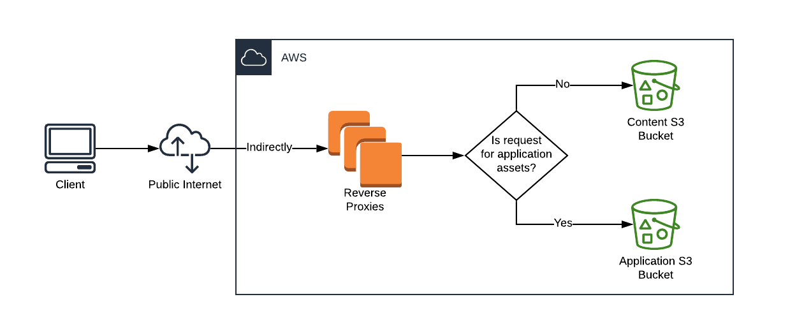

# Separate Content Build

**Author(s):** Christopher Valarida  
**Last Updated:** March 16 2020  
**Status:** **Draft** | In Review | Approved  
**Approvers:** Dror Matalon, Andrew Gunsch, Rian Fowler  

## Overview

### Objective
The objective here is to define an approach to isolate the concerns of the
content build from the front end application build and vice versa.

This design document is intended for front end engineers and DevOps engineers on
the Veteran-facing Services Platform (VSP) and other Veteran-Facing Services
(VFS) teams. Most directly affected is the Content Management System (CMS) team.

### Background

#### Build script
This [Metalsmith](https://github.com/segmentio/metalsmith) script does many
things. The highlights include:
- Fetching static content from Drupal
- Building static HTML pages from the content
- Triggering Webpack to build JS and CSS bundles
- Creating the HTML pages for the React Single-Page Applications (SPAs)
- Checking all HTML pages for broken links

The script can be found [here](https://github.com/department-of-veterans-affairs/vets-website/blob/master/src/site/stages/build/index.js).

#### CI pipeline
The CI pipeline for `vets-website` triggers the above build and runs a number of
tests. Pertinent to this document are:
- Accessibility tests on static content pages
  - Using the [`npm run nightwatch:docker --
    --env=accessibility`](https://github.com/department-of-veterans-affairs/vets-website/blob/master/Jenkinsfile#L82) command
  - This iterates through all the pages on the sitemap, which is created by the
    content build script
- Broken link checks on static content pages
  - The actual link checking happens during the build script, but it isn't
    reported anywhere until [after the build script has been run](https://github.com/department-of-veterans-affairs/vets-website/blob/master/jenkins/common.groovy#L200)
    
#### Deployment
There are currently two kinds of deployments:
1. [Partial deploy](https://department-of-veterans-affairs.github.io/veteran-facing-services-tools/getting-started/workflow/deploy/#partial-deploy--static-page-changes-only)
    - For static pages only
    - Uses the latest `vets-website` release and static assets
      - Does not trigger Webpack to build the JS and CSS bundles
      - Instead,
        [fetches](https://github.com/department-of-veterans-affairs/vets-website/blob/master/src/site/stages/build/plugins/configure-assets.js#L22-L23)
        the assets [from S3](https://github.com/department-of-veterans-affairs/vets-website/blob/master/src/site/stages/build/plugins/download-assets.js#L111)
        - Process is triggered [here](https://github.com/department-of-veterans-affairs/vets-website/blob/master/Jenkinsfile.content#L32)
    - Does **NOT** run any content validation such as accessibility tests or
      broken link checker
2. [Full deploy](https://department-of-veterans-affairs.github.io/veteran-facing-services-tools/getting-started/workflow/deploy/#full-deploy-of-vagov-client-app)
    - For `vets-website` code changes
    - Creates a new release and deploys it
    - Fetches the latest Drupal content
      - Falls back to the cached content in S3 from the last successful deploy
        (full or partial)
        <!-- TODO: Verify that either deploy will cache the pages.json and files -->
    - Runs the accessibility tests and link checker

See [here](https://department-of-veterans-affairs.github.io/veteran-facing-services-tools/getting-started/workflow/deploy/)
for more details.

#### Pain points
- Engineers developing applications need CMS content to build their applications
  - When their applications have nothing to with the CMS
  - It's a confusing requirement to new engineers
  - It requires either SOCKS proxy access or the `npm run fetch-drupal-cache`
    command, which isn't obvious
  - The build fails with an unexpected error when the CMS content cache
    (`pages.json`) is used with the updated Liquid templates to build the HTML
    files
    - Resulting in confused questions in the platform support channel and
      general frustration
- Application deployments depend on CMS content being valid
  - If content has accessibility errors, the build and deploy job will fail and
    application code won't be deployed to production
  - If there's an error in the content build, application code won't get
    deployed to production
    - This includes broken links
    - We have a safeguard that mostly works; if we run into a failure using the
      latest CMS content, we try again with the cached content
      - This doesn't work when the GraphQL query has been updated; that
        invalidates the cache
      - Errors in liquid templates would potentially break the build and falling
        back to the cache won't help

### High Level Design
The current front end build will be split up into two distinct builds:
1. Content build
    - Input: CMS content
    - Output: HTML files, assets from the CMS (PDFs, images and the like)
1. Application build
    - Input: `vets-website` code
    - Output: JavaScript and CSS bundles

The output of both these builds will be deployed to separate buckets. The
reverse proxies will route traffic intelligently to the appropriate bucket given
the request.

**Important note:** JavaScript application landing pages will live in the CMS.
To get an application into production, the page in Drupal will need to be
published.

**Another important note:** There is no way to coordinate these two deploys to
make an application live for the first time. The process will be to manually:
1. Verify the application assets are live in production
1. Publish the landing page
1. Deploy a new content build

## Specifics

### Detailed Design

_Coming soon to a design doc near you!_

<!--

_Designs that are too detailed for the above High Level Design section belong
here. Anything that will require a day or more of work to implement should be
described here._

_This is a great place to put APIs, communication protocols, file formats, and
the like._

_It is important to include assumptions about what external systems will
provide. For example if this system has a method that takes a user id as input,
will your implementation assume that the user id is valid? Or if a method has a
string parameter, does it assume that the parameter has been sanitized against
injection attacks? Having such assumptions explicitly spelled out here before
you start implementing increases the chances that misunderstandings will be
caught by a reviewer before they lead to bugs or vulnerabilities. Please
reference the external system's documentation to justify your assumption
whenever possible (and if such documentation doesn't exist, ask the external
system's author to document the behavior or at least confirm it in an email)._

_Here's an easy rule of thumb for deciding what to write here: Think of anything
that would be a pain to change if you were requested to do so in a code review.
If you put that implementation detail in here, you'll be less likely to be asked
to change it once you've written all the code._

NOTE: Don't forget about broken link validation with regard to links to
application assets. Specifically, how the application assets live in a
different location than the HTML files.

### Code Location
_The path of the source code in the repository._

### Testing Plan
_How you will verify the behavior of your system. Once the system is written,
this section should be updated to reflect the current state of testing and
future aspirations._

### Logging
_What your system will record and how._

### Debugging
_How users can debug interactions with your system. When designing a system it's
important to think about what tools you can provide to make debugging problems
easier. Sometimes it's unclear whether the problem is in your system at all, so
a mechanism for isolating a particular interaction and examining it to see if
your system behaved as expected is very valuable. Once a system is in use, this
is a great place to put tips and recipes for debugging. If this section grows
too large, the mechanisms can be summarized here and individual tips can be
moved to another document._

### Caveats
_Gotchas, differences between the design and implementation, other potential
stumbling blocks for users or maintainers, and their implications and
workarounds. Unless something is known to be tricky ahead of time, this section
will probably start out empty._

_Rather than deleting it, it's recommended that you keep this section with a
simple place holder, since caveats will almost certainly appear down the road._

_To be determined._

### Security Concerns
_This section should describe possible threats (denial of service, malicious
requests, etc) and what, if anything, is being done to protect against them. Be
sure to list concerns for which you don't have a solution or you believe don't
need a solution. Security concerns that we don't need to worry about also belong
here (e.g. we don't need to worry about denial of service attacks for this
system because it only receives requests from the api server which already has
DOS attack protections)._

### Privacy Concerns
_This section should describe any risks related to user data, PII that are added
by this new application. Think about flows of user data through systems, places
data is stored and logged, places data is displayed to users. Where is user data
stored or logged? How long is it stored?_

### Open Questions and Risks
_This section should describe design questions that have not been decided yet,
research that needs to be done and potential risks that could make make this
system less effective or more difficult to implement._

_Some examples are: Should we communicate using TCP or UDP? How often do we
expect our users to interrupt running jobs? This relies on an undocumented
third-party API which may be turned off at any point._

_For each question you should include any relevant information you know. For
risks you should include estimates of likelihood, cost if they occur and ideas
for possible workarounds._

### Work Estimates
_Split the work into milestones that can be delivered, put them in the order
that you think they should be done, and estimate roughly how much time you
expect it each milestone to take. Ideally each milestone will take one week or
less._

### Alternatives
_This section contains alternative solutions to the stated objective, as well as
explanations for why they weren't used. In the planning stage, this section is
useful for understanding the value added by the proposed solution and why
particular solutions were discarded. Once the system has been implemented, this
section will inform readers of alternative solutions so they can find the best
system to address their needs._

### Future Work
_Features you'd like to (or will need to) add but aren't required for the
current release. This is a great place to speculate on potential features and
performance improvements._

-->

### Revision History
Date | Revisions Made | Author
-----|----------------|--------
Mar ??, 2020 | Initial draft | Christopher Valarida

