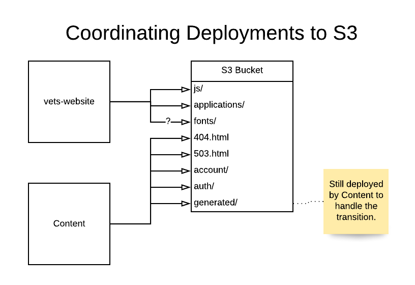

# Separate Content Build

**Author(s):** Christopher Valarida  
**Last Updated:** March 16 2020  
**Status:** **Draft** | In Review | Approved  
**Approvers:** Dror Matalon, Andrew Gunsch, Rian Fowler  

## Table of Contents

- [Separate Content Build](#separate-content-build)
    - [Overview](#overview)
        - [Objective](#objective)
        - [Background](#background)
            - [Build script](#build-script)
            - [CI pipeline](#ci-pipeline)
            - [Deployment](#deployment)
            - [Pain points](#pain-points)
        - [High Level Design](#high-level-design)
    - [Specifics](#specifics)
        - [Detailed Design](#detailed-design)
            - [Content build in a separate repository](#content-build-in-a-separate-repository)
            - [Testing changes to applications](#testing-changes-to-applications)
            - [Miscellaneous](#miscellaneous)
            - [React application landing pages](#react-application-landing-pages)
        - [Code Location](#code-location)
        - [Testing Plan](#testing-plan)
            - [Consolidated build script](#consolidated-build-script)
        - [Logging](#logging)
        - [Debugging](#debugging)
            - [Content](#content)
                - [Build](#build)
                - [Deploy](#deploy)
            - [Application](#application)
                - [Build](#build-1)
                - [Deploy](#deploy-1)
        - [Caveats](#caveats)
        - [Security Concerns](#security-concerns)
        - [Privacy Concerns](#privacy-concerns)
        - [Open Questions and Risks](#open-questions-and-risks)
        - [Work Estimates](#work-estimates)
        - [Alternatives](#alternatives)
            - [Mono-repo](#mono-repo)
            - [Multiple S3 Buckets](#multiple-s3-buckets)
        - [Future Work](#future-work)
        - [Revision History](#revision-history)

## Overview

### Objective
The objective here is to define an approach to isolate the concerns of the
content build from the front end application build and vice versa.

This design document is intended for front end engineers and DevOps engineers on
the Veteran-facing Services Platform (VSP) and other Veteran-Facing Services
(VFS) teams. Most directly affected is the Content Management System (CMS) team.

### Background
VA.gov is composed of static content (`.html`), applications (`.js`), and
styling (`.css`).

Static content files are created from the **[Metalsmith build
script](#build-script)**. Application bundles are created with Webpack.

These builds are currently **orchestrated by the same build script.**

The **[CI pipeline](#ci-pipeline)** runs this build script (among other things)
whenever a commit is pushed to a branch in GitHub. On a branch, this build must
be successful **before the branch can be merged.**

The output of this build are **[deployed](#deployment) to and hosted from an AWS
S3 bucket**. Applications are deployed on a weekdaily schedule. New content is
deployed by a manual trigger from the CMS and by the weekdaily application
deployment.

The entangling of the content and application builds have [led to
frustrations](#pain-points) for engineers, slower iteration cycles due to failed
builds, and failed production deployments.

#### Build script
[Metalsmith](https://github.com/segmentio/metalsmith) is a static content build
pipeline orchestrator. `vets-website` uses it to manage the steps in the content
build. The highlights of what this script does include:
- Fetching static content from Drupal
- Building static HTML pages from the content
- Triggering Webpack to build JS and CSS bundles
- Creating the HTML pages for the React Single-Page Applications (SPAs)
- Checking all HTML pages for broken links

See [the build script](https://github.com/department-of-veterans-affairs/vets-website/blob/006185b7c40fe85a8b219ae99f3aefb3d8bf0e09/src/site/stages/build/index.js) for more details

#### CI pipeline
The CI pipeline for `vets-website` triggers the above build and runs a number of
tests. Pertinent to this document are:
- Accessibility tests on static content pages
  - Using the [`npm run nightwatch:docker --
    --env=accessibility`](https://github.com/department-of-veterans-affairs/vets-website/blob/006185b7c40fe85a8b219ae99f3aefb3d8bf0e09/Jenkinsfile#L82) command
  - This iterates through all the pages on the sitemap, which is created by the
    content build script
- Broken link checks on static content pages
  - The actual link checking happens during the build script, but it isn't
    reported anywhere until [after the build script has been run](https://github.com/department-of-veterans-affairs/vets-website/blob/006185b7c40fe85a8b219ae99f3aefb3d8bf0e09/jenkins/common.groovy#L200)
    
#### Deployment
There are currently two kinds of deployments:
1. [Partial deploy](https://department-of-veterans-affairs.github.io/veteran-facing-services-tools/getting-started/workflow/deploy/#partial-deploy--static-page-changes-only)
    - For static pages only
    - Uses the latest `vets-website` release and static assets
      - Does not trigger Webpack to build the JS and CSS bundles
      - Instead,
        [fetches](https://github.com/department-of-veterans-affairs/vets-website/blob/006185b7c40fe85a8b219ae99f3aefb3d8bf0e09/src/site/stages/build/plugins/configure-assets.js#L22-L23)
        the assets [from S3](https://github.com/department-of-veterans-affairs/vets-website/blob/006185b7c40fe85a8b219ae99f3aefb3d8bf0e09/src/site/stages/build/plugins/download-assets.js#L111)
        - Process is triggered [from this Jenkins config](https://github.com/department-of-veterans-affairs/vets-website/blob/006185b7c40fe85a8b219ae99f3aefb3d8bf0e09/Jenkinsfile.content#L32)
    - Does **NOT** run any content validation such as accessibility tests or
      broken link checker
2. [Full deploy](https://department-of-veterans-affairs.github.io/veteran-facing-services-tools/getting-started/workflow/deploy/#full-deploy-of-vagov-client-app)
    - For `vets-website` code changes
    - Creates a new release and deploys it
    - Fetches the latest Drupal content
      - Falls back to the cached content in S3 from the last successful deploy
        (full or partial)
        <!-- TODO: Verify that either deploy will cache the pages.json and files -->
    - Runs the accessibility tests and link checker

See [the deployment documentation](https://department-of-veterans-affairs.github.io/veteran-facing-services-tools/getting-started/workflow/deploy/)
for more details.

#### Pain points
- Engineers encounter **confusing build errors** that are due to the mismatch in
  outdated locally cached content and updated Liquid templates
- Fetching content from the CMS and building HTML files when developing
  applications **slows down the local builds** for engineers unnecessarily
- It **requires either SOCKS proxy access** or the `npm run fetch-drupal-cache`
  command, which isn't obvious
- **Application deployments and PR builds fail** when content in the CMS is
  invalid
  - This includes broken links and accessibility violations
  - We have a safeguard that mostly works; if we run into a failure using the
    latest CMS content, we try again with the cached content in S3 from the last
    successful build
    - This doesn't work when the GraphQL query has been updated; that
      invalidates the cache
    - Errors in liquid templates would potentially break the build and falling
      back to the cache won't help

### High Level Design
The current front end build will be split up into two distinct builds:
1. Content build
    - Input: CMS content
    - Output: HTML files, assets from the CMS (PDFs, images and the like)
    - This maps pretty cleanly to the current partial deploy
1. Application build
    - Input: `vets-website` code
    - Output: JavaScript and CSS bundles
    - This essentially maps to the current full deploy minus the content

The output of both these builds will be deployed to a single S3 bucket with
safeguards in place to ensure they don't override each other.

**Another important note:** There is no way to coordinate these two deploys to
make an application live for the first time. The process will be to manually:
1. Verify the application assets are live in production
1. Make the landing page live in production in the content build
    - Depending on the answer to [this
      question](#react-application-landing-pages), this may mean publishing the
      page in Drupal or switching the flag in the JSON file
1. Deploy a new content build

## Specifics

### Detailed Design

#### Content build in a separate repository
The content build will live in a separate repository called `content-build`.
This repository will contain only code pertaining to the content build.

#### Testing changes to applications
- The Webpack configuration will use
  [`html-webpack-plugin`](https://github.com/jantimon/html-webpack-plugin) to
  generate temporary landing pages for React applications
  - This will happen for all build types
    - Engineers will be able to access the site on a `localhost` build
    - CI can run E2E tests against production code without the output of the
      content build
- The E2E test script in CI will start a process to serve these pages so the
  tests can run a browser and access the applications
- **Important note:** These HTML files will not be served in production; the
  landing pages for the applications come from the content build
  - **Question:** How do we make this happen?

#### Miscellaneous
- We need a separate content validation job that runs once a day on a schedule
  - **Question:** How will we validate links to `vets-website` assets?
  - **Question:** Where will this job be run? Jenkins? Nomad? Circle?
- The application build will be responsible for creating the `settings.js`
  - It's currently a step in the Metalsmith script
- The landing pages to the applications will be created in the CMS
- The CMS repo will no longer import `vets-website`, but rather the new content
  build repo
  
#### React application landing pages
**Important note:** JavaScript application landing pages will be created during
the content build. There will be a JSON file with the parameters to create the
landing pages. Parameters include:
- URL of the page
- Bundle name for the application
- Whether the file should be made available in production

When we do this, we need to update the manifest.json documentation and remove
unused properties from all the files.

**Question:** Should this be a transitionary stopgap measure until the landing
pages are all created in Drupal, or could this be a viable long-term solution?

### Code Location
To start, the **content build** will live at
`vets-website/src/stages/build-content/`. (This should be mostly just a rename
of `build/` to `build-content/` for clarity.) Once the implementation is
complete, this code will **move to a new repository.**

The **application build** will consist of **webpack configuration files** found in
the **root of the project.** If we need any script files to aid in the build
process, they will be located in `vets-website/scripts/build/`.

### Testing Plan

#### Consolidated build script
After the content and application builds have their own build scripts within
`vets-website`, we'll write a script to run both builds together to reproduce
the current build script's output. To test that this is working properly we can:

1. Run the script pre-separation (checkout `master` for this)
1. Rename the `vets-website/build/localhost/` directory
1. Run the post-separation build script
1. Check that the all same files are there
    - We can use `find` and `cmp` for this as needed
    
### Logging
**Question:** What _should_ it log? Anything? Is this a Jenkins / Nomad /
CircleCI thing?

### Debugging

#### Content

##### Build
When the [`process-cms-exports`](https://github.com/department-of-veterans-affairs/vets-website/blob/006185b7c40fe85a8b219ae99f3aefb3d8bf0e09/src/site/stages/build/process-cms-exports/index.js)
system is live, there will be automated tests to validate input from the CMS and
output from the content transformers.

##### Deploy
To determine whether a page exists in the drupal content, we can go to
`staging.va.gov/drupal/debug/`. This page is not available in production,
however.

#### Application

##### Build
We have automated unit and end-to-end tests that are run on every CI build.

##### Deploy
**Question:** How _do_ we tell whether or not the deploy was successful and the
expected version of the application code is live in production?

### Caveats
- The content validation doesn't happen in the build job
  - The application CI runs tests, but the content CI does not
  - This is because it takes a long time and content editors are used to seeing
    their changes in production quickly
  - Validation instead happens in a separate job

### Security Concerns
There are no new concerns with a separated build process.

### Privacy Concerns
There are no new concerns with a separated build process.

### Open Questions and Risks
All questions have been inlined to preserve context.

Risks include:
- Misconfiguring the forward proxy routing
  - Could "remove" all static content from VA.gov
  - Could "remove" all applications from VA.gov

### Work Estimates
The following estimates vary greatly depending on who's doing the work.

1. Write a standalone script that can be pointed to the build output directory
   to check for broken links
    - Run this in Jenkins (Nomad? Circle?) after the build succeeds
    - **Estimate:** 3 hours - 3 days
1. Remove the broken link checker step from the Metalsmith script
    - **Estimate:** < 1 hour
1. Separate the content and application builds into their own scripts within
   `vets-website`
    - **Estimate:** 1 - 5 days
1. Coordinate the builds with a consolidated build script to produce the same
   output of the current build
    - **Estimate:** 2 hours - 2 days
1. Copy the content build script to another repo
    - **Estimate:** 2 hours - 1 day
1. Set up the CI for that new repo
    - **Estimate:** ??
    - I'm not sure what all goes into this
        - What does it take to wire this into Jenkins / Nomad?
1. Modify the `createReactPages` step to use the new JSON file
    - **Estimate:** 1 day - 3 days
    - **Note:** This work can be done in parallel with any of the above tasks
1. Once we're confident the deploys are working properly, switch the
   `vets-website` build to build only webpack assets
    - **Estimate:** < 1 hour
    <!-- TODO: More clearly define the transition to separate deployments -->

### Alternatives

#### Mono-repo
The alternative to splitting out the content build into its own separate repo is
to keep it in `vets-website`. The reasons we're not doing this are:
- We're trying to reduce what `vets-website` is "in charge" of
  - Building static content from the CMS and compiling application code are two
    completely separate functions
- We can have one CI pipeline per repository
  - And they'll be more narrowly focused
- We can manage dependencies independently
  - All dependencies in the content build repo are not client-facing
    - There _may_ be exceptions later
  - It will be harder for an application to use be able to use a dependency that
    wasn't intended to be client-facing

#### Multiple S3 Buckets
There are a few challenges that multiple buckets present.
1. ATO
    - There's a lot of paperwork
1. Namespacing
    - To use S3 to serve a static site, the bucket needs to be named after the
      namespace, e.g. `www.VA.gov`
    - We could maybe get around this with using a subdomain like
      `javascript.VA.gov` or something, but again, paperwork and likely more
      maintenance burden

### Future Work
1. Splitting out the platform code from the application code
1. Splitting up the applications into separate repositories

### Revision History
Date | Revisions Made | Author
-----|----------------|--------
Mar ??, 2020 | Initial draft | Christopher Valarida
