# GitHub Actions Usage for VA.gov Front-End Engineers

## Table Of Contents

1. [Workflow Functionality](#workflow-functionality)
    1. [Continuous Integration workflow](#continuous-integration-workflow)
    1. [Pull Request workflow](#pull-request-workflow)
1. [Workflow Statuses](#workflow-statuses)
    1. [Viewing all workflow statuses for a commit](#viewing-all-workflow-statuses-for-a-commit)
        1. [Pull requests](#pull-requests)
        1. [Commit statuses](#commit-statuses)
    1. [Viewing the summary and pipeline visual for a workflow run](#viewing-the-summary-and-pipeline-visual-for-a-workflow-run)
        1. [Matrix jobs](#matrix-jobs)
        1. [Job dependencies](#job-dependencies)
    1. [Viewing workflow runs with the GitHub CLI](#viewing-workflow-runs-with-the-github-cli)
    1. [Cancelling and re-running failed workflows](#cancelling-and-re-running-failed-workflows)
1. [Debugging Failures](#debugging-failures)
    1. [Linting](#linting)
    1. [Unit tests](#unit-tests)
    1. [Cypress E2E tests](#cypress-e2e-tests)
1. [Edge Cases](#edge-cases)

## Workflow Functionality

GitHub Actions allows us to define multiple pipelines, referred to as **workflows**.

Workflows are made up of **jobs**, which are sets of steps or commands, representing tasks such as building and testing.

The workflows you may find relevant are "Continuous Integration" and "Pull Request".

### Continuous Integration workflow

This workflow runs on every push to a branch. No matter how many commits you make locally, the workflow will only trigger each time you push.

It's responsible for typical CI processes, consisting of jobs such as building, testing, and deploying.

It also has a job that lints files across the entire repo. For PRs, this gets skipped in favor of the linting in the "Pull Request" workflow, which only lints files changed.

### Pull Request workflow

This workflow runs whenever a pull request is created or new commits are pushed to a pull request.

Its jobs run certain checks on changed files, including:
- Linting only files changed, which differs from the "Continuous Integration" linting that runs on all files in the repo
- Raising concerns when Sentry calls are made in case PII is mistakenly included in the report
- Reminding that icons should have ARIA attributes when they have functional purposes
- Double checking whether disabling ESLint rules is completely necessary

When issues are detected, these checks annotate or comment on the relevant sections of code.

## Workflow Statuses

### Viewing all workflow statuses for a commit

#### Pull requests

Pull requests display status checks at the bottom of the page. Click on "Details" of any job to view its console output.

> 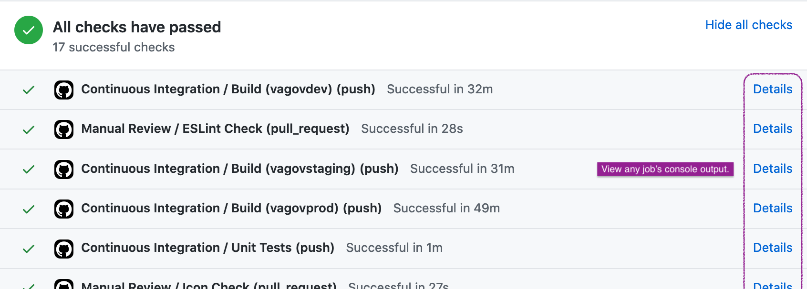

Alternatively, directly navigate to the "Checks" tab. To view a particular job's output, expand the workflow that contains it by clicking the chevron.

To view workflow statuses for previous commits in the PR, select a commit from the commit hash dropdown.

> 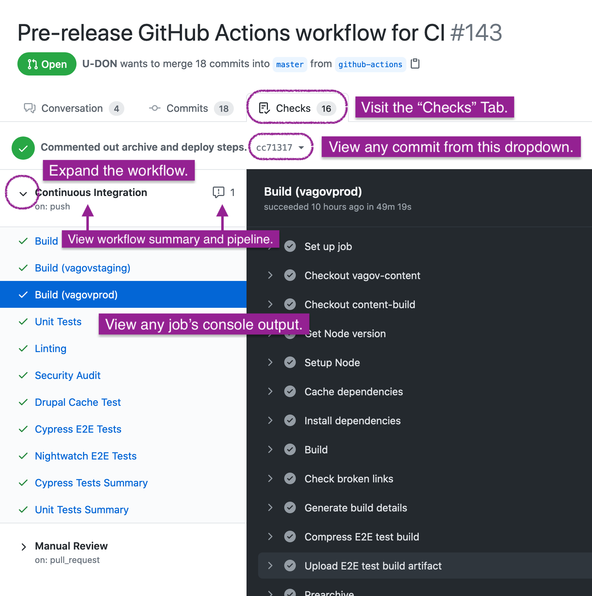

#### Commit statuses

Commit histories show icons to indicate the overall status of a commit.

Click on the icon and then click on "Details" of any job to view its console output.

> 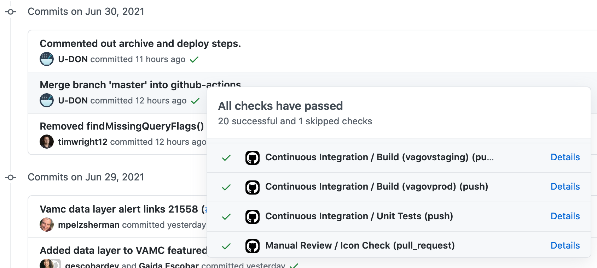

### Viewing the summary and pipeline visual for a workflow run

> 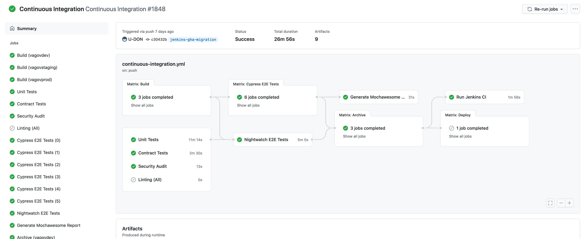

On the summary page of a workflow run, you can view a a graph of the pipeline to track its progress.

Each box or node in the graph represents a job or matrix of jobs. Each job will have an icon indicating the status.

To get to this page from the [view of all workflows for a commit](#viewing-all-workflow-statuses-for-a-commit), click on the workflow name.

#### Matrix jobs

A matrix represents a set of jobs that run the same steps with different variables. Variations are indicated in parentheses.

**Build for each environment**

> 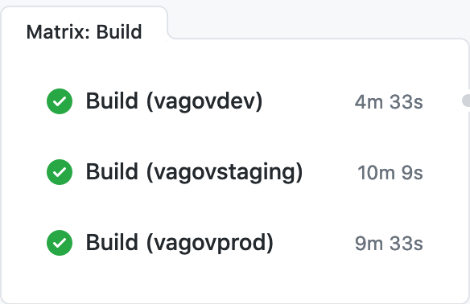

**Cypress tests split into smaller batches**

> 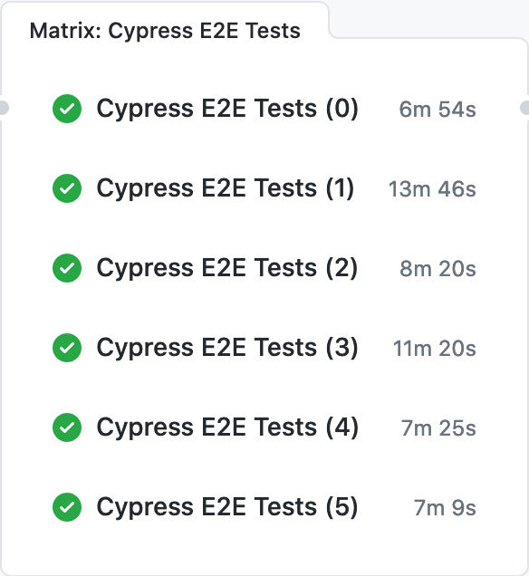

#### Job dependencies

Lines between jobs indicate dependencies. Jobs on the left of the line must run before those on the right.

Hover over a box to highlight the job and its dependency graph.

Lines can sometimes overlap, but the dependencies may become more apparent when hovering over the relevant jobs.

> 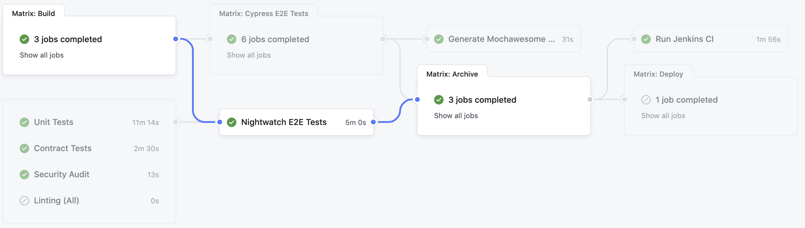

### Viewing workflow runs with the GitHub CLI

TBD

### Cancelling and re-running failed workflows

In either the [workflow statuses view for a commit](#viewing-all-workflow-statuses-for-a-commit) or the [summary page of a workflow run](#viewing-the-summary-and-pipeline-visual-for-a-workflow-run), you may cancel or re-run a workflow.

To cancel a workflow, click the button to "Cancel workflow".

> 

To re-run a workflow that has failed, expand the dropdown to "Re-run jobs" and click the button to "Re-run all jobs".

> 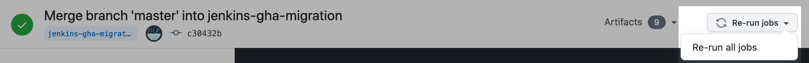

## Debugging Failures

In general, you may view the console log for details about any job execution. Some jobs generate additional information that may be useful.

### Linting

The linting job in the "Pull Request" workflow annotates any problematic areas in the changed code.

> 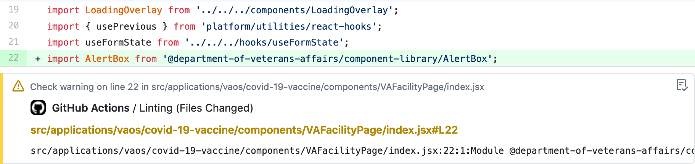

### Unit tests

Unit tests produce a "Unit Tests Summary" in the list of checks jobs the workflow.

It contains the following information:
- Number of tests run, skipped, and failed
- Annotations for any test failures
- Code coverage report

> 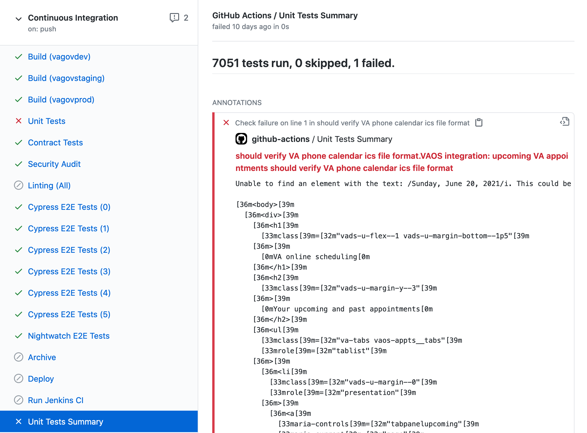

### Cypress E2E tests

Cypress tests produce a "Cypress Tests Summary" similar to unit tests.

> 

The summary contains the number of tests run, skipped, and failed as well as annotations for test failures.

There are more comprehensive test reports generated with Mochawesome.
- These are hosted in the Testing Reports repo with GitHub Pages.
- Links to the Mochawesome report are posted to the "Cypress Tests Summary" check.

There are also screenshot and video artifacts generated for any test failures.

> 

## Edge Cases

Commits can sometimes show multiple, seemingly duplicate, runs of a workflow (e.g., "Continuous Integration").

> 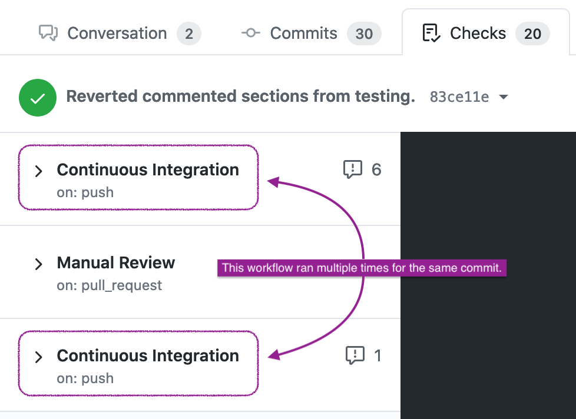

This happens when a branch is created from that commit and pushed without adding any new commits. As a result, the workflow is triggered by a push event for the same commit hash.

Navigating to the summary of the run should indicate which branch triggered the run.

> 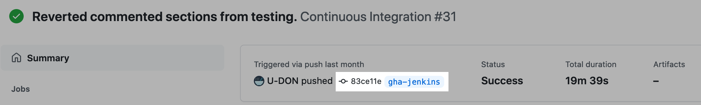
