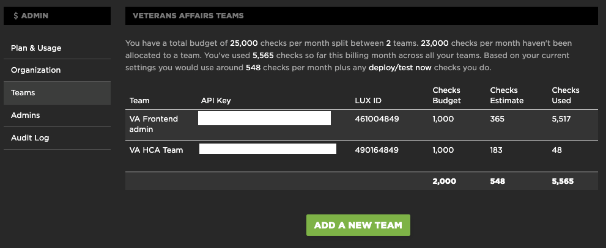
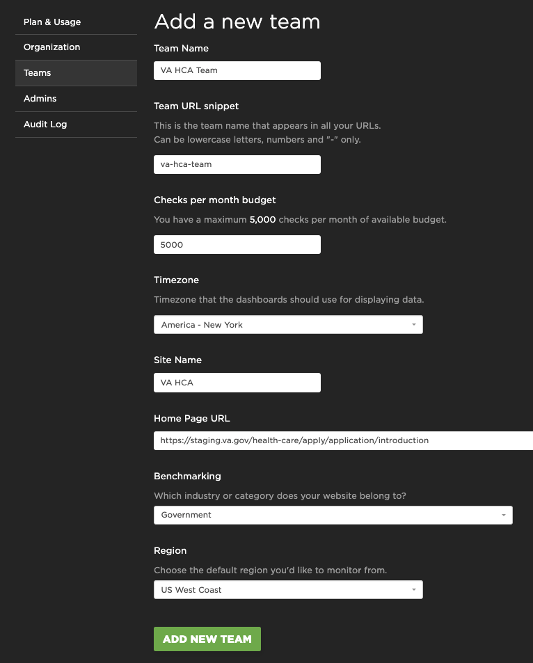
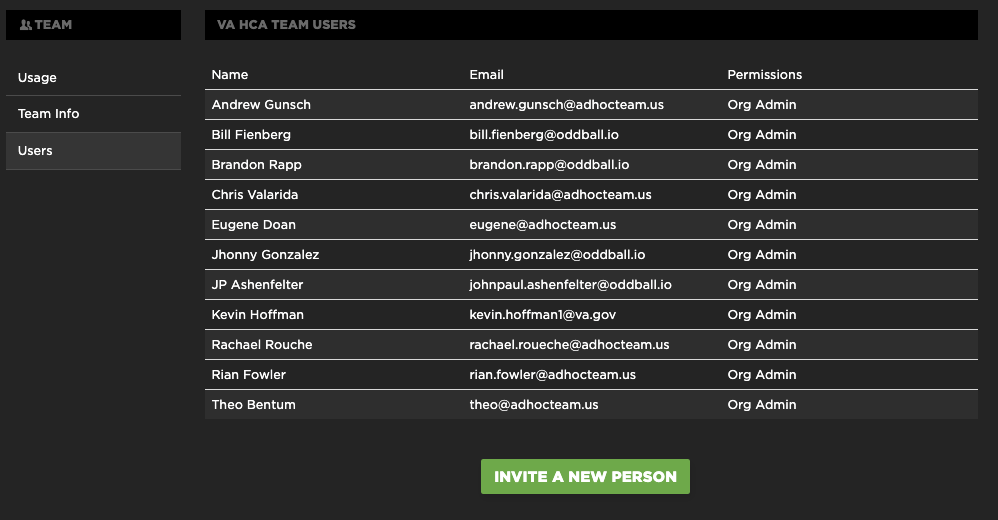
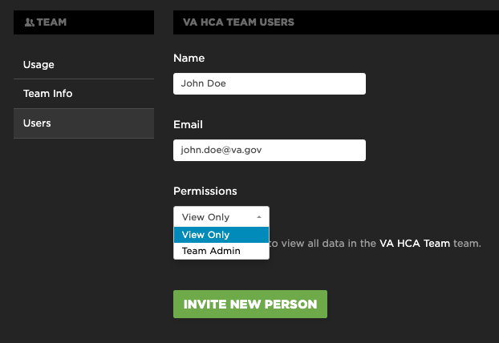
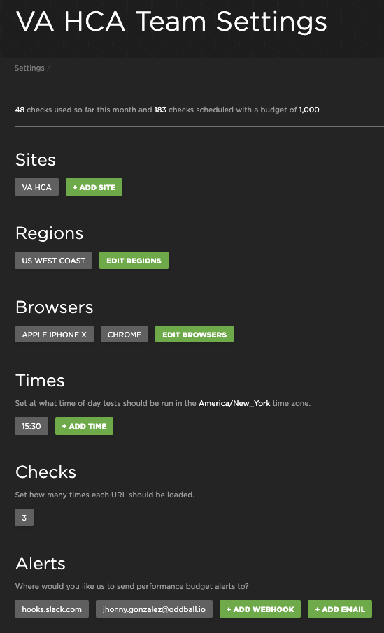
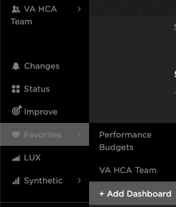
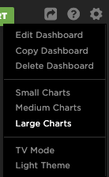

# Monitoring performance on VA.gov

----

# We're moving our docs! 
### Find [the latest version of this page](https://depo-platform-documentation.scrollhelp.site/developer-docs/Monitoring-Performance-on-va.gov.1846214727.html) on the Platform website.

### Still can't find what you're looking for? Reach out to [#vfs-platform-support](https://dsva.slack.com/archives/CBU0KDSB1) on Slack.

----

[SpeedCurve](https://www.speedcurve.com) provides insight into the interaction between performance and design to help Veteran-facing services (VFS) teams deliver fast and engaging user experiences.

SpeedCurve also provides performance feedback of each app such as page size and how long it takes to load a page, and can show you the impact new features have on the performance of the app.

SpeedCurve's dashboards provide various perspectives and options. VFS teams can define and monitor performance metrics across VA.gov, test performance in the context of continuous deployment, test responsiveness, and analyze assets. VFS teams can also set a performance budget so teams can see and track when the performance of the site lags.

With SpeedCurve, we can:

- Track dozens of metrics
- Create performance budgets and get alerts
- Diagnose performance issues at the page level (Provided with Google's Lighthouse & PageSpeed Insights audits, there is a list of performance rules, stacked and color-coded in their order of importance)
- Analyze the performance impact of ads and third parties

### Metrics

In order to track and monitor the performance budget for any specific metric, a custom chart needs to be added for each metric.

The front-end team recommends to create a chart for each of the following metrics:

| No. |          Metric          | Recommended Threshold |
| :-: | :----------------------: | :-------------------: |
|  1  |        SpeedIndex        |       3 seconds       |
|  2  |  First Meaningful Paint  |       3 seconds       |
|  3  |  First Contentful Paint  |       3 seconds       |
|  4  |   Time To Interactive    |       3 seconds       |
|  5  |    Start Render Time     |      2.5 seconds      |
|  6  |   Backend (TTFB) Time    |       1 second        |
|  7  |      Total Requests      |          60           |
|  8  |        Total Size        |        1500 KB        |
|  9  |       Blocking CSS       |           5           |
| 10  |       Blocking JS        |           5           |
| 11  |  Lighthouse Performance  |          40           |
| 12  |      Lighthouse PWA      |          30           |
| 13  | Lighthouse Accessibility |          90           |
| 14  | Lighthouse Best Practice |          70           |
| 15  |      Lighthouse SEO      |          80           |

[What do the different SpeedCurve metrics represent?](https://support.speedcurve.com/en/articles/74078-what-do-the-different-speedcurve-metrics-represent)

## Getting started

One user from each Veteran-Facing Services (VFS) team is designated as the administrator for the team. If you are designated as the administrator, you will receive an invitation via email to sign up for SpeedCurve.

Once you are signed in to SpeedCurve, perform the following tasks to configure your team's settings:

1. [Create a team](#create-a-team)
2. [Add team members](#add-team-member)
3. [Configure default settings](#default-settings)
4. [Dashboards](#dashboards)

- Creating the dashboard
- Configure the dashboard
- Metrics
- Adding Charts and performance budgets

### Create a team 

1. Go to `Admin` -> `Teams`
2. Click on `“ADD A NEW TEAM”`
3. Default settings:

|         Setting         |    Default Value     |
| :---------------------: | :------------------: |
|        Team Name        | VA `[App name]` Team |
| Checks per month budget |         1000         |
|        Timezone         |  America - New York  |
|        Site Name        |   VA `[App name]`    |
|      Home Page URL      |   `[App home URL]`   |
|      Benchmarking       |      Government      |
|         Region          |    US West Coast     |

### Add team members 

1. Go to `Team` -> `Users` (Make sure you are in the right team)
2. Click on `“INVITE A NEW PERSON”`
3. Default settings:

|   Setting   |                                                                                Default Value                                                                                |
| :---------: | :-------------------------------------------------------------------------------------------------------------------------------------------------------------------------: |
|    Name     |                                                                              `[Person’s name]`                                                                              |
|    Email    |                                                                             `[Person’s email]`                                                                              |
| Permissions | Team Admin -> Grants permission to view all data, modify settings, create shared dashboards, and invite new members to the specific team. There should only be 1 Team Admin |
|             |                                                    View Only -> Grants permission to view all data in the specific team.                                                    |

### Configure the default settings 

Upon the creation of a new team, the site settings need to be adjusted. These are the default settings:

| Setting  |               Default Value                |                                                          Comment                                                          |
| :------: | :----------------------------------------: | :-----------------------------------------------------------------------------------------------------------------------: |
|  Sites   |                 [App Site]                 |         This should be already included when the team was created. Multiple sites can be added for monitoring          |
| Regions  |               US West Coast                |                                                                                                                           |
| Browsers |         Apple iPhone X and Chrome          |                                                                                                                           |
|  Times   |                   15:30                    |                                                                                                                           |
|  Checks  |                     3                      |                                                                                                                           |
|  Alerts  | hooks.slack.com [app designated emails] | hooks.slack.com - used to integrate the alerts into slack [app designated emails] - used to email any alerts triggered |

## Dashboards 

### Creating the dashboard

Navigate to `Favorites` -> `Add Dashboard`

Default settings:

|       Setting       |       Default Value       |
| :-----------------: | :-----------------------: |
|   Dashboard Name    |   [App name] Dashboard    |
|   Team Visibility   | Visible to the whole team |
| Weekly Email Report |  [app designated emails]  |

### Configure the dashboard

The dashboard’s setting can be edited from the gear located in the upper right hand corner

### Metrics

In order to track and monitor the performance budget for any specific metric, a custom chart needs to be added for each metric.

The front-end team recommends to create a chart for each of the following metrics:

| No. |          Metric          | Recommended Threshold |
| :-: | :----------------------: | :-------------------: |
|  1  |        SpeedIndex        |       3 seconds       |
|  2  |  First Meaningful Paint  |       3 seconds       |
|  3  |  First Contentful Paint  |       3 seconds       |
|  4  |   Time To Interactive    |       3 seconds       |
|  5  |    Start Render Time     |      2.5 seconds      |
|  6  |   Backend (TTFB) Time    |       1 second        |
|  7  |      Total Requests      |          60           |
|  8  |        Total Size        |        1500 KB        |
|  9  |       Blocking CSS       |           5           |
| 10  |       Blocking JS        |           5           |
| 11  |  Lighthouse Performance  |          40           |
| 12  |      Lighthouse PWA      |          30           |
| 13  | Lighthouse Accessibility |          90           |
| 14  | Lighthouse Best Practice |          70           |
| 15  |      Lighthouse SEO      |          80           |

[What do the different SpeedCurve metrics represent?](https://support.speedcurve.com/en/articles/74078-what-do-the-different-speedcurve-metrics-represent)

### Adding Charts and performance budgets

1. Click on “ADD CHART”
2. Default settings:

|      Section       |       Setting       |         Default Value          |
| :----------------: | :-----------------: | :----------------------------: |
|     Chart Type     | Select a chart type |          Time Series           |
|    Data Source     | I want to plot the  |             median             |
|                    |  of these metrics   |         [Metric Name]          |
|  Filter the data   |        sites        |           [App Site]           |
|                    |     page labels     |        All page labels         |
|                    |      Browsers       |          All browsers          |
|                    |       Regions       |          All regions           |
| Performance Budget |    Budget metric    |         [Metric Name]          |
|                    | Absolute threshold  | [Metric recommended threshold] |

## SpeedCurve documentation

- [Get started with Synthetic monitoring](https://support.speedcurve.com/en/articles/946252-get-started-with-synthetic-monitoring)
- [Create performance budgets and set alerts](https://support.speedcurve.com/en/articles/1539827-create-performance-budgets-and-set-alerts)
- [Understanding Metrics](https://support.speedcurve.com/en/collections/21148-understanding-metrics)
- [SpeedCurve Synthetic API](https://support.speedcurve.com/en/articles/415403-synthetic-api)
- [Trigger tests using CircleCI](https://support.speedcurve.com/en/articles/992851-trigger-tests-using-circleci)
