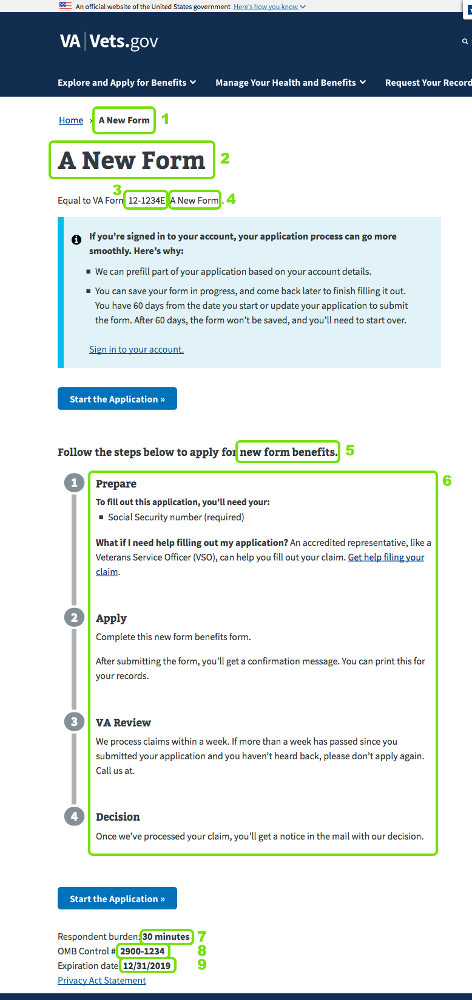
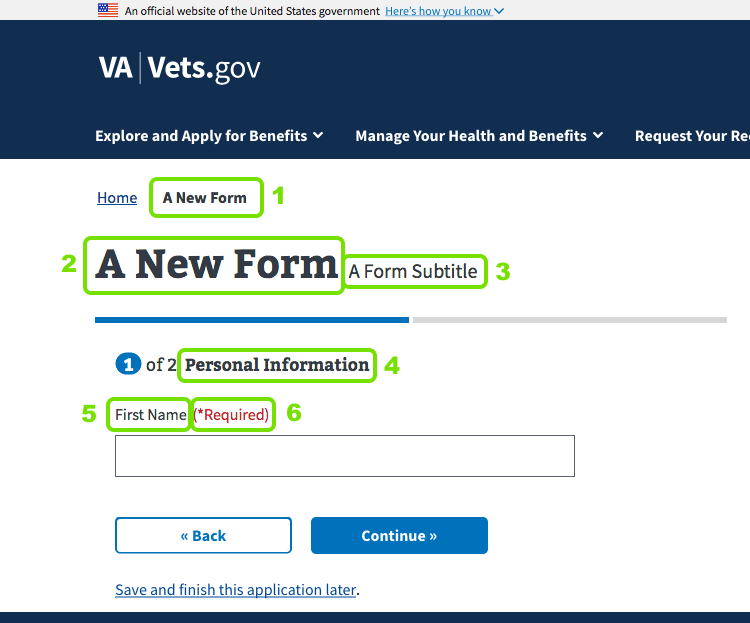
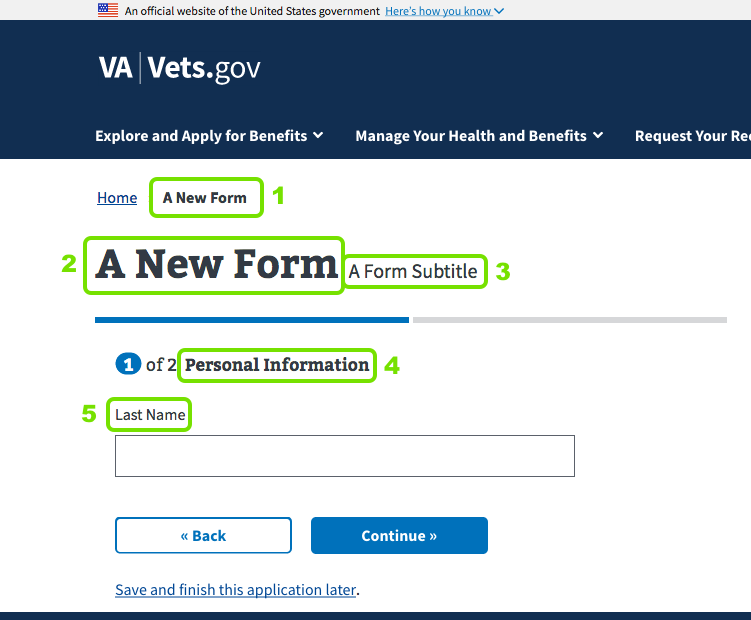
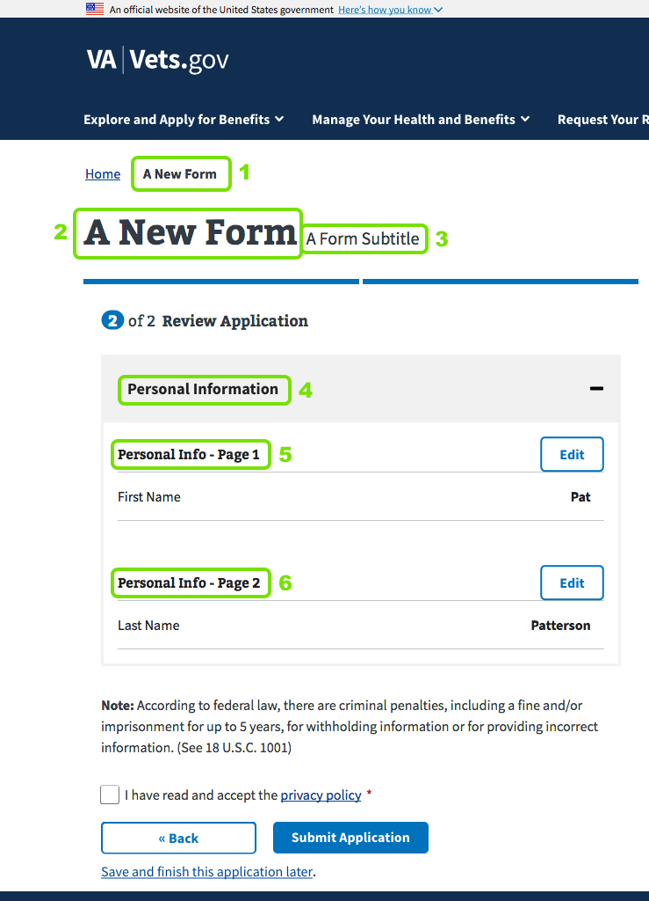

# Form Map - Where Does This Stuff Come From?

In this doc, we'll explain where the content you see on the form actually comes from. The file locations in this doc assumes you created a simple form using the Yeoman generator, saving the app in `new-form` and giving it a root URL of `/new-form` (questions 2 and 4 in the generator).

## Form Introduction Page

1. Form title in breadcrumb: `title` field in `content/pages/new-form.md`. This value also sets the web page's title in the browser tab/window.
2. Form title: The `FormTitle` component rendered by `src/applications/new-form/containers/IntroductionPage.jsx`. Initially set in the Yeoman generator.
3. Form number: Rendered by `src/applications/new-form/containers/IntroductionPage.jsx`. Initially set in the Yeoman generator.
4. Form title: Rendered by `src/applications/new-form/containers/IntroductionPage.jsx`. Initially set in the Yeoman generator.
5. Form benefits: The `SaveInProgressIntro` component rendered by `src/applications/new-form/containers/IntroductionPage.jsx`. Initially set in the Yeoman generator.
6. Subway text: Rendered by `src/applications/new-form/containers/IntroductionPage.jsx`.
7. Time burden: The `OMBInfo` component rendered by `src/applications/new-form/containers/IntroductionPage.jsx`. Initially set in the Yeoman generator.
8. OMB control number: The `OMBInfo` component rendered by `src/applications/new-form/containers/IntroductionPage.jsx`. Initially set in the Yeoman generator.
9. Expiration date: The `OMBInfo` component rendered by `src/applications/new-form/containers/IntroductionPage.jsx`. Initially set in the Yeoman generator.

## Chapter 1, Page 1

1. Form title in breadcrumb: *Same as above*
2. Form title: The `formConfig.title` property in `src/applications/new-form/config/form.js`. Initially set in the Yeoman generator.
3. Form subtitle: The `formConfig.subTitle` property in `src/applications/new-form/config/form.js`. The Yeoman generator does not set this by default.
4. Chapter title: The `formConfig.chapters.chapter1.title` property in `src/applications/new-form/config/form.js`.
5. Input field title: The `formConfig.chapters.chapter1.pages.page1.uiSchema` property in `src/applications/new-form/config/form.js`.
6. Required indicator: Shown because this particular field ID is included in the `formConfig.chapters.chapter1.pages.page1.schema.required` array.

## Chapter 1, Page 2

1. Form title in breadcrumb: *Same as above*
2. Form title: *Same as above*
3. Form subtitle: *Same as above*
4. Chapter title: *Same as above*
5. Input field title: The `formConfig.chapters.chapter1.pages.page2.uiSchema` property in `src/applications/new-form/config/form.js`.

## Form Review Page

1. Form title in breadcrumb: *Same as above*
2. Form title: *Same as above*
3. Form subtitle: *Same as above*
4. Chapter title: *Same as above*
5. Page title: The `formConfig.chapters.chapter1.pages.page1.title` property in `src/applications/new-form/config/form.js`.
6. Page title: The `formConfig.chapters.chapter1.pages.page2.title` property in `src/applications/new-form/config/form.js`.

> **NOTE:** Page titles are not shown on the review page if the chapter they belong to only has a single page.

Back: [Vets Website Forms in Production](forms-in-production.md)

Next: [Creating Form Schema](../../creating-form-schema.md)
