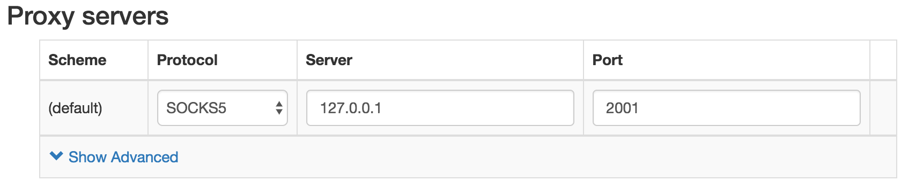
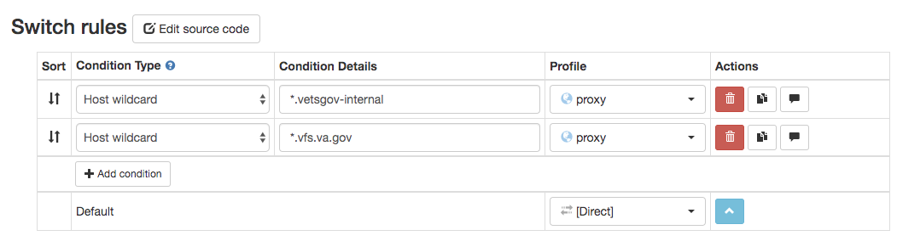
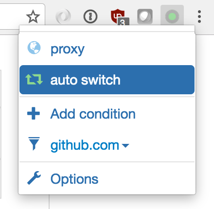
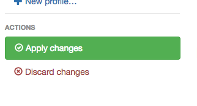

# Internal Tools Access

This document describes tools available internally to developers working on the Veteran-facing Services Platform and configuration required to access them. You'll need access to these tools if you need:

* Build logs and details from Jenkins (linked to from GitHub PRs for each project)
* System metrics for diagnostic/troubleshooting purposes
* Exception reports and tracebacks

These internal tools are available on the `vetsgov-internal` domain and are being transitioned over to the vfs.va.gov domain. The `vetsgov-internal` domain is **only accessible while your system is running a SOCKS proxy locally**, the other are available both on SOCKS and on the internal VA network. Your SOCKS proxy will tunnel traffic over a secure channel to vets.gov servers, providing access to:

| Name                 | vetsgov-internal link                            | vfs.va.gov link           |
|----------------------|--------------------------------------------------|---------------------------|
| Jenkins              |                                                  | http://jenkins.vfs.va.gov |
| Grafana              |                                                  | http://grafana.vfs.va.gov |
| Sentry               |                                                  | http://sentry.vfs.va.gov  |
| Prometheus (dev)     | http://prometheus-dev.vetsgov-internal:9090/     | NA                        |
| Prometheus (staging) | http://prometheus-staging.vetsgov-internal:9090/ | NA                        |
| Prometheus (prod)    | http://prometheus-prod.vetsgov-internal:9090/    | NA                        |
| Prometheus (utility) | http://prometheus-utility.vetsgov-internal:9090/ | NA                        |

You do not need to run the SOCKS proxy while you're developing unless you need access to one of the above tools.

<hr>

## Table of Contents

* [Design Rationale](#design-rationale)
* [Create SSH public key](#create-ssh-public-key)
* [Configure the SOCKS proxy](#configure-the-socks-proxy)
* [Test and use the SOCKS proxy](#test-and-use-the-socks-proxy)
* [Tools](#tools)
* [FAQs](#faqs)

<hr>


> These steps assume you're running on Linux or OSX. There are slightly different commands to connect to the proxy depending on whether you are connected to the VA network or not. You will need to run the SOCKS proxy on your local system whenever you need access to tools on the `vetsgov-internal` domain.

## Design Rationale

Some utilities, such as metrics dashboards, error reporting, and deployment
tools should not be made available to the public. While such a utility may lock
functionality behind a user login system, these vary among implementations and
may be vulnerable to exploits. Additionally, due to the difficulty of creating
subdomains for vets.gov, it may be problematic to host some of these utilities
when they do not support relative path installations.

The preferred solution is to host these systems on an internal network that
prevents public access. While the VA maintains an internal network, the vets.gov
team operates within the AWS environment. Installation of a utility like this on
the VA network would require additional authority to operate extensions,
a server within the VA, and mapping new connections from AWS to the VA. Since
these tools are for use exclusively by the vets.gov services installed within
AWS, utilizing the VA's internal network is both unnecessary, more complex,
time intensive, and would likely impact performance of the utility and
application requiring it.

To address this issue we've configured an internal DNS server which can be
accessed via a SOCKS proxy. The SOCKS proxy is a server on your local system
which tunnels HTTP and DNS traffic to a jumpbox on the vets.gov AWS network.
Once connected, a developer will have access to the `*.vetsgov-internal` TLD,
and can use their browser to connect to tools such as prometheus.

Internal systems will not require any modification to connectivity, and should
communicate with the utilities directly. They may use a `/etc/hosts` entry for
the corresponding `*.vetsgov-internal` address when necessary.


## Create SSH public key

If you don't already have a SSH public key, or you're not sure if you do,
here are the steps to create one:

1. First run the following command in your terminal: `cd ~/.ssh`. If this command returns the following error message, `cd: no such file or directory`,
  you will need to create a .ssh directory by following these steps:
    1. Create the directory by running `mkdir ~/.ssh`.
    2. Run `chmod 700 .ssh`. This sets the permissions on that directory to readable
  only by you since it has your private keys.
    3. Once the directory exists, cd into that directory by running `cd ~/.ssh`.

2. Once you have cd-ed into `~/.ssh`, check to see if you already have your SSH keys by running `ls`. 
    * If you see `id_rsa_vetsgov` and `id_rsa_vetsgov.pub` returned, you already have your keys and you can skip steps 3 and 4. 
    * If you don't see `id_rsa_vetsgov` or `id_rsa_vetsgov.pub` continue onto the next steps.

3. Run the following command `ssh-keygen -f id_rsa_vetsgov` to generate your public and private keys. It will prompt you for a passphrase; you should enter a secure passphrase to protect your private key.

4. Run `ls ~/.ssh` and confirm that you see `id_rsa_vetsgov` and `id_rsa_vetsgov.pub`. It's normal to see several other files, as well. Seeing `id_rsa_vetsgov` and `id_rsa_vetsgov.pub` means you now have your private and public (the one with the `.pub` extension) keys! Your private key should never leave your computer, and it's unnecessary and inadvisable to share it with anybody.

5. Confirm everything went well:
    * You will have a subdirectory in your home directory `~/.ssh`
    * This subdirectory has restrictive permissions `0700`
    * In this subdirectory you will have two files, `id_rsa_vetsgov` and `id_rsa_vetsgov.pub`.
    * Got it? --> Back to [Orientation for Developers](https://github.com/department-of-veterans-affairs/va.gov-team/blob/master/platform/working-with-vsp/orientation/request-access-to-tools.md#additional-steps-for-developers)

## Configure the SOCKS proxy

These steps assume you're running on Linux or OSX. There are slightly different commands to connect to the proxy depending on whether you
are connected to the VA network or not. You will need to run the SOCKS proxy on your local system whenever you need access to tools on the
`vetsgov-internal` domain.

1. [Follow this process](https://github.com/department-of-veterans-affairs/va.gov-team/blob/master/platform/working-with-vsp/orientation/request-access-to-tools.md) to have your new SSH key added to the list of authorized SSH keys.
    * When your SSH key has been added, you will receive a Github notification that your key has been added. Once you receive the notification, continue with the steps below.

1. Copy down the SSH configuration that you'll need locally to access the remote SSH servers.
    * Visit https://github.com/department-of-veterans-affairs/devops/blob/master/ssh/config
    * Click the "Raw" button, and copy the URL that's in your browser.
1. Run `curl URL > ~/.ssh/config`, where URL is the URL that you copied in the previous step. This will overwrite any existing ssh config without warning; please back up any existing file if it exists.

1. Add your SSH key to your local agent with `ssh-add -K ~/.ssh/id_rsa_vetsgov`

1. Proceed to the instructions below to access the SOCKS proxy.
    * If your key doesn't seem to be working, ask for help in the *#vfs-platform-support* Slack channel


#### Accessing SOCKS proxy from VA network

The `~/.ssh/config` file on your local system contains configuration to access the SOCKS proxy from the VA network - see [Line 34 here](https://github.com/department-of-veterans-affairs/devops/blob/master/ssh/config#L34)

1. Run `ssh socks-va -D 2001 -N &`
   _Note: the first time you connect to the jumpbox, ssh will prompt to ask 
   if you are sure you want to connect to a new host. You will be unable to 
   respond "yes" if ssh is in the background, so either bring it to the 
   foreground with `fg` or omit the `&` character from the above command._

1. Follow the instructions below to test and use the SOCKS proxy.

#### Accessing SOCKS proxy from the internet

The `~/.ssh/config` file on your local system contains configuration to access the SOCKS proxy from outside the VA network - see [Line 28 here](https://github.com/department-of-veterans-affairs/devops/blob/master/ssh/config#L28)

1. Run `ssh socks -D 2001 -N &`
   _Note: the first time you connect to the jumpbox, ssh will prompt to ask 
   if you are sure you want to connect to a new host. You will be unable to 
   respond "yes" if ssh is in the background, so either bring it to the 
   foreground with `fg` or omit the `&` character from the above command._

1. Follow the instructions below to test and use the SOCKS proxy.


## Test and Use the SOCKS proxy

Use the following steps to verify that the proxy connection is working, and to configure your
browser to use the proxy connection. Note that the proxy only allows access to our internal
tools, not to the internet at large. So you need to configure your browser to either use the proxy
only for the `vetsgov-internal` and `vfs.va.gov` domains (as described below for Chrome); enable/disable the proxy
connection as needed; or use a separate browser for accessing the internal tools vs. for general
use.

### Curl

To test your proxy connectivity, the best option is to run the following command:

`$ curl -v --proxy socks5h://127.0.0.1:2001 sentry.vfs.va.gov`

You should get output that includes `HTTP/1.1 302 FOUND`. If not, check that the
SOCKS proxy server is running. You can `$ nc -z 127.0.0.1 2001` as a first step.

### Chrome & Firefox

1. Install Proxy SwitchyOmega

   https://chrome.google.com/webstore/detail/proxy-switchyomega/padekgcemlokbadohgkifijomclgjgif
   https://addons.mozilla.org/en-US/firefox/addon/switchyomega/

1. Configure the `proxy` profile like this:

   

1. Configure the `auto switch` profile like this:

   

1. In Chrome's menu bar, click on the proxy app and change the setting to 'auto switch':

   

1. Be sure to hit the Apply Changes button to save your changes!

   

1. NOTE: You may have to uncheck a settings flag in Chrome, see

   https://github.com/FelisCatus/SwitchyOmega/wiki/DNS-and-SOCKS-proxy

1. Check your connection by navigating to Sentry at http://sentry.vfs.va.gov.

### Socks script
An alternative to SwitchyOmega is to use [the `socks` script](https://github.com/department-of-veterans-affairs/va.gov-team/tree/master/scripts/socks). The `socks` script loads your key into the ssh agent, starts the socks proxy, and sets up your system to proxy only URLs that require the proxy. It has the advantage of not requiring any 3rd party extensions, and it works with Chrome and Firefox browsers.

## Tools

### Jenkins

With the Socks proxy set up and running, go to http://jenkins.vfs.va.gov. You can see the builds without logging in, but will need to authenticate (with GitHub OAuth) to re-run failed builds. 

### Sentry

With the Socks proxy set up and running, go to http://sentry.vfs.va.gov. You can signin in using your GitHub account by clicking the "GitHub" button on the login page. Once logged in, you can add yourself to the appropriate teams.

We do not really use Sentry teams except to separate production, staging, and dev errors. To view the most recent production errors, which is the most common thing to do while on call, go to http://sentry.vfs.va.gov/vets-gov/platform-api-production/

### Grafana
With the Socks proxy set up and running, go to http://grafana.vfs.va.gov/login. You can sign in using your GitHub account by clicking the "GitHub" button on the login page.

There are many dashboards and you should click around to get familiar with the variety of metrics being collected and visualized (make sure Data Source is set to Production). A few highlights are:

- [Site](http://grafana.vfs.va.gov/dashboard/db/site) to see overall metrics about the health of the site
- [External Service Status](http://grafana.vfs.va.gov/dashboard/db/external-service-status) to see the availability of the services vets.gov depends on. 
- [RDS](http://grafana.vfs.va.gov/dashboard/db/rds) to see the database statistics. 
- [Rev Proxy](http://grafana.vfs.va.gov/dashboard/db/revproxy) to see metrics on the reverse proxies. 


## FAQs

#### "Permission denied - public key" error when pushing to Github

1. Has your public SSH key been added to the list of authorized SSH keys? 
    * **Platform team** - Check the list of authorized keys in the [devops repo](https://github.com/department-of-veterans-affairs/devops/tree/master/ansible/roles/dsva-config/files/authorized_keys). If it's not there, [follow the process above](https://github.com/department-of-veterans-affairs/va.gov-team/blob/master/platform/engineering/internal-tools.md) to adding it.
    * **VFS teams** - You will receive a Github notification once your key has been added to the authorized list. If it's been more than 72 hours, check with your DSVA contact.
1. Does your .ssh/config contain the correct content?
    * Config for working [within the VA network](https://github.com/department-of-veterans-affairs/va.gov-team/blob/master/platform/engineering/internal-tools.md)
    * Config for working [outside the VA network](https://github.com/department-of-veterans-affairs/va.gov-team/blob/master/platform/engineering/internal-tools.md)
1. Have you added your private key to your local ssh agent?
    * run ```ssh-add -K ~/.ssh/id_rsa_vetsgov```
1. Are you running the correct command for ```sock``` vs ```sock-va``` depending on whether you are on or off the VA network?
    * [Within the VA network](https://github.com/department-of-veterans-affairs/va.gov-team/blob/master/platform/engineering/internal-tools.md)
    * [Outside the VA network](https://github.com/department-of-veterans-affairs/va.gov-team/blob/master/platform/engineering/internal-tools.md)
    

#### ```ssh sock -D 2001 -N``` failing

1. **Platform team** - Does your ```.ssh/config``` contain the right content?
    * **Platform team** - [see here](https://github.com/department-of-veterans-affairs/devops/blob/master/ssh/config) 
    * **VFS teams** - see [Step #2 here](#configure-the-socks-proxy)
2.  Is your ssh private key added to your local ssh agent? To add it run ```ssh-add -K ~/.ssh/id_rsa_vetsgov```


#### Page not loading on the vfs.va.gov domain

We previously had an issue where va.gov HSTS settings were incorrectly forcing browsers to use HTTPS on all subdomains. While this is correct from an external perspecitve, some internal tools aren't available on HTTPS yet. Browsers may silently redirect you to https. See [here](https://cheapsslsecurity.com/blog/hsts-chrome-firefox-clear-hsts-settings/) for details on how to disable on your browser of choice.
