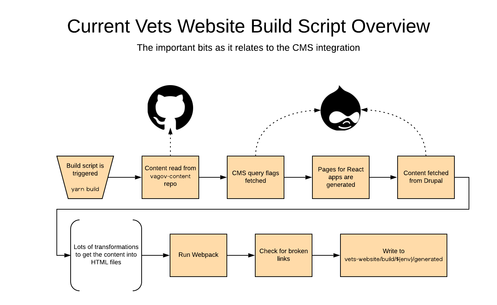
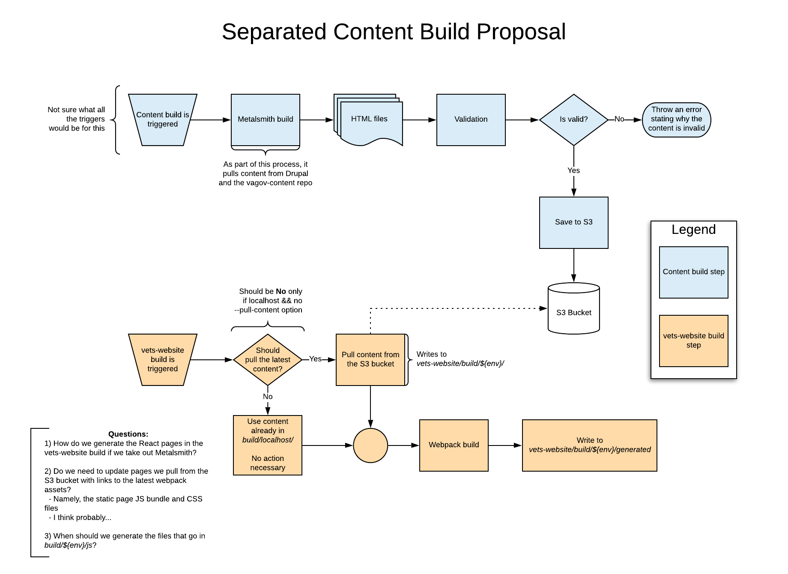

# RFC: CMS Integration

- Date: _2019-09-30_
- Related Issue:

## Motivation
When any new commits are pushed to a `vets-website` branch, a full
Jenkins build is triggered. This build attempts to fetch the latest
content and do some content validation (see [Content
Validation](#content-validation) for details). This means that **two
subsequent builds can fail for reasons not introduced in the code.**

The biggest example of this is when the `master` branch build fails
due to broken links, which will halt the deploy. **Broken links
prevent unrelated features in React applications from being
deployed.**

**Example**
1. Somebody merges a branch into `master`
1. A full Jenkins build is triggered, which then passes
1. A broken link is introduced in the CMS
1. Somebody else merges a branch into `master`
1. A new full Jenkins build is triggered
1. The Metalsmith script queries for the latest content with the
   broken link
1. Because of this latest content, the `vets-website` `master` build
   fails, but not because of any changes in `vets-website` code

The goal of this RFC is to determine an approach for separating the
content build from the `vets-website` Webpack build, so when
`vets-website` pulls the content to serve up, it's already been built
and validated. **Build failures due to content issues will be isolated
to the content build and will not affect `vets-website` builds or
deploys.** This will improve the overall stability of the
`vets-website` CI.

## Background
The current `vets-website` build script looks like this.

### Glossary
This RFC will use the following terms. These terms may or may not be
used outside of this RFC.
- Full Jenkins build
  - All branches are build using this pipeline (including `master`)
  - This attempts to pull all CMS content, but will fall back to the
    cache if necessary
  - This builds JavaScript and CSS assets
    - For the build of the `master` branch, these assets are saved in
      S3
  - Runs the full suite of unit, e2e, and accessibility tests
- Content-only build
  - Used in a content-only deploy
  - Attempts to pull the latest CMS content
    - Will not fall back to the cache
  - Uses the JavaScript and CSS assets from the latest full build
  - Runs a limited suite of tests
- React app landing page
  - An HTML file used as the landing page for a React application
  - Has the normal header and footer
  - Points to the appropriate assets for the application

### Metalsmith
Currently, `vets-website`'s build is managed by Metalsmith, a
plugin-based static site generator. Metalsmith uses a number of custom
plugins used to manipulate the static content in various ways. One
such plugin fetches the content from Drupal if we pass the
`--pull-drupal` flag to the build script (`yarn build --pull-drupal`)
or if the local cache isn't found. Another plugin checks for broken links,
etc.

This build script is run in a number of ways:
- The Jenkins pipeline for a full build
- The Jenkins pipeline for a content-only build
- Locally, with `yarn build` or `yarn watch`

Separate, but related, the [preview
server](https://department-of-veterans-affairs.github.io/veteran-facing-services-tools/platform/architecture/cms/#preview-server)
has a modified version of the Metalsmith build (`yarn preview`). This
is used for content editors to see how their changes show up on the
site.

Having a Metalsmith build script came from a time when `vets-website`
had a `content/` directory from which the static pages were
built. These days, however, all of the content comes from outside
`vets-website`.

### Content validation
Some basic validations are performed on the content from the CMS and
vagov-content repo.

| Validation | Full build | Content-only build | Preview server |
| ---------- | ---------- | ------------------ | -------------- |
| Broken link checking | True; will fail the build on the `master` branch only | True; will fail the build | False |
| Accessibility | True; will fail the build | True; will fail the build | False |

The Metalsmith script performs the check for broken internal
links. This happens before the accessibility tests in the Jenkins
build pipelines.

When broken links are discovered during a full Jenkins build, we send
a Slack notification with a link to the build. If Jenkins was building
the production (`master`) branch, the build will also fail, to prevent
broken links in production.

Accessibility tests run the aXe checker on all pages found in the
sitemap. Whenever the accessibility check fails, the Jenkins build
fails. This happens after the content build and link checker.

## Design
I propose rearchitecting the `vets-website` build to separate the
static content building into a process distinct from the website.

**Note:** Pulling the already-built content _can still_ have two
different results, much like the current state, but since the content
it's pulling will have already been validated, the likelihood of a
failure is drastically reduced.

### Changes
- The `vets-website` build script will no longer build the content
  - **Possible exceptions:**
	- We may need to update some things in the
	  pre-built content such as references to the new cache-busted
	  filenames for JS and CSS assets
	- It should still be responsible for building the pages for React
	  apps, which would need to have the surrounding markup come from
	  the templates
- There will be a new repo for the content build process
  - This will include scripts and templates
- There will be a new Jenkins pipeline for building the content
  - And everything that goes with this
- There will be a (new?) S3 bucket which holds all the built content
  - We currently do this with the cache, so this isn't much of a
    deviation
- The preview server will live in the new content-building repo
- Sitemap accessibility tests will be done during the content build,
  not the `vets-website` build
- The `vets-website` Jenkins build will have the following changes
  - There will be no cache fallback
  - There will be no content caching
  - There will be no sitemap accessibility testing
  
### Serving React apps
`vets-website` should be responsible for making the pages where the
React apps live, but not responsible for building the header, footer,
and other surrounding markup. To make this possible, **I propose we
have the content build produce an empty React app landing page
template which the `vets-website` build script can use to make landing
pages for each React application.** The `vets-website` build script
would then update the landing page with references to the correct
JavaScript bundle and CSS files to bootstrap the application.

The empty React app landing page would then be deleted or otherwise
prevented from being served to production.

### Beneficial side effects
- The `vets-website` build will be faster both locally and in Jenkins
  - Because the build script wouldn't perform any transformations on
    the content, this would save about half the build time for
    developers on their local machines (~20s)
	- Assuming the cache and the `localhost` buildtype are used
  - All the assets from Drupal (PDFs, JPEGs, etc.) will be bundled up
    in the single content tarball, so instead of making 475 individual
    requests (as of the time of this writing), there will be only a
    single request
	- Saving upwards of 40 - 50 seconds
	- Saving all the unchanged assets again and again into S3 is not
      ideal
  - When querying for the latest content, the separated build approach
    would save upwards of a full minute on `vets-website` builds since
    it wouldn't have to wait for Drupal to parse the _massive_ GraphQL
    query, put to gether the result, and send back the multi-megabyte
    response
  - The full Jenkins build on `vets-website` would no longer perform
    the sitemap accessibility tests, which may speed it up
	- Since these tests are performed in parallel with the normal e2e
      tests, it's unclear
	- These tests will still be run—just in the content build because
      it's a content concern
- `vets-website` will be isolated from any changes to the way content
  is built
  - Example 1: Rather than querying for all the content at once, the
    build could query for only the _new_ content
  - Example 2: Whoever manages the content build in the future can
    decide to skip any pages with broken links, and `vets-website`
    won't be burdened with the complexity of that decision
	  
### How this would affect the CMS team
I _think_ the impact would be minimal. Rather than using the full
`vets-website` in their integration environment, they'd use the new
content building repo.

The CMS team can also trigger a content-only deploy from inside
Drupal. If this is done before the latest content build is finished,
the deploy may not have all the latest changes.

## Risks
- The current integration is _so_ complex; it would be easy to
  overlook something while implementing the changes

## Questions
- Who owns the content build repo?
  - The CMS team?
  - VSP?
  - Global UX
    - Given their relationship with the content, this may make the most sense
- Who owns managing the content build Jenkins pipeline?
  - The same team that owns the repo?
- What triggers a content build?
  - Could be a daily job
  - Could be triggered manually from inside Jenkins or even Drupal

## Alternatives
### Keep on keeping on
We could change nothing.

The problem here is that `vets-website` deploys will be blocked for
non-`vets-website` issues. As we scale both the platform and usage of
the CMS, we'll have to coordinate with the CMS team and content
editors a _lot_ to resolve issues since it will affect VFS teams.

### Allow bad content
Where "bad content" is defined here as broken links and accessibility
issues in the content from CMS or the `vagov-content` repo.

The problem with this is the degraded experience for Veterans.

### Output HTML files directly from Drupal
I don't know what the level of complexity for this would be.

I'm not proposing this for now simply because there's nothing I can do
about it. From the `vets-website` perspective, pivoting from this
proposal of a separate content building repo to having Drupal output
HTMl files directly would be nominal.
