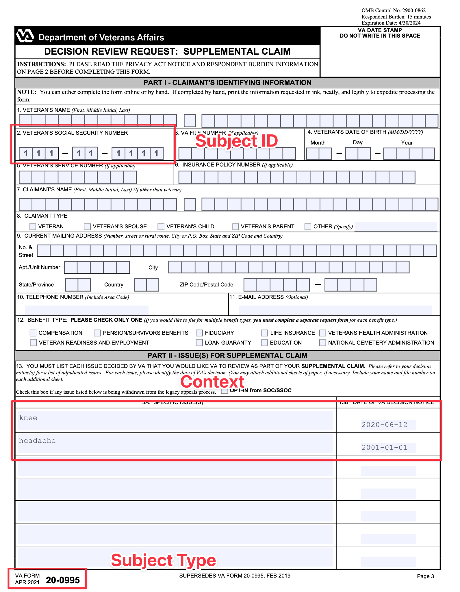

# RFC: Tracking Submissions from Origin to Destination

- Date: 2024-10-03
- Related Issue:

## Table of Contents

- [RFC: Tracking Submissions from Origin to Destination](#rfc-tracking-submissions-from-origin-to-destination)
  - [Table of Contents](#table-of-contents)
  - [Background](#background)
  - [Definitions](#definitions)
  - [Motivation](#motivation)
  - [Design](#design)
    - [Unique and Deterministic](#unique-and-deterministic)
    - [Format](#format)
    - [Content](#content)
      - [Common Items](#common-items)
        - [Submission Type](#submission-type)
        - [Submission Subject ID](#submission-subject-id)
      - [Submission Context](#submission-context)
    - [Generating the ID](#generating-the-id)
      - [Normalization](#normalization)
      - [Concatenation](#concatenation)
      - [Hashing](#hashing)
  - [Full Example](#full-example)
    - [Other Submissions](#other-submissions)
  - [Risks](#risks)
    - [Types](#types)
    - [Duplicates](#duplicates)
    - [Context Changes](#context-changes)
      - [Format Changes](#format-changes)
      - [Context Loss](#context-loss)
  - [Alternatives](#alternatives)
    - [Random IDs](#random-ids)
    - [Central ID Map](#central-id-map)
  - [Additions](#additions)
    - [Origin](#origin)
    - [ID Encoding](#id-encoding)


## Background

Submissions are any data provided by veterans/users that are collected, generated, stored, and sent in many different ways across products/services.

In order to provide a holistic view of these submissions as they travel from system to system on their way to a final destination, we need a way to track each item uniquely and consistently. Ideally, this system is resilient to unexpected gaps or loses, as well as support systems that cannot change or be updated.

## Definitions

**Submissions**: A combination of Forms and other Documents that represents a veteran's intent to communication with the VA. This can be by submitting a Form, attaching evidence, or any other form of official communication that requires traversal through multiple systems.

**Forms**: A product for VA.gov that represents completed form (or the data representing the form) for transmission and use by the VA. A list of VFS Product Forms can be found [here](https://depo-platform-documentation.scrollhelp.site/getting-started/vfs-product-directory)

**Evidence**: Any document uploaded by a user, that vets-api is responsible for transmitting down- or up- stream. Examples could include a medical document, buddy statement, scanned-in filled-out form, digitally filled-out form, and other various documents.

**Ancillary Document**: Any document that has an official VA designated form number, that we fill-out and transmit somewhere, based on information the end-user enters into the frontend. Depending on the form/situation, the end-user may or may not know they filled this form out, or that one was filled out on their behalf. Examples include form 21-4142, form 21-0781, and other forms that we take information and stamp onto a PDF to transmit.

**Documents**: May be used to refer to both evidence and ancillary documents collectively.

**PII**: Personally Identifiable Information. Information with this designation must be protected from view by any unauthorized groups.

**PHI**: Protected Health Information. Any information subject to the privacy protections and patients’ rights provisions of the HIPAA Privacy Rule.

## Motivation

- Provide a way to track unique submissions from system to system
- Allow for transition time for systems that cannot be updated quickly
- Can recover from errors or gaps in tracking
- Should not be considered PII/PHI (but may use PII/PHI in its generation)

## Design

The main design is to generate a unique ID for each submission, regardless of type that can persist between all systems the submission will travel. In order to support systems that cannot or will not be updated to accept and work with this ID, it should be deterministic based on the content of the submission. This allows systems that are aware of the ID to "regenerate" the ID or corelate that system's ID to this unique ID.

A reference implementation for this thought experiment would be a Reporting/BI service would collect information about submissions from each system. This service would attempt to track a submission between these systems. In order to do so, it will need a way to associate records from each system to a unique submission. Using the ideas in this paper, the Reporting service would be able to either:

- Use the generated Submission ID, if it's available from the reporting service
- Generate the Submission ID from the content of the submission, if it's not available from the reporting service

### Unique and Deterministic

A globally unique ID must be generated for each submission. This ID should be deterministic such that the same submission should result in the same ID. This should be independent of time or place, allowing the ID to be generated or regenerated successfully at any point in the submission's lifecycle.

### Format

An ID should have the following qualities:

- Consistent length
- Resistent to collisions
- Deterministic
- Does not communicate data or qualities used to generate the ID

Given these qualities, a [Hash Function](https://en.wikipedia.org/wiki/Hash_function) is a good fit.
The size of the resulting hash should provide enough address space to handle a large number of submissions over the lifetime. I recommend a minimum of 256 bits to give ample room.

Given this, I think the common [SHA2](https://en.wikipedia.org/wiki/SHA-2) hashing algorithm with a 256 bit digest will provide the best combination of speed, size, and common usage across multiple languages and services.

### Content

Now that we have criteria set, the question becomes What do we hash?

#### Common Items

Some items will be common between all submissions types and therefor always included in the hash.

##### Submission Type

Each type of submission should have a unique name, referenced in a global space. This could be a registry or a simple location where submission types could be declared/registered for common use.

Defining these could be its own RFC but a basic description would be a list of Submission Types and their IDS in a tabular format:

|    Submission Type     |           ID           |
| :--------------------: | :--------------------: |
|    VA Form 20-0995     |    va_form_20-0995     |
|    VA Form 20-0996     |    va_form_20-0996     |
| VA Evidence Submission | va_evidence_submission |
|          etc           |          etc           |

Ideally Submission Type IDs should be pre-normalized however this can also be handled during the normalization step of the ID generation.

##### Submission Subject ID

Submissions should be tied to a subject, be it a Veteran, Dependent, Representative, etc. The assumption is that all items tracked should be related to a singular subject. The submission should have some form of identifier as part of its content and we can use that identifier to both increase its uniqueness as well as deterministically identify it in a global space.

Every submission is different but the assumption is that the Subject ID is considered PII by definition.

Examples of Subject IDs:

- Social Security Numbers (SSN)
- Integration Control Number (ICN)

This subject ID may be a combination of data in order to make it unique. This can be used in cases where there is no singular element that uniquely identifies the subject.

Examples of Combination Subject IDs:

- First Name + Last Name + Birth Date

Subject ID does not necessarily need to be globally unique (in the above example, there can be cases where someone with the same first/last name could be born on the same date) but it has to be enough such that when combined with other data it becomes unique.

#### Submission Context

With the common items identified, we now turn to what makes that submission unique in the namespace of the combination of the Submission Type and Subject ID. This value will be a function of the submission type, with the subject matter experts(SME) having to define what makes that submission unique from another submission of the same type by the same subject. The SME must identify that if the same veteran submits the same form/item twice, what makes one submission unique from the other?

The Submission Context can only use values present in the submission, in order to be able to regenerate that Submission ID at any point in the submission life cycle. This could mean adding data (such as a salt) to the submission if there is no way to identify a difference between two submissions. This ideally is a rare scenario.

The Submission Context should be the minimum amount of data needed to be considered unique. Sometimes that might be the entire submission, which is valid, but every effort should be made to use the least amount of data.

Examples:

- For a Supplemental Claim, this could be a list of contentions and their decision dates
- For a Buddy Statement, this could be the contents of the statement

### Generating the ID

The ID should be generated by concatenating the normalized Content Elements.

#### Normalization

The normalization process is used to remove any unintentional variability that could be introduced. The variability should not change the meaning of the content but simply prevent meaningless mismatches. This can include mismatch in case, white space, diacritics, encoding, etc.

The following steps should be taken to normalize the Content:

1. UTF-8 Normalization: All characters should be UTF-8 and run through [Normalization Form Canonical Composition(NFC)](https://en.wikipedia.org/wiki/Unicode_equivalence#Normalization)
2. Replace all Accents and Diacritics with common alphabetic equivalents (`garçon` -> `garcon`)
3. Trim all whitespace characters from the start and end (` foo ` -> `foo`)\*
4. Converting any other casing to lowercase (`Foo` -> `foo`)

\* Note: We might consider removing all whitespace to prevent issues with added newlines when converting from data to PDF and back

#### Concatenation

Once the content is normalized, it should be concatenated to form the final input for hashing.
To be deterministic, order will matter:

1. Submission Type
2. Subject ID
3. Context

The content should be separated by the `-` symbol. While this isn't necessary, it does make debugging and validation easier.

In the end you should get: `type-id-context` or as an example `va_form_10-0996-123456789-foot:90,head:100`

#### Hashing

Finally the combined context should be hashed to create the id.

> TYPE: The Submission Type
>
> SUBJECT: The Submission Subject ID
>
> CONTEXT: The Submission Context
>
> ID = SHA256(NORMALIZE(TYPE)-NORMALIZE(SUBJECT)-NORMALIZE(CONTEXT))

Example:

```shell
normalize() {
  # Implement normalization rules
  echo $1
}

TYPE=$(normalize 'va_form_10-0996')
SUBJECT=$(normalize '123456789')
CONTEXT=$(normalize '2020-06-12:knee,2001-01-01:headache')

echo -n "$TYPE-$SUBJECT-$CONTEXT" | shasum -a 256
# 386ff27b99accdfd6e3d313354417d8e7d7652da3fd8673bf80a4455ef0387fe
```

Putting it all together, the Tracking ID for the example is: `386ff27b99accdfd6e3d313354417d8e7d7652da3fd8673bf80a4455ef0387fe`

## Full Example

Here is a mocked version of a Decision Reviews: Supplemental Claim: (trimmed for brevity)

**Headers**:

```
...
X-VA-SSN: 111-11-1111
...
```

**Body**:

```json
{
  "data": {
    "type": "supplementalClaim",
    "attributes": {
      "benefitType": "compensation",
      "claimantType": "veteran",
      "veteran": {
        "timezone": "America/New_York",
        "address": {
          "addressLine1": "1600 Pennsylvania Ave NW",
          "city": "Washington",
          "stateCode": "DC",
          "countryCodeISO2": "US",
          "zipCode5": "20500"
        }
      }
    }
  },
  "included": [
    {
      "type": "contestableIssue",
      "attributes": {
        "issue": "knee",
        "decisionDate": "2020-06-12",
        "ratingIssueReferenceId": "142894"
      }
    },
    {
      "type": "contestableIssue",
      "attributes": {
        "issue": "headache",
        "decisionDate": "2001-01-01"
      }
    }
  ]
}
```

Given this submission, we would use the following information:

```js
// naive implementation without diacritics
const normalize = (s) => s.normalize("NFC").toLowerCase().trim();
// hash message using browser libraries
const digestMessage = async (message) => {
  const msgUint8 = new TextEncoder().encode(message); // encode as (utf-8) Uint8Array
  const hashBuffer = await window.crypto.subtle.digest("SHA-256", msgUint8); // hash the message
  const hashArray = Array.from(new Uint8Array(hashBuffer)); // convert buffer to byte array
  return hashArray.map((b) => b.toString(16).padStart(2, "0")).join(""); // convert bytes to hex string
};

const typeMap = {
  supplementalClaim: "va_form_20-0995",
};

const req = {
  headers: {
    /* request headers from above */
    'X-VA-SSN': "111-11-1111"
  },
  body: {
    /* request body from above */
    "data": {
      "type": "supplementalClaim",
    },
    "included": [
      {
        "attributes": {
          "issue": "knee",
          "decisionDate": "2020-06-12",
        }
      },
      {
        "attributes": {
          "issue": "headache",
          "decisionDate": "2001-01-01"
        }
      }
    ]
  }
};

const type = normalize(typeMap[req.body.data.type]);
const subjectId = normalize(req.headers["X-VA-SSN"]);
const context = normalize(
  req.body.included
    .map(
      (issue) => `${issue.attributes.decisionDate}:${issue.attributes.issue}`
    )
    .join(",")
);
const hashContent = `${type}-${subjectId}-${context}`;

const id = await digestMessage(hashContent);
// a11af0b512e265c7fffaf6c8dd8ebb9933dc912f87d8c45c62184096fa0a7640
```

### Other Submissions

What about submissions outside the digital forms? With the IDs being generated using the context of the submission itself, IDs can be determined by the intaking system during processing or digitization.



In the above example, you can gather the information for the id from the content. The content matches the values in the example above, so you would end up with the same ID!

## Risks

### Types

Having types be global requires any system generating an ID would require that value as context. This can be mitigated by having a globally acknowledged place of record as well as only required the system or origin to be aware of Types it is a source of origin for, however it is still an external context requirement.

### Duplicates

There can be cases where a Veteran submits the same exact submission multiple times. This should be mitigated by the SME selecting data that guarantees uniqueness, however that may not always be the case.

This is an opportunity to deduplicate submissions at the submission process however that may not be the desired outcome as Veterans are allowed to submit duplicates.

In those cases, we could add an optional [salt](https://en.wikipedia.org/wiki/Salt_(cryptography)) value to the context. This could be used if set, but allowed to be empty when no salt is needed.

### Context Changes

If, through the process of submission, values used in the context of the id change, the resulting id would also change.

**Examples**:

#### Format Changes

- Veteran submits evidence as a PNG file to VA.org.
- That evidence is sent to Lighthouse where it is converted to a PDF file and send to CMP.

If the Submission ID is generated using a hash of the PNG file as context, that context would be lost in the conversion to PDF.

#### Context Loss

- Veteran submits data for a form that is too long to fit in the resulting form area
- When the PDF form is generated, some of the data is cut off or moved to an alternate section

If the Submission ID is generated using that full data, the context will have been changed thus changing the ID.

## Alternatives

### Random IDs

Assign a random unique ID for each submission. Assignment is much easier at origin as a properly unique value, such as a UUID, can generated without any context needed.

A downside would be that the ID would need to either be included in the submission content or be purposely carried by each system the submission travels through in the metadata of the requests.

### Central ID Map

Each system in the submission chain generates its own unique ID. Once a submission has moved from SystemA to SystemB, SystemA will report to a central location the corelation of SystemA.id to SystemB.id.
A chain would be formed in the central system such that `SystemA.id -> SystemB.id -> ... -> SystemN.id`.

A downside to this method is that a failure to report a link at any step would result in the loss of visibility in all of the following steps until the missing step is found. Until the link is recovered, you cannot assume the submission failed as the system could have successfully handed the submission over but failed to notify the central system.

## Additions

There are some additional items and thoughts.

### Origin

One thought is the option to add the origin to the id, either as a concatenation of an origin id and the hash or including the origin in the hash.

### ID Encoding

The hash value could be representing in many ways. Hex is common, however there are options to make it shorter using Base64 or Base58.

|  Type  | Value                                                              |
| :----: | :----------------------------------------------------------------- |
|  Hex   | `d0b0072b8286f9cf8803dfce075be3e6f255d2f9ec30e48ca9cbc872ae3cf7f6` |
| Base58 | `F3dUukF8vdguQUp5VHurBBC4m7aTzdtgunmL4HmMSvBP`                     |
| Base64 | `0LAHK4KG+c+IA9/OB1vj5vJV0vnsMOSMqcvIcq489/Y=`                     |

Base58 is preferred as there are less special characters, making it easier to read.
