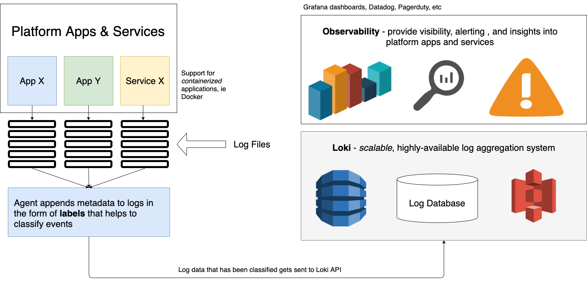
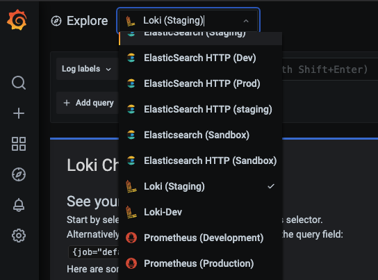
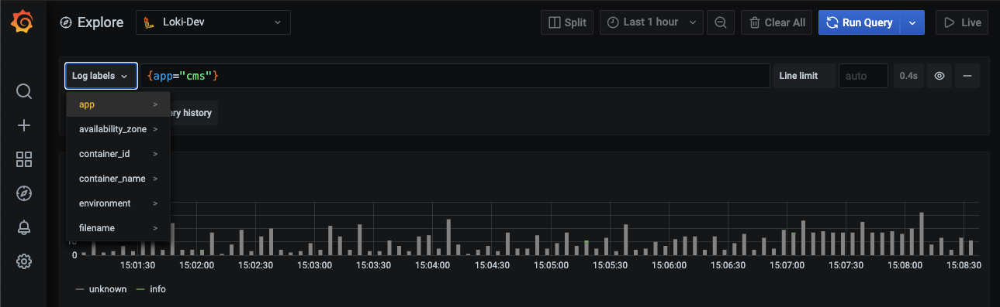
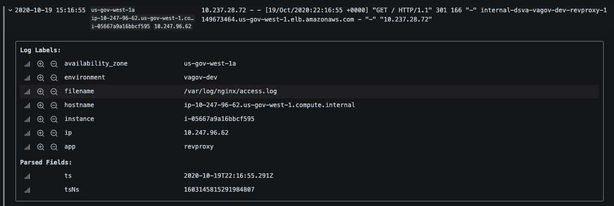
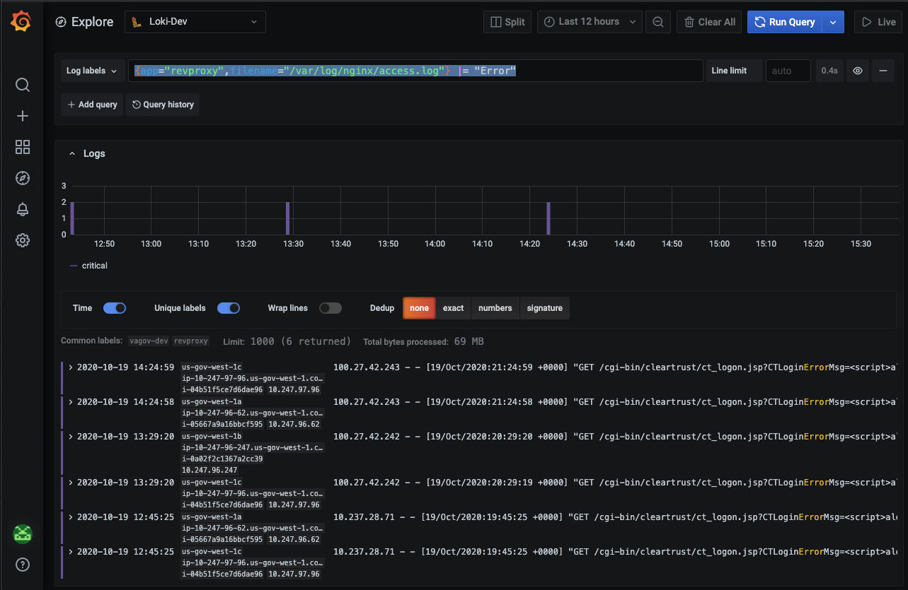

----

# We're moving our docs! 
### Find [the latest version of this page](https://depo-platform-documentation.scrollhelp.site/developer-docs/Monitoring-performance.1847787786.html) on the Platform website.

### Still can't find what you're looking for? Reach out to [#vfs-platform-support](https://dsva.slack.com/archives/CBU0KDSB1) on Slack.

----

## Centralized Logging with Loki - User Guide

### What is Loki?

Loki is a centralized logging solution from the folks that brought us Grafana and Prometheus; think Prometheus, but for logs!  

Logs are a key component for observability, and there is a ton of valuable user and systems data stored in log files. Traditionally, log management can be a bit of a challenge due to the sheer volume of information to sift through and review, and the fact that 99% of log entries look the same. Storing and analyzing logs - especially at scale - is rarely easy, cheap, or fast (and you can usually only pick 2).

Loki aims to solve these problems by leveraging technologies developed in other Grafana products. After researching, testing, and implementing Loki, we are excited about the value that these enhanced capabilities can bring to developers using the Platform.

Here’s a high-level diagram showing the basic architecture of the Platform's centralized logging solution:

## Loki Details for All Developers

### How to view logs in Loki

One of the great things about Loki - and a significant consideration in the design of our solution - is that it is part of the “Grafana stack”, and the Grafana UI is used as the visualization interface for logs aggregated by Loki.  Additionally, the query language is similar to Prometheus PromQL, so there will be some familiarity for developers that have used these tools in the past. 

To view logs in Grafana collected by Loki, simply:

- Login to the [VFS Grafana instance](http://grafana.vfs.va.gov) (SOCKS or VA VPS required)
- Go to Explore (the little compass icon), and,,,
- Select the respective Loki environment as a data source _(see image below)_

- You will now see a query interface for slicing, dicing, and analyzing your log files!

**NOTE:** If an environment isn’t visible, that means that it’s likely not ready… yet _(request additional info or support in #vfs-platform-support)_

### How to query and analyze log data in Loki

**Step 1: Get familiar with your data**

In order to understand how to slice and dice your logs, you’ll first need to understand the data. This includes WHAT information is being sent, HOW it looks, and HOW it is being tagged and labeled. The labeling aspect is especially important since that is how you will facet/group/slice/segment the log data.

_To do this, try the following:_

- Log in to Grafana (remember SOCKS needed)
- Go to Explore (the little compass icon)
- Select the respective Loki data source
- Click `“Log labels”` to See how ALL the data is structured and organized
  - **NOTE:** Most people will find the `app` label to be the most useful

- Now you should see some data: 

  - The image above is showing ALL of the log data for the `app` (or label) that has been selected
  - The bar graph at the top is showing the rate of log messages for a particular label
  - The lines below (at the top of the image) are individual log messages
  - Try clicking on a specific message to see additional details, including extracted fields and other labels that are tagged onto that specific message _(see image below)_
  

**Step 2: Try some basic data manipulation**

Let’s see how we can manipulate this data (without going too deeply):

- Try clicking the time picker at the top, to select a range of dates/times or a specific time window
- Try clicking the split icon to get two windows side-by-side which can be helpful for manual correlation
- Try clicking the `“Live”` button to see ingestion and processing of log data in real-time (whoa - cool!) 
- Try clicking the various options below the graph to see how it changes the detail view.

**Step 3: Try some simple queries**

The power of Loki is in labeling the log messages, which enables you to quickly sort, query, and slice & dice the log data. Selecting an `app` label will show all logs for a given app (for the chosen environment). 

_As an example,_ if we want to see only the web-server logs for the reverse proxy aka `“revproxy”`:

- The web server logs are generated by scraping the Nginx access logs, ie `/var/log/nginx/access.log` 
- This can be found by looking for a web-server log entry, clicking it, and seeing the labels.
- So, we can update our query to only show logs with BOTH labels (app, and specific log file): `{app="revproxy",filename="/var/log/nginx/access.log"}`
- _Pro-tip:_ after entering the first label, you can start typing and the filters will auto-complete with (only) valid options
- _Pro-tip:_ you can hit `“Shift+enter”` as a keyboard short-cut to execute your updated query

_As another example,_ if we want to look for something a bit more specific:

- Errors are a common thing to look for, so… 
- By appending a simple operator to our query `(|= “thingy”)`, we can search for errors in the revproxy's access logs: `{app="revproxy",filename="/var/log/nginx/access.log"} |= "Error"` _(see image below)_

To recap, the above image is showing us:

- All of the web-server logs (Nginx `access.log` files) 
- From all revproxy instances, that…
- Contain `"Error"` over the past 12hrs

**NOTE:** You can also transform your logs in the query as well, see [HERE](https://grafana.com/blog/2020/10/28/loki-2.0-released-transform-logs-as-youre-querying-them-and-set-up-alerts-within-loki/) for more info, and check back for additional examples and resources coming soon. 

**Step 4: Advanced, statistical queries**

_TBD - Coming soon!_

**Step 5: Share your knowledge/findings via Dashboards!**

_TBD - Coming soon!_

**How to use LogCLI for programmatic log data query/export/manipulation**

_TBD - Coming soon!_

