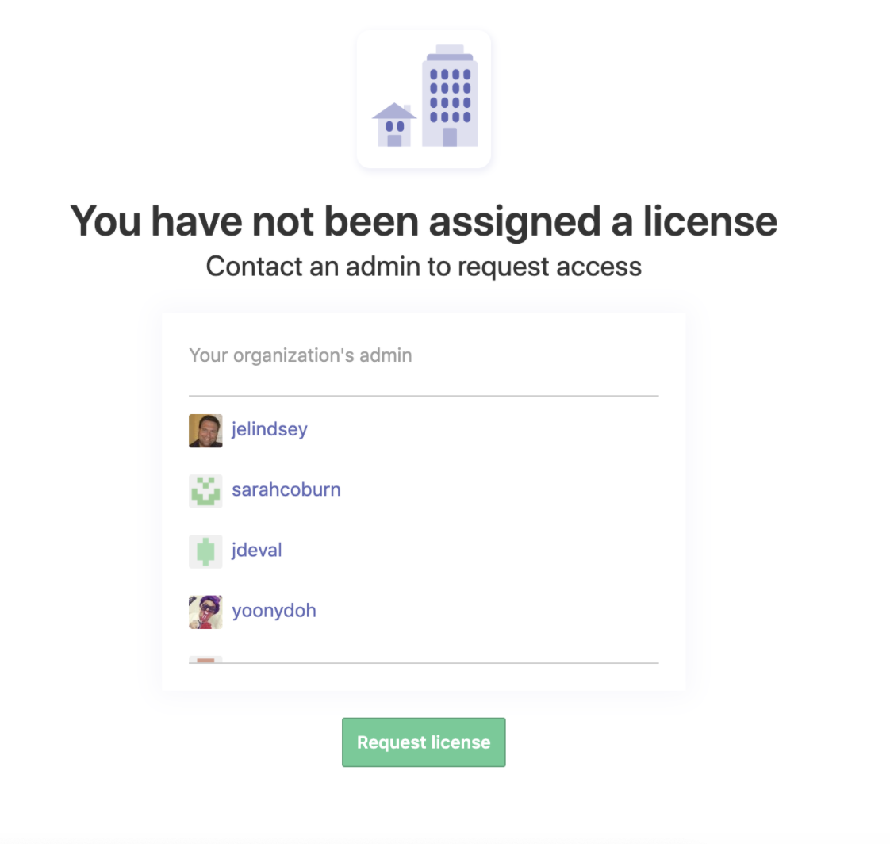

# Zenhub

Zenhub is the main issue tracking tool used by VSP. An intro to Zenhub can be found [here](https://help.zenhub.com/support/solutions/articles/43000010778-what-is-zenhub-an-intro-to-zenhub-in-github).

It may be useful to see Zenhub as a layer of data that sits on top of github issues and offers additional functionality and features.

The difference between a github issue and a Zenhub issue is further described in the [Zenhub documentation](https://help.zenhub.com/support/solutions/articles/43000458338-what-is-zenhub-vs-github-in-an-issue).

## Zenhub onboarding
To start using Zenhub, you can follow the onboarding process described here:
* [Zenhub onboarding](https://github.com/department-of-veterans-affairs/va.gov-team/blob/master/platform/working-with-vsp/orientation/zenhub_onboarding.pdf)

### Zenhub licenses

If after following the onboarding instructions above, you see a screen stating "You have not been assigned a license; Contact an admin to request access", 

try to click the button to request a license, then wait 1 business day for access to be granted.

If Zenhub still doesn't work, or you haven't been granted a license after 1 business day, please create a new thread in #vfs-platform-support and ping @zenhub-admins to request that they grant your license. Please provide your github username so they can process the request.

## Product management with Zenhub
The product management process for Zenhub is described here:
* [Product Management Process in Zenhub](https://github.com/department-of-veterans-affairs/va.gov-team/blob/master/platform/working-with-vsp/orientation/zenhub_product_management.pdf)
 