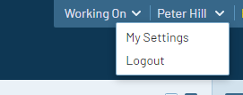
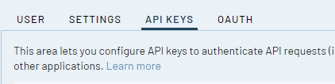
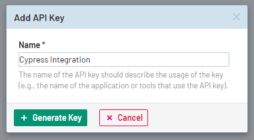
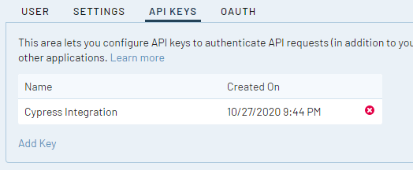
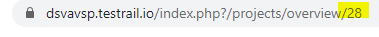
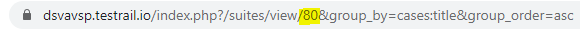
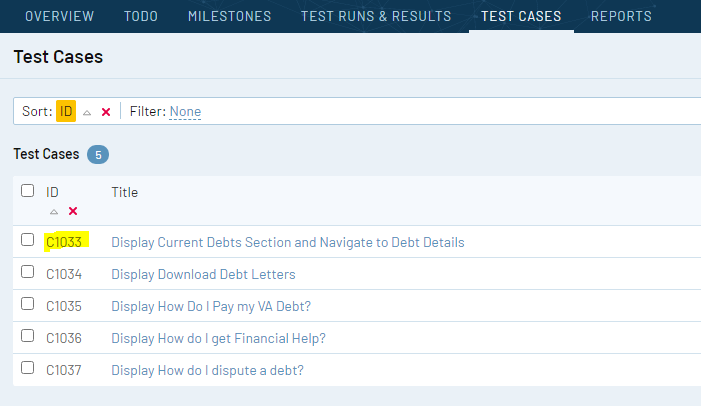
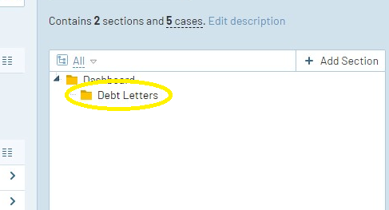
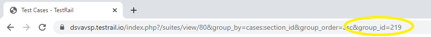

# Cypress to TestRail Reporter Plugin Configuration

In order to begin writing your execution records from your Cypress e2e teests into related test cases in TestRail you will need the following configurations --
* [TestRail API Key](#testrail-api-key)
* [Corresponding Project, Test Suite, and Test Cases in TestRail](#corresponding-testrail-objects)
* [Environment Variables Set](#environment-variables-set)
* [Invoke Cypress with Reporter Options from Environment Variables](#invoke-cypress-with-custom-reporter-options)

## TestRail API Key
1. Log in to TestRail
2. In the upper right of the interface find your name and click it to spawn a menu



3. Select 'My Settings'
4. Select the 'API KEYS' tab



5. Click 'Add Key' link
6. Use 'Add API Key' dialog to name the key something relevant like 'Cypress Integration'



7. Click 'Generate Key'
8. Copy the displayed key out and save it somewhere secure


9. Click 'Add Key'
10. Verify that key was added to list of API Keys



11. Click 'Save Settings' **THIS IS VERY IMPORTANT. DON'T FORGET THIS STEP!**

## Corresponding TestRail Objects
1. Navigate to project dashboard
2. Verify `projectID` in URL



3. Navigate to 'Test Cases' tab
4. Verify `suiteID` in URL



5. Tag test cases in your Cypress test file by using the unique identifier of the test case in the test title



6. In order to run a subset of tests available in your project's test suite, you will need to organize them into a section in TestRail and discover that section's `groupId`.





## Environment Variables Set
1. `TR_USER` : the email address for your TestRail account
1. `TR_API_KEY` : the API key that you created for use by Cypress to TestRail reporter in TestRail
1. `TR_PROJECTID` : the unique identifier for your TestRail project
1. `TR_SUITEID` : the unique identifier for the test suite from your project (by default a project is set up with only one test suite)
1. `TR_RUN_NAME` : the name that you would like to see in TestRail for this run
1. `TR_INCLUDE_ALL` : **true** if you want to run all test cases in the test suite || **false** if you want to run a subset of test cases available in your test suite
1. `TR_GROUPID` : the unique identifier of your section/group of automated tests in your test suite
1. `TR_FILTER` : a string to match the names of your test cases to (even if you don't want to filter, you must include this variable set to an empty string)
```
export TR_USER="your-testrail-email-here" TR_API_KEY="your-API-key" TR_PROJECTID="your-projectid" TR_SUITEID="your-suiteid" TR_RUN_NAME="human readable name" TR_INCLUDE_ALL="TRUE/FALSE" TR_GROUPID="subset of test cases collected into group" TR_FILTER="a string to filter on (can be blank)"
```

## Invoke Cypress with Custom Reporter Options
```
yarn cy:testrail-run --spec src/applications/<your app>/tests/e2e/<your test file>
```
The above yarn script is using your previously set environment variables to set the reporter options --
```
"cy:testrail-run": "cypress run --config-file config/cypress-testrail.json --reporter-options domain=dsvavsp.testrail.io,username=$TR_USER,password=$TR_API_KEY,projectId=$TR_PROJECTID,suiteId=$TR_SUITEID,runName=$TR_RUN_NAME,includeAllInTestRun=$TR_INCLUDE_ALL,groupId=$TR_GROUPID,filter=$TR_FILTER",
```
