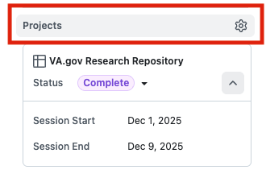

# Research Recommendation Sub-Issue Workflow Guide

## Overview

This guide explains how to create GitHub Issues from your research recommendations and link them as sub-issues to your research issue.  This workflow enables Research-Ops to track how research findings translate into shipped product improvements.

---

## Why This Matters

When you link recommendation issues as sub-issues of your research issue, you create a traceable connection: 

```
Research Study → Findings Report → Recommendations → GitHub Issues → Shipped Product Changes
```

This traceability helps: 
- **Product teams** see which issues are research-backed
- **Research-Ops** measure research impact across the organization
- **DSD leadership** understand how research drives Veteran outcomes
- **You** demonstrate the value of your research work

---

## Step-by-Step Workflow

### Step 1: Complete Your Research

1. Conduct your study and complete synthesis
2. Write your research findings report using the template
3. Commit your findings report to the `va.gov-team` repository
4. Move your research issue in the Research Repository to "Completed" status

### Step 2: Generate Recommendation Issues with Copilot

1. Open your finalized research findings report in GitHub
2. Open GitHub Copilot Chat
3. Attach your research findings report to the chat (click the Copilot icon twice)
4. Copy and paste the prompt from [`create-issues-from-research-findings-prompt.md`](https://github.com/department-of-veterans-affairs/va.gov-team/blob/master/platform/research/synthesis/create-issues-from-research-findings-prompt.md)
5. Review Copilot's suggested issues and refine as needed
6. Create each issue in the appropriate repository (usually `va.gov-team`)

### Step 3: Link Issues as Sub-Issues

After creating your recommendation issues, link them to your parent research issue:

#### Method A: From the Parent Issue (Recommended)

1. Navigate to your research issue in the [Research Repository Project Board](https://github.com/orgs/department-of-veterans-affairs/projects/880/views/2)
2. Open your research issue
3. In the issue body, find the **"Create sub-issue"** button at the lower left corner of the main body.


4. Click the dropdown button  then click **"Add existing issue"**
5. Search for or paste the URL of your recommendation issue
6. Repeat for each recommendation issue

#### Method B: From the Child Issue

1. Open your recommendation issue
2. In the issue body, add:  `Parent issue: [Research Repository URL]#[issue-number]`
3. Example: `Parent issue: https://github.com/department-of-veterans-affairs/va.gov-research-repository/issues/123`

### Step 4: Add Sub-Issues to Product Team's Project Board

1. Open each recommendation sub-issue
2. In the sidebar, find **"Projects"**
3. Hover over **"Projects"** so it gets grey overlay, then click it.



4. Select your product team's project board
5. This ensures the product team sees the issue in their workflow

### Step 5: Update Your Findings Report

1. Return to your research findings report
2. Under each Recommendation and Next Step, add a hyperlink to the created issue
3. Example: 
   ```markdown
   ## Recommendations
   
   1. **Implement synonym matching in search** (High Priority)
      - [Recommendation Issue #456](https://github.com/department-of-veterans-affairs/va.gov-team/issues/456)
   ```
4.  Commit the updated findings report

---

## What If I Have No Recommendations?

Some research legitimately has no actionable recommendations. This is valid for: 

- **Exploratory/discovery research** — Identifies areas for further investigation
- **User Acceptance Testing (UAT)** — Validates existing implementation
- **Research that confirms current approach** — No changes needed

In these cases: 

1. Open your research issue
2. Apply one of these labels:
   - `no-recommendations-exploratory`
   - `no-recommendations-validated`
   - `no-recommendations-uat`
   - `further-research-needed`
3. This tells Research-Ops that you've considered recommendations and determined none are appropriate

---

## Reminder Bot

If your research issue moves to "Completed" and after 7 days you haven't: 
- Created any sub-issues, OR
- Applied a "no-recommendations" label

You'll receive an automated reminder comment on your issue, and @sstrassberg will be notified. 

This isn't punitive—it's a gentle nudge to ensure research impact is tracked! 

---

## Visual Summary

```
┌─────────────────────────────────────────────────────────────────┐
│  RESEARCH ISSUE (Parent)                                        │
│  Repository: va.gov-research-repository                         │
│  Status: Completed                                              │
│                                                                 │
│  Sub-Issues:                                                    │
│  ├── Recommendation 1 Issue ──▶ Product Team Project Board      │
│  ├── Recommendation 2 Issue ──▶ Product Team Project Board      │
│  └── Next Step 1 Issue ───────▶ Product Team Project Board      │
│                                                                 │
│  (Sub-issues live in va.gov-team but link back here)           │
└─────────────────────────────────────────────────────────────────┘
```

---

## FAQ

**Q: What if my product team doesn't use GitHub Projects?**
A:  The sub-issue link to the research issue is the critical piece. Adding to the product board is ideal but not required. 

**Q: Can I create sub-issues later if new recommendations emerge?**
A:  Yes!  You can add sub-issues at any time. Just remember to update your findings report. 

**Q: What if an engineer already created an issue for my recommendation?**
A: Link the existing issue as a sub-issue.  No need to create a duplicate.

**Q: Who "owns" the recommendation issues after I create them?**
A: The product team owns execution.  You've done your part by creating the issue and linking the research evidence.

---

## Support

Questions about this workflow?  Reach out in [#research-ops](https://dsva.slack.com/archives/C0216PL32HJ) on Slack.
