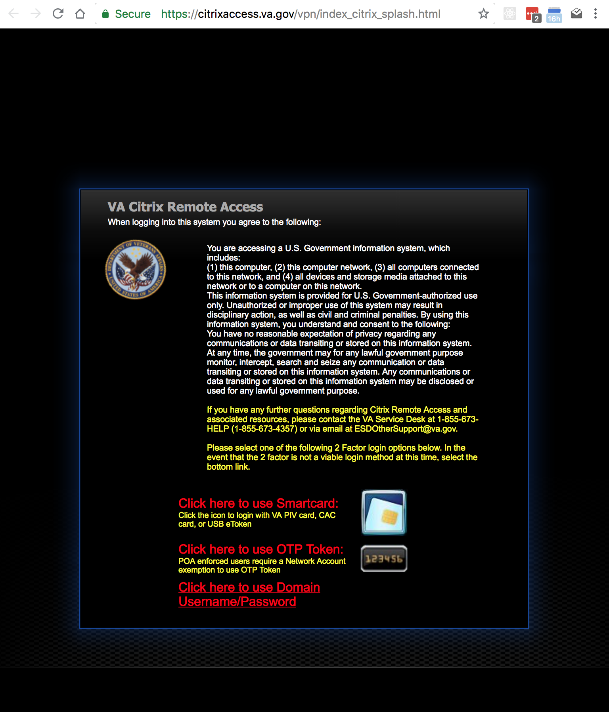
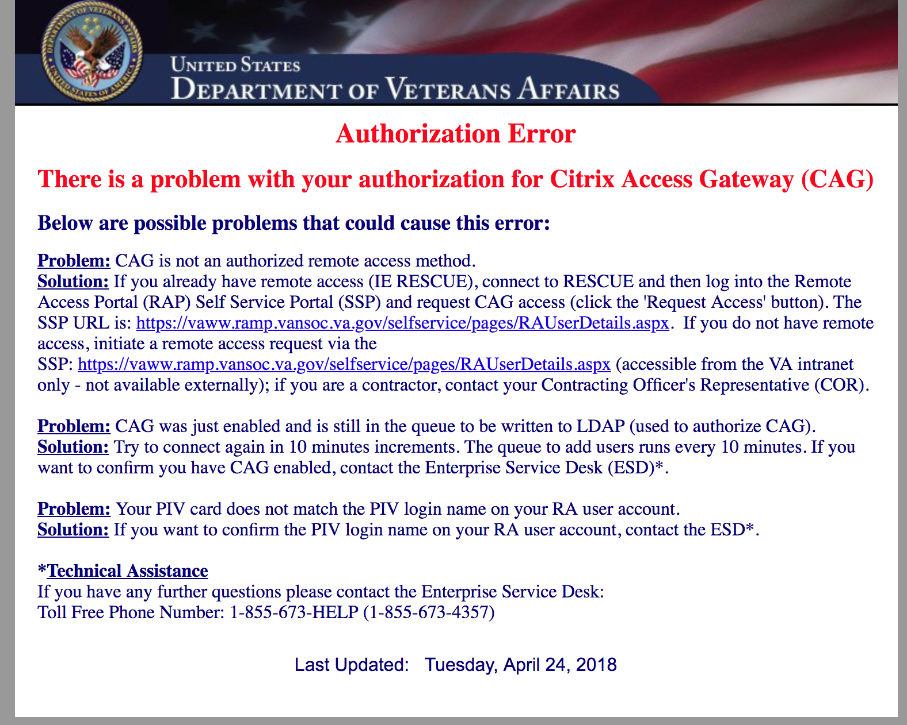

These instructions are relevant for those who need access to the VA network, but do not have a VA-imaged laptop (also known as Government-Furnished Equipment (GFE) laptop). Instead, you can use your PIV to access the Citrix Access Gateway (CAG) site and launch a Windows virtual desktop. This virtual desktop is suitable for checking VA email and accessing VA intranet sites; it's not usable for design or development tasks. 

_These steps are geared towards contractors, specifically Ad Hoc and its subcontractors - if you work for a different company, administrative steps such as who to contact as your COR may differ.

# Accessing Citrix Access Gateway (CAG)

## Requirements:
- Your PIV Card
- Your PIV PIN
- CAG access enabled (you have to request this, current POC is: [Trista Coyne](mailto:trista@adhocteam.us).)
- A SmartCard reader - you plug this into your USB port and then insert your PIV card into it.
  - One popular option: https://www.amazon.com/gp/product/B00RPNZ3BG/ref=oh_aui_detailpage_o02_s01?ie=UTF8&psc=1
- Possibly a [USB-C to USB Adapter](https://www.amazon.com/gp/product/B07D6JPLNQ/ref=oh_aui_detailpage_o00_s00?ie=UTF8&psc=1) if your laptop does not have a regular USB port.
- This software bundle, installed on your Mac laptop: https://adhoc.slack.com/archives/C15P6TD45/p1521225818000256

_Note: If you do have a VA-issued laptop, you can also use CAG, but the Citrix software should be pre-installed so you should not need to install the above software bundle, and doing so may conflict with the already-installed software._

## Account Requirements:
- Contractors must be authorized for CAG access by their Contracting Officer's Representative (COR), and then VA IT staff needs to enable your account for CAG access. If you're not sure whether this has happened, check with your manager. 

## Steps

1. Plug in USB Adapter if necessary
2. Plug in SmartCard Reader
3. Insert PIV Card into CAG Reader
    - Wait about 5 seconds...
4. If prompted, enter your PIV PIN.
    - You created this when you first received your PIV Card and tested your network access at the VA facility. I believe it is a minimum of six digits. If you forgot your PIN, you will need to contact (and probably visit) your local VA facility.
    - If you saved your password to Mac Keychain you may not be prompted on subsequent accesses, and your PIV will now be connected to your local OS account.
5. Navigate to https://citrixaccess.va.gov/.
.
6. Choose the "Click here to use Smartcard" option
7. A dialog will show up prompting you to select one of the certificates on your PIV to use for authentication.
8. Select the certificate subtitled *Veteran Affairs User* (generally the first certificate listed) and click OK.
9. Re-enter your PIN when prompted.
10. Do you see this error?

    - This likely means that your account was disabled for inactivity if you haven't connected within a certain timespan.
    - Solution: Please reach out to the Ad Hoc onboarding POC, currently [Neal Sherwood](mailto:neal@adhocteam.us).
    - If you don't believe this to be the case or would like to confirm the issue, contact the [National Service Desk](‭tel:18556734357‬) at ‭1 (855) 673-4357‬.
11. Otherwise you should be logged in to the Citrix storefront page. Click from the empty "Applications" tab to the "Desktops" tab. Different users see different lists of available desktops here depending on how their account is configured, but in general most should be some variant of Windows and should have Outlook and one or more browsers. Find an option that works well enough, isn't super-slow, and has the tools you need installed.
12. When you pick a desktop, it will launch and should show a Windows sign-in screen. If it's prompting for a username/password, select "Log in as a different user" and then click the SmartCard option. After a few seconds it should read your PIV and prompt you for a PIN, and then log you into Windows.

## Troubleshooting

### Citrix PIV web portal (citrixaccesspiv.va.gov) does not accept login certificate
In Chrome the page title will say: "This site can't provide a secure connection" and the fine print reads: "citrixaccesspiv.va.gov didn't accept your login certificate, or one may not have been provided."

**Solution:** Restart your machine. The source of this issue is unclear, but team members have reported having to do this several times each month.

### General trouble connective with Chrome browser

**Solution:** Try switching to Safari. Apparently some folks have trouble using Chrome in particular, but Safari is reported to be less problematic. ¯\_(ツ)_/¯

### Unable to reconnect after virtual session times out

**Solution:** Try removing the PIV card and quitting the browser before re-trying the sequence above. This worked in Chrome.
