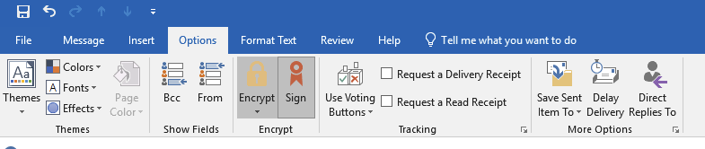

# Setup encrypted email at VA

Sending or receiving sensitive information within VA requires you to setup encrypted email for your VA email address. The encryption is done via a key and certificate that is contained in your PIV card. Keep in mind that you have to do this for each PIV you receive over time, and going through a PIV renewal means that you lose access to all of your old encrypted email since they dispose of the old card for you.

## Setup

First, you need to publish your certificate to the Global Address List (GAL).

The easiest path forward is to use a script that's already been added to the Start menu of some desktops. From CAG or your GFE, see if the script already has a shortcut:

Start -> Dept of Veterans Affairs -> Publish My eMail Certs

If the menu option is not there, there's a [knowledge base article](https://yourit.va.gov/nav_to.do?uri=%2Fkb_view.do%3Fsysparm_article%3DKB0031750) (only works on CAG/GFE) on how to download the script and execute it.

## Sending and receiving encrypted email

The "setup" step above needs to be done before you can send or receive encrypted emails.

To send an encrypted email, open the "options" tab on the new message window and select "Encrypt" and "Sign". When you hit send, you'll get prompted to input your PIV's PIN again (and the PIV needs to stay inserted into the reader).

When receiving encrypted emails, some won't show up in the reading pane. Double-click the email to open it in a separate window and you will receive a prompt for your PIN to decrypt the message.
