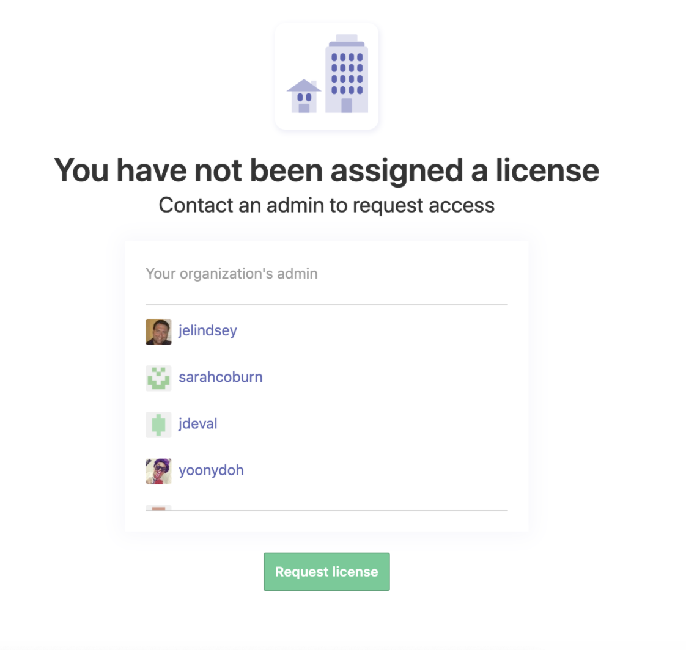

---- 

# We're moving our docs!
### [Find Request Access to Tools](https://depo-platform-documentation.scrollhelp.site/getting-started/request-access-to-tools) on the Platform website.

### Still can't find what you're looking for? Reach out to [#vfs-platform-support](https://dsva.slack.com/archives/CBU0KDSB1) on Slack.

### For community assistance with Zenhub issues, go to [#zenhub-information](https://dsva.slack.com/archives/CE4304QPK/p1714146847917589)

----

# Zenhub

Zenhub is the main issue tracking tool used by VSP. An intro to Zenhub can be found [here](https://help.zenhub.com/support/solutions/articles/43000010778-what-is-zenhub-an-intro-to-zenhub-in-github).

It may be useful to see Zenhub as a layer of data that sits on top of github issues and offers additional functionality and features.

The difference between a github issue and a Zenhub issue is further described in the [Zenhub documentation](https://help.zenhub.com/support/solutions/articles/43000458338-what-is-zenhub-vs-github-in-an-issue).

## Zenhub onboarding

To start using Zenhub, you can follow the onboarding process described here:
1. [Zenhub orientation](https://github.com/department-of-veterans-affairs/va.gov-team/blob/master/platform/working-with-vsp/orientation/zenhub_onboarding.pdf)
2. Zenhub admins are in Slack, `@admins-zenhub`.
3. Someone with Zenhub board access should go to app.zenhub.com, login, and click "Invite your team" in bottom left sidebar. Enter the user's agency email address / send, OR copy the link to workspace and send to the new user.
4. User should:
    1. Make sure your agency email address is connected to your Github account.
    2. Try to reach the Zenhub link provided for their team's sprint board (e.g. https://app.zenhub.com/workspaces/vagov-cms-team-5c0e7b864b5806bc2bfc2087/board)
    3. Sign into Zenhub using your agency email NOT Github connect
    4. After login, you should see a prompt to Request Access to the department-of-veterans-affairs Zenhub org. Click "Request Access". That will generate a license request.
    5. Ping `@admins-zenhub` in Slack to check if the License request appears in their dashboard to be approved. If so, once they approve, you should be able to access the board in Zenhub app, and in Github on a browser with the Zenhub extension installed, if you're signed in with the correct agency email / Github ID. 
6.  If you don't get prompted to Request Access:
    1. Confirm that the email you are using to log into Zenhub is also associated with your Github account.
    2. Confirm that someone with access to the required Zenhub board has invited you to Zenhub using the correct email address. This should generate an email you receive to click through and accept.
    3. Confirm that you're "SAC Adjudicated" (have been fingerprinted & confirmed with your COR).
    4. When these are true:
        1. Log out of Github and Zenhub.
        2. Clear your browser cache
        3. Log into Github.
        4. Log into the Zenhub webb app (app.zenhub.com).
        5. Try your board link again.
        6. If this fails: schedule a support session with Zenhub support: https://calendly.com/zenhubsuccess/support-session?utm_campaign=support&utm_source=helpcenter

_Note: Having a mismatch in email address used for Zenhub vs. Github, or in accepting the invite via Zenhub webapp vs. using the browser extension caused some problems. Mind your workflow of accepting invite > trying to access the board, and make sure you're doing it in the same place_

### Requesting a Zenhub license

If after following the onboarding instructions above, you see a screen like the below stating "You have not been assigned a license; Contact an admin to request access", 

try to click the button to request a license, then wait 1 business day for access to be granted.

If after 1 day, Zenhub still doesn't work, please create a new thread in [#vfs-platform-support](https://dsva.slack.com/archives/CBU0KDSB1) and ping @admins-zenhub to request that they grant your license. Please provide your github username so they can process the request.

## Product management with Zenhub

The product management process for Zenhub is described here:
* [Product Management Process in Zenhub](https://github.com/department-of-veterans-affairs/va.gov-team/blob/master/platform/working-with-vsp/orientation/zenhub_product_management.pdf)
 
## Zenhub administration
 
 If you are a Zenhub administrator, you can use the following steps to approve license requests:
 1. Go to https://app.zenhub.com/dashboard/o/department-of-veterans-affairs/manage
 2.  Hit "assign all"
 3. Follow the additional 1-2 steps to "purchase" the licenses
 
 Note: this will make you feel nervous because it seems like you're shelling out money for something. But you're not. We have a forever unlimited free licenses setup with ZenHub. So, though it feels like you're spending money, the card on file will not be charged for the additional licenses.
 
