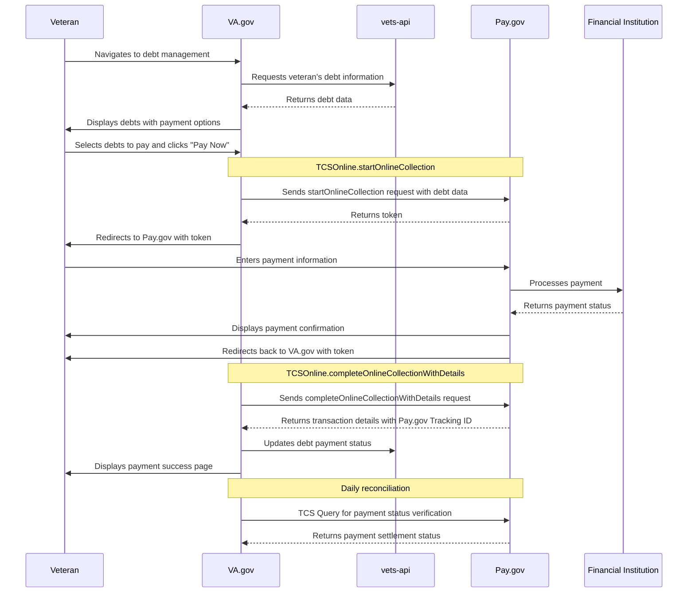

## Pay.gov Technical Overview

This doc outlines the workflow that will allow VA.gov to integrate with pay.gov to enable veterans to make payments for VA debts.
This will use PA.gov hosted collection pages to securely process payments, minimize risk to the VA, and offer a good ux.

This doc reflects our current understanding and is subject to change

### Pay.gov components
1. Hosted collection page service - Primary payment flow
2. TCS Single Query Web Service - For transaction verification




### Detailed Workflow Steps
#### 1. Auth and debt retrieval
- Veteran authenticates on VA.gov
- VA.gov fetches and displays debt info

#### 2. Debt selection and payment initiation
- Veteran selects what debt they want to pay
- VA.gov prepares the payment data with a payload that has:
  - Total payment amount
  - Custom debt identifiers
  - Veteran information
Sample request payload (the classification and custom id fields still need to be defined, this is a guess for now)
```
// Sample request payload
{
  "tcs_app_id": "VA_DEBT_PAYMENTS",
  "agency_tracking_id": "[unique transaction identifier]",
  "transaction_type": "Sale",
  "transaction_amount": "[total payment amount]",
  "language": "en",
  "url_success": "https://va.gov/payments/confirmation",
  "url_cancel": "https://va.gov/payments/cancel",
  "account_holder_name": "[Veteran's name]",
  "email_address": "[Veteran's email]",
  "custom_fields": {
    "custom_field_1": "[Veteran ID]",
    "custom_field_2": "[Additional reference data]"
  },
  "classification": [
    {
      "classification_id": "VA_MEDICAL_CENTER_A",
      "amount": "[portion for first medical center]"
    },
    {
      "classification_id": "VA_MEDICAL_CENTER_B",
      "amount": "[portion for second medical center]"
    }
  ]
}
```

#### 3. Redirect to pay.gov
- VA.gov redirects to pay.gov with a url that looks something like:
  - `https://www.pay.gov/tcsonline/payment.do?token=[token]&tcsAppID=[VA_DEBT_PAYMENTS]`
  - The hosted collection page is prefilled with veteran info and payment ammount

#### 4. Payment processing
- Veteran enters payment info
- pay.gov processes payment
- pay.gov generated a tracking ID for transaction
- pay.gov displays confirmation and redirects back to va.gov

#### 5. Transaction complete
- VA.gov receives the token when veteran is redirected
- pay.gov returns transaction details that look something like:
```
{
  "paygov_tracking_id": "25PC41EF",
  "agency_tracking_id": "[original transaction identifier]",
  "transaction_amount": "240.01",
  "transaction_type": "Sale",
  "transaction_date": "2025-05-20T16:01:46",
  "payment_date": "2025-05-20",
  "transaction_status": "Success",
  "payment_type": "PLASTIC_CARD"
}
```
- VA.gov displays payment confirmation

#### Reconcilation
- VA.gov uses TCS single query web service to verify transaction status
- For each transaction, VA.gov sends a query with the tracking id
- PA.gov returns settlement status

#### File processing
- Pay.gov generates daily activity files with transaction info
- VA.gov downloads and processes these files to update payment records


### Security
- IP whitelisting will be implemented for all server-to-server communication
- Treasury issued security cert based auth
- All tranactions encrypted and use TLS


#### References
Reach out to team for access:
- https://qa.pay.gov/agencydocs/docs/web_services_overview.pdf
- https://qa.pay.gov/agencydocs/docs/tcs_single_query_service.pdf
- https://qa.pay.gov/agencydocs/docs/hosted_collection_pages.pdf
- https://qa.pay.gov/agencydocs/docs/web_services_data_elements.pdf
- https://qa.pay.gov/agencydocs/docs/tcs_single_service.pdf

