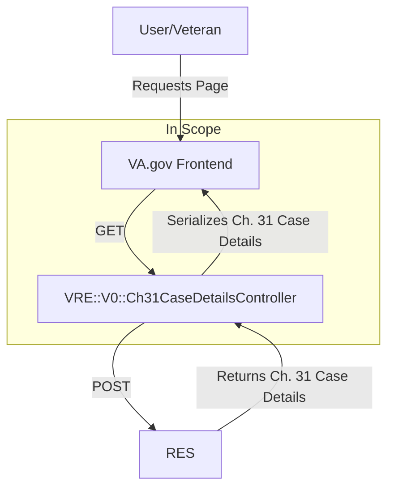

```mermaid
graph TD
    User[User/Veteran] --> |Requests Page| Frontend[VA.gov Frontend]
    Frontend --> |GET| Controller[VRE::V0::Ch31CaseDetailsController]
    Controller --> |POST| RES[RES]
    Controller --> |Serializes Ch. 31 Case Details| Frontend
    RES --> |Returns Ch. 31 Case Details| Controller

    subgraph "In Scope"
        Frontend
        Controller
    end
```
