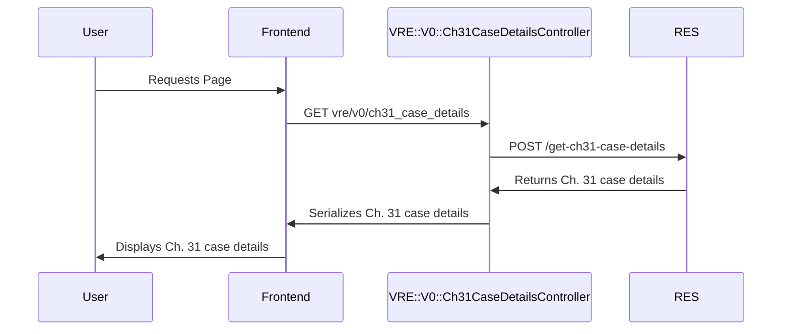

```mermaid
sequenceDiagram
    participant U as User
    participant F as Frontend
    participant B as VRE::V0::Ch31CaseDetailsController
    participant R as RES

    U->>F: Requests Page
    F->>B: GET vre/v0/ch31_case_details
    B->>R: POST /get-ch31-case-details
    R->>B: Returns Ch. 31 case details
    B->>F: Serializes Ch. 31 case details
    F->>U: Displays Ch. 31 case details
```
