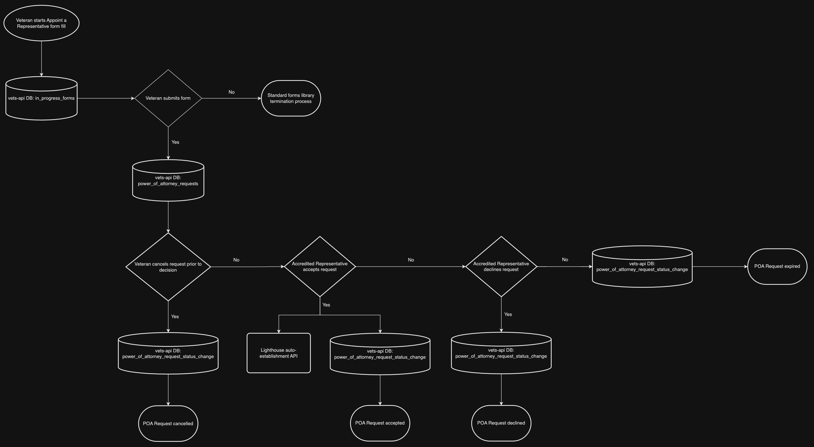
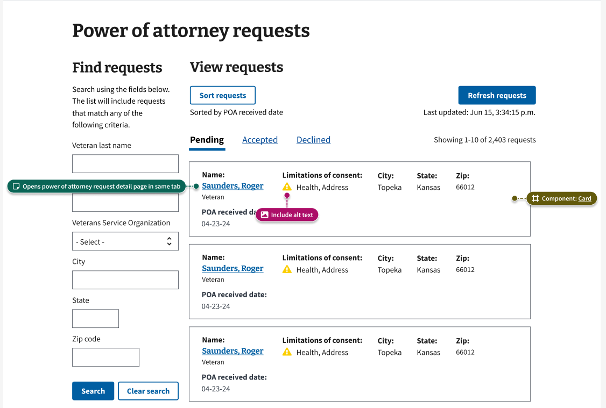
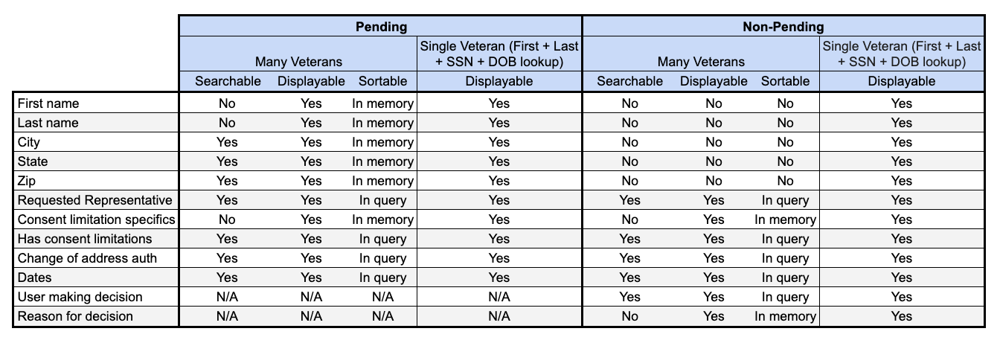

# Storage Proposal for Power of Attorney Requests
This proposal only covers the storing of data for Power of Attorney Requests.

## Background
The Office of the Chief Technology Officer (OCTO) is seeking to migrate Veteran and Power of Attorney (PoA) experiences from the legacy Stakeholder Enterprise Platform (SEP) product and eBenefits platform to VA.gov.

One aspect of this experience is the Power of Attorney (POA) Request, a data object that exists to enable accredited representatives accepting or denying requests to act as a Power of Attorney (Forms 21-22 and 21-22a) on behalf of Veterans. The data object bridges the gap from the Veteran facing form fill experience (Appoint a Representative) to establishing the Power of Attorney relationship in systems of record and updating representative permissions in those systems (Lighthouse auto-establishment APIs). [See the flow chart](#data-flow)

## Problem
In order to create a functional user interface for accredited representatives ([see the sample UI](#sample-ui)), the POA Request objects must support reasonably efficient searching or filtering on the following Veteran attributes: first name, last name, city, state, zip code, and consent limits. The front end must also be able to display information related to change of address authorization and health record access limitations.

There is not an existing pattern or solution in vets-api for storing Veteran PII that is secure and efficiently searchable for a many row result.

## Solution
Code below is for illustrative and general direction purposes. Implementation details may change.

### Column level encryption
The [blind index gem](https://github.com/ankane/blind_index) allows for exact matching queries on encrypted columns. This will be used on fields that users will search or filter by. Existing KMS encryption will be used on the fields that are for display purposes only.

#### The Models
```ruby
class PowerOfAttorneyRequest < ApplicationRecord
  include AASM

  has_kms_key
  has_encrypted :consent_limitation_data, :first_name, :last_name, key: :kms_key, **lockbox_options
  blind_index :city, :state_code, :zip_code

  belongs_to :user_account
  belongs_to :requested_individual, class_name: 'AccreditedIndividual', optional: true
  belongs_to :requested_organization, class_name: 'AccreditedOrganization', optional: true
  has_many :power_of_attorney_request_status_changes

  before_create :calculate_has_consent_limitations
  before_create :set_expiration

  validate :requested_entity_presence

  EXPIRATION_TIME = 60.days

  aasm column: :status do
    state :pending, initial: true
    state :accepted, :cancelled, :declined, :expired

    after_all_transitions :log_status_change
    after_all_transitions :remove_sensitive_data

    event :accept do
      transitions from: :pending, to: :accepted
    end

    event :cancel do
      transitions from: :pending, to: :cancelled
    end

    event :decline do
      transitions from: :pending, to: :declined
    end

    event :expire do
      transitions from: :pending, to: :expired
    end
  end

  private

  def log_status_change(params)
    status_change = build_status_change(params)
    power_of_attorney_request_status_changes << status_change
  end

  def build_status_change(params)
    PowerOfAttorneyRequestStatusChange.new(
      from_state: aasm.from_state,
      to_state: aasm.to_state,
      event: aasm.current_event,
      user_id: params[:user_id],
      user_type: params[:user_type],
      reason: params[:reason]
    )
  end

  def remove_sensitive_data
    self.first_name = nil
    self.last_name = nil
    self.city = nil
    self.state_code = nil
    self.zip_code = nil

    save
  end

  def calculate_has_consent_limitations
    self.has_consent_limitations = if consent_limitation_data.any? { |_k, v| v == true }
                                     true
                                   else
                                     false
                                   end
  end

  def set_expiration
    self.expires_at = Time.zone.now + EXPIRATION_TIME
  end

  def requested_entity_presence
    if requested_individual.blank? && requested_organization.blank?
      errors.add('Either an AccreditedIndividual or AccreditedOrganization must be requested')
    end
  end
end
```

```ruby
class PowerOfAttorneyRequestStatusChange < ApplicationRecord
  has_kms_key
  has_encrypted :reason, key: :kms_key, **lockbox_options

  belongs_to :power_of_attorney_request
end
```

#### The Migrations
```ruby
class CreatePowerOfAttorneyRequests < ActiveRecord::Migration[7.1]
  def change
    create_table :power_of_attorney_requests, id: :uuid do |t|
      t.references :user_account, foreign_key: true, type: :uuid
      t.references :requested_individual, foreign_key: {to_table: 'accredited_individuals'}, type: :uuid
      t.references :requested_organization, foreign_key: {to_table: 'accredited_organizations'}, type: :uuid

      t.string :city_bidx, index: true
      t.string :state_bidx, index: true
      t.string :zip_code_bidx, index: true

      t.text :consent_limitation_data_ciphertext
      t.string :first_name_ciphertext
      t.string :last_name_ciphertext

      t.boolean :change_of_address_authorization
      t.boolean :has_consent_limitations

      t.string :status, index: true
      t.datetime :expires_at

      t.text :encrypted_kms_key
      t.timestamps
    end
  end
end
```

```ruby
class CreatePowerOfAttorneyRequestStatusChanges < ActiveRecord::Migration[7.1]
  def change
    create_table :power_of_attorney_request_status_changes, id: :uuid do |t|
      t.references :power_of_attorney_request, foreign_key: true, type: :uuid

      t.string :from_state
      t.string :to_state
      t.string :event
      t.uuid :user_id
      t.string :user_type
      t.text :reason_cyphertext

      t.uuid :lighthouse_power_of_attorney_submission_id

      t.text :encrypted_kms_key
      t.timestamps
    end
  end
end
```

#### Consent Limitation Data
Consent limitation data will be treated as jsonb and should only contain boolean values.
```ruby
{
  limitation_alcohol: true,
  limitation_hiv: true,
  limitation_s_c_a: true,
  limitation_h_i_v: false
}
```

### Short term persistence
Due to the sensitive nature of this data, the various encrypted fields will only be stored for XX days. After XX days or a terminal status is reached (i.e. the request is accepted) only metadata will be kept in the database.

#### Cleanup Job
This would be a scheduled job and could run on any cadence. The first choice would be once per day to match `InProgressFormCleaner`.

```ruby
class PowerOfAttorneyRequestCleaner
  include Sidekiq::Job

  def perform
    requests = PowerOfAttorneyRequest.where(status: 'pending').where('expires_at < ?', Time.now.utc)
    logger.info("Expiring #{requests.count} power of attorney requests")
    requests.each do |request|
      request.expire
    end
  end
end
```

#### Terminal Actions by Users
The state machine helper methods should be used when VA.gov users take terminal actions.

## Risks
- `blind_index` is susceptible to leakage in the same way any deterministic encryption method is.
- Mixing elevated PII fields (name + location) makes this dataset a more appealing target to attackers.
- The medical consent limitations may be considered PHI. However, one could argue that limiting access to certain types of records does not necessarily mean a user has those medical conditions.

## Future Considerations
- Data access policies (i.e. Pundit) are not considered in this document. That may be an additional security concern for those implementing Accredited Representative Portal users.
- Without clear product requirements, it is unclear how the system might use non-pending requests. The proposed data retention policy makes those settled requests less supportive of the same features pending request can power. It may be worth exploring an extended retention of XX days post settlement.

## Supplemental Information

### Data Flow


### Sample UI
This is for illustrative purposes and subject to change ([source](https://www.figma.com/design/LVCQBuW7a6nfVFNyhA4kv4/ARF---Design-Explorations?node-id=294-34927&t=u5PCXD0K6lXA4SFQ-0]))


### Features Supported

