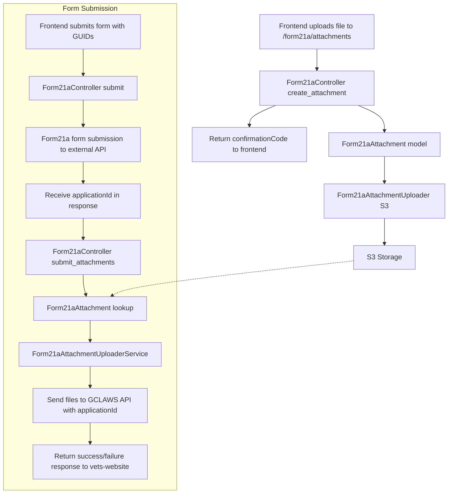

# 📎 Findings: File Upload Storage in VA.gov

- Author(s): Khoa Nguyen
- Created date: July 3, 2025
- Ticket Links: https://github.com/department-of-veterans-affairs/va.gov-team/issues/112590

## 🔍 Overview

This spike explores how file uploads should be handled for Form 21a on VA.gov, detailing how files are stored, retained, and integrated across both `vets-website` and `vets-api`. It reviews existing patterns such as `FormAttachment`, Save-In-Progress (SiP), and uploader classes like `EVSSClaimDocumentUploader` to inform a clear implementation path.

---

## ✅ Frontend Upload Flow (`vets-website`)

- File uploads are sent using `multipart/form-data` to endpoints such as:

  ```
  POST /v1/decision_review_evidence
  ```

- Uploads are configured via the `fileUiSchema` helper, supporting:
  - `fileUploadUrl`
  - Accepted file types and size limits
  - A `createPayload` function to format form data
  - A `parseResponse` function to extract a `confirmationCode` (GUID)

- Only **metadata** like `name` and `confirmationCode` are stored in the SiP JSON. **Binary file content is not stored** in SiP or persisted on the frontend.

- **Illustrative Example (not actual implementation):**
  ```js
  // Example using fetch (for illustration only; actual implementation uses platform fileInputUI)
  const formData = new FormData();
  formData.append('form_attachment[file_data]', file);
  fetch('/accredited_representative_portal/v0/form21a/attachments', {
    method: 'POST',
    body: formData
  })
    .then(res => res.json())
    .then(data => {
      // data.confirmationCode contains the GUID
    });
  ```
  *Note: The above is for illustration. The actual implementation uses the platform abstraction described below.*

- **Multiple file uploads:** Users can select and upload multiple files for Form 21a. The platform abstraction (`fileInputUI`/`fileInputSchema`) uploads each file individually—one at a time—to the backend endpoint. This allows for granular error handling and progress tracking for each file, and ensures that a failure in one upload does not affect the others. The frontend collects all returned `confirmationCode` values and includes them in the final form submission payload.

  **Actual implementation in 21a:**
  The 21a form uses the platform abstraction `fileInputUI` and `fileInputSchema` from `platform/forms-system` to handle file uploads. The upload field is configured in `/src/applications/accreditation/21a/pages/helpers/backgroundInformationDetailsPageSchema.js`:
  ```js
  [documentsKey]: {
    ...fileInputUI({
      title: 'Provide any relevant documents',
      required: () => false,
      hint: 'You may add .pdf, .doc, .jpg, or .txt documents under 25MB. Please name documents with clear, descriptive names.',
      name: `${path}-file-input`,
      fileUploadUrl: url,
    }),
    warnings: {
      'ui:field': 'BasicArrayField',
      'ui:title': 'Document upload warnings',
    },
  },
  ```
  - The upload URL is dynamically set to `/accredited_representative_portal/v0/form21a/${path}`.
  - The actual upload logic is handled by the platform, which uploads each file individually and manages confirmation codes.
  - See also: [platform/forms-system/src/js/web-component-patterns.js](https://github.com/department-of-veterans-affairs/vets-website/blob/main/src/platform/forms-system/src/js/web-component-patterns.js)
  - Reference: `/src/applications/accreditation/21a/pages/helpers/backgroundInformationDetailsPageSchema.js`
  - **About the `warnings` field:** This field is used to display any warnings related to the uploaded documents (e.g., unsupported file type, size too large, or virus scan issues) in a user-friendly way. It leverages the `BasicArrayField` UI component to show a list of warnings.

---

## 📦 Backend Storage and Retention (`vets-api`)

- Uploaded files are handled via the `FormAttachment` model.
- Encrypted file content is saved via the `file_data` attribute.
- Files are uniquely identified by a `guid`, which is returned as the `confirmationCode` to the frontend.
- Some uploaders are based on `FormAttachment` and add custom logic for specific use cases. For example, `DecisionReviewEvidenceAttachment` is a specialized subclass that adds extra behavior for decision review evidence uploads.
- AWS S3 is used for storage; uploaders like `EVSSClaimDocumentUploader` and `HCAAttachmentUploader` configure access using credentials from `Settings.<namespace>.s3`.
- Retention and cleanup are managed by `DeleteAttachmentJob`, which periodically removes old, unreferenced files:

  ```ruby
  FormAttachment.where('created_at < ?', 2.month.ago)
                .where(type: ATTACHMENT_CLASSES)
                .where.not(guid: uuids_to_keep)
                .find_each(&:destroy!)
  ```

- The job preserves attachments referenced in active Save-In-Progress forms by scanning:

  ```ruby
  InProgressForm.data_and_metadata[:formData]
  ```

- Files unused after 2 months are deleted, aligning with VA’s 60-day retention policy per Section 3.2 of the EBA data policy.

---

## ❌ Key Constraints: What Save-In-Progress (SiP) Does NOT Store

- SiP **only stores form data as JSON strings**.
- **Binary file uploads are never stored** in SiP.
- Files must be uploaded separately and tied to the form data via `confirmationCode`.

---

## 🛠 Step-by-Step Implementation Plan for Form 21a Upload Support

Before you begin, here’s a quick overview of the main classes and their roles in the upload flow:

- **Form21aAttachmentUploader (Uploader):** Handles file storage location, file type/size validation, and any processing (e.g., virus scan, PDF check) for Form 21a attachments. This uploader is configured to use AWS S3 for storage, leveraging CarrierWave’s S3 integration. The S3 bucket, credentials, and region are set in the Rails settings and environment variables, and CarrierWave is initialized to use these settings.
- **Form21aAttachment (Model):** Subclasses `FormAttachment` and connects the uploaded file to a unique GUID, providing the main interface for file persistence and retrieval. The file is stored in S3 via the uploader.
- **Form21aController (Controller):** Exposes endpoints for uploading attachments and, at submission, coordinates sending attachments to the external GCLAWS API.
- **Form21aAttachmentUploaderService (Service, optional):** Encapsulates the logic for sending attachments to the external API, improving testability and separation of concerns. Use this if you want to keep controller actions lean.

With these roles in mind, follow the steps below to implement Form 21a upload support:

### 1. Create a New Uploader

- **File:** `app/uploaders/form21a_attachment_uploader.rb`
- **Dependencies:** Ensure `carrierwave`, `mini_magick`, and any virus scanning gems are in the Gemfile and configured.

```ruby
# app/uploaders/form21a_attachment_uploader.rb
# Uploader for Form 21a attachments. Handles file storage location, file type/size validation, and processing (e.g., virus scan, PDF check).
class Form21aAttachmentUploader < CarrierWave::Uploader::Base
  def store_dir
    raise 'missing guid' if @guid.blank?
    "form21a_attachments/#{@guid}"
  end

  # Additional configuration:
  # - Allow only PDF files
  # - Limit size to 25 MB
  # - Use UploaderVirusScan and MiniMagick if needed
end
```

Set `store_dir` to `"form21a_attachments/#{@guid}"`.

---

### 2. Subclass `FormAttachment`

- **File:** `app/models/form21a_attachment.rb`
- **Model for Form 21a file attachments. Subclasses FormAttachment and connects uploaded files to a unique GUID, using the Form21aAttachmentUploader.**

```ruby
# app/models/form21a_attachment.rb
class Form21aAttachment < FormAttachment
  ATTACHMENT_UPLOADER_CLASS = Form21aAttachmentUploader
end
```

Override `ATTACHMENT_UPLOADER_CLASS` to point to `Form21aAttachmentUploader`.

---

### 3. Add Controller Endpoint

- **File:** `app/controllers/form21a_controller.rb`
- **Add the following method:**

```ruby
def create_attachment
  form_attachment = Form21aAttachment.new
  form_attachment.set_file_data!(params.dig(:form_attachment, :file_data), params.dig(:form_attachment, :file_password))
  form_attachment.save!
  render json: { confirmationCode: form_attachment.guid }, status: :ok
rescue => e
  Rails.logger.error("Form21aAttachment upload failed: #{e.message}")
  render json: { errors: 'File upload failed' }, status: :unprocessable_entity
end
```

- Accepts `multipart/form-data` with `file_data` and optional `file_password`.
- Returns `{ confirmationCode: guid }`.
- **Testing:** Add request specs to cover successful upload, invalid file type, and missing file cases.

---

### 4. Define Route

- **File:** `modules/accredited_representative_portal/config/routes.rb` (or similar)

```ruby
AccreditedRepresentativePortal::Engine.routes.draw do
  namespace :v0, defaults: { format: :json } do
    post 'form21a/attachments', to: 'form21a#create_attachment'
  end
end
```

---

### 5. Configure AWS S3 Storage

- **File:** `config/settings.yml` (or appropriate settings file)
- **Initializer:** Ensure CarrierWave is configured for S3 in `config/initializers/carrierwave.rb`.
- **Sample YAML:**

```yaml
ogc:
  form21a:
    s3:
      uploads_enabled: true
      aws_access_key_id: <%= ENV['ogc__form21a__s3__access_key'] %>
      aws_secret_access_key: <%= ENV['ogc__form21a__s3__secret_key'] %>
      region: us-gov-west-1
      bucket: va.shared.uploads.prod  # or your own
  form21a_service_url:
    document_upload_url: <%= ENV['ogc__form21a_service_url__upload_url'] %> # Set in parameter store
    # Example value for parameter store:
    # https://ogccotst1.dva.va.gov:4501/api/v2/Applications/Documentation
```

- **Permissions:** Ensure the S3 bucket has correct permissions and credentials are managed securely.

---

### 6. Upload Files to GCLaws API Flow

- Frontend uploads one or more files individually or in batch.
- Each successful upload calls the `form21a/attachments` endpoint and receives a `confirmationCode` (GUID).
- The frontend stores these GUIDs and includes them in the final form submission payload.
- On the review page, multiple `confirmationCode` values may be included.
- At submission, the backend retrieves attachments by GUIDs (provided as an array) and forwards them to the external GCLAWS API, including the `applicationId` in the payload for each attachment.

**Backend Implementation Options:**

There are two main ways to implement the logic for sending attachments to the external API:

- **Option 1: Inline Method in `Form21aController`** – Place the upload logic directly in the controller. This is simple but can make the controller bulky if the logic grows.
- **Option 2: Extract to a Service Class** – Move the upload logic to a dedicated service class. This improves testability and keeps the controller lean.

**Option 1: Inline Method in `Form21aController`**

```ruby
def submit_attachments(attachment_guids, application_id)
  attachments = Form21aAttachment.where(guid: attachment_guids)

  attachments.each do |attachment|
    file = attachment.get_file_data[:file] # CarrierWave returns file object

    payload = {
      FileDetails: file,
      FileType: attachment.file_type, # defined on model or passed via param
      ApplicationId: application_id,
      DocumentType: attachment.document_type || 'supporting_document',
      OriginalFileName: attachment.original_filename
    }

    response = conn.post(document_upload_url) do |req|
      req.headers['x-api-key'] = Settings.ogc.form21a_service_url.api_key
      req.headers['Content-Type'] = 'multipart/form-data'
      req.body = payload
    end

    unless response.success?
      Rails.logger.error(
        "Form21aController: Failed to upload attachment \\#{attachment.guid}. " \
        "Status: \\#{response.status}, Body: \\#{response.body}"
      )
    end
  rescue => e
    Rails.logger.error("Form21aController: Unexpected error during attachment upload: \\#{e.class} \\#{e.message}")
  end

  # Returns a Faraday connection configured for multipart requests.
  # This method is used for illustrative purposes in this spike; see the actual implementation for production code.
  def conn
    Faraday.new do |f|
      f.request :multipart
      f.request :url_encoded
      f.adapter Faraday.default_adapter
    end
  end

  # Returns the document upload URL from Rails settings.
  def document_upload_url
    Settings.ogc.form21a_service_url.document_upload_url
  end
end
```

**Option 2: Extract to a Service Class**

Create a dedicated service class to handle the document upload logic. This improves testability and separation of concerns.

- **File:** `app/services/form21a_attachment_uploader_service.rb`

```ruby
# app/services/form21a_attachment_uploader_service.rb
class Form21aAttachmentUploaderService
  # Initialize the service with an array of attachment GUIDs and the application ID.
  def initialize(attachment_guids, application_id)
    @attachment_guids = attachment_guids
    @application_id = application_id
  end

  # Sequentially upload all attachments to the external API.
  # Use this method if you want simple, reliable uploads (one at a time).
  def upload_all
    attachments = Form21aAttachment.where(guid: @attachment_guids)
    attachments.each { |attachment| upload(attachment) }
  end

  # Parallel upload method with error aggregation and retry logic.
  # Use this method for faster uploads when handling multiple files.
  # Limits concurrency to max_threads (default: 5).
  def upload_all_parallel(max_threads: 5)
    attachments = Form21aAttachment.where(guid: @attachment_guids)
    pool = Concurrent::FixedThreadPool.new(max_threads)
    futures = attachments.map do |attachment|
      Concurrent::Promises.future_on(pool) do
        attempts = 0
        begin
          attempts += 1
          upload(attachment)
          { guid: attachment.guid, success: true }
        rescue => e
          Rails.logger.error("Parallel upload failed for #{attachment.guid} (attempt #{attempts}): #{e.class} #{e.message}")
          retry if attempts < 3
          { guid: attachment.guid, success: false, error: e.message }
        end
      end
    end
    results = Concurrent::Promises.zip(*futures).value!
    pool.shutdown
    pool.wait_for_termination
    results # Array of { guid, success, error }
  end

  private

  # Upload a single attachment to the external API.
  # Handles request building and error logging.
  def upload(attachment)
    file = attachment.get_file_data[:file]
    payload = {
      FileDetails: file,
      FileType: attachment.file_type,
      ApplicationId: @application_id,
      DocumentType: attachment.document_type || 'supporting_document',
      OriginalFileName: attachment.original_filename
    }
    response = conn.post(document_upload_url) do |req|
      req.headers['x-api-key'] = Settings.ogc.form21a_service_url.api_key
      req.headers['Content-Type'] = 'multipart/form-data'
      req.body = payload
    end
    unless response.success?
      Rails.logger.error(
        "Form21aAttachmentUploaderService: Failed to upload attachment #{attachment.guid}. " \
        "Status: #{response.status}, Body: #{response.body}"
      )
    end
  rescue => e
    Rails.logger.error("Form21aAttachmentUploaderService: Unexpected error during attachment upload: #{e.class} #{e.message}")
  end

  # Returns a Faraday connection configured for multipart requests.
  def conn
    Faraday.new do |f|
      f.request :multipart
      f.request :url_encoded
      f.adapter Faraday.default_adapter
    end
  end

  # Returns the document upload URL from Rails settings.
  def document_upload_url
    Settings.ogc.form21a_service_url.document_upload_url
  end
end

# Usage: Choose either upload_all (sequential, one at a time) or upload_all_parallel (parallel, faster for many files) based on your needs.
# For large batches or slow external APIs, parallelization can improve performance. Limit concurrency (e.g., 3-5 threads) to avoid overwhelming the external service or your own infrastructure.
# Example:
#   Form21aAttachmentUploaderService.new(guids, app_id).upload_all
#   # or
#   Form21aAttachmentUploaderService.new(guids, app_id).upload_all_parallel(max_threads: 5)
```

---

## 📊 vets-api Form 21a File Upload Flow Diagram



---

### ⚡ Optional: Parallelizing Attachment Submission to GCLAWS

By default, the backend submits attachments to the GCLAWS API sequentially—one HTTP request per file, waiting for each to complete before starting the next. This is simple and reliable, but can be slow if there are many files or if GCLAWS is slow to respond.

**To improve performance, you may parallelize the upload process:**

- Use Ruby concurrency primitives (e.g., `Thread`, `Concurrent::Future`, or background jobs) to send multiple HTTP requests to GCLAWS at the same time.
- Limit the number of concurrent uploads to avoid overwhelming the GCLAWS API or your own infrastructure (e.g., 3-5 at a time).
- Collect and aggregate results, handling errors and retries for individual files as needed.

---

### 7. Frontend Integration

- Use `fileUiSchema` to add file inputs.
- POST files as `multipart/form-data` to the new backend endpoint.
- Extract `confirmationCode` from the response.
- Store only the `confirmationCode` and metadata in the form JSON payload, not the file itself.
- Handle upload progress and errors gracefully.
- **Example:** See code snippet in section 1 above.

---

### 8. Cleanup Compatibility

- **File:** `app/jobs/delete_attachment_job.rb` (or similar)
- Add `Form21aAttachment` to the list of types in `DeleteAttachmentJob::ATTACHMENT_CLASSES`:

```ruby
ATTACHMENT_CLASSES = [
  ...existing classes...,
  'Form21aAttachment'
]
```

---

### 9. Schema Changes

- **File:** `vets-json-schema/dist/form21a.json` (or appropriate schema file)
- Update the schema for Form 21a to accept a list of attachment GUIDs:

```json
"attachments": {
  "type": "array",
  "items": {
    "type": "string",
    "format": "uuid"
  }
}
```

---

### 10. Testing and Validation

- Add RSpec request specs for the new endpoint.
- Add model specs for the uploader and attachment model.
- Test S3 integration and permissions.
- Test frontend upload and error handling.
- **Integration tests:** Add end-to-end tests to verify the full upload and submission flow, including file persistence and retrieval by GUID.
- **Rate limiting & monitoring:** Consider implementing rate limiting on the upload endpoint to prevent abuse, and add monitoring/alerting for unusual upload patterns or errors.

---

### 11. Migration Note

- If a new table is needed for `Form21aAttachment`, generate a Rails migration. If it subclasses `FormAttachment` and uses the same table, no migration is needed.

---

## 🔒 Security & Compliance

- **File Validation:**
  - Enforce strict file type (PDF only) and size (≤25MB) validation in the uploader and controller.
  - Reject files with suspicious extensions or MIME types.
- **Malware Scanning:**
  - Integrate a virus/malware scanner (e.g., ClamAV, UploaderVirusScan) in the uploader pipeline.
  - Log and reject any file flagged as malicious.
- **Audit & Logging:**
  - Log all upload attempts (success/failure) with user, timestamp, and file metadata.
  - Ensure logs do not contain sensitive file content.
- **Access Control:**
  - S3 bucket policies should restrict access to only necessary IAM roles.
  - Uploaded files should not be publicly accessible.
- **Encryption:**
  - Ensure S3 bucket enforces server-side encryption (SSE-S3 or SSE-KMS).
  - Use encrypted connections (HTTPS) for all uploads and downloads.

---

## ⚠️ Error Handling & User Feedback

- **Frontend:**
  - Display clear error messages for invalid file types, size, or upload failures.
  - Show upload progress and allow retry/cancel.
- **Backend:**
  - Return descriptive error responses (e.g., 422 for validation, 500 for server errors).
  - Log errors with sufficient context for debugging.
- **Logging Patterns:**
  - Use structured logging for upload events and errors.
  - Avoid logging file contents or PII.

---

## 🧪 Testing Examples

- **RSpec Backend:**
  - Request specs for successful upload, invalid file, virus detection, and missing file cases.
  - Model specs for uploader validation and S3 integration.
  - Use S3 mocking libraries (e.g., `aws-sdk-s3` stubs, `Fakes3`) to avoid real uploads in test.
- **Frontend:**
  - Cypress or Jest tests for file input, upload flow, error handling, and progress UI.

---

## 🚀 Deployment & Environment Notes

- **Environment Variables:**
  - S3 credentials, bucket name, and region must be set in environment/config files.
  - API keys for external services (e.g., GCLAWS) should be managed securely (not in code).
- **IAM Permissions:**
  - Grant only minimal S3 permissions (PutObject, GetObject, DeleteObject) to the app role.
  - Rotate credentials regularly.
- **S3 Bucket:**
  - Use separate buckets for dev/staging/prod.
  - Enable versioning and lifecycle policies for cleanup.

---

## 🔄 Rollback & Cleanup

- **Orphaned Files:**
  - Ensure `DeleteAttachmentJob` removes files not referenced by active forms after 60 days.
  - Consider manual cleanup scripts for edge cases.
- **Failed Uploads:**
  - Clean up partially uploaded files on error.

---

## 📚 Documentation & Handoff

- **README Updates:**
  - Document new endpoints, S3 config, and upload flow in the relevant README(s).
- **QA Checklist:**
  - Include test cases for file validation, error handling, and S3 integration.
- **Handoff:**
  - Provide a summary and walkthrough for QA and product teams.

---

## ♿ Accessibility & UX

- **ARIA:**
  - Use ARIA attributes for file input and error messages.
- **Error Messages:**
  - Ensure errors are accessible to screen readers.
- **Keyboard Navigation:**
  - File upload controls must be fully keyboard accessible.

---

## 🔄 API Versioning & Backward Compatibility

- If changing existing endpoints, consider versioning (e.g., `/v1/` vs `/v0/`).
- Ensure new upload flow does not break existing consumers.
- Document any breaking changes and provide migration guidance if needed.

---

## 🧠 Summary

| Layer      | Action                                                                                   |
|------------|------------------------------------------------------------------------------------------|
| Model      | Subclass `FormAttachment` for Form 21a uploads                                          |
| Controller | Add `create_attachment` to accept and save uploads                                      |
| Routing    | Add POST route to `form21a/attachments` under `AccreditedRepresentativePortal::Engine`  |
| Frontend   | Upload files as `multipart/form-data`, collect `confirmationCode`, and include in payload|
| Cleanup    | Add `Form21aAttachment` to `DeleteAttachmentJob::ATTACHMENT_CLASSES`                    |
| Schema     | Update `vets-json-schema` to accept array of GUIDs                                      |
| S3 Config  | Add S3 settings and ensure permissions                                                  |
| Testing    | Add request/model specs and frontend tests                                              |
| Monitoring | Add rate limiting and monitoring for upload endpoint                                    |

---

## 🧪 Example API Request

Here’s how the frontend should upload a file:

```http
POST /accredited_representative_portal/v0/form21a/attachments

form_attachment[file_data]: <uploaded PDF>
form_attachment[file_password]: <optional password>
```

**Response:**
```json
{
  "confirmationCode": "<guid>"
}
```

This `confirmationCode` is then included in the form JSON payload submitted later.

---

## 📖 Glossary / Key Terms

- **fileInputUI / fileInputSchema:** Platform abstractions in vets-website for rendering file upload fields and handling upload logic, including progress, error handling, and multiple file support.
- **confirmationCode:** The GUID returned by the backend for each uploaded file, used to reference the file in the form payload.
- **FormAttachment:** Rails model for storing uploaded files, with subclasses for specific forms.
- **CarrierWave:** Ruby gem for file uploads, used to manage storage (including S3 integration).
- **GCLAWS API:** External API to which attachments are ultimately sent after form submission.
- **warnings field:** UI field in the frontend to display document upload warnings to the user.
- **DeleteAttachmentJob:** Background job that cleans up old, unreferenced attachments from storage.
- **Rate limiting:** Mechanism to prevent abuse by limiting the number of uploads per user or IP.
- **Integration test:** End-to-end test covering the full upload and submission flow.
