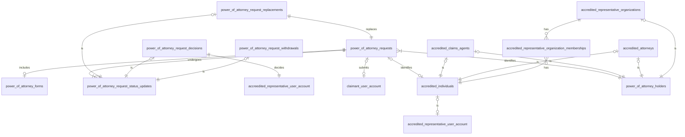

```mermaid
erDiagram
    power_of_attorney_requests ||--o| power_of_attorney_forms : includes

    %% Events
    power_of_attorney_requests ||--|{ power_of_attorney_request_status_updates : undergoes
        power_of_attorney_request_replacements |o--|| power_of_attorney_request_status_updates : is
        power_of_attorney_request_replacements ||--|| power_of_attorney_requests : replaces
        power_of_attorney_request_decisions |o--|| power_of_attorney_request_status_updates : is
        power_of_attorney_request_decisions ||--|| accreedited_representative_user_account : decides
        power_of_attorney_request_withdrawals |o--|| power_of_attorney_request_status_updates : is

    %% Parties
    power_of_attorney_requests |o--o| claimant_user_account : submits
    power_of_attorney_requests |o--o| accredited_individuals : identifies
    power_of_attorney_requests }|--|| power_of_attorney_holders : identifies
        accredited_claims_agents |o--|| power_of_attorney_holders : is
        accredited_claims_agents |o--|| accredited_individuals : is
        accredited_attorneys |o--|| power_of_attorney_holders : is
        accredited_attorneys |o--|| accredited_individuals : is
        accredited_representative_organizations |o--|| power_of_attorney_holders : is
        accredited_representative_organizations ||--o{ accredited_representative_organization_memberships : has
        accredited_representative_organization_memberships }o--|| accredited_individuals : has
        accredited_individuals |o--o| accredited_representative_user_account : is
```
