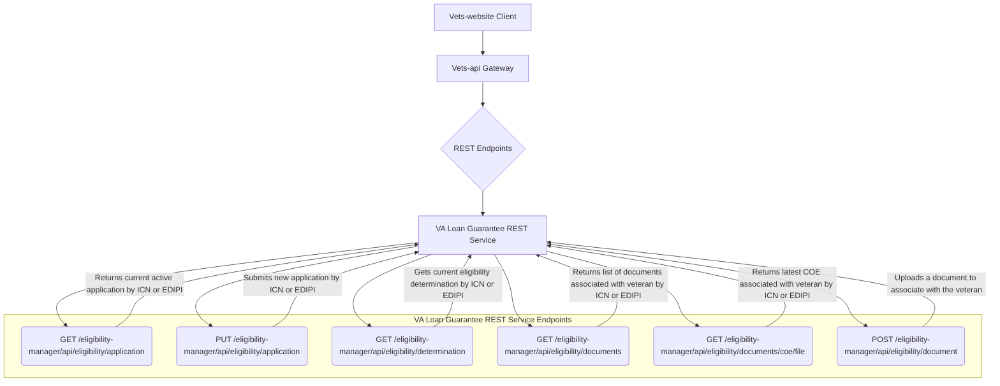

## ATO Documentation: Certificate of Eligibility (COE)
**_Last Updated: 09/10/2025_**

_Please Note: The Veteran-Facing Services Platform ATO boundary includes all environments: Dev, Staging, Utility, Sandbox, and Production, as well as all VFS teams/Products, Platform teams, CMS, VA Notify, and VA Mobile. If the environments your team uses have different configurations, we will need this information for each environment._

#### POC
1. **What is the name of your product(s)/system(s)?** Certificate of Eligibility (COE)
2. **Describe its purpose in a few sentences.** Request/download the document which indicates that a Veteran meets the requirements for a VA-guaranteed home loan
3. **If you represent multiple products, please describe the relationship between them, if there is any.** This is a standalone product
4. **What is the expected duration of your project? This information helps us understand how our processes need to adapt** Indefinite

#### AWS Resources

This product is housed within vets-api/vets-website.  No additional AWS resources are used.
1. ~~List AWS services used.~~
2. ~~Describe named instances of each service used.~~
3. ~~Which of your resources handle PII? List the types of PII.~~
4. ~~Do you utilize any other cloud resources beyond VA.gov?~~

#### Repositories

This product is housed completely within the vets-website and vets-api repositories.  No additional repositories are used

1. ~~List repos maintained by your team, provide links.~~
2. ~~List repos used by your team, provide links.~~
3. ~~Do you have a POC for each repo? Please list – Individuals are preferred, but groups are acceptable.~~
4. ~~List other groups you know use your repos.~~

#### Tools

As this product is a part of vets-website and vets-api, we do not use any additional tooling.  No new gems are required.

1. ~~List CI/CD or Infrastructure as Code tools.~~
2. ~~Describe where each tool is hosted and if they handle PII.~~
3. ~~List software included in deployment or generate SBOM.~~
4. ~~List all packages/plugins/modules/gems/etc. Include version numbers.~~

#### Connections

This feature interacts with the VA's Loan Guarantee (LGY) service.  This service is housed within the VA Network.  There are no other systems utilized by this feature.

1. ~~List the connections your team makes/maintains with systems outside the Platform AWS Environment.~~
2. ~~Are these connections Internal or External to the VA?~~
3. ~~Do you have a POC? Please list.~~
4. **Describe the encryption used for the connection in transit (e.g., Not Encrypted, TLS 1.2, TLS 1.3, mTLS). Specify the certificate source if applicable (e.g., AWS ACM, Let's Encrypt, self-signed).** Communication with the LGY REST service is done with the `Common::Client::Base` service on vets-api.
5. **List the types of PII shared (in each direction) with this connection.** Name, address, phone number, email address, prior loan information, periods of service
6. **Do you have an MOU, ISA, IAA, or other formal agreement that documents this connection? If so, please provide it.** No, these connections are covered by broad formal agreements covering all vets-api requests to these internal services.

#### Data Flow Diagram
The following is a data flow diagram that shows this product’s relationship to Platform:

