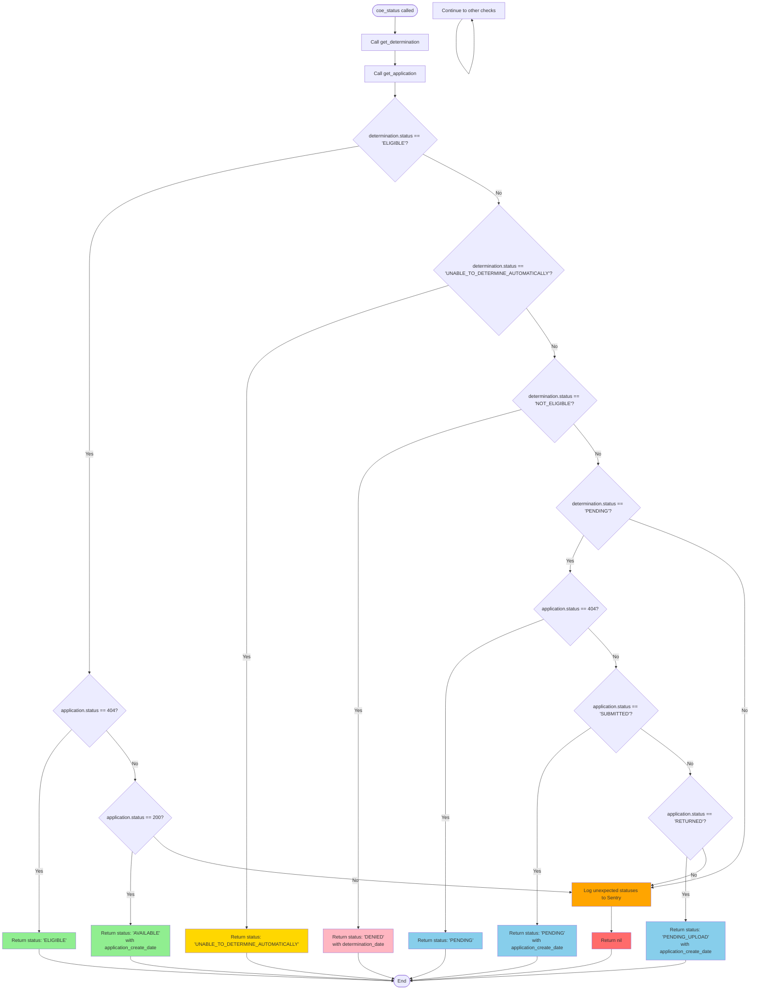

```mermaid
flowchart TD
    Start([coe_status called]) --> GetDetermination[Call get_determination]
    GetDetermination --> GetApplication[Call get_application]
    
    GetApplication --> CheckEligible{determination.status == 'ELIGIBLE'?}
    
    CheckEligible -->|Yes| CheckApp404{application.status == 404?}
    CheckApp404 -->|Yes| ReturnEligible[Return status: 'ELIGIBLE']
    CheckApp404 -->|No| CheckApp200{application.status == 200?}
    CheckApp200 -->|Yes| ReturnAvailable[Return status: 'AVAILABLE'<br/>with application_create_date]
    CheckApp200 -->|No| LogError
    
    CheckEligible -->|No| CheckUnable{determination.status == 'UNABLE_TO_DETERMINE_AUTOMATICALLY'?}
    CheckUnable -->|Yes| ReturnUnable[Return status: 'UNABLE_TO_DETERMINE_AUTOMATICALLY']
    
    CheckUnable -->|No| CheckNotEligible{determination.status == 'NOT_ELIGIBLE'?}
    CheckNotEligible -->|Yes| ReturnDenied[Return status: 'DENIED'<br/>with determination_date]
    
    CheckNotEligible -->|No| CheckPending{determination.status == 'PENDING'?}
    CheckPending -->|Yes| CheckPendingApp404{application.status == 404?}
    CheckPendingApp404 -->|Yes| ReturnPending1[Return status: 'PENDING']
    CheckPendingApp404 -->|No| CheckSubmitted{application.status == 'SUBMITTED'?}
    CheckSubmitted -->|Yes| ReturnPending2[Return status: 'PENDING'<br/>with application_create_date]
    CheckSubmitted -->|No| CheckReturned{application.status == 'RETURNED'?}
    CheckReturned -->|Yes| ReturnPendingUpload[Return status: 'PENDING_UPLOAD'<br/>with application_create_date]
    
    CheckPending -->|No| LogError[Log unexpected statuses to Sentry]
    CheckReturned -->|No| LogError
    CheckOther --> CheckOther[Continue to other checks]
    LogError --> ReturnNil[Return nil]
    
    ReturnEligible --> End([End])
    ReturnAvailable --> End
    ReturnUnable --> End
    ReturnDenied --> End
    ReturnPending1 --> End
    ReturnPending2 --> End
    ReturnPendingUpload --> End
    ReturnNil --> End
    
    style ReturnEligible fill:#90EE90
    style ReturnAvailable fill:#90EE90
    style ReturnUnable fill:#FFD700
    style ReturnDenied fill:#FFB6C1
    style ReturnPending1 fill:#87CEEB
    style ReturnPending2 fill:#87CEEB
    style ReturnPendingUpload fill:#87CEEB
    style ReturnNil fill:#FF6B6B
    style LogError fill:#FFA500
```
