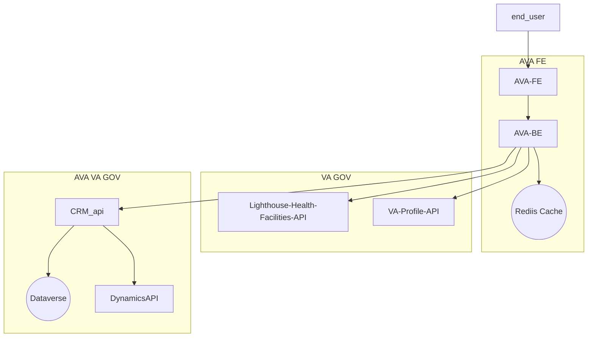

# Engineering Strategy for Phase 1 of Ask VA on va.gov

Phase 1 of the Ask VA redesign is limited to bringing up the front end of the AVA application to VA.gov design and accessibility standards hosted on VA.gov. The existing Ask VA application backend will continue to live in Microsoft Dynamics, but the existing front-end (the Microsoft Dynamics portal) will no longer be used. After deploying the new design (exact timing TBD), we will deprecate the Dynamics portal. It will serve as a fallback if needed.

## The Problem: Where Do We Get Our Data?

Some data, like inquiries and replies, only exist in the Dynamics CRM application. Similarly, the Dynamics application drives the routing logic of the CRM application, and those workflows expect certain data in specific formats. Other data can be sourced from the VA APIs. The VA API data would include data and validation logic for states, countries, titles, suffixes, zip codes, etc.

In general, the strategic engineering decisions for where data is sourced in partnership with the VA.gov platform team follow two guiding principles.

1. Use VA data sources (APIs) whenever possible.
2. Don't break the existing Dynamics CRM or the process of routing inquiries to the agents using Dynamics CRM.

These KPIs will guide our decisions and help us measure success:
* Reduce the time it takes to submit a question.
* Increase the percentage of submitters that successfully ask a question.
* Meet the target VA.gov user satisfaction score.

## The Options: Data Sourcing

Three options were assessed for pulling data from VA APIs or Dynamics APIs.

### <ins>Always use Dynamics Data.</ins>

**PROS:** 

* This method ensures that the data we send in the inquiry form is always in sync with the Dynamics data.

**CONS:**

* This violates the guiding principle we pull from VA APIs when possible. 
* The existing workflow for updating data exacerbates the pattern of each application hosting its copy of centralized data. 
* The Dynamics CRM application was written before many VA APIs were published. Data capture is on demand, creating a lag for real-time updates. 
* This will increase the requests (additional seconds) we make to the VA APIs, which can make the app run slower due to the slow response time from VA APIs.

**SUBMITTER IMPACT:**

* There are inconsistencies between the AVA and VA profiles. 
* There's a delay in updates to the data for VA APIs. The CRM team is made aware of the changes and manually updates their copy of the data, which results in the submitter experiencing slower response time to their requests.  

### <ins>Merge VA Data + Dynamics Data as equally valid sources of data, as It's Retrieved</ins>

**PROS:** 

* This method helps reduce conflicts for data missing in the VA APIs or that only lives in the Dynamics CRM application.

**CONS:** 

* This makes the new code more complex and fragile, increases the frequency and duration of retrieving data during cache misses, and creates a new hybrid view of the data that only lives in the latest Ask VA application. 
* Can create a potential conflict when data sources do not match. 

**SUBMITTER IMPACT:** 

* The submitter gets the latest data from each source, and their form selections are more likely to match the data used by the Dynamics backend.

### <ins>Use VA Data as primary source of data, and utilize  Dynamics as secondary where needed</ins>

**PROS:** 

* This method ensures we're using the latest version of the data, which the data owners maintain.

**CONS:** 

* We cannot always use VA APIs for our data. 
* Dynamics API data will have to come from the Dynamics CRM application.

**SUBMITTER IMPACT:** 

* The system would have to handle instances (i.e., transforming data) where data exists in the VA system but is not handled by the Dynamics workflows.

## The Recommendation

In keeping with our core guiding principles of using VA data sources (APIs) whenever possible and not breaking the existing AVA application, our recommendations are as follows:

* [Use VA Data as primary source of data, and utilize  Dynamics as secondary where needed](#use-va-data-as-primary-source-of-data-and-utilize-dynamics-as-secondary-where-needed)
* Pull as much data as possible from VA APIs 
* Pull remaining Dynamics-CRM-only data from Dynamics APIs.

## How we will implement

### General Architecture

### Specific Data Sourcing

**The following data will be retrieved from VA APIs:**

* Generic lookups (like states, countries, etc.)
* ZIP Code validation
* Address validation
* Medical Facility lookups
* VA Profile data

**The following data will be retrieved from Dynamics APIs:**

* Inquiry summaries
* Inquiry details
* Inquiry replies
* Attachments
* Educational Facility lookups
* Categories, Topics, and Subtopics
  
## Examples of Data we will source from Dynamics API 

### Educational Facility lookups [Supporting Documentation](https://github.com/department-of-veterans-affairs/va.gov-team/blob/master/products/ask-va/engineering/spikes/education_facility_data_sourcing.md)

Since both systems (GI Bill and CRM API) source their data from WEAMS, there will be no difference in the data if we use either.

* The GI Bill does NOT have an API available to pull data from their repository. There IS a CSV file that would require either a separate manual step or a service to be created to consume that data in our system.
* The CRM Team has agreed to create an API endpoint to provide education facilities to us.
* WEAMS, the system of record, does NOT currently have an API available.

### Healthcare Facilities [Supporting Documentation](https://github.com/department-of-veterans-affairs/va.gov-team/blob/master/products/ask-va/engineering/spikes/health_facility_data_sourcing.md)

* We will pull data for the 140 Medical Centers from Lighthouse.
* We will use the names provided by Lighthouse as the names to show to users on the front end
* Instead of showing the two VAMCs under the Northern California Health Care System, Sacramento, and Martinez Medical Centers, we will show the Northern California Health Care System with a facility ID of 612.

### Business fields in AVA profile (pending)

* The VA Profile API does not store business information for a user. There are business fields in the AVA Profile we will need to prefill the form. The AVA FE team is investigating possible solutions for the missing business fields in the VA Profile.

## How we can integrate both data sources based on our recommendation 

We created an API facade for our new application to allow for UI development before these critical data decisions have been made. The new user interface hits this facade, and the facade redirects the request to the actual source of the data for that specific endpoint. This allows us to swap out data sources (when a decision has been made) without affecting the UI.

* Note: The AVA FE engineering team will work with design to identify instances where data exists in VA but not Dynamics and decide how to transform/map the data.

An additional benefit of using the facade APIs is that we could return static data for our prototype that will be used for usability testing before the Dynamics APIs are fully developed and exposed to our application. The UI for our application never needs to know where the data originates- Dynamics APIs, VA APIs, or static data.
