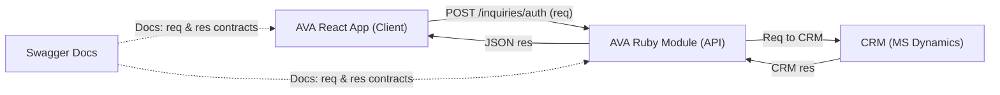

# Implement Swagger (OpenAPI) Documentation for Ask VA API

## Description

Implementing Swagger (OpenAPI) documentation across all `ask_va_api` endpoints within `vets-api` will create a single, accurate source of truth for the API’s public contract, defining what the **Frontend React Ask VA application** (our client) sends to and receives from the backend service.

The goal is to provide shared understanding and visibility across technical, research, and product teams. Swagger will serve as a **living contract** between the React client and the Ruby on Rails backend. Helping every team member, from product management to engineering make decisions with clarity and confidence.

This effort includes:
- A **SPIKE** to research and establish where and how Swagger documentation should be implemented.
- **Milestone 1** to set up the core structure and document the first endpoint (`POST /v0/ask_va/inquiries/auth`).
- Subsequent milestones to expand coverage across all remaining endpoints (approximately 25 total).

This initiative will be completed iteratively over multiple sprints and coordinated with product stakeholders for feedback and prioritization.

---

## Benefits to Stakeholders

| Role / Team | Benefits |
|--------------|-----------|
| **Frontend Developers (Ask VA React app)** | Gain clear, self-service reference for endpoint inputs and outputs. Enables faster development, testing, and debugging without waiting for backend updates or manual clarifications. |
| **Backend Developers (Ask VA API Ruby module)** | Establishes a stable API contract between vets-api and the React frontend. Simplifies onboarding, improves collaboration, and prevents regressions by making data contracts explicit. QA and verification are streamlined since developers can validate payloads directly from the documentation. |
| **AI Developers** | Gains structured, consistent data schemas that simplify analysis of inquiry form content and help identify redundant or overly complex sections in forms. Supports research efforts to streamline the Ask VA experience and improve data collection. |
| **UX Researchers & Designers** | Clear visibility into what data is available from the backend enables informed design decisions and more accurate research planning. Reduces friction when proposing UI/UX adjustments. |
| **Product Owners / Program Managers** | Gain immediate visibility into what features the API supports and how each endpoint contributes to business outcomes. This improves roadmap planning, cross-team alignment, and accountability. Enables non-technical stakeholders to verify that the system’s capabilities match business needs. |
| **CRM Team (Downstream System)** | Receives more predictable and stable upstream requests from Ask VA, reducing integration issues and debugging time. Consistent input formats help ensure data integrity and smoother coordination between teams. |

---

## Goals

- Define and document the **Ask VA API’s public-facing contract** — the request and response shapes between the vets-api backend and the React client.
- Establish a maintainable structure and workflow for documenting approximately 25 endpoints.
- Ensure that every documented schema reflects the backend’s real behavior, as shaped by controllers and serializers.
- Create a clear contribution guide to keep Swagger docs up to date as endpoints evolve.

---

## System Flow Overview

---

## Findings from SPIKE Investigation

This section summarizes findings from the initial SPIKE investigation that established the foundation for implementing Swagger documentation within `ask_va_api`.

**Key Outcomes**
1. **Swagger location:** Recommended under `app/swagger/swagger/requests/ask_va.rb` following patterns used by sibling modules within `vets-api`.  
2. **Schema definition approach:** Begin with **plain Swagger schemas** for faster delivery and alignment with current vets-api conventions. ActiveModel-based schemas remain a potential enhancement for future maintainability.  
3. **Initial prototype:** The `POST /v0/ask_va/inquiries/auth` endpoint will serve as the first fully documented example.  
4. **Naming and structure:** Adopt consistent naming, tagging, and folder conventions to support automated builds and Swagger UI compatibility.  
5. **Maintenance workflow:** Swagger documentation updates will be added to the PR checklist and reviewed alongside serializer or endpoint changes.

---

## Milestone 1: Core Setup & First Endpoint

**Goal:** Create the foundational Swagger structure and fully document the `/inquiries/auth` endpoint as the model for future endpoints.

**Deliverables**
- File and folder structure created under `app/swagger/swagger/requests/ask_va.rb`.
- `app/swagger/swagger/requests/ask_va.rb` implemented with `POST /inquiries/auth` documentation.
- Request and response schemas (with examples) aligned to controller and serializer.
- Swagger UI renders successfully without validation errors.
- Contribution guide drafted for developers adding future endpoints.

---

## Schema Definition Approach

To align with current `vets-api` conventions and ensure early delivery, initial Swagger documentation for Ask VA will use **plain Swagger schemas** defined directly in `swagger_path` or `swagger_schema` blocks.

This approach matches sibling modules and allows for rapid iteration during the documentation phase.

---

## Risks & Mitigations

| Risk | Mitigation |
|-------|-------------|
| Drift between docs and serializers | Add “Swagger updated” checklist to PR template and validate in reviews. |
| CRM unreachable in local environment | Use serializer output and verified mock payloads consistent with production shapes. |
| Time constraints | Work grouped by endpoint families (e.g., inquiries, topics, attachments) for more predictable progress. |

---

## Acceptance Criteria

- [ ] Swagger documentation structure for Ask VA API is defined and implemented following vets-api conventions.
- [ ] Example endpoint (`POST /v0/ask_va/inquiries/auth`) is documented with accurate request and response schemas and sample payloads.
- [ ] Swagger UI builds successfully and validates without errors.
- [ ] Contribution guide created outlining how to add and maintain future endpoint documentation.
- [ ] Plan reviewed and approved by a development lead and product lead.
