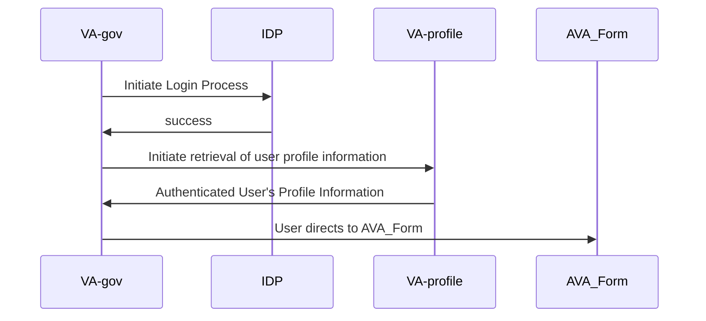
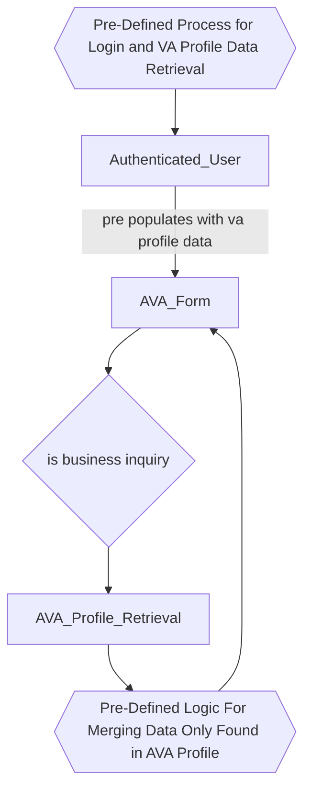
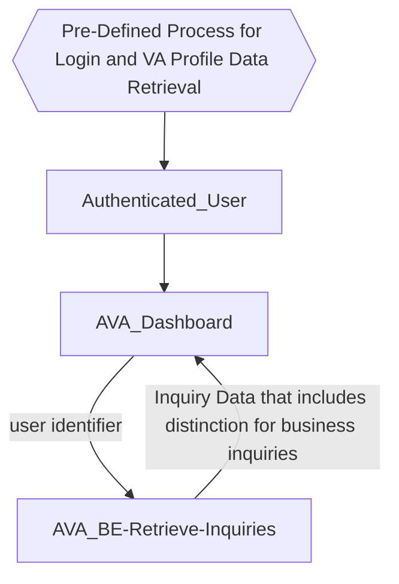

# Profile Processes

## Description

## Login Flow

## Authenticated Form Flow

## Authenticated Dashboard Flow

## Notes
* Current system allows for directly updating profile.
    * If we are using VA Profile, maybe we can create/update a profile when the user submits their first inquiry.  This will allow us to collect the information we need to create a profile and allow the user to update their profile information as needed.
    * Alternatively, we redirect the user to VA Profile if they want to update their profile information.
