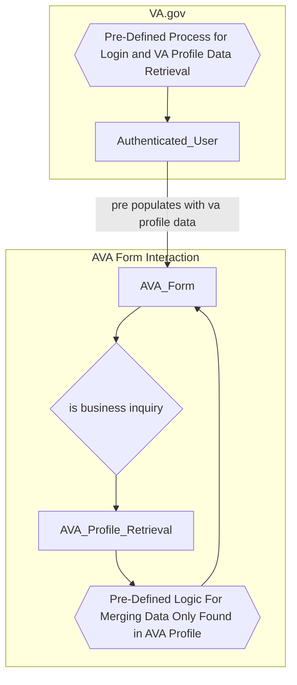
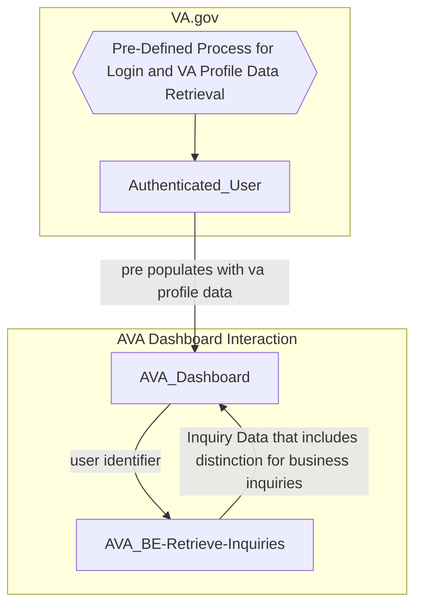

# Profile Processes

## Description
When an authenticated user visits the AVA Form, some fields pre-populate.  

The data for a field can come from either the VA Profile or AVA Profile. VA Profile is considered the primary source of profile information, so any field with data in both VA Profile and AVA Profile, or VA Profile alone, will use the data from VA Profile. However, if the field only has data in the AVA Profile, the AVA Form will use that data instead.

No information can be pre-populated for unauthenticated users of the AVA Form.

## Benefits of pre-population
* Reduces friction between user and submitting their inquiry
* VA Profile Benefits:
  *  A user can submit a form in VA.gov and expect the same default information across the system
  *  Updates to profile happen explicitly.
      * They can change things on a per-submission basis without having to worry about changing their default values.
  *  User has a single place to record their preferences.
* AVA Profile Benefits:
  * Information specific to AskVA can be stored.
  * Can be updated implicitly with each form submission.

## Authenticated Form Flow

## Authenticated Dashboard Flow

## Pre-Defined Process for Login and VA Profile Data Retrieval

## Pre-Defined Logic For Merging Data Only Found in AVA Profile

## Pre-Populated Field Sourcing
| Pre-Populated Field | Source | Source Field |
|:--|:--|:--|
| Suffix | AVA Profile | Suffix |
| Pronouns | AVA Profile | Pronouns I use |
| School State | AVA Profile | School State |
| School Facility | AVA Profile | School Facility Code |
| Service Number | AVA Profile | Service Number |
| Business phone | AVA Profile | Business Phone |
| Business email | AVA Profile | Business Email |
| Suffix | AVA Profile | Suffix |
