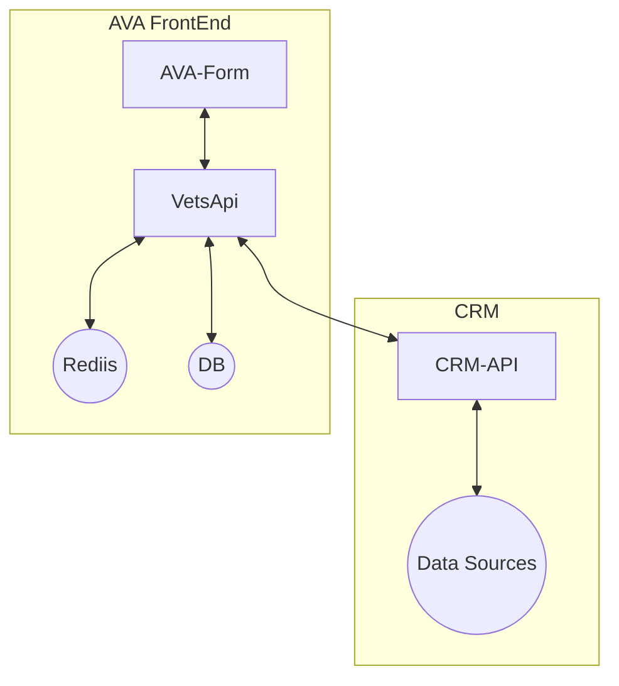
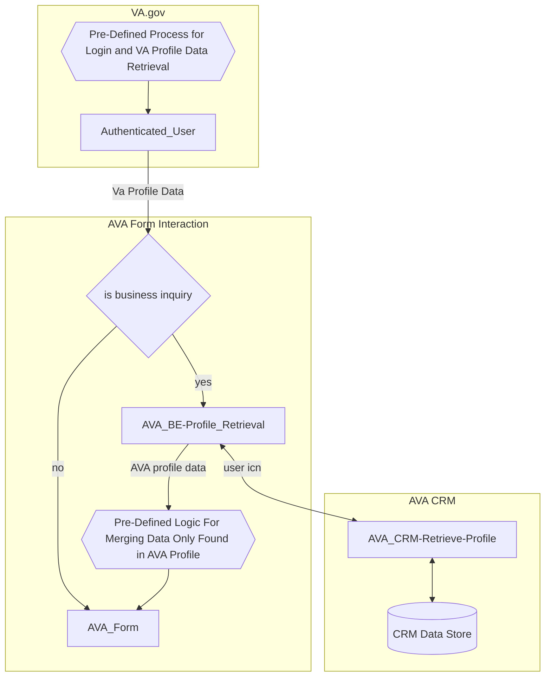
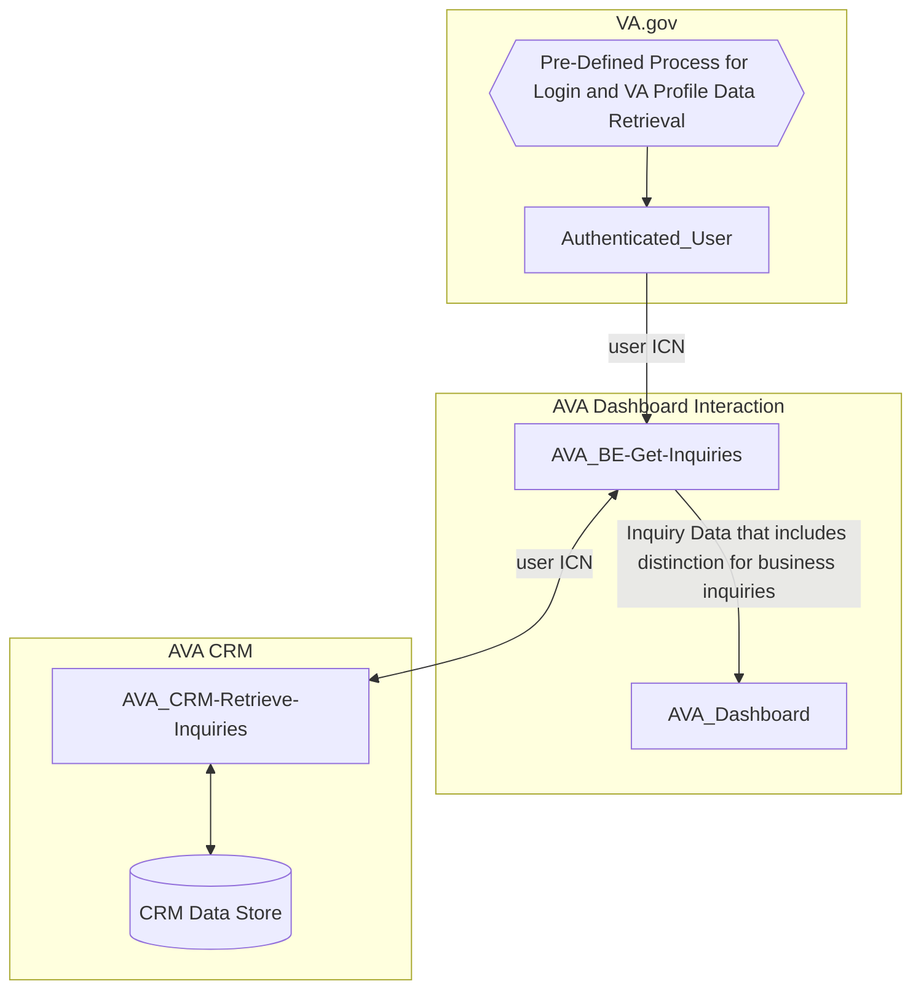
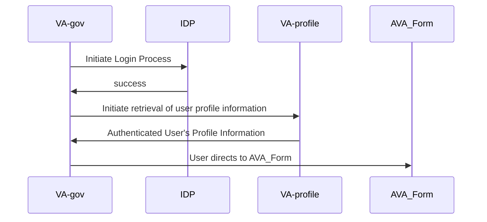
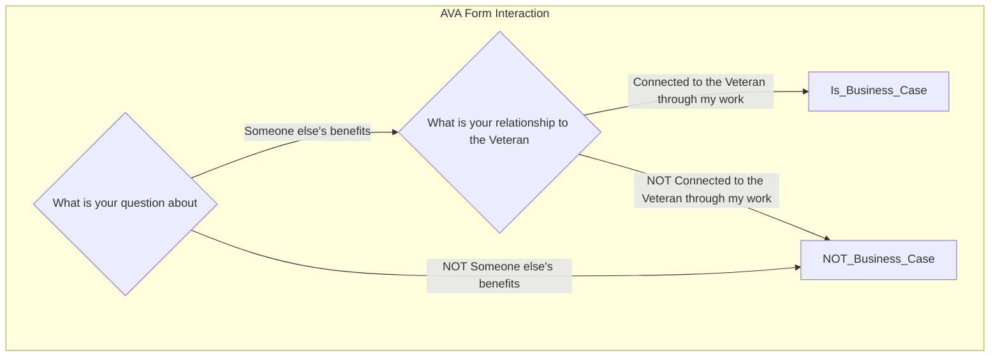

# Profile Processes for Ask VA
This document outlines how and which fields in the Ask VA (AVA) form prefill from either the existing AVA Profile or VA Profile. We consolidated information from our [VA Profile Spike](https://github.com/department-of-veterans-affairs/va.gov-team/blob/master/products/ask-va/engineering/spikes/va_profile_spike.md) and [Moving to VA Profile](https://github.com/department-of-veterans-affairs/va.gov-team/blob/master/products/ask-va/design/Moving%20to%20VA%20Profile.md) docs in GitHub.

## Description
When an authenticated user visits the AVA form, some fields will be pre-filled.  

The pre-filled data for a field can come from either VA Profile or AVA Profile. VA Profile provides authoritative data source on profile data ([learn more in their SharePoint site](https://dvagov.sharepoint.com/sites/OITEPMOVAPROPUB)). Any field with data in VA Profile or both VA Profile and AVA Profile will use the data from VA Profile. However, if the field only has data in AVA Profile, the AVA form will use that data instead.

No information can be prefilled for unauthenticated users of the AVA Form.

## Benefits of prefill
* Reduces friction for the submitter filling out the form
* VA Profile benefits:
  *  The submitter can submit a form in VA.gov and expect the same default information across VA.gov
  *  Updates to profile happen explicitly
      * The submitter can change things on a per-submission basis without having to worry about changing their default values.
  *  The submitter has a single place to record their preferences for all VA.gov forms
* AVA Profile benefits:
  * Inquiry information that is specific to the submitter can be stored
  * Inquiry information can be updated implicitly when the submitter submits their inquiry

## Prefilled field sourcing
| Prefilled field | Source | Source field |
|:--|:--|:--:|
| Submitter ICN | VA.gov Profile | icn |
| Submitter EDIPI | VA.gov Profile | edipi |
| Submitter SSN | VA.gov Profile | ssn |
| Submitter First Name | VA.gov Profile | given_names |
| Submitter Middle Name | VA Profile | * |
| Submitter Last Name | VA Profile | * |
| Submitter Suffix | VA.gov Profile | suffix |
| Submitter Home Address | VA.gov Profile | address.street & address.street2| 
| Submitter Home City | VA.gov Profile | address.city | 
| Submitter Home State | VA.gov Profile | address.state | 
| Submitter Home Zip  | VA.gov Profile | address.zip | 
| Submitter Phone  | VA.gov Profile | home_phone | 
| Submitter Email  | VA.gov Profile | email | 
| Submitter Gender | VA.gov Profile | gender |
| Submitter DoB | VA.gov Profile | birth_date |
| Preferred Name | VA Profile | genderIdentityTraits.preferredName | 
| Pronouns | VA Profile | genderIdentityTraits.pronoun.pronounName |
| Submitter Branch of Service  | VA Profile | * | 
| Submitter Service Number  | AVA Profile | patient.submitter_provided_service_number | 
| Submitter School Facility Code  | AVA Profile | patient.school_facility_code | 
| Submitter State of School  | AVA Profile | patient.iris_schoolstate | 
| Business phone | AVA Profile | patient.telephone1 |
| Business email | AVA Profile | patient.emailaddress2 |

  * Denotes, the path to this data hasn't been determined yet 

## General Architecture

## Flows
### Authenticated Form Flow

### Authenticated Dashboard Flow

### Pre-Defined Process for Login and VA Profile Data Retrieval

### Pre-Defined Logic For Merging Data Only Found in AVA Profile
* Change Mobile Phone Number field from Personal Phone to Business Phone
* Change Email field from Personal Email to Business Email
* Fill out School Facility Code, if required
* Fill out School State, if required
* Fill out Service Number, if required

### Determination of Business Inquiry

## VA Profile vs VA.gov Profile

Questions: 
1. What is the purpose for each system? 
2. Does everybody get an ICN who logs into VA.gov?
3. Is VA Profile available to ALL people that will try to access AskVA (veteran and non-veteran)?

| Criteria | VA Profile | VA.gov Profile |
|---|---|---|
| When you authenticate to one of the supported IDPs, is a record in this system created? | | |
| Is the information in this system accessible to AskVA (in VetsAPI)? | | |
| POC for the system | | |

## Resources
* [VA Profile Spike](https://github.com/department-of-veterans-affairs/va.gov-team/blob/master/products/ask-va/engineering/spikes/va_profile_spike.md)
* [Moving to VA Profile](https://github.com/department-of-veterans-affairs/va.gov-team/blob/master/products/ask-va/design/Moving%20to%20VA%20Profile.md)

