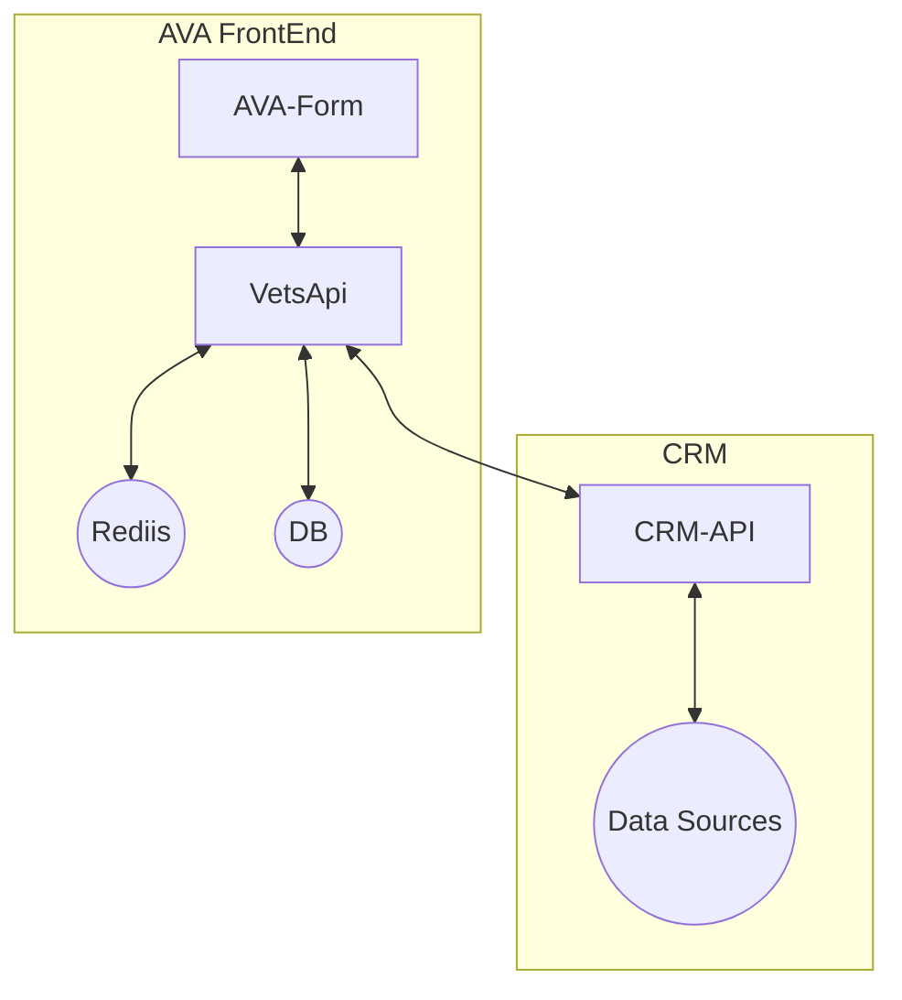
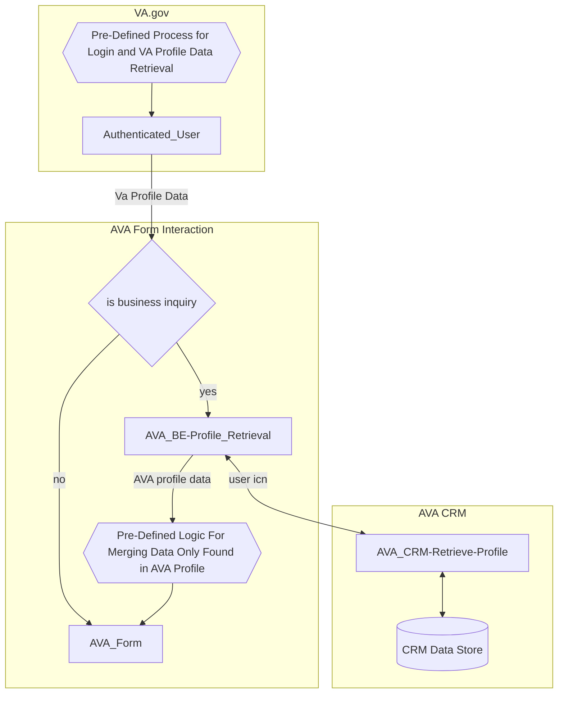
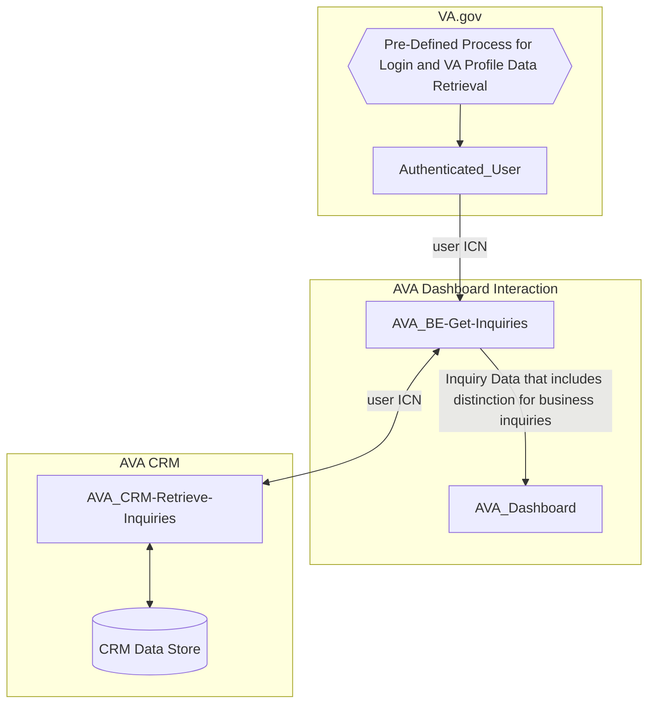
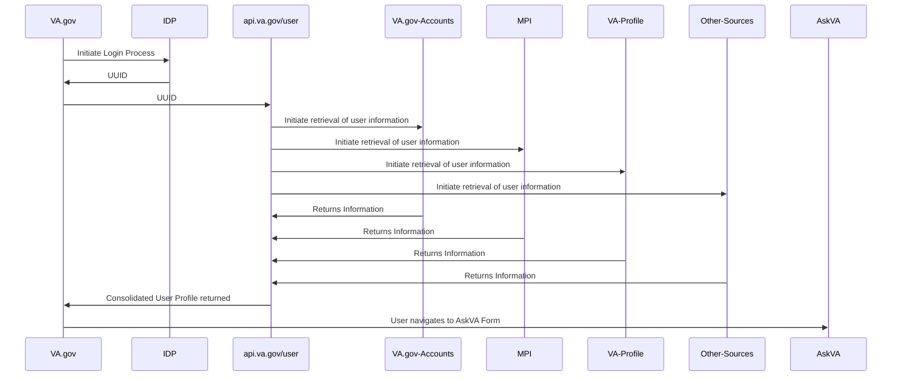
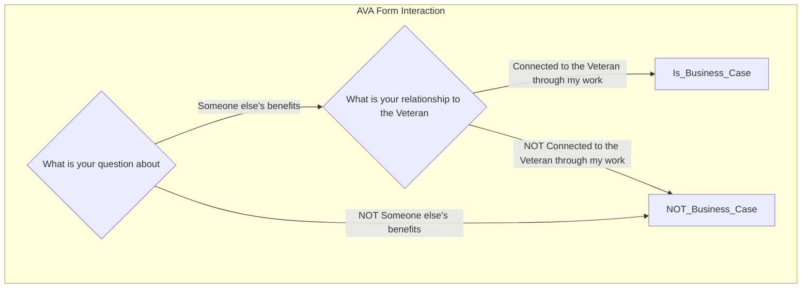

# Profile Processes for Ask VA
This document outlines how and which fields in the Ask VA (AVA) form prefill from either the existing AVA Profile or VA Profile. We consolidated information from our [VA Profile Spike](https://github.com/department-of-veterans-affairs/va.gov-team/blob/master/products/ask-va/engineering/spikes/va_profile_spike.md) and [Moving to VA Profile](https://github.com/department-of-veterans-affairs/va.gov-team/blob/master/products/ask-va/design/Moving%20to%20VA%20Profile.md) docs in GitHub.

## Description
When an authenticated user visits the AVA form, some fields will be pre-filled.  

The pre-filled data for a field can come from either VA Profile or AVA Profile. VA Profile provides authoritative data source on profile data ([learn more in their SharePoint site](https://dvagov.sharepoint.com/sites/OITEPMOVAPROPUB)). Any field with data in VA Profile or both VA Profile and AVA Profile will use the data from VA Profile. However, if the field only has data in AVA Profile, the AVA form will use that data instead.

No information can be prefilled for unauthenticated users of the AVA Form.

## Benefits of prefill
* Reduces friction for the submitter filling out the form
* VA Profile benefits:
  *  The submitter can submit a form in VA.gov and expect the same default information across VA.gov
  *  Updates to profile happen explicitly
      * The submitter can change things on a per-submission basis without having to worry about changing their default values.
  *  The submitter has a single place to record their preferences for all VA.gov forms
* AVA Profile benefits:
  * Inquiry information that is specific to the submitter can be stored
  * Inquiry information can be updated implicitly when the submitter submits their inquiry

## Identity ID sourcing
Note: Where the source is VA.gov Profile, we will get data through the api.va.gov/user endpoint through vets-api. [See the outlined process later in this doc](https://github.com/department-of-veterans-affairs/va.gov-team/edit/master/products/ask-va/integration/va_profile/profile_processes.md#pre-defined-process-for-login-and-va-profile-data-retrieval). The source of this data is still technically VA Profile or MPI though.

| Prefilled field | Source | Source field | Mapping to AVA field | Description |
|:--|:--|:--:|:--|:--|
| Submitter CSP UUID | VA.gov Profile - identity | uuid | ... | Generated when a user registers at one of the IDPs |
| Submitter ICN | VA.gov Profile - MPI | icn | ... | Generated when a user verifies their identity with one of the IDPs | 
| Submitter EDIPI | VA.gov Profile - MPI | edipi | Patient.EDIPI  | DoD number used for veterans, contractors, and govt civilians |

## Prefilled field sourcing
| Prefilled field | Source | Source field | Mapping to AVA field | Notes |
|:--|:--|:--:|:--|:--|
| Submitter First Name | VA.gov Profile | first_name | Patient.First Name | |
| Submitter Middle Name | VA.gov Profile | middle_name | Patient.Middle Name | |
| Submitter Last Name | VA.gov Profile | last_name | Patient.Last Name | |
| Submitter Suffix | VA.gov Profile | suffix | Patient.Suffix (AVA) | |
| Submitter Email  | VA.gov Profile | email | Patient.Email |  |
| Submitter Gender | VA.gov Profile | gender | Patient.Submitter Provided Gender | |
| Submitter DoB | VA.gov Profile | birth_date | IF Submitter = Veteran, then Patient.Date of Birth| |
| Submitter SSN | VA.gov Profile | ssn | Patient.SSN | |
| Submitter Home Address | VA.gov Profile | address.street & address.street2| Patient.Address1:Street 1 | |
| Submitter Home City | VA.gov Profile | address.city | Patient.Address1:City | |
| Submitter Home State | VA.gov Profile | address.state | Patient.State |  |
| Submitter Home Zip  | VA.gov Profile | address.zip | Patient.Address 1: ZIP/Postal Code | |
| Submitter Phone  | VA.gov Profile | home_phone | Patient.Address 1: Telephone 3 | |
| Preferred Name | VA.gov Profile | preferredName | Patient.Preferred Name | |
| Pronouns | VA Profile | genderIdentityTraits.pronoun.pronounName | Patient.Pronouns I Use | waiting on court ruling to make it available on va.gov profile page  Can pull this information from AVA Profile until then |
| Submitter Branch of Service  | VA Profile | militaryServiceHistory | Patient.Submitter Provided Branch of Service | This information is available in VA Profile and is read only because it comes straight from DoD.    There can be many results so need to consider that when defaulting to one |
| Submitter Service Number  | AVA Profile | patient.submitter_provided_service_number | | |
| Submitter School Facility Code  | AVA Profile | patient.school_facility_code | | | 
| Submitter State of School  | AVA Profile | patient.iris_schoolstate | | | 
| Business phone | AVA Profile | Patient.Business Phone | | | 
| Business email | AVA Profile | Patient.Email Address 2  | | | 

  * Denotes, the path to this data hasn't been determined yet 

## General Architecture

## Flows
### Authenticated Form Flow

### Authenticated Dashboard Flow

### Pre-Defined Process for Login and VA Profile Data Retrieval

### Pre-Defined Logic For Merging Data Only Found in AVA Profile
* Change Mobile Phone Number field from Personal Phone to Business Phone
* Change Email field from Personal Email to Business Email
* Fill out School Facility Code, if required
* Fill out School State, if required
* Fill out Service Number, if required

### Determination of Business Inquiry

## VA.gov Profile vs VA Profile vs AVA Profile
### What
*  **VA.gov Profile:**  This is a consolidation service that relies on multiple VA systems that are considered sources of truth for specific kinds of data. Access is via VA.gov API and [VA.gov Profile Page](https://www.va.gov/profile).
*  **VA Profile:** This is a datastore that contains multiple tables that store information for users that interact with the VA.  Access is via VA Profile API
*  **AVA Profile:** This is a datastore that contains user information specific to the AskVA form.  Currently there is no API available, however you can [track progress](https://github.com/department-of-veterans-affairs/va.gov-team/blob/master/products/ask-va/integration/README.md) of the one being built.

### How
* A VA.gov profile is generated for every verified user.
* Anybody with an ICN in MPI who has provided contact information is eligible to be in VA Profile
    * EXCEPTION: excludes VA employees unless they are veterans - the authoritative system for VA employees are HR Smarts

## Resources
* [VA Profile Spike](https://github.com/department-of-veterans-affairs/va.gov-team/blob/master/products/ask-va/engineering/spikes/va_profile_spike.md)
* [Moving to VA Profile](https://github.com/department-of-veterans-affairs/va.gov-team/blob/master/products/ask-va/design/Moving%20to%20VA%20Profile.md)

