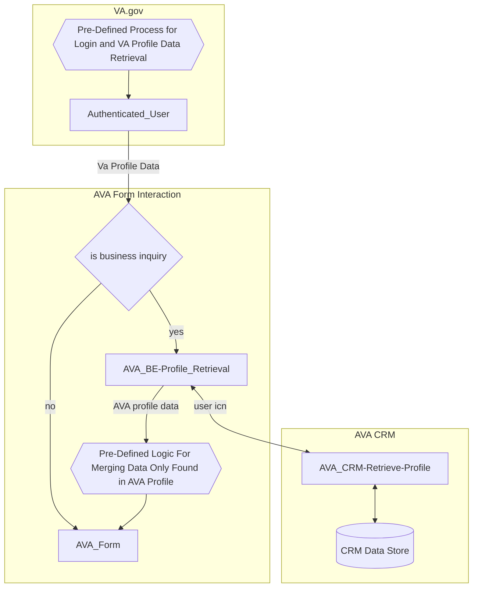
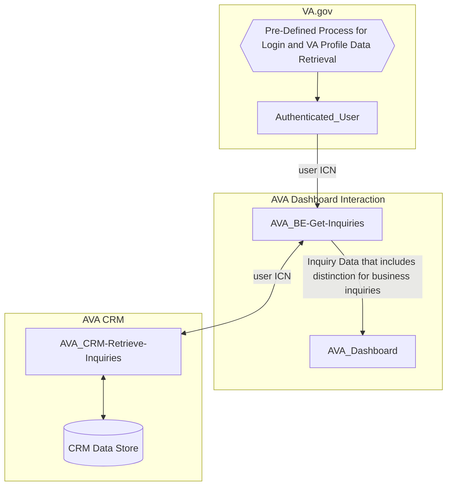
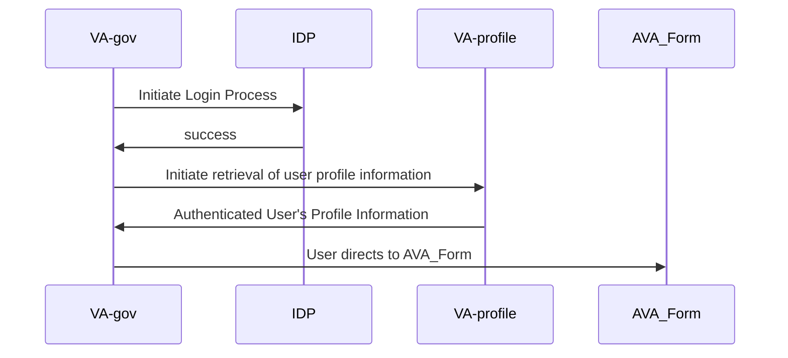
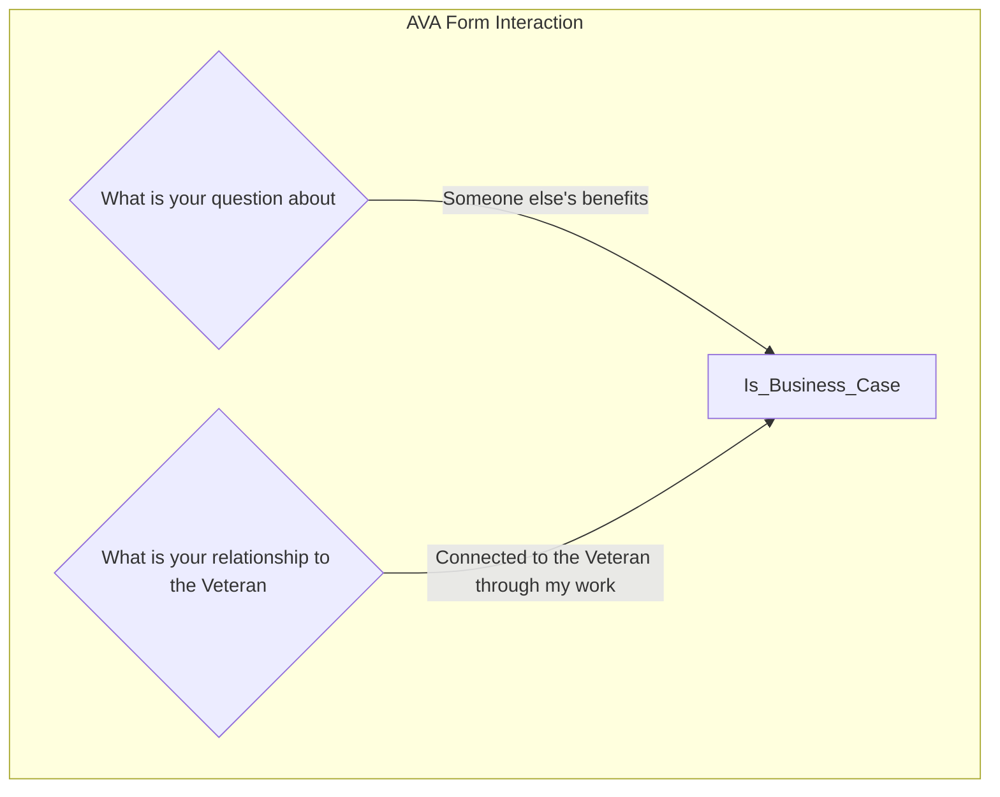

# Profile Processes for Ask VA
This document outlines how and which fields in the Ask VA (AVA) form prefill from either the existing AVA Profile or VA Profile. We consolidated information from our [VA Profile Spike](https://github.com/department-of-veterans-affairs/va.gov-team/blob/master/products/ask-va/engineering/spikes/va_profile_spike.md) and [Moving to VA Profile](https://github.com/department-of-veterans-affairs/va.gov-team/blob/master/products/ask-va/design/Moving%20to%20VA%20Profile.md) docs in GitHub.

## Description
When an authenticated user visits the AVA form, some fields will become prefilled.  

The data for a field can come from either VA Profile or AVA Profile. VA Profile is considered the primary source of profile information. Any field with data in VA Profile or both VA Profile and AVA Profile will use the data from VA Profile. However, if the field only has data in AVA Profile, the AVA form will use that data instead.

No information can be prefilled for unauthenticated users of the AVA Form.

## Benefits of prefill
* Reduces friction for the submitter submitting their inquiry
* VA Profile benefits:
  *  The submitter can submit a form in VA.gov and expect the same default information across the system
  *  Updates to profile happen explicitly
      * The submitter can change things on a per-submission basis without having to worry about changing their default values.
  *  The submitter has a single place to record their preferences
* AVA Profile benefits:
  * Inquiry information that is specific to the submitter can be stored
  * Inquiry information can be updated implicitly when the submitter submits their inquiry

## Prefilled field sourcing
| Prefilled field | Source | Source field |
|:--|:--|:--:|
| Submitter Home Address | VA Profile | addressLine1, addressLine2, addressLine3| 
| Submitter Home City | VA Profile | cityName | 
| Submitter Home State | VA Profile | state.stateName or province.provinceName | 
| Submitter Home Zip  | VA Profile | zipCode5 | 
| Submitter Phone  | VA Profile | countryCode, areaCode, phoneNumber, phoneNumberExt | 
| Submitter Email  | VA Profile | emailAddressText | 
| Preferred Name | VA Profile | genderIdentityTraits.preferredName | 
| Pronouns | VA Profile | genderIdentityTraits.pronoun.pronounName |
| Submitter DoB | VA Profile |  |
| Submitter SSN | VA Profile |  |
| Submitter First Name | VA Profile |  |
| Submitter Middle Name | VA Profile |  |
| Submitter Last Name | VA Profile |  |
| Submitter Gender | VA Profile |  |
| Submitter Branch of Service  | VA Profile |  | 
| Submitter Service Dates  | VA Profile |  | 
| Submitter Service Number  | VA Profile |  | 
| Submitter School Facility Code  | AVA Profile | patient.school_facility_code | 
| Submitter State of School  | AVA Profile | patient.iris_schoolstate | 
| Suffix | AVA Profile | patient.iris_suffix |
| Business phone | AVA Profile | patient.telephone1 |
| Business email | AVA Profile | patient.emailaddress2 |
 
## Flows
### Authenticated Form Flow

### Authenticated Dashboard Flow

### Pre-Defined Process for Login and VA Profile Data Retrieval

### Pre-Defined Logic For Merging Data Only Found in AVA Profile

## Resources
* [VA Profile Spike](https://github.com/department-of-veterans-affairs/va.gov-team/blob/master/products/ask-va/engineering/spikes/va_profile_spike.md)
* [Moving to VA Profile](https://github.com/department-of-veterans-affairs/va.gov-team/blob/master/products/ask-va/design/Moving%20to%20VA%20Profile.md)
