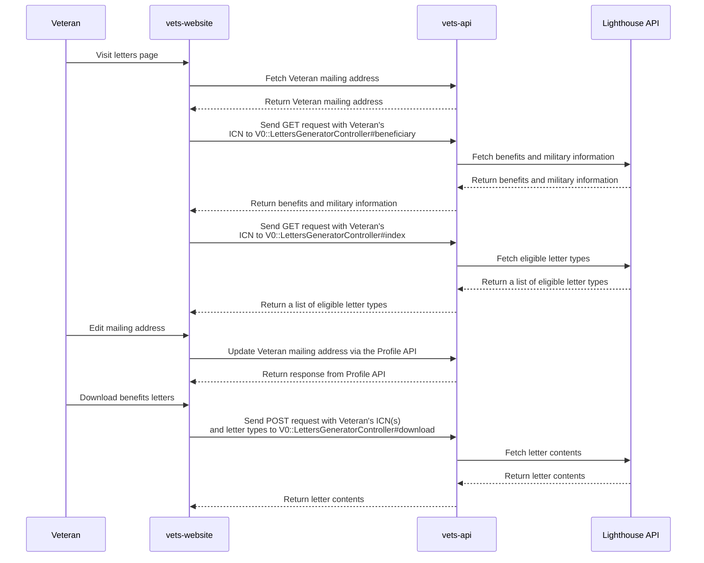

### Architecture Diagram

```mermaid
sequenceDiagram
    participant Veteran
    participant Frontend as vets-website
    participant Backend as vets-api
    participant Lighthouse as Lighthouse API

    Veteran->>Frontend: Visit letters page
    Frontend->>Backend: Fetch Veteran mailing address
    Backend-->>Frontend: Return Veteran mailing address
    Frontend->>Backend: Send GET request with Veteran's<br/> ICN to V0::LettersGeneratorController#35;beneficiary
    Backend->>Lighthouse: Fetch benefits and military information
    Lighthouse-->>Backend: Return benefits and military information
    Backend-->>Frontend: Return benefits and military information
    Frontend->>Backend: Send GET request with Veteran's<br/> ICN to V0::LettersGeneratorController#35;index
    Backend->>Lighthouse: Fetch eligible letter types
    Lighthouse-->>Backend: Return a list of eligible letter types
    Backend-->>Frontend: Return a list of eligible letter types
    Veteran->>Frontend: Edit mailing address
    Frontend->>Backend: Update Veteran mailing address via the Profile API
    Backend-->>Frontend: Return response from Profile API
    Veteran->>Frontend: Download benefits letters
    Frontend->>Backend: Send POST request with Veteran's ICN(s)<br/> and letter types to V0::LettersGeneratorController#35;download
    Backend->>Lighthouse: Fetch letter contents
    Lighthouse-->>Backend: Return letter contents
    Backend-->>Frontend: Return letter contents
```
