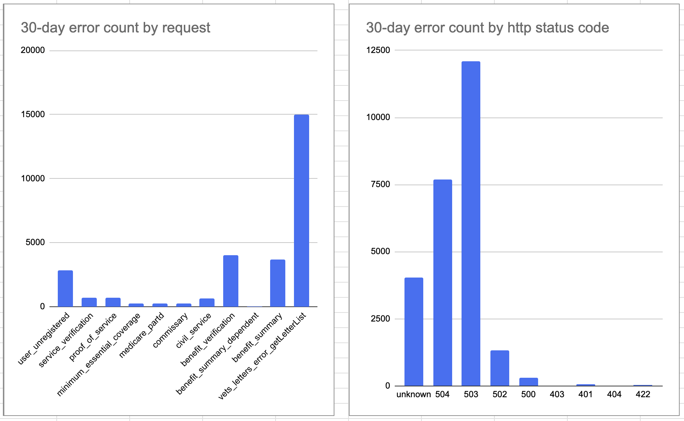
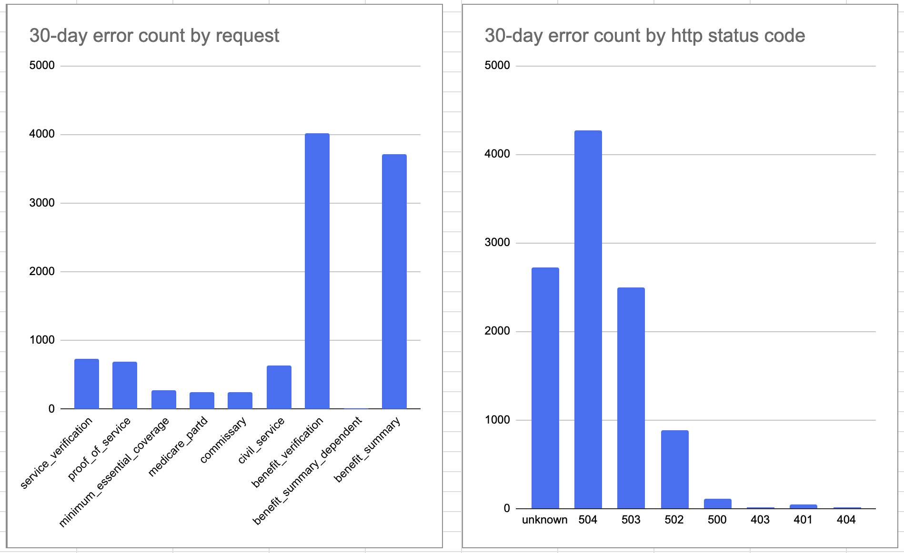
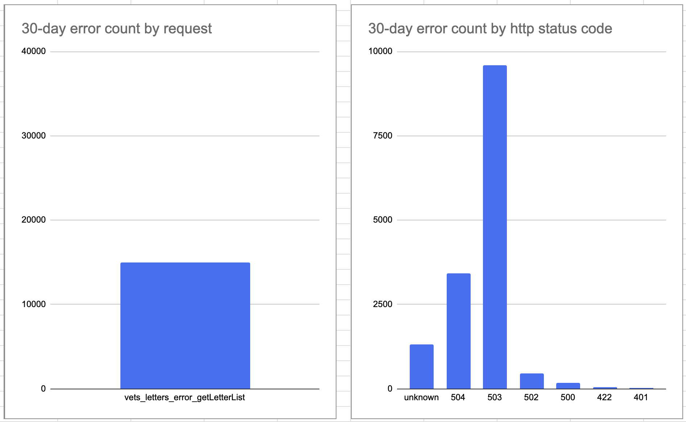

# Letters App Sentry Errors (EVSS)

Date range: 5/27/2023 through 6/26/2023

## Takeaway
Total error count over 30 days: ~40,000



The errors here are the most significant. There are some error types not included here that were one
offs or not significant enough to be focused on.

If we could significantly reduce or get rid of the 504 and 503 errors, we'd be in much better shape
as far as persistent errors. Unfortunately, there's not much we can do about those types of errors
as they are a result of an unavailable or slow upstream service.

There is potential that when we move fully to lighthouse (vs EVSS) we see a drop in these types of
errors.

The details on this page *include* errors that occurred during maintenance and upstream fault
windows. More work will be needed to see if the number of errors during those windows significantly
impact the numbers here.

## Frontend Errors

### Vets Letters User Unregistered Error
Appears to be an error when making the request `GET https://api.va.gov/v0/user`.

These are not fixable by us. Recommend to filter out these errors from the results list. There's a
high chance that these show up as errors for the letters app because they occur on the letters page,
but they're not actually letters app errors.

Message: `vets_letters_user_unregistered Error /generated/letters.entry.js new i new i(generated/letters.entry)`

Sample:
1. User navigates:
```
{
    from: /records/download-va-letters/letters, 
    to: /records/download-va-letters/letters/confirm-address
}
```
2. User updates/enters their address
3. User clicks the submit button
4. Navigates:
```
{
    from: /records/download-va-letters/letters/confirm-address,
    to: /records/download-va-letters/letters/letter-list
}
```
5. User downloads letter: `POST https://api.va.gov/v0/letters/benefit_verification`
6. User clicks: `div > div.usa-alert-text > div.alert-actions > button.usa-button[type="button"]`
7. Error fetching `GET https://api.va.gov/v0/user` with `Error: vets_letters_user_unregistered`

### Vets Letters Download Errors


Stats:
- Most (~9500) error status codes across all letter downloads are unknown, 504s, 503s
  - 504s and 503s indicate upstream server errors
  - Not sure what the uknown errors root cause is
- Most (~8000) errors occur for benefit_verification and benefit_summary
  - Suggests high download rates for these 2 letter types

### Vets Letters List View Errors


Stats:
- Most (~12,000) error status codes are 504 or 503
  - Indicates upstream server errors


## Backend Errors
