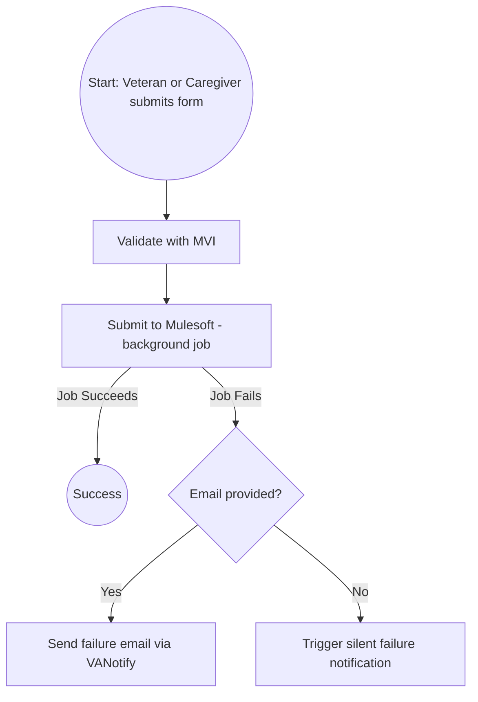

```mermaid
flowchart TD
    A((Start: Veteran or Caregiver submits form)) --> B[Validate with MVI]
    B --> C[Submit to Mulesoft - background job]

    C -->|Job Succeeds| D((Success))

    C -->|Job Fails| E{Email provided?}
    E -->|Yes| F[Send failure email via VANotify]
    E -->|No| G[Trigger silent failure notification]

```
